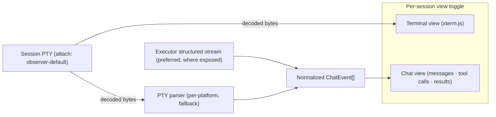

# ADR: Cockpit Chat View — Structured Agent-Output Parsing alongside the Raw Terminal

**Status**: Proposed
**Phase**: Elaboration
**Epic**: roctinam/aiwg#1633 (Cockpit v2)
**Issue**: roctinam/aiwg#1645
**Related**: @.aiwg/architecture/adr-cockpit-session-attach-model.md, @.aiwg/architecture/adr-cockpit-session-control-not-cli-runner.md, @.aiwg/architecture/cockpit-sad.md, `apps/cockpit/web/src/useSession.ts` (xterm.js PTY renderer, commit `d4c84ee8`)

## Reasoning

1. **Problem analysis**: The Sessions pane renders the PTY through xterm.js — correct for any shell or tmux, where ANSI/VT/OSC sequences must be *interpreted*. But an agentic session (Claude Code, Codex, …) is a turn-by-turn conversation, and operators want it as a **chat transcript** — messages, tool calls, tool results — not raw redraw scrollback. The raw terminal is the wrong altitude for reading what an agent is doing.
2. **Constraint identification**: The attach model is **non-destructive and observer-default** (the attach-model ADR) — a Chat view must not perturb the session or claim input. Agent output formats are **heterogeneous and unstable** per platform. The Cockpit is a **control surface, not a CLI runner** (the not-a-runner ADR) — it must not shell `aiwg` to reconstruct transcripts. Today the only data plane is the PTY byte stream.
3. **Alternative consideration**: parse the PTY bytes in the browser; or have the executor expose a structured agent-output stream the Cockpit renders; or a hybrid that prefers structure and degrades to scraping. (Evaluated below.)
4. **Decision rationale**: A **view toggle** (Terminal ↔ Chat) over one attached session, with Chat fed by a **normalized chat-event contract**. The contract is sourced from a structured executor stream where one exists (preferred) and from a **per-platform PTY parser** only as a fallback. Terminal stays the default and the universal floor.
5. **Risk assessment**: PTY-scraping is brittle and version-coupled; mitigated by keeping Terminal authoritative, scoping Chat to declared platforms, and treating the parser as best-effort with a visible "raw" escape hatch. A structured executor stream is the durable fix but is an agentic-sandbox dependency (TBD).

## Context

`useSession` attaches to a session's PTY WebSocket and writes decoded bytes into an xterm.js terminal — colors, tmux redraws, window titles, bracketed paste all render correctly. This is the right primitive for shells and for *any* session as a universal fallback.

It is the wrong reading surface for agentic sessions. When the operator is supervising Claude Code or Codex, they want the agent's **conversation**: each assistant turn, each tool invocation and its result, status/usage lines — rendered as messages, not reconstructed by eye from a scrolling VT buffer. Several agent CLIs can already emit a machine-readable event stream (e.g. Claude Code's `--output-format stream-json`); others only emit human-formatted text to the PTY.

Two forces collide: operators want a standard chat UI, and the Cockpit must stay non-destructive, provider-heterogeneous, and not a CLI runner. The data the Cockpit has *today* is the PTY byte stream the attach model already delivers.

## Decision

1. **A per-session view toggle: Terminal ↔ Chat.** Both views observe the *same* attached session through the existing observer-default attach (no second connection, no input claim). Terminal is the **default** and is always available; Chat is offered only for sessions whose platform has a registered renderer.

2. **A normalized chat-event contract** is the seam between data source and renderer. The Chat view renders only this shape; it never sees raw platform formats:

   ```ts
   type ChatEvent = {
     seq: number;                 // monotonic, aligned with the PTY seq for replay
     role: 'assistant' | 'user' | 'system' | 'tool';
     kind: 'message' | 'tool_call' | 'tool_result' | 'status' | 'error';
     text?: string;              // rendered/markdown body
     tool?: { name: string; input?: unknown; output?: unknown; ok?: boolean };
     ts?: string;                // ISO, when the source provides one
     partial?: boolean;          // streaming token chunk not yet finalized
   };
   ```

3. **Two sources feed the contract, in priority order:**
   - **(Preferred) Structured stream from the executor.** Where the agentic-sandbox exposes a structured agent-output channel (or the session was launched with a structured `--output-format`), the Cockpit consumes events and maps them to `ChatEvent` with no scraping. This is lossless and version-robust.
   - **(Fallback) A per-platform PTY parser.** A registry of `platform → parser` functions that consume the *same decoded PTY bytes* xterm.js receives and emit `ChatEvent`s best-effort. Parsers are declared per platform (first: Claude Code), are pure and unit-tested against captured fixtures, and never block the Terminal view.

4. **Platform scoping is explicit.** A capability descriptor per session names its `chat_source` (`structured` | `pty-parser:<platform>` | `none`). `none` → Chat toggle is hidden; the operator sees Terminal only. This mirrors how Drive is capability-gated in the attach-model ADR.

5. **Terminal remains authoritative.** Chat is a *projection*; if the parser is uncertain or a platform is unrecognized, the operator always has the exact bytes in Terminal. A per-message "show raw" affordance reveals the source span a `ChatEvent` was derived from.

6. **No CLI runner.** Neither source shells `aiwg`. The structured source is an executor stream; the fallback parses the PTY the Cockpit already attaches to. Consistent with the not-a-runner ADR.



## Options considered

| Option | Verdict |
|---|---|
| A. Parse the PTY in the browser only (no contract, no executor stream) | ✗ Brittle and version-coupled; couples renderer to each CLI's exact text; no path to lossless |
| B. Require an executor structured stream for Chat; no PTY fallback | ✗ Blocks Chat on an agentic-sandbox dependency; gives operators *nothing* better than Terminal until then |
| C. **View toggle + normalized contract; structured source preferred, per-platform PTY parser fallback; Terminal authoritative** | ✓ **Chosen** — ships value now (Claude Code parser), degrades safely, and has a clean upgrade path to lossless structured streams without renderer churn |
| D. Replace Terminal with Chat for agentic sessions | ✗ Violates non-destructive/universal-fallback; loses raw fidelity operators need when the parser is wrong |

## Consequences

- **Positive**: operators get a standard chat transcript for supervised agentic work; the contract decouples renderer from platform churn; Terminal stays the universal, always-correct floor; the design upgrades to lossless structured streams with no UI rewrite.
- **Negative / accepted**: each supported platform needs a declared, fixture-tested parser (maintenance cost; scoped, not universal); PTY-scraped Chat is best-effort and can lag or mis-segment — accepted because Terminal is one toggle away and "show raw" exposes provenance.
- **Follow-on / TBD**: an agentic-sandbox companion to expose a structured agent-output stream (the preferred source) is out of scope for this ADR and tracked separately; first parser target is Claude Code (`stream-json`), with Codex next. Capture a per-platform `chat_source` capability matrix during Elaboration (mirrors the attach-capability matrix).

## References

- roctinam/aiwg#1645 — chat-style agent view alongside the raw terminal
- @.aiwg/architecture/adr-cockpit-session-attach-model.md — observer-default, non-destructive attach (the data plane Chat observes)
- @.aiwg/architecture/adr-cockpit-session-control-not-cli-runner.md — the Cockpit never runs `aiwg` to do work
- @.aiwg/architecture/cockpit-sad.md — Cockpit architecture
- `apps/cockpit/web/src/useSession.ts` — current xterm.js PTY renderer (commit `d4c84ee8`)
