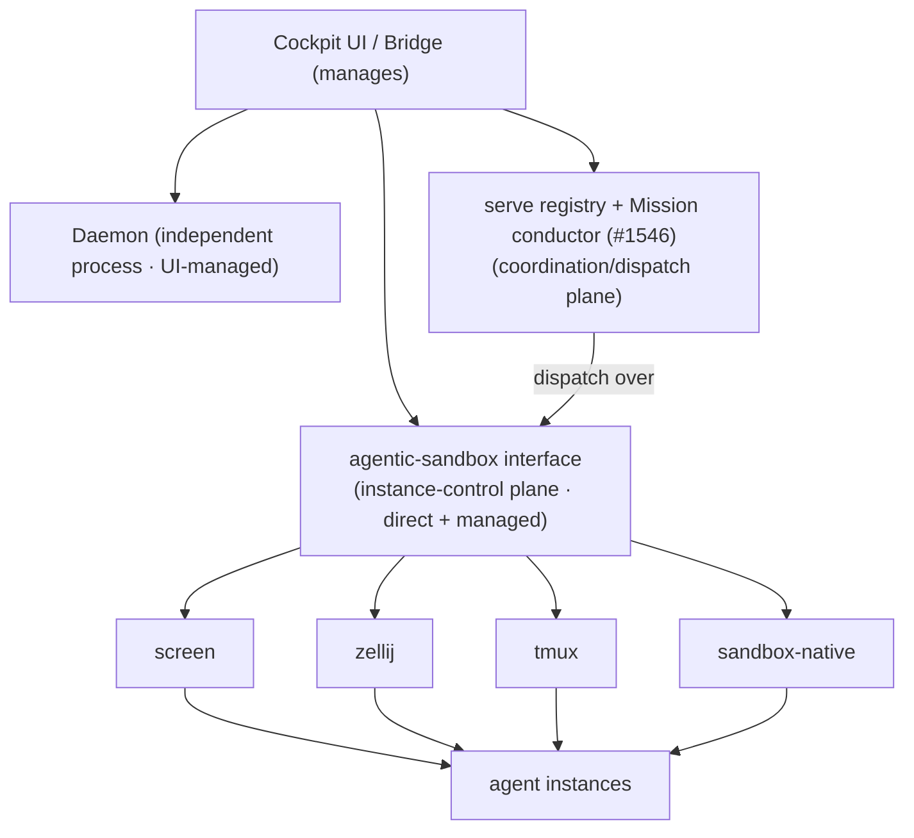

# ADR: Instance-Control Substrate — Normalize on the agentic-sandbox Interface; Daemon Decoupled, UI-Managed

**Status**: Accepted (agentic-sandbox `v2026.7.4` landed the predicted extensions — host target, direct+managed sessions, normalized v2 admin interface — verified end-to-end via Cockpit 2026-07-09; resolves the Bridge-vs-daemon open question)
**Phase**: Elaboration
**Related**: @.aiwg/architecture/cockpit-sad.md, @.aiwg/architecture/adr-cockpit-overlay-integration-model.md, @.aiwg/architecture/adr-cockpit-session-attach-model.md, @.aiwg/architecture/adr-cockpit-coordination-bus.md, @.aiwg/requirements/nfr-modules/cockpit-nfrs.md (NFR-01, NFR-07), @.aiwg/risks/cockpit-risk-register.md (X11, X12), #1546 (serve Mission conductor), #1566 (shared agentic-sandbox hosts), #1565 (hitl-prompt/v1)

## Reasoning

1. **Context analysis**: Cockpit must open/run/manage agent instances and also manage the daemon. There are several instance hosts in play (screen, zellij, tmux, agentic-sandbox). Without a normalized interface, Cockpit would special-case each — brittle and unbounded.
2. **Force identification**: normalize instance control vs. host heterogeneity; daemon independence vs. UI management; direct (ad-hoc) sessions vs. managed (orchestrated) sessions; overlay isolation.
3. **Option evaluation**: below.
4. **Decision justification**: the **daemon runs independently and is *managed by* the UI** (not fused into the Bridge); **all instance control normalizes on the agentic-sandbox interface**, which abstracts the host backends and is extended to cover direct + managed sessions.
5. **Consequence assessment**: one interface to control instances (Cockpit, daemon, CLI all use it); requires upstream work to extend agentic-sandbox; multiplexer heterogeneity is hidden behind the interface.

## Context

This ADR settles the previously-open "is the Bridge the daemon?" question and defines how instances are controlled. AIWG already has: a **daemon/concierge** (long-running), the **serve executor-registry + Mission conductor** (#1546, cross-stack dispatch), and **agentic-sandbox** (an execution sandbox; #1565/#1566 reference hitl-prompt/v1 and shared agentic-sandbox hosts). Operators also run agents in terminal multiplexers (screen/zellij/tmux).

## Decision

### 1. Daemon is decoupled; the UI manages it
- The **daemon runs as its own independent process.** It is **not** the Cockpit Bridge and not fused into it. The Cockpit UI/Bridge **manages** the daemon (start/stop/observe/configure) as a first-class *managed entity* — one of the things on the dashboard — alongside the stacks.
- Consequence: a Cockpit crash doesn't take down the daemon (or instances); they are separate processes the UI observes/controls (overlay isolation, NFR-01).

### 2. Normalize instance control on the agentic-sandbox interface
- **All agent-instance open/run/manage operations go through the `agentic-sandbox` interface.** Cockpit/Bridge (and the daemon, and the CLI) control instances *through this one interface* — never by directly poking screen/tmux/zellij.
- **Two axes behind the interface**:
  1. **Execution target / isolation tier** — *where* an instance runs. agentic-sandbox today supports **Docker** (container) and **VM** only; it **MUST be extended to add a local user-host target** so it accommodates **AIWG's base level** (most users run agents directly on the host, no container/VM) and offers the **full sandboxing spectrum**, operator-selectable per instance: **local host** (least isolation) → **Docker** → **VM** (strongest). *(Landed: agentic-sandbox #460; the host target is live and verified — `host ✓ · docker ✓ · vm ✓` at v2026.7.4, 2026-07-09.)*
  2. **Session host** — *how* the instance's terminal is hosted within a target: multiplexers (**screen / zellij / tmux**) or native.
  New targets and session hosts are added as backends without changing callers. This is the **instance-control adapter seam** (refines NFR-07: the seam for *instance control* is agentic-sandbox; the seam for *coordination/dispatch* is the serve executor-registry).
- **Isolation is an explicit, audited choice**: the operator selects the tier per launch (default to AIWG's base = local host unless a stronger tier is chosen); the chosen tier is shown + recorded (a host-target instance has full host access — least sandboxed — so the choice must be visible, not implicit). Host-target work respects `respect-repo-access-manifest` and the launch-cwd model.

### 3. Extend agentic-sandbox: direct + managed sessions, one interface
- Today agentic-sandbox handles managed/orchestrated sessions. **Extend it to also open, run, and manage *direct* sessions** (an operator opening a plain session) **alongside managed sessions** — so both session classes are controlled through the same normalized interface. This is the upstream extension this product depends on. *(Landed: session listing via agentic-sandbox #140/#611 returns live through `aiwg serve` at v2026.7.4; agent-scoped direct sessions not yet surfacing in the global registry remain open — agentic-sandbox #500.)*

### 4. Two planes, clarified
- **Instance-control plane = agentic-sandbox** (open/run/manage/attach instances; multiplexer + sandbox backends; direct + managed).
- **Coordination/dispatch plane = serve executor-registry + Mission conductor (#1546)** — operates *over* instances that are controlled via agentic-sandbox.
- The session-attach I/O piping (PTY-bridge/screen-reader, `adr-cockpit-session-attach-model`) is how agentic-sandbox exposes an instance's stdin/stdout; observe/drive flow through it. The two planes compose: a Mission dispatches work to instances the sandbox controls.

## Options considered

| Option | Verdict |
|---|---|
| A. Bridge *is* the daemon (my earlier lean) | ✗ Rejected by decision — couples UI lifecycle to the daemon; the daemon should run independently and be *managed*, not be the UI server |
| B. Cockpit special-cases each host (screen/tmux/zellij/sandbox) directly | ✗ Brittle, unbounded, duplicates control logic |
| C. **Normalize on the agentic-sandbox interface (backends: multiplexers + sandbox); extend it for direct+managed; daemon decoupled + UI-managed** | ✓ **Chosen** — one control interface, clean backend extension, daemon independence preserved |

## Consequences

- **Positive**: a single normalized instance-control interface (Cockpit, daemon, CLI all use it); new multiplexer/sandbox backends extend cleanly; daemon independence preserves overlay isolation; direct and managed sessions are unified; clarifies the two-plane model (control vs. coordination).
- **Negative / accepted**: depends on **upstream work to extend agentic-sandbox** (direct+managed sessions, multiplexer backends) — a real dependency (X11; spike + scope like #1546/X2); multiplexer behavioral heterogeneity (screen vs zellij vs tmux) must be absorbed behind the interface (X12); the daemon being a managed entity means Cockpit needs a daemon-management surface (a screen + lifecycle actions).

## Validation — agentic-sandbox v2026.7.4 (2026-07-09)

This ADR was **Accepted** once the upstream extensions it depended on landed in
agentic-sandbox `v2026.7.4` — the best-functioning Cockpit ↔ sandbox integration to
date. Verified end-to-end through the Cockpit UI against a real executor
(`127.0.0.1:8122`):

| Predicted dependency (this ADR) | Landed in agentic-sandbox | Verified in Cockpit |
|---|---|---|
| §2 axis-1: add a **local host target** (AIWG base tier) | host-runtime mTLS enrollment (#609), host runtime session listing (#611) | Inventory shows a **Host / full host access** instance, `Secure transport · mtls`, host daemon `available` |
| §2: normalized interface exposes **transport posture** per tier | `dd97529 fix(admin-v2): expose instance transport posture` (+ `b03cb43`) | Host/Container `Secure · mtls`, enrolled VM `Local · vsock`, booting VM `bootstrap-pending` (prior dead "Unknown transport / unknown" resolved) |
| §3: **direct + managed sessions** through one interface | host-runtime PTY sessions in the formal session API (#611); tmux session adoption (#613); attach metadata + controller/observer leases (7.2) | Session-list returns cleanly (HTTP 200, no 502); Observe/Drive controller model present |
| §2: full isolation spectrum **host → Docker → VM** | all three runtime families provisioned | Runtime coverage banner `host ✓ · docker ✓ · vm ✓` |

**Evidence:** `.aiwg/testing/cockpit-7.4-transport-verify-2026-07-09.md` +
`.aiwg/testing/cockpit-7.4-inventory-2026-07-09.png`.

**Residual upstream follow-ups** (do not block acceptance): screen/zellij session-host
backends beyond tmux are not yet exercised; host `host_daemon` reports `available`
without a detailed status payload. Tracked as future backend extensions, not
gaps in the substrate decision.
