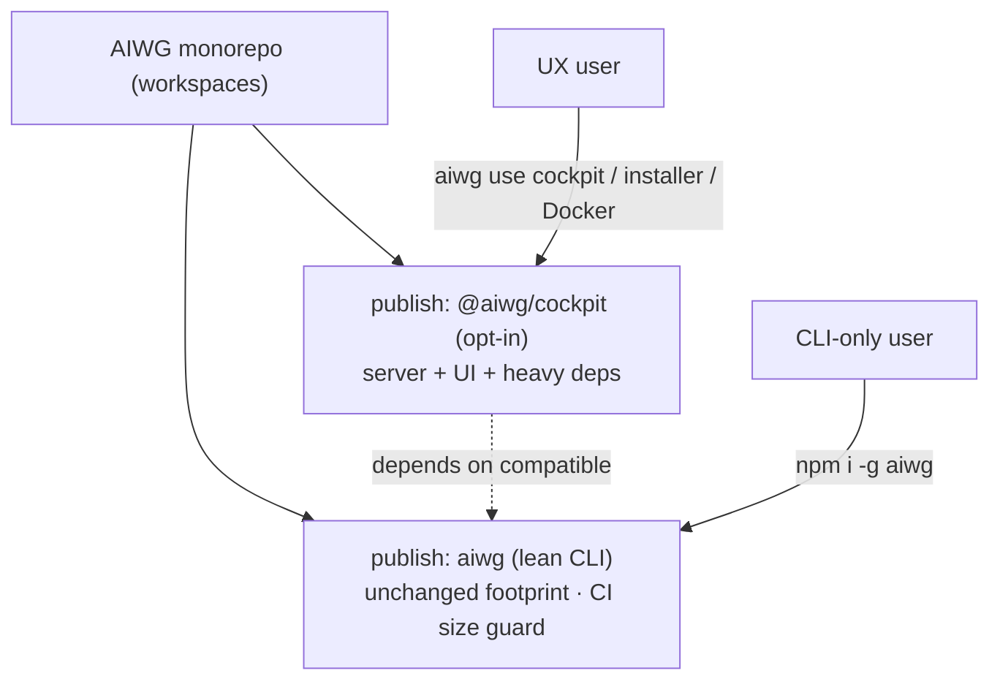

# ADR: Cockpit Package Topology — Monorepo, Separately-Published, Opt-In (Base npm Stays Lean)

**Status**: Proposed
**Phase**: Elaboration
**Related**: @.aiwg/architecture/adr-cockpit-distribution-packaging.md, @.aiwg/architecture/adr-cockpit-ui-cli-extension-binding.md, @.aiwg/management/cockpit-vision.md (§Strategic Posture), @.aiwg/requirements/nfr-modules/cockpit-nfrs.md (NFR-09), @.aiwg/risks/cockpit-risk-register.md (X7, P6), rules: cli-secondary, dependency-source-policy

## Reasoning

1. **Context analysis**: The directive: keep the UI in the monorepo, but **do not ship it with every `npm install`**. Users keep today's lean base install and *opt in* to the full UX/server/tools via npm or other sources. CLI-first is always the floor.
2. **Force identification**: monorepo dev convenience vs. lean base footprint; one-install simplicity vs. user choice of weight; CLI-first floor vs. additive heavy system; version coherence across split packages.
3. **Option evaluation**: below.
4. **Decision justification**: keep Cockpit code in the monorepo but publish it as a **separate, opt-in package**; the base `aiwg` tarball excludes the UI/server/heavy deps; acquisition is explicit (`aiwg use cockpit` / installer / Docker).
5. **Consequence assessment**: introduces multi-package management (workspaces) + a version-coherence contract; protects the base footprint as a measured invariant.

## Context (current state)

`aiwg` is a **single, lean npm package**: no workspaces, 11 runtime deps, and **zero heavy UI/server/browser deps** in base (Playwright is fetched via `npx`, never bundled; the daemon and browser-control are opt-in addons acquired via `aiwg use`). The repo already has an `apps/` directory and a `plugins/`/`vscode-extension/` multi-surface layout. The base install is something to *protect*, not regress.

## Decision

### 1. Monorepo, multi-package
- Cockpit code lives in the monorepo (e.g., `apps/cockpit-ui/` for the web app, `src/cockpit/` or a `@aiwg/cockpit-server` package for the Bridge). Introduce **npm workspaces** so the repo publishes multiple packages from one source tree.
- Published artifacts:
  - **`aiwg`** — the lean core CLI, **unchanged footprint**. Today's install, exactly.
  - **`@aiwg/cockpit`** (opt-in) — the heavy payload: server (Bridge) + UI bundle + their deps (UI framework, server runtime). Depends on a compatible `aiwg` core.

### 2. Base-lean invariant (measured)
- `npm i -g aiwg` MUST NOT pull the UI/server/heavy deps. The base tarball excludes Cockpit (`files`/workspace boundaries), and **a CI guard fails the build if the base package's installed size or dependency count regresses** beyond a set ceiling (mirrors the Codex 32KB / #1579 doctor-guard discipline).
- No Cockpit dep leaks into base `dependencies`. Heavy/external deps are the opt-in package's concern.

### 3. Opt-in acquisition (npm or other sources)
- **`aiwg use cockpit`** is the canonical acquisition: it installs the `@aiwg/cockpit` package (from npm) and deploys the addon — same conceptual flow as today's opt-in addons, just with a heavier published payload.
- Other sources per `adr-cockpit-distribution-packaging`: the guided installer / Homebrew / Docker image bundle the full UX/server for the one-step path; npm remains canonical.
- **Lazy stub**: base ships a thin `aiwg cockpit` command that, if `@aiwg/cockpit` is absent, **offers to install it** (with show-before-run) rather than erroring — "base knows, opt-in loads."

### 4. CLI-first floor (non-negotiable)
- Every CLI capability works with Cockpit **never installed**. Cockpit is purely additive. This is the packaging expression of the UX-first/CLI-always posture: the best of AIWG is in the CLI layer first; the UX is the heavier, optional front.

## Options considered

| Option | Verdict |
|---|---|
| A. Bundle UI/server into the base `aiwg` package | ✗ Bloats every install; forces the heavy system on CLI-only users; contradicts the directive |
| B. Separate repo for Cockpit | ~ Clean isolation but loses monorepo dev/refactor coherence with the core it binds to (registry/serve) |
| C. **Monorepo + workspaces; publish `@aiwg/cockpit` separately; base stays lean; opt-in via `aiwg use`/installer/Docker** | ✓ **Chosen** — lean base, user choice, monorepo coherence, fits existing opt-in pattern |

## Consequences

- **Positive**: base install unchanged (protected by a CI size/dep guard); users explicitly choose the heavier system; monorepo keeps Cockpit in lockstep with the core contracts it binds to (extension registry, serve); reuses the established "base-lean, acquire-on-demand" pattern (browser-control/daemon).
- **Negative / accepted**: introduces workspaces + a multi-package release process (X7); a **version-coherence contract** is required so an opt-in `@aiwg/cockpit` matches the installed `aiwg` core (P6 — pin a compatible-range + a runtime version check in the lazy stub); the guided-installer/Docker paths must compose the two packages without drift (handled by the single SetupManifest, `adr-cockpit-distribution-packaging`).

