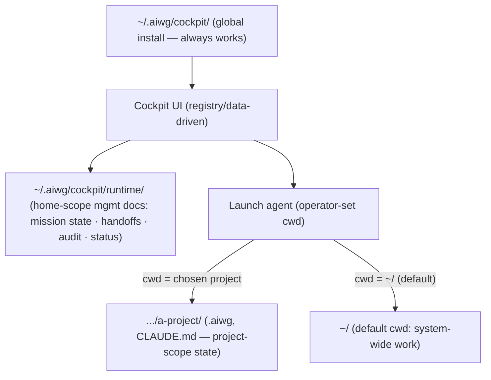

# ADR: Cockpit Runtime Home + Launch Context — Global `~/` Install, Operator-Set Launch CWD, Home-Scope Runtime Docs

**Status**: Proposed
**Phase**: Elaboration
**Related**: @.aiwg/architecture/adr-cockpit-package-topology.md, @.aiwg/architecture/adr-cockpit-ui-cli-extension-binding.md, @.aiwg/architecture/adr-cockpit-session-attach-model.md, @.aiwg/management/cockpit-vision.md, @.aiwg/requirements/nfr-modules/cockpit-nfrs.md (NFR-06, NFR-08), @.aiwg/risks/cockpit-risk-register.md (X8), rules: activity-log, respect-repo-access-manifest, resolveStorage subsystem

## Reasoning

1. **Context analysis**: Cockpit manages a *wider system* — many stacks across many projects. So (a) it must "always work" regardless of where it's launched, (b) it decides where the agent instances it spawns start (their cwd ⇒ what project context they load), and (c) the management activity itself generates runtime docs that don't belong to any one project.
2. **Force identification**: always-works (cwd-independent) vs. project-context fidelity (agents need the right cwd); home-scope management state vs. not polluting project dirs; data-driven UI vs. hardcoded surfaces.
3. **Option evaluation**: below.
4. **Decision justification**: install Cockpit at a global `~/` location; make the agent launch cwd an explicit, per-launch operator choice (default `~/` for system-wide work, a project dir when scoped); and keep Cockpit's runtime/management docs in a home-scope runtime dir, routed through `resolveStorage`.
5. **Consequence assessment**: clean separation of *management* state (home-scope) from *project* state (launch-cwd-scope); the UI stays data-driven off the registry + live runtime feeds.

## Context

Per `adr-cockpit-package-topology`, Cockpit is an opt-in package. Operators run it from anywhere; the stacks it launches need a defined starting directory because **cwd determines which project context (`CLAUDE.md`/`AGENTS.md`/`.aiwg/`) an agent loads**. AIWG already has home-scope precedents (`~/.aiwg/`, OpenClaw/OpenHuman global kernel installs) and `resolveStorage` for subsystem-scoped storage.

## Decision

### 1. UI is registry/data-driven (reinforces the binding ADR)
- The UI renders from **data**, not hardcoded surfaces: capabilities come from the extension+command registry (`adr-cockpit-ui-cli-extension-binding`); the live views (inventory, running agents, sessions, approvals, cost) are bound to AIWG's status/registry/activity-log **data feeds**. Adding an extension or a running stack changes the UI with no UI code change. No hardcoded capability or provider lists.

### 2. Global `~/` install — "always works"
- The Cockpit tool installs to a **global, user-scope location** under `~/` (an appropriate AIWG home path, e.g. `~/.aiwg/cockpit/`), not project-local. The UI/server is therefore launchable from any directory and does not depend on being inside a project. This is the install-location complement to the opt-in package topology and matches AIWG's existing global-home precedents.

### 3. Operator-set launch context (cwd) for spawned agents
- Cockpit **sets the working/home directory from which it launches each agent instance**. cwd is an explicit launch parameter:
  - **Default `~/`** (home) for system-wide / cross-stack management work.
  - **A chosen project directory** when the operator scopes a session to a project (so the agent loads that project's `CLAUDE.md`/`.aiwg/` context).
- The chosen cwd is shown in the Session View (the operator always knows where an agent is rooted) and recorded in the launch's `activity-log` entry. Launch cwd respects `respect-repo-access-manifest` for any repo-scoped work.

### 4. Home-scope runtime docs dir (managing the wider system)
- A dedicated **runtime dir under `~/`** (e.g. `~/.aiwg/cockpit/runtime/`) holds the **runtime-level docs generated while managing the wider system**: cross-stack Mission state, handoff records, the unified audit/activity-log view, generated status/management docs, session metadata. Routed through `resolveStorage` so it honors AIWG storage config.
- **Scope separation (important)**: *management/runtime* artifacts (cross-project, cross-stack) live in the home-scope runtime dir; a stack's *own project work* stays in its launch-cwd project (`.aiwg/` etc.). Cockpit does not pollute project dirs with cross-system management state, and does not hoist project state into home.

## Options considered

| Option | Verdict |
|---|---|
| A. Project-local Cockpit install + project-cwd-only launches + project-scope runtime docs | ✗ Breaks "always works" from anywhere; can't manage across projects; pollutes project dirs with cross-system state |
| B. **Global `~/` install + operator-set launch cwd (default `~/`) + home-scope runtime dir** | ✓ **Chosen** — always-works, correct per-agent context, clean management/project scope split |
| C. Always launch agents from `~/` only (no per-launch cwd) | ✗ Agents wouldn't load the intended project context; too blunt |

## Consequences

- **Positive**: Cockpit works from anywhere; agents start in the right context (operator-chosen cwd, shown + audited); management runtime docs have a home (home-scope) without polluting projects; the UI is data-driven (auto-reflects registry + live state).
- **Negative / accepted**: a home-scope runtime store needs lifecycle care (growth/retention/secrets-hygiene — route via `resolveStorage`, apply activity-log append-only + no-secrets rules; risk X8); launch-cwd is a sharp tool (a wrong cwd loads the wrong context) — mitigated by always showing + auditing the cwd and defaulting sensibly.

