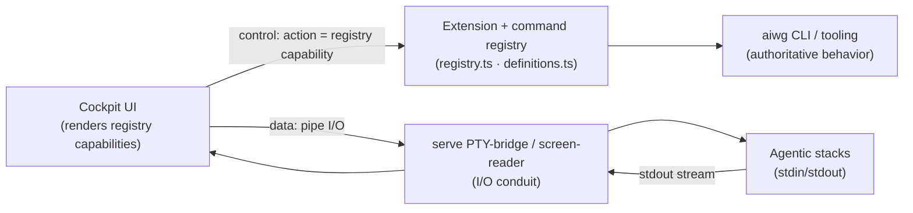

# ADR: Cockpit UI Is Bound to the CLI + Extension Registry — Fronts Them, Pipes Stack I/O (No UI-Only Logic)

**Status**: Proposed
**Phase**: Elaboration
**Related**: @.aiwg/architecture/cockpit-sad.md, @.aiwg/architecture/adr-cockpit-overlay-integration-model.md, @.aiwg/architecture/adr-cockpit-session-attach-model.md, @.aiwg/management/cockpit-vision.md (§Strategic Posture), @.aiwg/requirements/nfr-modules/cockpit-nfrs.md (NFR-09 CLI parity), @.aiwg/risks/cockpit-risk-register.md (P5), rules: cli-secondary, self-maintenance
**AIWG surfaces**: `src/extensions/registry.ts` (extension registry), `src/extensions/commands/definitions.ts` (canonical command definitions), `src/extensions/types.ts` (extension types: agent/command/skill/hook/tool/mcp-server/framework/addon/template/…), the `serve` executor-registry + PTY-bridge/screen-reader.

## Reasoning

1. **Context analysis**: We will always front the UX, but the UI must not become a second implementation of AIWG. The operator's directive: tie the UI to our extensions, CLI, and tooling — the UI *fronts* those — and have the UI pipe the input/output of the agentic stacks it supports.
2. **Force identification**: UX-first front door vs. don't-fork-our-own-logic; permanent CLI parity (NFR-09 / risk P5) vs. UI feature pressure; one operator I/O surface vs. overlay isolation.
3. **Option evaluation**: below.
4. **Decision justification**: bind the UI to AIWG's extension + command registry so every UI capability is *derived from* the same definitions the CLI uses (control plane), and route all agentic-stack stdin/stdout through the UI as a conduit over the existing serve bridge (data plane). Parity becomes structural, not aspirational.
5. **Consequence assessment**: the UI can only do what the registry/CLI/tooling expose (by design); new extensions surface in the UI automatically; the UI carries no business logic of its own.

## Context

AIWG already has a **unified extension system** (`src/extensions/`): a registry plus canonical command definitions and typed extension kinds (command, skill, agent, hook, tool, mcp-server, framework, addon, template). The CLI and tooling are the authoritative behavior. Cockpit is an overlay (per `adr-cockpit-overlay-integration-model`). The open question this ADR settles: *what is the UI made of?* — and the answer must guarantee CLI-always parity (NFR-09 / P5) and define how stack I/O flows.

## Decision

### Control plane — the UI is generated from / bound to the registry
- Cockpit UI capabilities are **derived from the AIWG extension registry + command definitions** (`registry.ts`, `commands/definitions.ts`). A UI action is a *rendering* of a CLI command / extension / tool invocation — it resolves to the same code path the CLI uses.
- **No UI-only logic.** Cockpit contains no behavior that isn't a command/extension/tool in the registry. If the UI needs a capability, that capability is added as an extension/command/tool **first** (CLI-reachable), then surfaced in the UI (this is `cli-secondary`/`self-maintenance` made structural).
- **Consequence: CLI parity by construction.** Because the UI is bound to the same registry, every UI action *has* a CLI equivalent automatically, and new extensions/commands surface in the UI without bespoke UI work. This converts risk P5 from a checklist into an architectural invariant.
- The UI surfaces the equivalent CLI command for any action (the "copy the CLI command" affordance) so easy-first and advanced-by-terminal reinforce each other.

### Data plane — the UI pipes agentic-stack I/O
- Cockpit is the **I/O conduit** for the stacks it supports: it pipes stack stdin/stdout through the existing `serve` PTY-bridge / screen-reader seam (per `adr-cockpit-session-attach-model`). Observe = stream stdout to the UI; drive (where capable) = pipe operator input to stdin — without owning the session lifecycle (overlay isolation preserved).
- **Cross-stack handoff is I/O routing**: piping the *output* of stack A into the *input/context* of stack B is the same conduit, recorded as a linked `activity-log` entry (UC-COCKPIT-007).
- I/O piping respects the security model: opaque attach-handles, no credential storage, signed control actions, and provenance-tagged audit (threat-model I1/T2/R2).

## Options considered

| Option | Verdict |
|---|---|
| A. UI implements its own logic, calls AIWG opportunistically | ✗ Forks behavior; parity drifts (P5); double maintenance; violates cli-secondary |
| B. **UI bound to the extension+command registry (control plane) + pipes stack I/O via serve (data plane); no UI-only logic** | ✓ **Chosen** — structural parity, auto-surfacing of new extensions, single behavior source, overlay-safe I/O |
| C. UI calls the CLI as opaque shell-outs only (no registry binding) | ~ Works but loses typed capability discovery + structured I/O; brittle parsing |

## Consequences

- **Positive**: CLI parity is structural (P5 largely retired by design); new commands/extensions/tools appear in the UI for free; the UI is thin (no business logic), easing maintenance and the agent-friendly-code goals; I/O piping reuses the serve bridge (overlay isolation intact); easy-first + advanced-by-terminal reinforce via the surfaced-command affordance.
- **Negative / accepted**: the UI can only expose what the registry/tooling exposes (a deliberate ceiling — capability gaps are fixed in the CLI/extension layer first, not the UI); the registry-binding contract must stay stable as the extension system evolves (tracked under NFR-07 maintainability / the adapter seam); shell-out-only fallback (option C) may be needed for tools not yet modeled as typed extensions, flagged per-tool.

