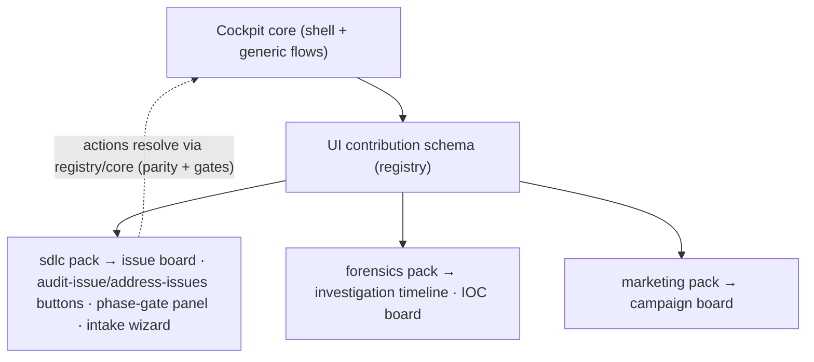

# ADR: Cockpit UI Extensibility — Registry-Driven Contribution Model (Screens, Actions, Workflows, Hooks)

**Status**: Proposed
**Phase**: Elaboration
**Related**: @.aiwg/architecture/adr-cockpit-ui-cli-extension-binding.md, @.aiwg/architecture/adr-cockpit-ui-stack.md, @.aiwg/architecture/adr-cockpit-marketplace-ux-agent-sourcing.md, @.aiwg/management/cockpit-vision.md, @.aiwg/security/cockpit-threat-model.md (E3/I5), UC-COCKPIT-014, @.aiwg/risks/cockpit-risk-register.md (P7, X10), src/extensions/types.ts (extension kinds), src/extensions/registry.ts

## Reasoning

1. **Context analysis**: The UI must be *extensible via the registry* — not a fixed set of screens. Domain packs should contribute tailored surfaces so dev teams manage their work (issues, gates, investigations, campaigns) in the UI instead of the CLI. The operator's example: `audit-issue` and `address-issues` as simple buttons / event hooks.
2. **Force identification**: a coherent, friendly core UX vs. open extensibility; first-party trust vs. third-party/marketplace safety; platform power vs. contract maintenance.
3. **Option evaluation**: below.
4. **Decision justification**: define a **registry-driven UI contribution model** — extensions declare UI contributions (screens, actions, workflows, event hooks) that Cockpit hosts; contributed *actions* still resolve to registry capabilities (binding ADR), so extensibility never bypasses CLI-parity or the security model.
5. **Consequence assessment**: Cockpit becomes the visual surface of the whole AIWG ecosystem; a contribution schema is a new contract; contributed UI (esp. third-party) must be sandboxed.

## Context

The binding ADR established that the UI is *derived from* the registry (capabilities → actions) and logic-free. This ADR goes further: the UI is **a host for registry-contributed surfaces.** AIWG's extension system already types `command`, `skill`, `agent`, `hook`, `tool`, `framework`, `addon`, `template`, … and each framework ships a coherent capability set. Those frameworks should be able to ship *Cockpit UI* alongside their agents/skills/rules.

## Decision

### A UI contribution model, declared in the registry
Extensions declare **UI contributions** (a new contribution schema on extensions, or a `ui-contribution`/`view` extension kind). Cockpit discovers and hosts them. Contribution points:

| Contribution | What it is | Example |
|---|---|---|
| **Action** | A registry capability surfaced as a button/menu item in a context | `audit-issue` / `address-issues` as buttons on an issue row or project view |
| **Screen / panel** | A domain view registered into the IA | SDLC issue board + phase-gate panel; forensics investigation timeline; marketing campaign board; ops runbook runner |
| **Workflow / interaction** | A guided multi-step flow | SDLC intake→elaboration wizard; the address-issues 2-way collaboration view; a Mission composer |
| **Event hook** | UI reacts to / emits events | a hook surfaces a UI prompt on a system event; a button fires a hook/workflow (ties to AIWG `hook`/behavior types) |

### Invariants the contribution model preserves
- **Actions still resolve through the registry/core** (binding ADR) — a contributed button is a *rendering* of a CLI capability; it cannot do anything the CLI can't, and it inherits human-authorization / HITL gates. Extensibility never becomes a privilege side-door.
- **Data-driven + logic-free** — contributions declare *what* (capability + view), Cockpit owns *how* it renders; contributions carry no privileged business logic.
- **Tiered trust** — first-party framework contributions (sdlc/forensics/marketing/ops) are trusted; third-party/marketplace UI contributions run in the sandbox (CSP `connect-src 'self'`, display/interaction scope, no dispatch side-door) per `adr-cockpit-marketplace-ux-agent-sourcing` + threat-model E3/I5, and pass the Adoption Gate.
- **Graceful base** — with no contributions installed, the core shell + the generic flows (UC-COCKPIT-001..013) still work; contributions are additive (mirrors CLI-first).

### What ships where
- **Cockpit core** ships the shell + generic cross-stack flows.
- **Frameworks/addons** ship their Cockpit surfaces in their bundle (the SDLC framework ships the issue/phase-gate screens; forensics ships its timeline; etc.) — deployed the same way their agents/skills/rules are, gated by the opt-in package topology.

## Options considered

| Option | Verdict |
|---|---|
| A. Fixed set of core screens only | ✗ Doesn't scale to AIWG's framework breadth; forces CLI for domain work; contradicts "extensible via the registry" |
| B. Extensions ship arbitrary UI code Cockpit loads | ✗ Huge security/maintenance surface; privilege side-door |
| C. **Declarative registry-driven contribution model; actions resolve via the registry; tiered trust + sandbox** | ✓ **Chosen** — platform extensibility with CLI-parity + security preserved |

## Consequences

- **Positive**: Cockpit becomes the visual front of the *entire* AIWG ecosystem — each framework's value (issues, gates, investigations, campaigns) reachable without the CLI; domain teams get tailored surfaces; reuses the extension/deploy model; contributions inherit parity + security by construction.
- **Negative / accepted**: a **UI-contribution schema is a new public contract** to design + version (P7 — keep it declarative + small; version it); contributed UI is an attack surface, esp. third-party (X10 — sandbox + Adoption Gate + tiered trust); risk of an inconsistent UX across many contributors (mitigate: a Cockpit design system + the AIWG UX team reviewing first-party contributions).

