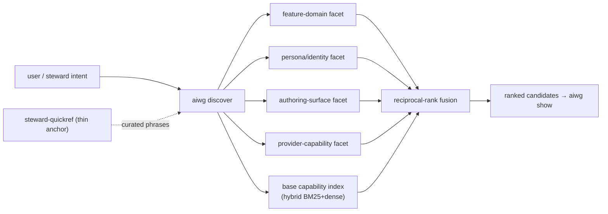

# ADR: Feature-Domain Discoverability via Facet-Enriched Index + Thin Steward Anchors

**Status:** Accepted — implemented across #1623 (facet enrichment + single-pass fused query) and #1626 (parallel multi-vector fan-out + RRF)
**Date:** 2026-06-18
**Issue:** #1623
**Supersedes:** —
**Related:** #1212 (index-driven discovery substrate), `skill-discovery` rule, `cli-secondary` rule
**Research basis:** `.aiwg/research/reports/issue-1623-steward-discoverability-research-brief.md`

## Context

Users — and the `aiwg-steward` agent, the documented routing fallback — cannot find three
capability domains: **expansion** (extension/addon/framework authoring), **persona** (SOUL profiles
+ persona agents), and **project** (`aiwg new` + project-local bundles).

A research spike established the load-bearing fact: **this is a surfacing/curation problem, not an
indexing problem.** All three already return from `aiwg discover` (`scaffold-extension` 0.66,
`new-project` 0.58–0.66, `soul-create` 0.26, persona agent `aiwg-writer` 0.27 — verified live). The
failure is weak *information scent* (Pirolli & Card), a missing *signifier* (Norman), and thin
ranking metadata (empty `triggers: []` on persona agents — the exact anti-pattern flagged by ToolRet,
SkillRouter, and Faghih's "rewordings swing selection >10×").

The existing substrate is already the right shape and must not be rebuilt:
- `src/artifacts/query-engine.ts` `discoverCapability` + `src/artifacts/hybrid-query.ts`
  (lexical+dense) + `fulltext.ts` (FTS5 BM25) — established as near-optimal for a ~400-item corpus
  (`zero-server-index-tech-2026-05.md`; Fortemi/REF-249: BM25+dense+RRF beats heavy stacks <100K docs).
- `src/artifacts/browser-export.ts` **already carries a `facets: Record<string, string[]>` concept** —
  the multi-facet design below extends an existing structure rather than inventing one.

## Decision

Adopt a **facet-enriched, multi-vector-capable index as the heavy-lifting layer, with thin steward
quickref anchors as signposts** — and proactive signifier behavior in the steward.

Concretely:

1. **The index does the heavy lifting.** Enrich the capability index with four separately-rankable
   **facets** the CLI can fuse at query time (RRF):

   | Facet | Answers | Backing data |
   |---|---|---|
   | **feature-domain** | "author an expansion", "scaffold a project" → owning skill/agent | curated feature→capability map (Tool-to-Agent pattern, REF-878) |
   | **persona/identity** | "persona", "soul", "a writer voice" → SOUL profiles + persona agents (author **and** select) | `agentic/code/agents/personas/*`, `soul-*` skills |
   | **authoring-surface** | create-vs-use split: "how do I *make* X" vs "run X" | `scaffold-*`, `devkit-*`, `new-*` vs runtime skills |
   | **provider-capability** | "does provider P support X natively?" | existing `capability-matrix.yaml`, surfaced through the same fused path |

2. **Quickrefs are thin anchors, not reference bodies.** A dedicated `steward-quickref` kernel skill
   (and small additions to the two existing kernel quickrefs) holds **guidance + anchoring phrases
   only** — e.g. "personas → `aiwg discover persona`". No inlined skill/agent bodies. This honors the
   OpenClaw 150-skill / Copilot ~15K-char budgets (`skill-budget-landscape-2026-05.md`) and the
   command-palette "stable, memorable" lesson (VS Code #1964) without spending budget on content.

3. **Trigger/description engineering is mandatory and guarded.** Populate `triggers` + front-loaded,
   synonym-bearing descriptions on persona agents and the authoring skills, and add a
   **metadata-completeness lint** (`skill-lint.ts` / `agent-validator.ts`) so empty `triggers` fail
   validation and the regression cannot silently recur.

4. **The steward surfaces proactively.** The steward volunteers the affordance ("you can also author
   expansions / personas / scaffold projects") in relevant contexts (Norman signifier), and
   **re-queries** when a first discover pass is low-confidence instead of dead-ending (Dynamic ReAct
   arch-5, REF-1033).

5. **Ship facet-enrichment now; specify multi-vector, ship single-pass fused query.** #1623 lands the
   four facets + enrichment + fused single-pass `discover`. The contract for the CLI fanning out
   across N facet vectors in parallel is *specified* here but its parallel-fan-out implementation may
   land incrementally without breaking the contract.

6. **Fix the latent `show` bug.** Add `agentic/code/agents` to `findCorpusArtifact`
   (`query-engine.ts:786`) so persona `show` survives un-indexed workspaces.

### Fused discover fan-out (target contract)

## Consequences

**Positive**
- Builds on settled architecture; no heavy new index, no quickref body-bloat.
- Facets are independently tunable; the provider-capability facet folds `capability-matrix.yaml`
  into the same discover path the steward already trusts.
- Lint guard prevents metadata regression class-wide, not just for today's three domains.
- Persona "author + select" both land because the persona facet is first-class (selection *UX* is a
  separate follow-up spike — research gap noted in the brief).

**Negative / risks**
- A new kernel skill (`steward-quickref`) spends a slice of OpenClaw/Copilot budget even kept thin —
  mitigated by anchor-only content and measured against `aiwg doctor` kernel counts.
- Multi-facet fusion adds ranking surface area; must verify the three target domains rank in top-3
  for their canonical phrases (acceptance test) and that existing queries don't regress.
- Curated feature→capability map needs ownership/maintenance — guarded by the lint + a discover
  acceptance test, not left to drift.

## Alternatives considered

1. **Inline reference into a fat quickref.** Rejected: violates budget caps and the user's explicit
   steer ("quickrefs should be guidance/anchoring; indices do the heavy lifting"); contradicts the
   thin-kernel finding.
2. **New heavyweight embedding/ColBERT index.** Rejected: over-engineered for ~400 items
   (Fortemi/REF-249; hybrid+RRF already near-optimal).
3. **Training-based routing (ToolGen tokens / fine-tuned router).** Rejected for now: high cost,
   non-portable across 10 providers; revisit only if curated facets prove insufficient.
4. **Reactive-only steward.** Rejected: the failure is a missing signifier — answering only when
   asked leaves the affordance invisible (Norman, information scent).

## Dependency: harden the existing project-index registry

The four facet indices are durable project-level indices and must be tracked/refreshed alongside the
existing framework/project/codebase graphs. A registry mechanism **already exists** — the
`index.graphs` block in `.aiwg/aiwg.config` (#1491) + module-declared graphs
(`loadUserGraphConfigs`/`GRAPH_CONFIGS`, `src/artifacts/types.ts:472`) + per-index
`checksum-manifest.json` + the `post-commit-index-refresh` rule. It is **real but weak/unreliable**:
the mechanism is undiscoverable, `loadUserGraphConfigs` **silently swallows** malformed graph configs
(best-effort `try/catch`), and there is no reliable "list all registered + freshness + drift +
rebuild-all" surface or doctor staleness gate. The fix is to **harden the existing layer**, not build
a new one. Captured as **Workstream F** and recommended as a **companion issue**; #1623 registers its
facets through the existing `index.graphs`/module-graph mechanism so they are tracked from day one.

## Implementation status

- **#1623 (single-pass fused):** `src/artifacts/discover-facets.ts` carries the
  curated `DISCOVER_FACETS` table; `discoverCapability` fuses it into the
  ranking. Facet-matched capabilities are lifted to an activation floor so they
  out-rank generic domain-word matches.
- **#1626 (parallel fan-out + RRF):** `applyFacetFusion` fans out across the
  facet vectors in parallel (`Promise.all` over `rankFacetVector`) and fuses
  them with the base lexical ranker via reciprocal-rank fusion. The fusion is a
  superset of the single-pass behavior: RRF consensus orders entries *within* a
  floor tier (multi-vector / more-relevant capabilities first) while the floor
  lift preserves the emitted score scale, so no existing query regresses.
- **Per-facet weighting (configurable):** `FacetWeights` (exported, with
  `DEFAULT_FACET_WEIGHTS`) tunes the base-ranker and per-facet contributions to
  the RRF sum. Defaults preserve the #1623 ranking; `provider-capability` is
  weighted 0.75 so it informs ties without dominating feature/persona queries.
  Operator-config wiring (reading weights from `.aiwg/aiwg.config`) is a
  follow-up; the fusion API is parameterized today.

## Follow-ups (out of scope for #1623)

- **Companion issue:** project-index registry + refresh rails (Workstream F — durable-index tracking,
  `aiwg index status/build --all/verify`, doctor staleness check).
- Parallel multi-vector fan-out implementation (contract specified here).
- **Persona selection UX spike** (catalog-pick at runtime — uncovered by both research corpora).
