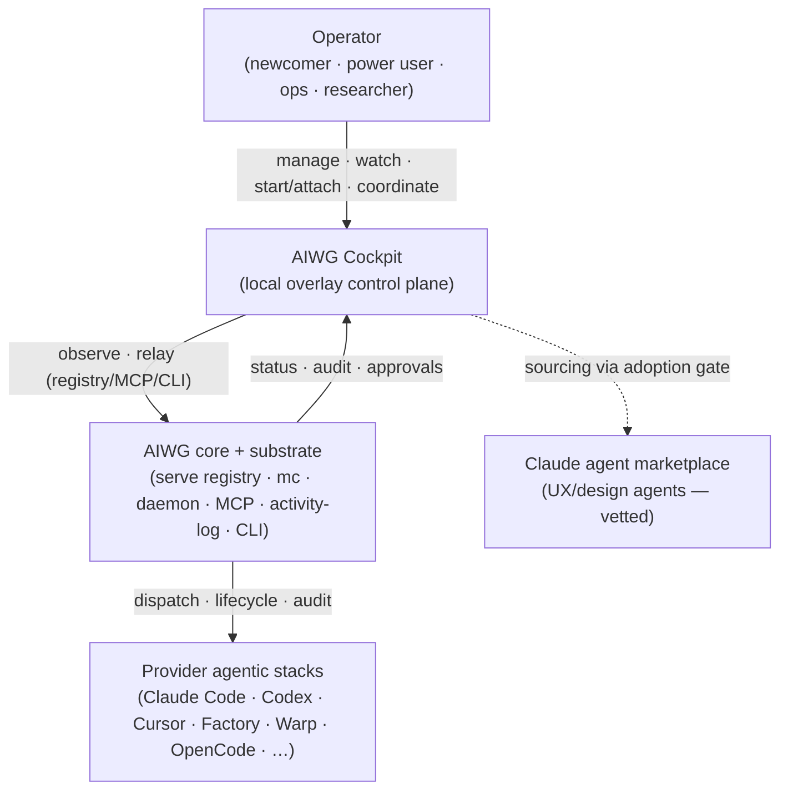
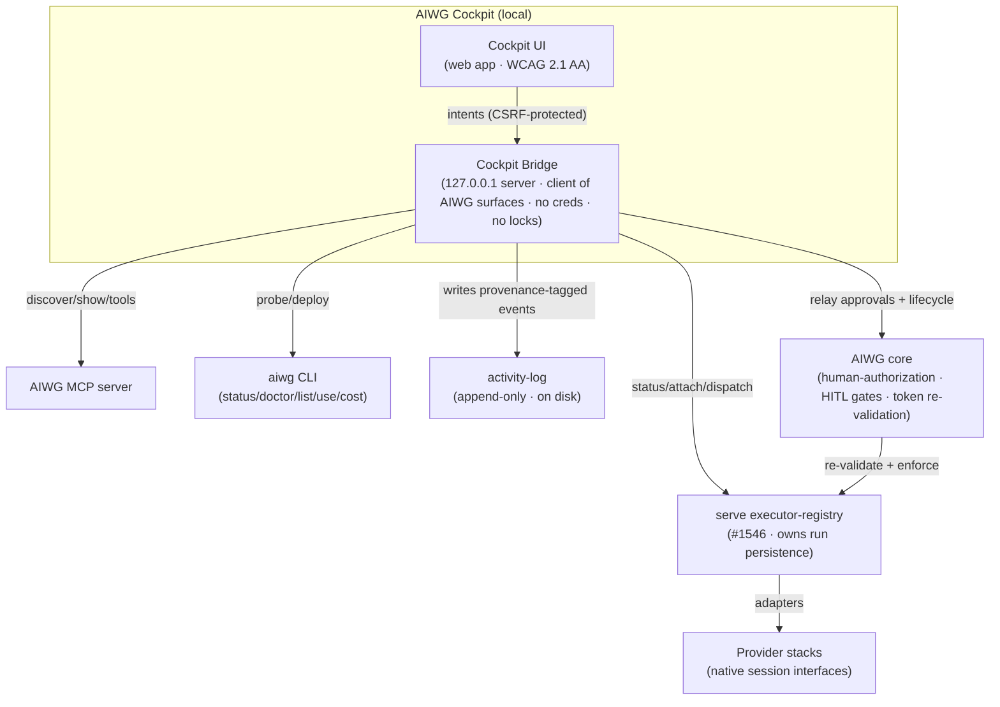

# Software Architecture Document — AIWG Cockpit

**Phase**: Elaboration
**Status**: Draft (Architecture Baseline candidate)
**Related**: @.aiwg/management/cockpit-vision.md, @.aiwg/requirements/ (UC-COCKPIT-001..012), @.aiwg/requirements/nfr-modules/cockpit-nfrs.md, @.aiwg/security/cockpit-threat-model.md, @.aiwg/risks/cockpit-risk-register.md
**ADRs**: adr-cockpit-overlay-integration-model, adr-cockpit-coordination-bus, adr-cockpit-session-attach-model, adr-cockpit-ui-stack, adr-cockpit-marketplace-ux-agent-sourcing, adr-cockpit-distribution-packaging
**Posture**: UX-first front door, CLI-always (see @.aiwg/management/cockpit-vision.md §Strategic Posture) — the UI is the default surface; the CLI stays at full capability underneath.

## 1. Reasoning

1. **Problem analysis**: AIWG's power is spread across the CLI, per-provider session UIs, config, and background daemons. The Cockpit must unify *management + observation + control + cross-stack coordination* into one friendly surface — without replacing or destabilizing any of it.
2. **Constraint identification**: Two architecture-shaping invariants dominate — **overlay isolation** (NFR-01: a Cockpit crash never affects a running stack) and **non-nerf capability parity** (NFR-02). Plus: reuse the existing AIWG substrate (serve executor-registry/#1546, Mission Control, daemon/concierge, MCP, activity-log, `resolveStorage`); no new backend; local/single-operator v1.
3. **Force identification**: friendliness vs. power; unify vs. don't-replace; drive vs. don't-hijack; coordination value vs. blast-radius/security.
4. **Decision rationale**: A thin **overlay control plane** — a local UI talking to a thin **Cockpit Bridge** that is a *client* of AIWG's existing surfaces (serve executor-registry, MCP, CLI, activity-log). The Bridge never owns run lifecycle/persistence (the registry does) and never replaces a provider's session — it observes/relays. All mutating/authorizing actions flow through AIWG core, which re-validates them.
5. **Consequence assessment**: Buys isolation + parity + auditability + maintainability (adapter seam). Costs: Cockpit is only as capable as the substrate exposes (some stacks are observe-only); coordination richness is bounded by #1546 maturity (tracked risk X2).

## 2. Architecture Overview

Cockpit is an **overlay control plane**, not a runtime. It is three layers:

- **Cockpit UI** — local web app (the friendly surface): Home/Inventory, Running Agents, Session View, Approval Inbox, Cost/Quota, Deploy. Progressive disclosure (newcomer-first, power behind).
- **Cockpit Bridge** — a thin local server (bound `127.0.0.1`) that is a *client* of AIWG's surfaces. It translates UI intents into calls on the executor-registry / MCP / CLI, streams status, relays approvals/lifecycle to AIWG core, and writes provenance-tagged `activity-log` entries. It holds **no** provider credentials and **no** exclusive run locks.
- **AIWG substrate (existing, unchanged)** — `serve` executor-registry (cross-stack Missions, #1546), Mission Control, daemon/concierge, MCP server, activity-log, `resolveStorage`, the `aiwg` CLI (`status --probe`, `doctor`, `list`, `use`, `cost-report`, `metrics-tokens`). **The provider stacks** (Claude Code, Codex, Cursor, Factory, Warp, OpenCode, …) sit behind their native interfaces; Cockpit reaches them only through the registry's adapters.

The **adapter seam is the executor-registry** (NFR-07): new providers/stacks are absorbed there, not in the UI or Bridge.

## 3. C4 — Context



## 4. C4 — Container



## 5. Key Components (Container → Components)

| Component | Responsibility | UC | NFR |
|---|---|---|---|
| Inventory service (Bridge) | Read install/health via `status --probe`/`doctor`/`list` | UC-001, UC-011 | NFR-07 |
| Run observer (Bridge) | Aggregate running ralph/mc/serve/daemon state from the registry | UC-002, UC-006 | NFR-01, NFR-04 |
| Session attach proxy (Bridge) | Observe/drive a running session via PTY-bridge/screen-reader, observer-default | UC-004, UC-005 | NFR-01, NFR-02 |
| Coordination service (Bridge) | Cross-stack handoff + unified Mission dispatch on the registry | UC-007, UC-008 | NFR-02, NFR-08 |
| Approval relay (Bridge) | Aggregate HITL gates; relay decisions to core for re-validation | UC-009 | NFR-03, NFR-08 |
| Cost/quota reader (Bridge) | Surface `cost-report`/`metrics-tokens`/#1187 | UC-010 | NFR-04 |
| Lifecycle relay (Bridge) | Pause/resume/stop via native lifecycle interfaces | UC-012 | NFR-01 |
| Deploy service (Bridge) | Wrap `aiwg use`/`remove`; never hand-copy | UC-011 | NFR-07 |
| Provider adapter set (registry) | Per-stack capability + attach/observe tiers | all | NFR-07 |

## 6. Cross-cutting concerns

- **Security** (threat model): no creds in UI state (I1); `127.0.0.1` bind + Origin allow-list + CSRF (S1); approvals re-validated by core, never minted by Bridge (E1/S3); marketplace agents sandboxed to display scope + strict CSP (E3/I5); HMAC-signed dispatch payloads (T2); marketplace supply-chain pinning (T3).
- **Overlay isolation** (NFR-01/D1): registry owns persistence; Bridge is fire-and-track, holds no exclusive locks; idempotent reattach from CLI/MCP/daemon after a Cockpit crash.
- **Non-nerf parity** (NFR-02/P1): per-provider capability-parity checklist is an ABM gate; drive only where provably safe, else observe-only.
- **Auditability** (NFR-08): every Bridge action → append-only activity-log with provenance tag (`operator`/`agent:<name>@<hash>`/`cli`/`mcp`/`daemon`).
- **Accessibility** (NFR-05): WCAG 2.1 AA on the core flows.

## 7. Key flows (sequence)

```mermaid
sequenceDiagram
    participant U as Operator
    participant UI as Cockpit UI
    participant B as Cockpit Bridge
    participant C as AIWG core
    participant R as executor-registry
    U->>UI: Approve a pending HITL gate
    UI->>B: decision (CSRF-protected)
    B->>C: relay decision (no token minted)
    C->>C: re-validate fresh approval token
    C->>R: enforce on originating stack
    B->>B: write provenance-tagged activity-log entry
    Note over B,R: Cockpit relays; core authorizes; registry enforces
```

## 8. Architecture decisions (see ADRs)

1. **Overlay integration model** — observe/relay via registry+MCP+CLI; never fork a provider session. → `adr-cockpit-overlay-integration-model`
2. **Coordination bus** — cross-stack handoff + unified dispatch on #1546. → `adr-cockpit-coordination-bus`
3. **Session attach model** — PTY-bridge/screen-reader, observer-default, non-destructive. → `adr-cockpit-session-attach-model`
4. **UI stack** — local-server web app; framework choice. → `adr-cockpit-ui-stack`
5. **Marketplace UX-agent sourcing** — adoption gate + AIWG UX team. → `adr-cockpit-marketplace-ux-agent-sourcing`
6. **Distribution & packaging** — UX-first guided installer + multi-target (beyond npm) generated from one `setup.aiwg.io/v1` SetupManifest (agentic-installer); npm stays canonical; CLI-always. → `adr-cockpit-distribution-packaging`
7. **UI↔CLI/extension binding** — the UI is *derived from* the extension+command registry (control plane, no UI-only logic → structural CLI parity) and *pipes* stack stdin/stdout via the serve bridge (data plane). → `adr-cockpit-ui-cli-extension-binding`
8. **UI extensibility / contribution model** — extensions contribute screens/actions/workflows/event hooks; actions still resolve via the registry. → `adr-cockpit-ui-extensibility-contribution-model`
9. **Package topology** — monorepo, separately-published `@aiwg/cockpit`, base npm stays lean, opt-in. → `adr-cockpit-package-topology`
10. **Runtime home + launch context** — global `~/` install, operator-set launch cwd, home-scope runtime docs. → `adr-cockpit-runtime-home-and-launch-context`
11. **Instance-control substrate** — normalize on the **agentic-sandbox** interface (backends: screen/zellij/tmux/native; direct+managed); **daemon decoupled + UI-managed**. Two planes: agentic-sandbox = instance control, serve/#1546 = coordination. → `adr-cockpit-instance-control-substrate`

## 9. Risks retired / to retire at ABM

- D1/NFR-01 overlay-isolation kill-bridge PoC; P1/NFR-02 per-provider parity checklist; E1+S3 relayed-approval integrity PoC; X1/X2 attach-capability + registry-seam spikes (see risk register §Top risks).

## 10. Open items for ABM gate

- UI-stack ADR decision finalized; provider attach-capability tier matrix populated; #1546 seam maturity confirmed or scoped to supported stacks.
