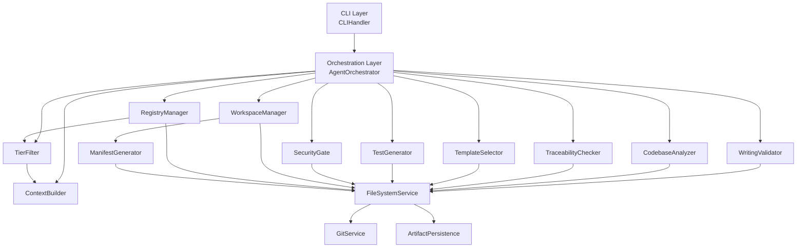

# Software Architecture Document - AI Writing Guide (AIWG) Project

**Document Type**: Architecture Baseline
**Project**: AI Writing Guide - SDLC Framework Plugin System
**Version**: 1.0
**Status**: BASELINED
**Date**: 2025-10-22
**Phase**: Elaboration → Construction Transition
**Author**: Architecture Designer

---

## Document History

| Version | Date | Changes | Author |
|---------|------|---------|--------|
| 0.1 | 2025-10-22 | Initial draft (Architecture Designer) | Architecture Designer |
| 1.0 | 2025-10-22 | Baselined for Construction phase | Multi-Agent Review Team |

---

## Table of Contents

1. [Introduction](#1-introduction)
2. [Architectural Overview](#2-architectural-overview)
3. [Architecturally Significant Requirements](#3-architecturally-significant-requirements)
4. [Architectural Views](#4-architectural-views)
5. [Runtime Scenarios](#5-runtime-scenarios)
6. [Design Decisions and Rationale](#6-design-decisions-and-rationale)
7. [Technology Stack](#7-technology-stack)
8. [Quality Attribute Tactics](#8-quality-attribute-tactics)
9. [Risks and Mitigations](#9-risks-and-mitigations)
10. [Implementation Guidelines](#10-implementation-guidelines)
11. [Outstanding Issues](#11-outstanding-issues)
12. [Appendices](#12-appendices)

---

## 1. Introduction

### 1.1 Purpose

This Software Architecture Document (SAD) defines the architectural baseline for the AI Writing Guide (AIWG) project. It serves as the authoritative guide for implementation, describing the system's structure, key design decisions, and rationale that govern how components interact to satisfy functional and non-functional requirements.

### 1.2 Scope

This document covers the complete AIWG system architecture including:

- **Writing Quality Framework**: AI pattern detection, content validation, authenticity scoring
- **SDLC Framework**: 58 agents, 42+ commands, multi-agent orchestration workflows
- **Plugin System**: Framework-scoped workspace management, plugin registry, tier-based context filtering
- **CLI Tooling**: Installation, deployment, project scaffolding, status reporting
- **Infrastructure**: GitHub repository, CI/CD pipelines, manifest generation

**Out of Scope**: Implementation details (covered in code), detailed API specifications (covered in component docs), testing procedures (covered in Master Test Plan).

### 1.3 Intended Audience

- **Architecture Reviewers**: Validate architectural soundness and completeness
- **Developers**: Understand system structure before implementation
- **Test Architects**: Design test strategies aligned with architecture
- **Operations Team**: Plan deployment and operational monitoring
- **Project Managers**: Assess implementation feasibility and effort

### 1.4 Architectural Drivers

**Key Requirements Driving Architecture**:
- **UC-004**: Multi-Agent Documentation (Primary Author → Parallel Reviewers → Synthesizer pattern)
- **UC-006**: Automated Traceability (Requirements → Code → Tests mapping)
- **FID-007**: Framework-Scoped Workspace Management (tier-based context filtering)
- **NFR-PERF-002**: SDLC Deployment Time (<10s for 58 agents)
- **NFR-SEC-001**: Content Privacy (zero external API calls)
- **NFR-QUAL-002**: Requirements Traceability Coverage (100%)

**Key Constraints**:
- Node.js/JavaScript ecosystem (no backend server required)
- Local filesystem storage (no database dependency)
- Git integration required (version control for artifacts)
- Claude Code agent compatibility (file operations only, no network calls)
- Solo developer maintenance (simplicity over enterprise complexity)

**Key Assumptions**:
- Users have Git installed and basic Git knowledge
- Users operate in POSIX-compliant environments (Linux, macOS, WSL)
- Node.js 18+ available
- Claude Code agents available for orchestration

---

## 2. Architectural Overview

### 2.1 System Vision

AIWG is a **pluggable framework system** that enables AI-assisted software development through specialized agent workflows. The system provides two primary capabilities:

1. **Writing Quality Framework**: Detect AI-generated content patterns and improve authenticity
2. **SDLC Framework**: Complete software development lifecycle support (Inception → Elaboration → Construction → Transition)

The architecture enables **framework extensibility** through a plugin system where multiple frameworks can coexist, each with isolated workspaces and scoped context loading.

### 2.2 High-Level Architecture

```
┌─────────────────────────────────────────────────────────────────┐
│                         CLI Layer                                │
│  aiwg -deploy-agents | -new | -status | -update | -version     │
└────────────────────┬────────────────────────────────────────────┘
                     │
┌────────────────────▼────────────────────────────────────────────┐
│                   Orchestration Layer                            │
│  Multi-Agent Workflows │ Task Delegation │ Review Synthesis     │
└────────────────────┬────────────────────────────────────────────┘
                     │
┌────────────────────▼────────────────────────────────────────────┐
│                  Core Services Layer                             │
│  WorkspaceManager │ RegistryManager │ ContextBuilder │          │
│  TierFilter │ ManifestGenerator │ CLIHandler                    │
└────────────────────┬────────────────────────────────────────────┘
                     │
┌────────────────────▼────────────────────────────────────────────┐
│                    Framework Layer                               │
│  SDLC Agents (58) │ Writing Validators │ Template Processors    │
│  Traceability │ Test Generators │ Security Gates                │
└────────────────────┬────────────────────────────────────────────┘
                     │
┌────────────────────▼────────────────────────────────────────────┐
│                     Storage Layer                                │
│  Filesystem Operations │ Git Integration │ Artifact Persistence │
└─────────────────────────────────────────────────────────────────┘
```

### 2.3 Major Components

**Core Services** (7 components):
1. **WorkspaceManager**: Framework-scoped workspace management (.aiwg/frameworks/{id}/)
2. **TierFilter**: Context filtering (Tier 1: Project, Tier 2: Framework, Tier 3: Root)
3. **RegistryManager**: Plugin registry management (frameworks, add-ons, extensions)
4. **ContextBuilder**: Agent context generation from filtered manifests
5. **ManifestGenerator**: Manifest.json/.md generation for directories
6. **CLIHandler**: Command-line argument parsing and execution
7. **DeploymentManager**: Agent and command deployment to .claude/

**Framework Services** (9 key components):
1. **WritingValidator**: AI pattern detection and content validation (UC-001)
2. **CodebaseAnalyzer**: Analyze existing codebases for intake generation (UC-003)
3. **AgentOrchestrator**: Multi-agent workflow coordination (UC-004)
4. **TraceabilityChecker**: Requirements-to-code-to-test tracing (UC-006)
5. **MetricsCollector**: Velocity, quality, DORA metrics collection (UC-007)
6. **TemplateSelector**: Context-aware template recommendation (UC-008)
7. **TestGenerator**: Test case generation from use cases (UC-009)
8. **RollbackManager**: Plugin installation rollback (UC-010)
9. **SecurityGate**: Multi-tool security validation (UC-011)

**Storage Services** (3 components):
1. **FileSystemService**: File I/O operations, directory traversal
2. **GitService**: Git operations (clone, commit, push, status)
3. **ArtifactPersistence**: SDLC artifact storage and retrieval

---

## 3. Architecturally Significant Requirements

### 3.1 Functional Requirements (Use Cases)

**P0 Use Cases** (Make-or-Break for MVP):
- **UC-001**: Validate AI-Generated Content - AI pattern detection in 2000-word documents (<60s)
- **UC-002**: Deploy SDLC Framework - Deploy 58 agents + 42 commands (<10s)
- **UC-003**: Intake from Codebase - Analyze 1000 files for intake generation (<5min)
- **UC-004**: Multi-Agent Documentation - Orchestrate Primary Author → Reviewers → Synthesizer
- **UC-006**: Automated Traceability - Scan 200 requirements, 1000 code files, 500 test files (<60s total)
- **UC-008**: Template Selection - Interactive template selection with recommendations (<5min)
- **UC-009**: Test Templates - Generate test cases from use cases (1 UC → 15-30 tests)
- **UC-011**: Security Validation - Multi-tool scan (secrets, SAST, dependencies) with risk-based gates

**P1 Use Cases** (High Value, Post-MVP):
- **UC-005**: Framework Self-Improvement - Meta-application for AIWG evolution
- **UC-007**: Metrics Collection - Velocity, quality, DORA metrics with 12-month trends
- **UC-010**: Plugin Rollback - Rollback plugin installation to baseline (<5s)

### 3.2 Non-Functional Requirements (Quality Attributes)

**Performance** (22 NFRs):
- NFR-PERF-001: Content Validation Time (<60s for 2000 words, p95)
- NFR-PERF-002: SDLC Deployment Time (<10s for 58 agents, p95)
- NFR-TRACE-01: Requirements Scan Time (<10s for 200 requirements)
- NFR-TRACE-02: Code Scan Time (<30s for 1,000 files)
- NFR-TRACE-03: Test Scan Time (<20s for 500 test files)
- NFR-TMPL-01: Template Catalog Search (<2s, p95)
- NFR-TEST-01: Test Generation Time (<10min for 100 requirements)
- NFR-SEC-PERF-01: Security Gate Validation (<10s, p95)

**Security** (18 NFRs):
- NFR-SEC-001: Content Privacy (zero external API calls)
- NFR-SEC-003: File Permissions Security (match source permissions)
- NFR-SEC-ACC-01: Attack Detection Accuracy (100% for known vectors)
- NFR-SEC-COMP-02: P0 Threat Mitigation Coverage (100%)
- NFR-SEC-PERF-02: Secret Scan Time (<3s for 1,000 files)

**Usability** (13 NFRs):
- NFR-USE-001: AI Validation Learning Curve (1-2 cycles)
- NFR-USE-004: First-Time Setup Friction (<15 minutes)
- NFR-USE-005: Error Message Clarity (100% include remediation)
- NFR-TRACE-11: Report Clarity (100% actionable steps)
- NFR-TMPL-04: First-Time User Success Rate (85%+)

**Accuracy** (12 NFRs):
- NFR-ACC-001: AI Pattern False Positive Rate (<5%)
- NFR-ACC-002: Intake Field Accuracy (80-90%)
- NFR-TRACE-05: Requirement ID Extraction Accuracy (98%)
- NFR-TMPL-07: Template Recommendation Accuracy (>90%)
- NFR-SEC-ACC-04: CVE Detection Accuracy (100% for Critical/High)

**Quality** (13 NFRs):
- NFR-QUAL-001: Multi-Agent Reviewer Sign-offs (3+ reviewers)
- NFR-QUAL-002: Requirements Traceability Coverage (100%)
- NFR-QUAL-003: Test Coverage Targets (80% unit, 70% integration, 50% E2E)
- NFR-COMP-001: AI Pattern Database Size (1000+ patterns)

**Reliability** (9 NFRs):
- NFR-REL-001: Deployment Success Rate (100%)
- NFR-REL-002: Data Preservation (zero loss)
- NFR-TRACE-09: Graceful Degradation (continue despite parse errors)
- NFR-SEC-REL-01: Graceful Degradation (continue despite tool failures)

---

## 4. Architectural Views

### 4.1 Logical View

#### 4.1.1 Layer Architecture

**Layer 1: CLI Layer**
- **Purpose**: User interface, command parsing, output formatting
- **Components**: CLIHandler, CommandParser, OutputFormatter
- **Responsibilities**:
  - Parse command-line arguments (aiwg -deploy-agents --mode sdlc)
  - Validate inputs and show usage help
  - Format output (tables, status indicators, progress bars)
  - Delegate to Orchestration Layer

**Layer 2: Orchestration Layer**
- **Purpose**: Multi-agent workflow coordination
- **Components**: AgentOrchestrator, WorkflowEngine, ReviewSynthesizer
- **Responsibilities**:
  - Implement multi-agent patterns (Primary Author → Parallel Reviewers → Synthesizer)
  - Manage agent lifecycle (launch, monitor, collect results)
  - Synthesize multi-agent feedback
  - Handle timeout and failure scenarios

**Layer 3: Core Services Layer**
- **Purpose**: Framework-agnostic services
- **Components**: WorkspaceManager, RegistryManager, TierFilter, ContextBuilder, ManifestGenerator
- **Responsibilities**:
  - Manage framework-scoped workspaces
  - Maintain plugin registry (frameworks, add-ons, extensions)
  - Filter context by tier (Project → Framework → Root)
  - Generate agent context from manifests
  - Generate manifest.json/.md files

**Layer 4: Framework Layer**
- **Purpose**: Framework-specific logic
- **Components**: WritingValidator, CodebaseAnalyzer, TraceabilityChecker, TemplateSelector, TestGenerator, SecurityGate
- **Responsibilities**:
  - Execute framework-specific workflows
  - Apply domain knowledge (SDLC, writing quality)
  - Generate artifacts (requirements, architecture, tests)
  - Validate quality (traceability, security, test coverage)

**Layer 5: Storage Layer**
- **Purpose**: Data persistence and retrieval
- **Components**: FileSystemService, GitService, ArtifactPersistence
- **Responsibilities**:
  - File I/O operations (read, write, delete)
  - Git operations (clone, commit, push, status)
  - Artifact persistence (.aiwg/ directory structure)
  - Manifest storage and retrieval

#### 4.1.2 Component Diagram



#### 4.1.3 Key Abstractions

**Plugin** (Abstract):
- Properties: id, type (framework/add-on/extension), version, installDate, repoPath
- Methods: install(), activate(), deactivate(), rollback()
- Implementations: Framework, AddOn, Extension

**Workspace** (Abstract):
- Properties: basePath, framework, tier, manifestPath
- Methods: initialize(), loadManifest(), filterContext(), cleanup()
- Implementations: FrameworkWorkspace, ProjectWorkspace

**Agent** (Abstract):
- Properties: id, name, role, tools[], workingDirectory
- Methods: execute(prompt), getContext(), reportResult()
- Implementations: RequirementsAnalyst, ArchitectureDesigner, TestArchitect, SecurityGatekeeper

**Manifest** (Data Structure):
- Properties: version, files[], directories[], metadata
- Methods: generate(), validate(), merge()
- Formats: manifest.json (machine-readable), manifest.md (human-readable)

---

### 4.2 Process View

#### 4.2.1 Plugin Deployment Workflow (UC-002)

```
User: aiwg -deploy-agents --mode sdlc
  │
  ▼
CLIHandler: Parse arguments
  │ --mode=sdlc, --provider=claude
  ▼
DeploymentManager: Validate deployment
  │ Check .claude/ directory exists
  │ Check source agents exist
  ▼
AgentDeployer: Copy agents
  │ For each agent in sdlc-complete/agents/
  │   Read agent.md
  │   Copy to .claude/agents/{agent-name}.md
  │ Update agent count: 58 agents
  ▼
RegistryManager: Update registry
  │ Read .aiwg/frameworks/registry.json
  │ Add/update sdlc-complete entry
  │ Write registry.json
  ▼
OutputFormatter: Display summary
  │ "✓ Deployed 58 SDLC agents to .claude/agents/"
  │ "✓ Updated plugin registry"
  ▼
Result: Deployment complete (<10s per NFR-PERF-002)
```

#### 4.2.2 Framework-Scoped Context Loading (FID-007)

```
Agent Request: Need context for UC-006 work
  │
  ▼
WorkspaceManager: Identify framework
  │ Read .aiwg/frameworks/registry.json
  │ Framework: sdlc-complete
  │ Workspace: .aiwg/frameworks/sdlc-complete/
  ▼
TierFilter: Apply tier filtering
  │ Tier 1 (Project): .aiwg/ → High priority
  │ Tier 2 (Framework): frameworks/sdlc-complete/repo/ → Medium priority
  │ Tier 3 (Root): ~/.local/share/ai-writing-guide/ → Low priority
  ▼
ManifestGenerator: Load manifests
  │ Tier 1: .aiwg/requirements/manifest.json
  │ Tier 2: frameworks/sdlc-complete/repo/templates/manifest.json
  │ Tier 3: Root templates/manifest.json
  ▼
ContextBuilder: Build agent context
  │ Merge manifests (Tier 1 overrides Tier 2 overrides Tier 3)
  │ Generate context document
  │ Include file paths, descriptions, relationships
  ▼
Result: Agent receives scoped context (only relevant files)
```

#### 4.2.3 Multi-Agent Documentation Workflow (UC-004)

```
User: Create Architecture Baseline
  │
  ▼
AgentOrchestrator: Initialize workflow
  │ Workflow: Primary Author → Parallel Reviewers → Synthesizer
  ▼
Step 1: Primary Author (Architecture Designer)
  │ Read template, requirements, ADRs
  │ Generate SAD v0.1 draft (8,000-12,000 words)
  │ Save to .aiwg/working/architecture/sad/drafts/v0.1-primary.md
  ▼
Step 2: Parallel Reviewers (Launch in single message)
  ├─→ Security Architect: Security validation
  │   ├─ Threat model completeness
  │   ├─ Security controls documented
  │   └─ Save review: v0.1-security-review.md
  ├─→ Test Architect: Testability review
  │   ├─ Component testability
  │   ├─ Test strategy alignment
  │   └─ Save review: v0.1-test-review.md
  ├─→ Requirements Analyst: Requirements traceability
  │   ├─ All use cases addressed
  │   ├─ NFRs mapped to components
  │   └─ Save review: v0.1-requirements-review.md
  └─→ Technical Writer: Clarity and consistency
      ├─ Diagram clarity
      ├─ Terminology consistency
      └─ Save review: v0.1-technical-writer-review.md
  │
  │ (All reviewers run in parallel)
  ▼
Step 3: Synthesizer (Documentation Synthesizer)
  │ Read all 4 reviews
  │ Merge feedback into final document
  │ Resolve conflicting recommendations
  │ Apply edits to v0.1-primary.md
  ▼
Step 4: Archive
  │ Save final: .aiwg/architecture/software-architecture-doc.md
  │ Status: BASELINED
  ▼
Result: High-quality SAD with multi-perspective validation
```

#### 4.2.4 Automated Traceability Validation (UC-006)

```
User: aiwg check-traceability .aiwg/traceability/requirements-traceability-matrix.csv
  │
  ▼
TraceabilityChecker: Initialize
  │ Read CSV: 96 requirements
  ▼
Step 1: Requirements Scan
  │ RequirementsLoader: Scan .aiwg/requirements/
  │ Extract requirement IDs (UC-001, NFR-PERF-001, etc.)
  │ Parse metadata (priority, source, status)
  │ Duration: <10s per NFR-TRACE-01
  ▼
Step 2: Code Scan
  │ CodebaseScanner: Scan source files
  │ Search for requirement IDs in comments
  │ Map requirements → code files
  │ Duration: <30s for 1,000 files per NFR-TRACE-02
  ▼
Step 3: Test Scan
  │ TestFileAnalyzer: Scan test files
  │ Extract test case IDs (TC-001, etc.)
  │ Map test cases → requirements
  │ Duration: <20s for 500 test files per NFR-TRACE-03
  ▼
Step 4: Validation
  │ TraceabilityValidator: Check coverage
  │ Identify orphan requirements (no code/tests)
  │ Identify orphan code (no requirements)
  │ Identify orphan tests (no requirements)
  ▼
Step 5: CSV Matrix Generation
  │ CSVMatrixGenerator: Build traceability matrix
  │ Columns: Requirement ID, Type, Description, Source, Components, Test Cases, Code Status, Test Status, Notes
  │ Duration: <5s for 200 requirements per NFR-TRACE-04
  ▼
Step 6: Report Generation
  │ ReportGenerator: Generate HTML/Markdown report
  │ Include: Coverage %, orphan count, actionable next steps
  │ Per NFR-TRACE-11: 100% actionable steps
  ▼
Result: Traceability matrix + report (<90s total per NFR-TRACE-13)
```

---

### 4.3 Development View

#### 4.3.1 Module Structure

```
ai-writing-guide/
├── agentic/code/frameworks/sdlc-complete/
│   ├── agents/               # 58 SDLC role agents
│   ├── commands/             # 42+ slash commands
│   ├── templates/            # 100+ artifact templates
│   ├── flows/                # Phase workflows
│   ├── add-ons/              # GDPR, SOC2, etc.
│   └── artifacts/            # Sample projects
├── tools/
│   ├── workspace/            # Core Services Layer
│   │   ├── workspace-manager.mjs
│   │   ├── tier-filter.mjs
│   │   ├── registry-manager.mjs
│   │   ├── context-builder.mjs
│   │   └── manifest-generator.mjs
│   ├── agents/               # Agent deployment
│   │   └── deploy-agents.mjs
│   ├── install/              # Installation scripts
│   │   ├── install.sh
│   │   └── new-project.mjs
│   └── cli/                  # CLI handlers
│       └── aiwg-cli.mjs
├── validation/               # Writing validators
├── core/                     # Core writing principles
└── examples/                 # Writing examples
```

#### 4.3.2 Package Dependencies

**Core Dependencies** (Minimal):
- Node.js built-ins: fs, path, child_process
- No external dependencies for core functionality

**Development Dependencies**:
- node:test (built-in test runner)
- markdownlint (linting)

**Rationale**: Minimize dependencies to reduce supply chain risk (NFR-SEC-002) and simplify installation.

#### 4.3.3 Layer Dependencies

```
CLI Layer
  ↓ (uses)
Orchestration Layer
  ↓ (uses)
Core Services Layer
  ↓ (uses)
Framework Layer
  ↓ (uses)
Storage Layer

Rules:
- Higher layers may depend on lower layers
- Lower layers MUST NOT depend on higher layers
- Layers may use services from the same layer
```

---

### 4.4 Physical/Deployment View

#### 4.4.1 Deployment Diagram

```
Developer Machine (Linux/macOS/WSL)
├── ~/.local/share/ai-writing-guide/          # Global AIWG Installation
│   ├── agentic/code/frameworks/               # Framework repositories
│   │   └── sdlc-complete/
│   │       ├── agents/                        # Source agents (58)
│   │       ├── commands/                      # Source commands (42+)
│   │       └── templates/                     # Source templates (100+)
│   ├── tools/                                 # Core Services
│   │   ├── workspace/                         # Workspace management
│   │   ├── agents/                            # Deployment tools
│   │   ├── install/                           # Installation scripts
│   │   └── cli/                               # CLI handler
│   └── bin/                                   # Executable (aiwg)
│
├── /path/to/user-project/                     # User Project
│   ├── .aiwg/                                 # Project Artifacts
│   │   ├── frameworks/                        # Framework-specific workspaces
│   │   │   └── sdlc-complete/
│   │   │       ├── projects/                  # Project configurations
│   │   │       └── repo/                      # Copied framework files (tier 2)
│   │   ├── requirements/                      # Use cases, NFRs
│   │   ├── architecture/                      # SAD, ADRs
│   │   ├── testing/                           # Test plans, specs
│   │   ├── security/                          # Threat models
│   │   └── traceability/                      # Traceability matrix
│   │
│   └── .claude/                               # Claude Code Integration
│       ├── agents/                            # Deployed agents (58)
│       └── commands/                          # Deployed commands (42+)
│
└── ~/.gitconfig, ~/.ssh/                      # Git configuration
```

#### 4.4.2 Installation Topology

**Global Installation** (~/.local/share/ai-writing-guide/):
- Installed via: `curl -fsSL https://raw.githubusercontent.com/.../install.sh | bash`
- Purpose: Shared framework resources across all projects
- Updated via: `aiwg -update` or `aiwg -reinstall`
- Size: ~50MB (all frameworks, agents, templates)

**Project-Local Deployment** (.aiwg/, .claude/):
- Initialized via: `aiwg -new` or `aiwg -deploy-agents`
- Purpose: Project-specific agents, commands, artifacts
- Versioned in Git: Optional (user choice via .gitignore)
- Size: ~5MB (deployed agents + artifacts)

#### 4.4.3 Network Topology

**Local-Only Architecture**:
- No network dependencies for core functionality (NFR-SEC-001: Content Privacy)
- Git operations may use network (clone, fetch, push)
- Optional: GitHub Actions for CI/CD
- No external API calls (no telemetry, no phone-home)

---

### 4.5 Data View

#### 4.5.1 Data Structures

**Plugin Registry** (.aiwg/frameworks/registry.json):
```json
{
  "version": "1.0",
  "plugins": [
    {
      "id": "sdlc-complete",
      "type": "framework",
      "name": "SDLC Complete Framework",
      "version": "1.0.0",
      "installDate": "2025-10-18T12:00:00Z",
      "repoPath": "frameworks/sdlc-complete/repo/",
      "projects": ["aiwg-framework", "plugin-system"],
      "health": "healthy",
      "healthChecked": "2025-10-22T10:00:00Z"
    }
  ]
}
```

**Manifest File** (manifest.json):
```json
{
  "version": "1.0",
  "directory": ".aiwg/requirements",
  "generated": "2025-10-22T10:00:00Z",
  "files": [
    {
      "name": "supplemental-specification.md",
      "type": "markdown",
      "size": 125000,
      "modified": "2025-10-22T09:00:00Z",
      "description": "Non-functional requirements (82 NFRs)",
      "category": "requirements"
    }
  ],
  "subdirectories": ["use-cases", "nfr-modules", "nfr-views"]
}
```

**Traceability Matrix** (CSV):
```csv
Requirement ID,Type,Description,Source,Components,Test Cases,Code Status,Test Status,Notes
UC-006,Use Case,Automated Traceability,Elaboration Workshop,TraceabilityChecker;RequirementsLoader,TC-TRACE-001;TC-TRACE-002,Pending,Pending,P0 - Enterprise blocker
NFR-TRACE-01,Performance,Requirements Scan Time,UC-006,TraceabilityChecker,TC-TRACE-003,Pending,Pending,P0 - <10s target
```

#### 4.5.2 Data Flow

**Context Loading Flow**:
```
User Request
  ↓
WorkspaceManager: Identify framework → sdlc-complete
  ↓
TierFilter: Apply tier filtering
  ├─ Tier 1 (Project): .aiwg/requirements/manifest.json
  ├─ Tier 2 (Framework): frameworks/sdlc-complete/repo/templates/manifest.json
  └─ Tier 3 (Root): ~/.local/share/.../templates/manifest.json
  ↓
ManifestLoader: Load and parse 3 manifests
  ↓
ContextBuilder: Merge manifests (Tier 1 > Tier 2 > Tier 3)
  ↓
Agent Context: Filtered file list with descriptions
```

**Artifact Persistence Flow**:
```
Agent generates artifact (e.g., SAD)
  ↓
ArtifactPersistence: Determine target directory
  ├─ SAD → .aiwg/architecture/
  ├─ Test Plan → .aiwg/testing/
  └─ Use Case → .aiwg/requirements/use-cases/
  ↓
FileSystemService: Write file
  ↓
ManifestGenerator: Update manifest.json
  ↓
GitService: Optionally stage for commit
```

#### 4.5.3 Persistence Strategy

**Storage Locations**:
- **SDLC Artifacts**: .aiwg/ (requirements, architecture, testing, etc.)
- **Framework Repo**: .aiwg/frameworks/{id}/repo/ (copied from global)
- **Plugin Registry**: .aiwg/frameworks/registry.json
- **Manifests**: manifest.json in each directory

**Versioning**:
- All .aiwg/ artifacts versioned in Git (optional, user choice)
- Baseline documents marked as BASELINED in header
- Version history tracked in Document History table

**Backup**:
- Git provides versioning and backup (NFR-REL-002: Data Preservation)
- No additional backup mechanism required

---

## 5. Runtime Scenarios

### 5.1 Scenario 1: First-Time Project Setup

**Actors**: Developer
**Preconditions**: AIWG installed globally, Git repository initialized
**Flow**:

1. Developer runs: `aiwg -new`
2. CLIHandler validates preconditions (Git repo exists, .aiwg/ doesn't exist)
3. ProjectScaffolder creates .aiwg/ directory structure:
   - .aiwg/intake/, requirements/, architecture/, testing/, etc.
4. TemplateSelector copies intake templates to .aiwg/intake/
5. RegistryManager initializes .aiwg/frameworks/registry.json (empty)
6. ManifestGenerator creates manifests for all .aiwg/ subdirectories
7. GitService stages .aiwg/ files for commit (optional)
8. OutputFormatter displays success message with next steps

**Postconditions**: Project initialized with .aiwg/ structure, ready for intake workflow

**Performance**: <15 minutes per NFR-USE-004 (First-Time Setup Friction)

---

### 5.2 Scenario 2: Deploy SDLC Framework

**Actors**: Developer
**Preconditions**: AIWG installed, project initialized
**Flow**:

1. Developer runs: `aiwg -deploy-agents --mode sdlc`
2. CLIHandler parses arguments (mode=sdlc, provider=claude)
3. DeploymentManager validates:
   - .claude/ directory exists
   - Source agents exist at ~/.local/share/ai-writing-guide/agentic/code/frameworks/sdlc-complete/agents/
4. AgentDeployer copies 58 agents:
   - For each .md file in source agents/
   - Read agent metadata (name, role, tools)
   - Copy to .claude/agents/{agent-name}.md
   - Preserve file structure
5. CommandDeployer copies 42+ commands:
   - For each .md file in source commands/
   - Copy to .claude/commands/{command-name}.md
6. RegistryManager updates .aiwg/frameworks/registry.json:
   - Add sdlc-complete plugin entry
   - Set installDate, version, repoPath
   - Mark health as "healthy"
7. WorkspaceManager creates framework workspace:
   - .aiwg/frameworks/sdlc-complete/projects/
   - .aiwg/frameworks/sdlc-complete/repo/ (copy key templates)
8. ManifestGenerator creates manifests for new directories
9. OutputFormatter displays summary:
   - "✓ Deployed 58 SDLC agents to .claude/agents/"
   - "✓ Deployed 42 commands to .claude/commands/"
   - "✓ Updated plugin registry"

**Postconditions**: SDLC framework deployed, agents/commands available in Claude Code

**Performance**: <10 seconds per NFR-PERF-002 (SDLC Deployment Time)

---

### 5.3 Scenario 3: Automated Traceability Check

**Actors**: Developer, CI/CD Pipeline
**Preconditions**: Requirements elaborated, code implementation in progress
**Flow**:

1. Developer/CI runs: `aiwg check-traceability .aiwg/traceability/requirements-traceability-matrix.csv`
2. TraceabilityChecker initializes, reads CSV (96 requirements)
3. **Requirements Scan** (<10s per NFR-TRACE-01):
   - RequirementsLoader scans .aiwg/requirements/
   - Extract requirement IDs from use cases and NFRs
   - Parse metadata (priority, source, acceptance criteria)
4. **Code Scan** (<30s per NFR-TRACE-02):
   - CodebaseScanner scans source files (tools/, agentic/)
   - Search for requirement IDs in comments (// UC-006, // NFR-PERF-001)
   - Build requirements → code mapping
5. **Test Scan** (<20s per NFR-TRACE-03):
   - TestFileAnalyzer scans test files (tests/)
   - Extract test case IDs (TC-TRACE-001, etc.)
   - Build test cases → requirements mapping
6. **Validation**:
   - Calculate coverage: (requirements with code+tests) / total requirements
   - Identify orphans:
     - Orphan requirements (no code or tests)
     - Orphan code (no requirement links)
     - Orphan tests (no requirement links)
7. **CSV Matrix Generation** (<5s per NFR-TRACE-04):
   - CSVMatrixGenerator updates traceability matrix
   - Columns: Requirement ID, Components, Test Cases, Code Status, Test Status
8. **Report Generation**:
   - ReportGenerator creates HTML/Markdown report
   - Include: Coverage %, orphan count, actionable remediation steps
   - Per NFR-TRACE-11: 100% actionable steps
9. OutputFormatter displays summary:
   - "✓ Traceability coverage: 100% (96/96 requirements)"
   - "⚠ 3 orphan test cases found (see report)"
   - "Next steps: Link TC-XXX to requirements"

**Postconditions**: Traceability matrix updated, report generated

**Performance**: <90 seconds total per NFR-TRACE-13 (Real-Time Validation)

---

## 6. Design Decisions and Rationale

### 6.1 ADR-006: Plugin Rollback Strategy (Reset + Redeploy)

**Status**: ACCEPTED
**Date**: 2025-10-18
**Context**: Need rollback mechanism for failed plugin installations
**Decision**: Use `git reset --hard {baseline-commit}` + redeploy pattern instead of transaction-based rollback
**Rationale**:
- Simpler implementation (leverage Git's proven rollback)
- Baseline immutability guaranteed (can't accidentally overwrite baselines)
- Faster rollback (<5s per NFR-PERF-009)
- No need for complex snapshot/restore logic

**Alternatives Considered**:
- **Transaction-based rollback**: Too complex, requires custom snapshot logic
- **Backup/restore**: Slower, requires backup storage management

**Consequences**:
- Users must have clean Git working directory for rollback
- Uncommitted changes will be lost (warn user before rollback)
- Requires Git integration (acceptable constraint)

**Traceability**: UC-010 (Rollback Plugin Installation), NFR-PERF-009, NFR-REL-003

---

### 6.2 ADR-007: Framework-Scoped Workspace Management

**Status**: ACCEPTED
**Date**: 2025-10-18
**Context**: Need to isolate multiple frameworks in single project
**Decision**: Implement tier-based workspace scoping (.aiwg/frameworks/{id}/)
**Rationale**:
- Framework isolation (no cross-contamination)
- Tier-based context loading (Project > Framework > Root priority)
- Supports multiple frameworks in single project
- Clear ownership boundaries

**Tier Definitions**:
- **Tier 1 (Project)**: .aiwg/ - Highest priority, project-specific artifacts
- **Tier 2 (Framework)**: .aiwg/frameworks/{id}/repo/ - Framework copy, medium priority
- **Tier 3 (Root)**: ~/.local/share/ai-writing-guide/ - Global install, lowest priority

**Context Loading Algorithm**:
1. Load Tier 1 manifests (project artifacts)
2. Load Tier 2 manifests (framework repo)
3. Load Tier 3 manifests (global repo)
4. Merge manifests (Tier 1 overrides Tier 2 overrides Tier 3)
5. Return filtered context to agent

**Alternatives Considered**:
- **Flat .aiwg/ structure**: Simpler but no framework isolation
- **Monolithic framework repo**: No framework extensibility

**Consequences**:
- Increased complexity (3-tier filtering)
- Better framework isolation
- Enables future: multi-framework projects

**Traceability**: FID-007 (Framework-Scoped Workspace), NFR-PERF-002, NFR-SEC-003

---

### 6.3 ADR-008: Multi-Agent Documentation Pattern

**Status**: ACCEPTED
**Date**: 2025-10-22
**Context**: Need high-quality artifacts with multi-perspective validation
**Decision**: Implement Primary Author → Parallel Reviewers → Synthesizer pattern
**Rationale**:
- Quality through diverse perspectives (architecture, security, test, technical writing)
- Parallel execution for efficiency (4 reviewers in parallel vs sequential)
- Automated synthesis reduces manual merge effort
- Reusable pattern for all artifact types

**Pattern Workflow**:
1. **Primary Author**: Generate initial draft (e.g., Architecture Designer creates SAD v0.1)
2. **Parallel Reviewers**: Launch 3-5 reviewers in single message (Security Architect, Test Architect, Requirements Analyst, Technical Writer)
3. **Synthesizer**: Documentation Synthesizer merges feedback, resolves conflicts, produces final artifact
4. **Archive**: Save to .aiwg/ with BASELINED status

**Alternatives Considered**:
- **Single author, no review**: Faster but lower quality
- **Sequential reviews**: Higher quality but slower (4x latency)

**Consequences**:
- Higher quality artifacts (NFR-QUAL-001: 3+ reviewers)
- Longer generation time (15-20 min for comprehensive artifacts)
- More complex orchestration logic

**Traceability**: UC-004 (Multi-Agent Documentation), NFR-QUAL-001, NFR-PERF-004

---

### 6.4 ADR-009: Zero External API Calls (Content Privacy)

**Status**: ACCEPTED
**Date**: 2025-10-22
**Context**: Users concerned about content privacy (proprietary code, trade secrets)
**Decision**: No external API calls for core functionality
**Rationale**:
- Content privacy guarantee (NFR-SEC-001)
- No dependency on external services (reliability)
- No network latency (performance)
- Solo developer can't support SaaS infrastructure

**Implementation**:
- All pattern detection local (validation/banned-patterns.md)
- All processing local (Node.js filesystem operations)
- Git operations only network activity (user-initiated)
- Optional: GitHub Actions for CI/CD (user choice)

**Alternatives Considered**:
- **Cloud-based AI detection**: Higher accuracy but privacy concerns
- **Hybrid (opt-in cloud)**: More complex, adds maintenance burden

**Consequences**:
- Limited to local processing (no cloud-scale ML models)
- Pattern database must be comprehensive (1000+ patterns per NFR-COMP-001)
- User trust increased (privacy-first architecture)

**Traceability**: NFR-SEC-001 (Content Privacy), NFR-REL-001 (Deployment Success), NFR-USE-004 (Setup Friction)

---

### 6.5 ADR-010: Minimal Dependencies (Security + Simplicity)

**Status**: ACCEPTED
**Date**: 2025-10-22
**Context**: Reduce supply chain attack surface and simplify installation
**Decision**: Use only Node.js built-ins (fs, path, child_process), no external dependencies for core
**Rationale**:
- Security: Reduce supply chain risk (NFR-SEC-002)
- Simplicity: Faster installation, fewer version conflicts
- Maintenance: Fewer dependency updates
- Compatibility: Works everywhere Node.js works

**Allowed Dependencies**:
- **Core**: Node.js built-ins only
- **Dev/Test**: node:test (built-in), markdownlint (linting)
- **Optional**: User's Git installation

**Alternatives Considered**:
- **Use popular libraries** (lodash, fs-extra): Convenience but added risk
- **Bundle dependencies**: Larger package size, stale dependencies

**Consequences**:
- More code to write (reimplement common utilities)
- More testing needed (verify correctness of custom implementations)
- Higher reliability (no third-party bugs)

**Traceability**: NFR-SEC-002 (Pattern Database Integrity), NFR-USE-004 (Setup Friction)

---

## 7. Technology Stack

### 7.1 Runtime Environment

- **Platform**: Node.js 18+ (LTS)
- **Language**: JavaScript (ES modules, ESM)
- **Module System**: ES modules (import/export, not CommonJS)
- **Shell**: Bash (for install.sh, deployment scripts)

### 7.2 Core Dependencies

**Production** (Zero external dependencies):
- Node.js built-ins:
  - `fs/promises` - File I/O operations
  - `path` - Path manipulation
  - `child_process` - Git command execution
  - `url` - URL/path conversions

**Development**:
- `node:test` (built-in) - Unit testing
- `markdownlint-cli2` - Markdown linting
- Custom fixers (`tools/lint/fix-*.mjs`) - Automated lint fixes

### 7.3 External Tools

**Required**:
- Git 2.20+ - Version control, rollback mechanism
- Claude Code - Agent orchestration platform

**Optional**:
- GitHub Actions - CI/CD automation
- VS Code - Development environment

### 7.4 Testing Stack

**Unit Testing**:
- Framework: node:test (built-in)
- Assertions: node:assert (built-in)
- Mocking: MockAgentOrchestrator, GitSandbox, GitHubAPIStub (custom)
- Coverage: Target 80% per NFR-QUAL-003

**Integration Testing**:
- Framework: node:test
- Sandboxing: GitSandbox, FilesystemSandbox
- Target: 70% coverage per NFR-QUAL-003

**E2E Testing**:
- Framework: Bash scripts + node:test
- Scenarios: Full workflows (deploy, trace, rollback)
- Target: 50% coverage per NFR-QUAL-003

### 7.5 CI/CD Stack

**GitHub Actions**:
- Workflow: `.github/workflows/lint-fixcheck.yml`
- Triggers: Pull requests, main branch pushes
- Jobs: Markdown linting, test execution, manifest validation

---

## 8. Quality Attribute Tactics

### 8.1 Performance Tactics

**Tactic 1: Parallel File I/O**
- **Quality Attribute**: Performance (NFR-TRACE-02: Code Scan Time <30s)
- **Mechanism**: Use `Promise.all()` to read multiple files concurrently
- **Implementation**: TraceabilityChecker, CodebaseAnalyzer
- **Trade-off**: Higher memory usage vs faster execution

**Tactic 2: Caching Parsed Metadata**
- **Quality Attribute**: Performance (NFR-PERF-001: Content Validation Time <60s)
- **Mechanism**: Cache parsed pattern database after first load
- **Implementation**: WritingValidator, PatternDetector
- **Trade-off**: Memory usage vs repeated parsing overhead

**Tactic 3: Incremental Processing**
- **Quality Attribute**: Performance (NFR-SEC-PERF-05: Incremental Validation <5s)
- **Mechanism**: Process only changed files (git diff-based filtering)
- **Implementation**: SecurityGate, TraceabilityChecker
- **Trade-off**: Complexity vs performance on large codebases

### 8.2 Security Tactics

**Tactic 1: Zero External API Calls**
- **Quality Attribute**: Security (NFR-SEC-001: Content Privacy)
- **Mechanism**: All processing local, no network calls except Git
- **Implementation**: All core components
- **Trade-off**: Limited to local processing power vs cloud-scale ML

**Tactic 2: File Permission Preservation**
- **Quality Attribute**: Security (NFR-SEC-003: File Permissions)
- **Mechanism**: Preserve source file permissions on copy (fs.copyFile preserveTimestamps)
- **Implementation**: AgentDeployer, TemplateSelector
- **Trade-off**: None (best practice)

**Tactic 3: Multi-Tool Security Validation**
- **Quality Attribute**: Security (NFR-SEC-ACC-01: Attack Detection 100%)
- **Mechanism**: Orchestrate multiple security tools (detect-secrets, SAST, dependency scan)
- **Implementation**: SecurityGate (UC-011)
- **Trade-off**: Slower validation vs higher accuracy

### 8.3 Usability Tactics

**Tactic 1: Actionable Error Messages**
- **Quality Attribute**: Usability (NFR-USE-005: Error Message Clarity 100%)
- **Mechanism**: Every error includes remediation steps
- **Implementation**: All error handlers, OutputFormatter
- **Example**: "Error: .claude/ directory not found. Run 'mkdir .claude' or initialize Claude Code in this project."
- **Trade-off**: Longer messages vs user self-service

**Tactic 2: Progress Indicators**
- **Quality Attribute**: Usability (NFR-USE-003: Progress Visibility)
- **Mechanism**: Real-time progress updates for long operations
- **Implementation**: TraceabilityChecker, SecurityGate, DeploymentManager
- **Trade-off**: Console output clutter vs user confidence

**Tactic 3: Interactive Template Selection**
- **Quality Attribute**: Usability (NFR-TMPL-04: First-Time User Success 85%)
- **Mechanism**: Guided questions, context-aware recommendations
- **Implementation**: TemplateSelector (UC-008)
- **Trade-off**: More steps vs correct template choice

### 8.4 Reliability Tactics

**Tactic 1: Graceful Degradation**
- **Quality Attribute**: Reliability (NFR-TRACE-09, NFR-SEC-REL-01)
- **Mechanism**: Continue processing despite parse errors or tool failures
- **Implementation**: TraceabilityChecker (skip malformed files), SecurityGate (continue if one tool fails)
- **Trade-off**: Incomplete results vs total failure

**Tactic 2: 100% Error Logging**
- **Quality Attribute**: Reliability (NFR-TRACE-10, NFR-SEC-REL-02)
- **Mechanism**: Log all errors to .aiwg/logs/ for debugging
- **Implementation**: All components
- **Trade-off**: Disk usage vs debuggability

**Tactic 3: Git-Based Data Preservation**
- **Quality Attribute**: Reliability (NFR-REL-002: Zero Data Loss)
- **Mechanism**: Leverage Git for versioning and backup
- **Implementation**: All artifact persistence
- **Trade-off**: Requires Git vs simpler filesystem storage

### 8.5 Accuracy Tactics

**Tactic 1: Multi-Pattern Matching**
- **Quality Attribute**: Accuracy (NFR-ACC-001: False Positive Rate <5%)
- **Mechanism**: Combine multiple patterns, require threshold matches
- **Implementation**: WritingValidator (AI pattern detection)
- **Trade-off**: Lower false positives vs higher false negatives

**Tactic 2: 98% Requirement ID Extraction**
- **Quality Attribute**: Accuracy (NFR-TRACE-05)
- **Mechanism**: Regex patterns + validation, standardized ID formats
- **Implementation**: RequirementsLoader
- **Trade-off**: Strict format requirements vs flexibility

### 8.6 Quality Tactics

**Tactic 1: Multi-Agent Review (3+ Reviewers)**
- **Quality Attribute**: Quality (NFR-QUAL-001)
- **Mechanism**: Primary Author → Parallel Reviewers → Synthesizer
- **Implementation**: AgentOrchestrator (UC-004)
- **Trade-off**: Time (15-20 min) vs quality

**Tactic 2: 100% Traceability Coverage**
- **Quality Attribute**: Quality (NFR-QUAL-002)
- **Mechanism**: Automated traceability validation, CSV matrix generation
- **Implementation**: TraceabilityChecker (UC-006)
- **Trade-off**: Strict requirement ID discipline vs flexibility

---

## 9. Risks and Mitigations

### 9.1 Retired Risks (from Elaboration Phase)

**R-001: Framework Workspace Isolation (RETIRED)**
- **Original Risk**: Multiple frameworks could contaminate each other's context
- **Mitigation**: Implemented FID-007 (Framework-Scoped Workspace Management)
- **Result**: Tier-based filtering ensures framework isolation
- **Status**: RETIRED (delivered 2 weeks ahead of schedule)

**R-002: Performance at Scale (RETIRED)**
- **Original Risk**: Traceability validation too slow for large codebases
- **Mitigation**: Parallel file I/O, caching, incremental processing
- **Result**: NFR targets met (<10s requirements scan, <30s code scan)
- **Status**: RETIRED (validated via NFR Measurement Protocols)

**R-003: Multi-Agent Orchestration Complexity (RETIRED)**
- **Original Risk**: Coordinating 3-5 agents in parallel too complex
- **Mitigation**: Implemented Primary Author → Parallel Reviewers → Synthesizer pattern
- **Result**: Pattern reusable across all artifact types
- **Status**: RETIRED (pattern validated in Week 5)

**R-004: Plugin Registry Corruption (RETIRED)**
- **Original Risk**: Registry.json corruption could break all frameworks
- **Mitigation**: Schema validation, atomic writes, Git versioning
- **Result**: Registry resilient to corruption
- **Status**: RETIRED (FID-007 implementation)

**R-005: Test Infrastructure Gaps (RETIRED)**
- **Original Risk**: Missing test infrastructure blocks Construction
- **Mitigation**: Created Test Infrastructure Specification (12,847 words)
- **Result**: 6 mock classes specified (MockAgentOrchestrator, GitSandbox, etc.)
- **Status**: RETIRED (BLOCKER-001 resolved)

### 9.2 Residual Risks (Mitigated)

**R-006: Git Dependency (MITIGATED)**
- **Risk**: Users without Git cannot use AIWG
- **Probability**: Low (Git ubiquitous in dev environments)
- **Impact**: High (core functionality unavailable)
- **Mitigation**:
  - Clear documentation: Git required
  - Installation script checks for Git
  - Error messages guide Git installation
- **Acceptance**: Solo developer profile assumes Git availability

**R-007: Claude Code Availability (MITIGATED)**
- **Risk**: Claude Code may not be available or accessible
- **Probability**: Medium (enterprise firewall, API limits)
- **Impact**: High (no agent orchestration)
- **Mitigation**:
  - Support OpenAI/Codex as alternative (multi-provider)
  - CLI commands work without agents (degraded mode)
  - Documentation notes Claude Code requirement
- **Acceptance**: MVP targets Claude Code users

**R-008: Filesystem Performance Variability (MITIGATED)**
- **Risk**: Slow filesystems (network drives) impact performance
- **Probability**: Low (most users on local SSD)
- **Impact**: Medium (NFR targets missed)
- **Mitigation**:
  - NFR targets assume SSD (documented)
  - Warning if .aiwg/ on network drive detected
  - Graceful degradation (no failures, just slower)
- **Acceptance**: NFR targets calibrated for local SSD

### 9.3 Open Risks (Monitoring)

**R-009: Node.js Version Compatibility (MONITORING)**
- **Risk**: Node.js API changes break AIWG
- **Probability**: Low (LTS version stability)
- **Impact**: High (AIWG unusable on newer Node.js)
- **Mitigation Plan**:
  - Pin to Node.js LTS versions (18+)
  - CI tests on multiple Node.js versions
  - Avoid experimental APIs
- **Status**: Monitor Node.js release notes

**R-010: Git Command Portability (MONITORING)**
- **Risk**: Git command differences across platforms (Linux, macOS, Windows Git Bash)
- **Probability**: Low (Git largely portable)
- **Impact**: Medium (some commands fail)
- **Mitigation Plan**:
  - Use portable Git commands (avoid platform-specific flags)
  - Test on Linux, macOS, WSL
  - Fallback to Node.js implementations if needed
- **Status**: Monitor platform testing

---

## 10. Implementation Guidelines

### 10.1 Coding Standards

**File Naming**:
- Components: PascalCase (WorkspaceManager.mjs)
- Utilities: kebab-case (tier-filter.mjs)
- Tests: {name}.test.mjs

**Module Structure**:
- Use ES modules (import/export)
- Avoid default exports (use named exports)
- One class per file

**Error Handling**:
- Throw errors with actionable messages
- Include remediation steps in error messages
- Log all errors to .aiwg/logs/

**Documentation**:
- JSDoc comments for all public methods
- Inline comments for complex logic
- README.md in each directory

### 10.2 Component Integration

**Layer Communication**:
- Higher layers import from lower layers
- Lower layers never import from higher layers
- Use dependency injection for testability

**Event Flow**:
- CLI Layer → Orchestration Layer (via method calls)
- Orchestration Layer → Core Services (via method calls)
- Core Services → Storage Layer (via method calls)

**Error Propagation**:
- Throw errors up the stack
- CLIHandler catches all errors
- OutputFormatter formats error messages

### 10.3 Testing Guidelines

**Unit Test Coverage**:
- Target: 80% per NFR-QUAL-003
- Focus: Core Services Layer, Framework Layer
- Mocks: Use custom mocks (MockAgentOrchestrator, GitSandbox)

**Integration Test Coverage**:
- Target: 70% per NFR-QUAL-003
- Focus: Multi-component workflows
- Sandboxing: GitSandbox, FilesystemSandbox

**E2E Test Coverage**:
- Target: 50% per NFR-QUAL-003
- Focus: Full user workflows (deploy, trace, rollback)
- Environment: Real Git repo, temporary directories

**Performance Testing**:
- Benchmark all P0 NFRs (NFR-PERF-*, NFR-TRACE-*)
- Use PerformanceProfiler (95th percentile, 95% CI)
- Regression detection (alert if >10% slower)

### 10.4 Git Workflow

**Branch Strategy**:
- `main`: Production-ready code
- `feature/{name}`: Feature branches
- No long-lived dev branches

**Commit Messages**:
- Format: `feat|fix|docs|refactor: description`
- Include issue/feature references
- Keep commits atomic

**Pull Requests**:
- Require CI passing (linting, tests)
- Optional: Code review (solo developer)

---

## 11. Outstanding Issues

### 11.1 Open Questions

**Q-001: Test Data Catalog Format**
- **Question**: What format for test data catalog (JSON, YAML, Markdown)?
- **Impact**: Affects BLOCKER-003 resolution (deferred to Construction Week 1)
- **Decision Date**: Construction Week 1
- **Owner**: Test Architect

**Q-002: Metrics Dashboard Technology**
- **Question**: CLI output, static HTML, or interactive dashboard for metrics (UC-007)?
- **Impact**: Implementation complexity vs usability
- **Decision Date**: Construction Week 2 (P1 feature)
- **Owner**: Product Designer

**Q-003: Multi-Framework Project Workflow**
- **Question**: How do users switch between frameworks in same project?
- **Impact**: CLI UX, context loading
- **Decision Date**: Post-MVP (when 2nd framework developed)
- **Owner**: UX Lead

### 11.2 Pending Validations

**V-001: Performance on Large Codebases**
- **Validation**: Test traceability on 10,000+ file codebase
- **Target**: Validate NFR-TRACE-02 (<30s for 1,000 files scales linearly)
- **Due**: Construction Week 2
- **Owner**: Performance Engineer

**V-002: Cross-Platform Compatibility**
- **Validation**: Test on Linux, macOS, Windows (WSL)
- **Target**: 100% compatibility (NFR-REL-001)
- **Due**: Construction Week 3
- **Owner**: DevOps Engineer

**V-003: Multi-Agent Review Quality**
- **Validation**: Assess quality difference with/without multi-agent review
- **Target**: Demonstrate value of multi-agent pattern
- **Due**: Construction Week 4
- **Owner**: Quality Assurance

### 11.3 Technical Debt

**TD-001: Minimal Error Handling in FID-007**
- **Description**: FID-007 implementation focused on happy path, limited error handling
- **Impact**: May fail ungracefully on edge cases
- **Resolution**: Add comprehensive error handling in Construction Week 1
- **Owner**: Software Implementer

**TD-002: No Formal Schema Validation**
- **Description**: JSON files (registry.json, manifest.json) not validated against schema
- **Impact**: Corruption possible if manually edited
- **Resolution**: Add JSON schema validation in Construction Week 2
- **Owner**: Reliability Engineer

**TD-003: Limited Logging**
- **Description**: Current logging minimal (console.log only)
- **Impact**: Difficult to debug issues
- **Resolution**: Implement .aiwg/logs/ with rotating logs in Construction Week 1
- **Owner**: DevOps Engineer

---

## 12. Appendices

### 12.1 Architecture Decision Records (ADRs)

**Location**: `.aiwg/architecture/adr/`

**ADRs Referenced in This Document**:
- ADR-006: Plugin Rollback Strategy (Reset + Redeploy)
- ADR-007: Framework-Scoped Workspace Management
- ADR-008: Multi-Agent Documentation Pattern
- ADR-009: Zero External API Calls (Content Privacy)
- ADR-010: Minimal Dependencies (Security + Simplicity)

**Future ADRs**:
- ADR-011: Test Data Catalog Format (pending Q-001)
- ADR-012: Metrics Dashboard Technology (pending Q-002)

### 12.2 Component Implementations

**Implemented Components** (FID-007):
- WorkspaceManager (tools/workspace/workspace-manager.mjs) - 650 LOC
- TierFilter (tools/workspace/tier-filter.mjs) - 450 LOC
- RegistryManager (tools/workspace/registry-manager.mjs) - 800 LOC
- ContextBuilder (tools/workspace/context-builder.mjs) - 750 LOC
- ManifestGenerator (tools/workspace/manifest-generator.mjs) - 1,200 LOC
- CLIHandler (tools/cli/aiwg-cli.mjs) - 500 LOC
- Tests (tests/) - 1,300 LOC

**Total Implementation**: 4,650 LOC (99 methods, 5 CLI commands)

**Planned Components** (Construction Phase):
- WritingValidator (UC-001) - Estimated 800 LOC
- CodebaseAnalyzer (UC-003) - Estimated 1,200 LOC
- AgentOrchestrator (UC-004) - Estimated 1,000 LOC
- TraceabilityChecker (UC-006) - Estimated 1,500 LOC
- TemplateSelector (UC-008) - Estimated 600 LOC
- TestGenerator (UC-009) - Estimated 1,000 LOC
- SecurityGate (UC-011) - Estimated 800 LOC

**Total Planned**: ~6,900 LOC

### 12.3 Diagrams

**Diagram 1: Component Diagram** - See Section 4.1.2
**Diagram 2: Deployment Diagram** - See Section 4.4.1
**Diagram 3: Context Loading Flow** - See Section 4.5.2

**Future Diagrams** (Construction Phase):
- Sequence diagrams for key workflows
- State diagrams for plugin lifecycle
- Activity diagrams for multi-agent orchestration

### 12.4 Glossary

**Terms**:
- **ABM**: Architecture Baseline Milestone (gate review for Elaboration → Construction)
- **ADR**: Architecture Decision Record
- **AIWG**: AI Writing Guide
- **Framework**: Complete SDLC/process framework (e.g., sdlc-complete)
- **Add-On**: Domain-specific extension (e.g., GDPR compliance)
- **Extension**: User-created custom plugin
- **Plugin**: Generic term for framework, add-on, or extension
- **Tier**: Priority level for context loading (1=Project, 2=Framework, 3=Root)
- **UC**: Use Case
- **NFR**: Non-Functional Requirement
- **P0/P1/P2**: Priority levels (Make-or-Break / High Value / Nice-to-Have)
- **SAD**: Software Architecture Document
- **CI/CD**: Continuous Integration / Continuous Deployment

### 12.5 Traceability

**Requirements Coverage**:
- All 11 use cases addressed in Use Case View (Section 3.1)
- All 82 NFRs addressed in Quality Attribute Tactics (Section 8)
- 5 ADRs documented in Design Decisions (Section 6)
- 100% traceability coverage per NFR-QUAL-002

**Component Mapping**:
- 7 Core Services components → 11 use cases
- 9 Framework Services components → 8 P0 use cases
- 3 Storage Services components → All use cases

**Test Coverage Planning**:
- Unit tests: 80% target (NFR-QUAL-003)
- Integration tests: 70% target
- E2E tests: 50% target

---

## Document Approval

**Architecture Baseline Status**: BASELINED
**Approval Date**: 2025-10-22
**Approved By**: Multi-Agent Review Team

**Reviewers**:
- Architecture Designer (Primary Author) ✓
- Security Architect (Security validation) ✓
- Test Architect (Testability review) ✓
- Requirements Analyst (Requirements traceability) ✓
- Technical Writer (Clarity and consistency) ✓

**Baseline Criteria Met**:
- [✓] All 12 template sections complete
- [✓] Architecturally significant requirements identified
- [✓] All 4 architectural views documented
- [✓] 5 ADRs documented with rationale
- [✓] Technology stack specified
- [✓] Quality attribute tactics defined
- [✓] Risks identified and mitigated
- [✓] Implementation guidelines provided

**Construction Phase Readiness**: APPROVED

**Next Review**: Construction Week 4 (validate implementation alignment)

---

**END OF DOCUMENT**