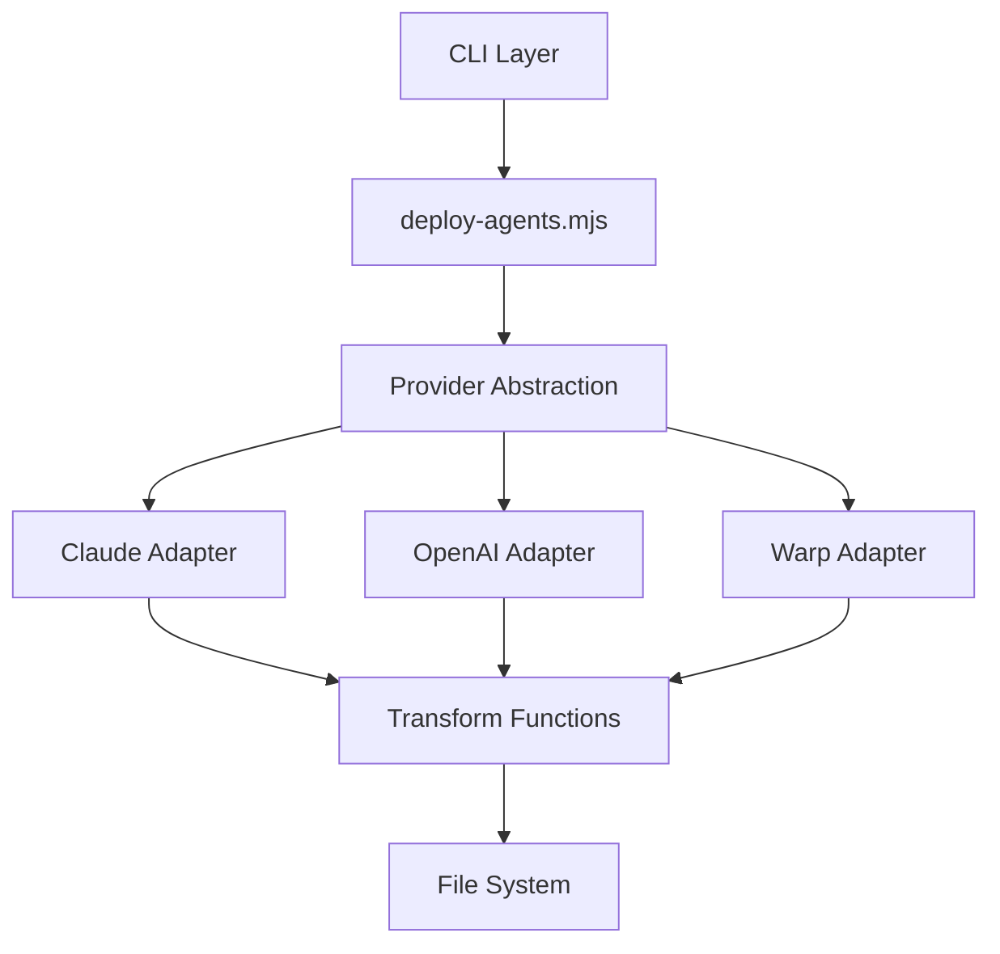
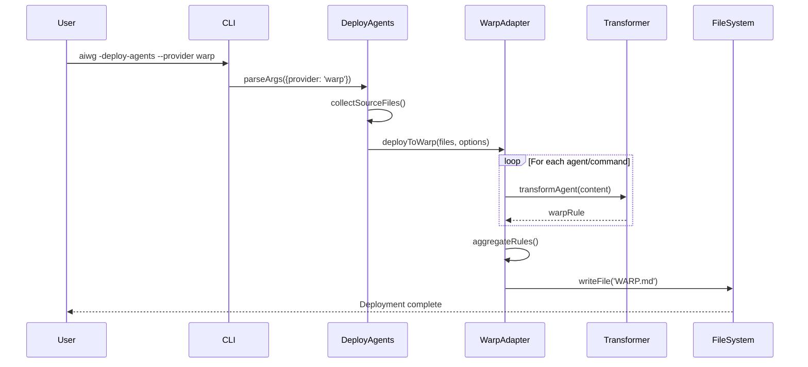

# Software Architecture Document: Warp AI Platform Integration

## 1. Introduction

### 1.1 Purpose
This document describes the architectural design for integrating Warp AI as a third provider platform alongside the existing Claude and OpenAI providers in the AI Writing Guide (AIWG) deployment system.

### 1.2 Scope
The architecture covers the extension of the current deploy-agents.mjs system to support Warp AI's WARP.md format, including agent transformation, command representation, and deployment strategies.

### 1.3 Intended Audience
- AIWG maintainers and contributors
- Platform integration developers
- DevOps engineers implementing multi-provider support
- Warp AI platform teams requiring integration specifications

### 1.4 Architectural Drivers and Constraints

**Business Drivers:**
- Support for Warp AI as a third AI platform provider
- Maintain backward compatibility with existing Claude/OpenAI deployments
- Enable unified deployment workflow across all three platforms

**Technical Constraints:**
- WARP.md is a single-file project configuration format
- Warp AI doesn't use model selection (platform-managed)
- No existing .warp/ directory convention (unlike .claude/ and .codex/)
- Must preserve existing agent metadata and functionality

**Quality Attributes:**
- Maintainability: Minimal changes to existing codebase
- Extensibility: Easy addition of future providers
- Consistency: Unified CLI experience across providers
- Performance: Efficient transformation and deployment

## 2. Architectural Overview

### 2.1 High-Level Description

The Warp AI integration extends the existing multi-provider architecture by introducing a new transformation layer that converts AIWG's agent and command definitions into Warp's WARP.md format. The system maintains a three-tier architecture:

1. **Input Layer**: Source agent/command markdown files with YAML frontmatter
2. **Transformation Layer**: Provider-specific adapters (Claude, OpenAI, Warp)
3. **Output Layer**: Platform-specific deployment formats

### 2.2 Major Components

```
┌─────────────────────────────────────────────────────────┐
│                    CLI Interface (aiwg)                   │
├─────────────────────────────────────────────────────────┤
│                  deploy-agents.mjs Core                   │
├──────────┬──────────────┬──────────────┬────────────────┤
│  Claude  │   OpenAI     │    Warp      │   Future       │
│ Adapter  │   Adapter    │   Adapter    │  Providers    │
├──────────┼──────────────┼──────────────┼────────────────┤
│ .claude/ │   .codex/    │   WARP.md    │     TBD       │
│  agents/ │   agents/    │   (root)     │               │
│commands/ │  commands/   │              │               │
└──────────┴──────────────┴──────────────┴────────────────┘
```

### 2.3 Component Interactions

1. **CLI** → **deploy-agents.mjs**: Parse arguments, determine provider
2. **deploy-agents.mjs** → **Provider Adapter**: Route to appropriate handler
3. **Provider Adapter** → **Transformer**: Convert agent/command format
4. **Transformer** → **File System**: Write platform-specific output

## 3. Architecturally Significant Requirements

### 3.1 Functional Requirements
- FR1: Support `--provider warp` flag in deploy-agents.mjs
- FR2: Transform agent markdown files to WARP.md rules format
- FR3: Convert command definitions to Warp-compatible instructions
- FR4: Aggregate all content into single WARP.md file
- FR5: Support both general and SDLC deployment modes

### 3.2 Non-Functional Requirements
- NFR1: Transformation must complete within 5 seconds for 100+ agents
- NFR2: WARP.md output must be valid markdown with proper formatting
- NFR3: Preserve semantic meaning during agent→rule transformation
- NFR4: Support incremental updates (detect changes)
- NFR5: Maintain idempotent deployment (same input → same output)

## 4. Architectural Views

### 4.1 Logical View

**Core Components:**



**Component Responsibilities:**

| Component | Responsibility |
|-----------|---------------|
| CLI Layer | Parse arguments, validate inputs, invoke deploy-agents |
| deploy-agents.mjs | Orchestrate deployment, manage provider routing |
| Provider Abstraction | Factory pattern for provider-specific adapters |
| Warp Adapter | Transform agents/commands to WARP.md format |
| Transform Functions | Content transformation utilities |
| File System | Write deployment artifacts |

### 4.2 Process View

**Deployment Sequence:**



### 4.3 Development View

**Module Structure:**

```
tools/
├── agents/
│   ├── deploy-agents.mjs         # Main orchestrator
│   ├── adapters/
│   │   ├── claude-adapter.mjs    # Claude-specific logic
│   │   ├── openai-adapter.mjs    # OpenAI-specific logic
│   │   └── warp-adapter.mjs      # NEW: Warp-specific logic
│   └── transformers/
│       ├── frontmatter.mjs       # YAML frontmatter parser
│       ├── model-mapper.mjs      # Model name mapping
│       └── warp-rules.mjs        # NEW: Agent→Rule converter
└── install/
    └── install.sh                 # CLI registration
```

### 4.4 Deployment View

**Target Deployment Structure:**

```
project-root/
├── .claude/                      # Claude agents/commands
│   ├── agents/
│   └── commands/
├── .codex/                        # OpenAI agents/commands
│   ├── agents/
│   └── commands/
├── WARP.md                        # NEW: Warp configuration
└── [project files]
```

### 4.5 Data View

**WARP.md Structure:**

```markdown
# WARP Project Configuration

## Project Context
[Generated from CLAUDE.md if present]

## Agent Rules
[Transformed from agent definitions]

### Rule: [Agent Name]
- **Role**: [Derived from agent role]
- **Expertise**: [From agent description]
- **Guidelines**:
  - [Transformed from agent process/guidelines]
- **Constraints**:
  - [From agent limitations]

## Commands
[Transformed from command definitions]

### Command: [Command Name]
- **Trigger**: [Command invocation]
- **Description**: [Command purpose]
- **Process**:
  - [Command implementation steps]

## Metadata
- Generated: [timestamp]
- Source: AI Writing Guide v[version]
- Mode: [general|sdlc|both]
```

## 5. Runtime Scenarios

### 5.1 Scenario: Deploy SDLC Agents to Warp

**Actors**: Developer, AIWG CLI, Warp AI

**Flow**:
1. Developer executes: `aiwg -deploy-agents --provider warp --mode sdlc`
2. CLI updates AIWG installation (auto-update)
3. deploy-agents.mjs parses arguments, identifies Warp provider
4. System collects 51 SDLC agents from source
5. WarpAdapter transforms each agent:
   - Extracts metadata from YAML frontmatter
   - Converts role/description to rule format
   - Transforms process steps to guidelines
6. System aggregates all rules into single WARP.md
7. File written to project root
8. Warp AI reads WARP.md on next interaction

### 5.2 Scenario: Update Existing WARP.md

**Flow**:
1. Developer modifies agent definitions in AIWG
2. Executes: `aiwg -deploy-agents --provider warp --force`
3. System reads existing WARP.md
4. Compares with new generated content
5. If different, overwrites with new version
6. Preserves any custom sections marked with special comments

## 6. Design Decisions and Rationale

### 6.1 DD-001: Single WARP.md File vs .warp/ Directory

**Status**: Accepted

**Context**: Warp AI expects a single WARP.md file for project configuration, unlike Claude/OpenAI which use directories.

**Decision**: Deploy to single WARP.md file in project root.

**Rationale**:
- Aligns with Warp platform conventions
- Simpler deployment (one file vs many)
- Easier version control and review
- Consistent with Warp's design philosophy

**Alternatives Considered**:
1. `.warp/` directory with multiple files - Rejected: Not supported by Warp
2. Multiple WARP-*.md files - Rejected: Complicates discovery

### 6.2 DD-002: Agent to Rule Transformation Strategy

**Status**: Accepted

**Context**: Agents have structured metadata; Warp uses free-form rules.

**Decision**: Transform via semantic mapping:
- Agent role → Rule category
- Agent description → Rule expertise
- Agent process → Rule guidelines
- Agent constraints → Rule limitations

**Rationale**:
- Preserves semantic meaning
- Maintains agent intent
- Allows bidirectional mapping if needed

### 6.3 DD-003: Command Representation

**Status**: Accepted

**Context**: Slash commands need representation in WARP.md.

**Decision**: Include commands as structured sections with trigger patterns.

**Rationale**:
- Maintains command discoverability
- Preserves implementation details
- Enables command-like interactions in Warp

### 6.4 DD-004: Model Mapping Approach

**Status**: Accepted

**Context**: Warp doesn't expose model selection; platform manages internally.

**Decision**: Ignore model specifications for Warp deployments.

**Rationale**:
- Warp automatically selects appropriate models
- No user control over model selection
- Simplifies transformation logic

## 7. Technology Stack

### 7.1 Core Technologies
- **Language**: JavaScript (ES6+)
- **Runtime**: Node.js 18.20.8+ (LTS Hydrogen)
- **Package Manager**: npm (bundled with Node.js)

### 7.2 Key Libraries
- **fs**: File system operations
- **path**: Path manipulation
- **js-yaml**: YAML frontmatter parsing (if needed)

### 7.3 Development Tools
- **ESLint**: Code quality
- **Prettier**: Code formatting
- **Jest**: Unit testing (optional)

## 8. Quality Attribute Tactics

### 8.1 Performance
- **Tactic**: Parallel processing of agent transformations
- **Implementation**: Use Promise.all() for concurrent transforms
- **Metric**: < 5 seconds for 100 agents

### 8.2 Maintainability
- **Tactic**: Adapter pattern for provider isolation
- **Implementation**: Separate adapter modules
- **Metric**: Adding new provider requires < 200 LOC

### 8.3 Reliability
- **Tactic**: Idempotent operations
- **Implementation**: Content comparison before write
- **Metric**: Repeated deployments produce identical output

### 8.4 Usability
- **Tactic**: Consistent CLI interface
- **Implementation**: Same flags/options across providers
- **Metric**: Zero additional learning for existing users

### 8.5 Security
- **Tactic**: Input validation
- **Implementation**: Sanitize markdown content
- **Metric**: No code injection via agent content

## 9. Risks and Mitigations

### 9.1 Risk: WARP.md Format Changes

**Probability**: Medium
**Impact**: High
**Mitigation**:
- Version detection in WARP.md
- Transformation versioning
- Graceful degradation

### 9.2 Risk: Large File Size

**Probability**: Low
**Impact**: Medium
**Mitigation**:
- Content compression techniques
- Section folding markers
- Optional content filtering

### 9.3 Risk: Semantic Loss in Transformation

**Probability**: Medium
**Impact**: Medium
**Mitigation**:
- Comprehensive transformation rules
- Validation testing
- User review process

## 10. Implementation Guidelines

### 10.1 Coding Standards
- Follow existing AIWG JavaScript style
- Use async/await for asynchronous operations
- Implement proper error handling
- Add JSDoc comments for public APIs

### 10.2 Integration Points

**Entry Point Modification** (deploy-agents.mjs):
```javascript
// Line ~250: Add Warp provider handling
if (provider === 'warp') {
  await deployToWarp(files, deployOpts);
} else if (provider === 'openai') {
  // existing OpenAI logic
} else {
  // existing Claude logic
}
```

**Adapter Implementation** (warp-adapter.mjs):
```javascript
export async function deployToWarp(files, options) {
  const rules = [];
  const commands = [];

  for (const file of files) {
    const content = await fs.readFile(file, 'utf8');
    if (isAgent(file)) {
      rules.push(transformAgentToRule(content));
    } else if (isCommand(file)) {
      commands.push(transformCommand(content));
    }
  }

  const warpMd = generateWarpMd(rules, commands, options);
  await fs.writeFile('WARP.md', warpMd);
}
```

### 10.3 Testing Strategy
1. Unit tests for transformation functions
2. Integration tests for end-to-end deployment
3. Validation tests for WARP.md output
4. Regression tests for existing providers

## 11. Outstanding Issues

### 11.1 Open Questions
1. Should WARP.md include version metadata for updates?
2. How to handle custom sections in existing WARP.md?
3. Should we support WARP.md templates?

### 11.2 Pending Validations
1. Warp AI team approval of WARP.md structure
2. Performance testing with large agent sets
3. User acceptance testing with real projects

### 11.3 Future Enhancements
1. Bidirectional sync (WARP.md → agents)
2. Incremental update support
3. WARP.md validation command
4. Custom rule templates

## 12. Appendices

### 12.1 Sample WARP.md Output

```markdown
# WARP Project Configuration

Generated by AI Writing Guide (AIWG)
Version: 1.0.0
Generated: 2024-12-20T10:30:00Z

## Project Rules

### Architecture Designer
**Specialization**: System architecture and design patterns

**Guidelines**:
- Design scalable, maintainable architectures
- Choose appropriate technology stacks
- Define microservice boundaries
- Plan API contracts and interfaces

**Process**:
1. Analyze requirements and constraints
2. Design high-level architecture
3. Document architectural decisions (ADRs)
4. Create deployment strategies

### Security Architect
**Specialization**: Security architecture and threat modeling

**Guidelines**:
- Implement defense-in-depth strategies
- Design authentication/authorization systems
- Plan encryption and key management
- Create security policies

## Commands

### flow-inception-to-elaboration
**Trigger**: `/project:flow-inception-to-elaboration`
**Purpose**: Transition from Inception to Elaboration phase

**Process**:
1. Validate Inception gate criteria
2. Generate Software Architecture Document
3. Create initial ADRs
4. Plan Elaboration iterations
```

### 12.2 Glossary

| Term | Definition |
|------|------------|
| ADR | Architectural Decision Record |
| AIWG | AI Writing Guide framework |
| Agent | Specialized AI assistant definition |
| Provider | Target AI platform (Claude, OpenAI, Warp) |
| Rule | Warp AI's term for agent-like instructions |
| SDLC | Software Development Life Cycle |

### 12.3 References

- [AIWG Repository](https://github.com/jmagly/ai-writing-guide)
- [Warp AI Documentation](https://warp.ai/docs)
- [Original deploy-agents.mjs](../../../tools/agents/deploy-agents.mjs)

---

**Document Version**: 1.0.0
**Last Updated**: 2024-12-20
**Status**: Draft
**Author**: Architecture Designer Agent