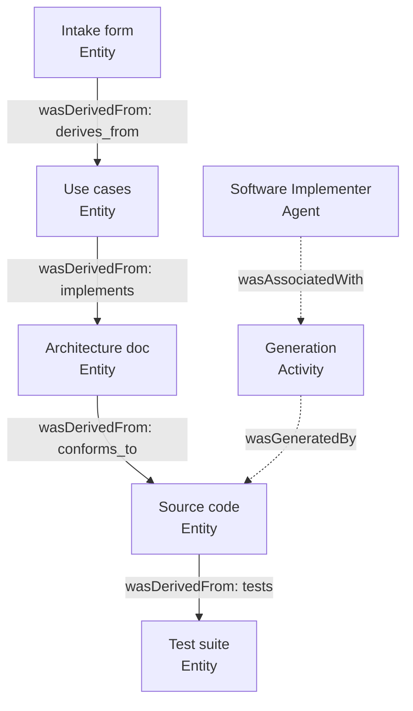

# Causal Inference in AIWG: Causality as Discipline, Not Estimator

## The claim worth making

AIWG ships no causal-inference engine. There is no do-calculus solver, no
potential-outcomes estimator, no propensity-score matcher, no structural causal
model you can hand a dataset and get back an average treatment effect. If you
came looking for econometrics, the search returns empty.

That absence is not the interesting fact. The interesting fact is that *causal
structure* — the graph, the intervention, the counterfactual, the refusal to
mistake correlation for cause — is load-bearing across at least four of AIWG's
core disciplines. AIWG does not *estimate* causes. It *enforces* causal
hygiene. The platform treats causality the way a good lab treats sterile
technique: not as a result to be computed but as a discipline to be practiced
so that the results it does produce are trustworthy.

This essay traces that discipline through four pillars — provenance, evidence
grading, credit assignment, and counterfactual evaluation — then looks at the
slice of the causal-methods literature the research corpus actually tracks
(spoiler: it is the mechanistic-interpretability strand, not Pearl's), and ends
on the one place where AIWG demands causal rigor of its sources but does not yet
practice it on itself.

## The distinction that organizes everything

Pearl's *ladder of causation* gives three rungs: **association** ("X and Y move
together"), **intervention** ("what happens to Y if I *do* X"), and
**counterfactual** ("what would Y have been had X not happened"). Statistical
causal inference is the machinery for climbing from rung one to rungs two and
three using observational data — adjusting for confounders, exploiting natural
experiments, modelling the data-generating process as a graph.

AIWG never climbs that ladder with data. What it does instead is build systems
whose *organizing object is the causal graph itself*, and whose *epistemic
default is rung-one humility*. Where a statistician asks "how large is the
effect?", AIWG asks "do we even have the warrant to call this a cause, and can
we trace what produced what?" These are different questions. They are also,
recognizably, causal-inference questions — just answered with engineering
discipline rather than estimation.

## Pillar 1 — Provenance is a causal lineage graph

The most literal connection is the one most easily overlooked because it does
not advertise itself as causal at all.

AIWG's provenance subsystem adopts the W3C PROV data model, and W3C PROV is a
causal vocabulary in everything but name. Its core relations — `wasGeneratedBy`,
`wasDerivedFrom`, `wasAssociatedWith`, `used` — encode "this activity *produced*
that entity," "this entity *came from* that one," "this agent *was responsible
for* that activity." The schema makes the structure explicit:

> ```
> wasGeneratedBy:        # prov-record.yaml:272
> wasDerivedFrom:        # prov-record.yaml:300
> wasAssociatedWith:     # prov-record.yaml:321
> ```
> — `agentic/code/frameworks/sdlc-complete/schemas/provenance/prov-record.yaml`

These are directed edges in a graph whose nodes are artifacts, activities, and
agents. And one validation constraint settles the matter that this is not merely
graph-shaped but *causal*-graph-shaped:

> "Circular derivations not allowed"
> — `prov-record.yaml:616`

Acyclicity is the defining property of the Directed Acyclic Graph — the exact
object a structural causal model is built on. A provenance store that forbids
cycles is, formally, maintaining a DAG over how its artifacts came to exist.
You can read any node's `wasDerivedFrom` chain backward and you are reading a
causal history: this SAD was derived-from those use cases, which were
derived-from that intake form. The rule even mandates the recursion that makes
the lineage transitive rather than shallow:

> "wasDerivedFrom.source entities should have own provenance records"
> — `prov-record.yaml:615`

AIWG goes further than untyped edges. The `derivation_type` vocabulary types
each causal edge by *how* one artifact produced another:

> `implements | conforms_to | follows_pattern | extends | tests | documents | refines | derives_from`
> — `prov-record.yaml:305`, `.claude/rules/provenance-tracking.md`

A typed edge — "this code `implements` that requirement," "this test `tests`
that source" — is a labelled causal relation, richer than the bare arrows of a
textbook DAG. And the same idea appears a second time, hand-maintained, in the
**qualified-references** discipline, where `@implements` / `@implemented-by`,
`@derives-from` / `@source-of`, `@tests` / `@tested-by` form a bidirectional
derivation graph threaded directly through source files
(`.claude/rules/qualified-references.md`). Provenance is the machine-readable
causal lineage; qualified references are the same lineage authored inline by
hand. Both answer the rung-one-and-a-half question that traceability really is:
*what produced this, and what did this produce?*



*The PROV lineage as a typed causal DAG. Reading an edge backward answers "what
produced this"; the acyclicity rule (`prov-record.yaml:616`) is what makes it a
DAG rather than an arbitrary graph.*

The payoff of holding this structure is exactly the payoff of a causal model:
**counterfactual reachability**. Because the graph is explicit and acyclic, the
artifact index can answer "if I change UC-001, what is downstream of it?"
(`aiwg index deps`) — which is the intervention query "what would be affected if
I *do* this change," answered by graph reachability rather than by re-running
the world. AIWG didn't build a causal-inference tool; it built a causal model of
its own artifacts and gets the intervention semantics for free.

## Pillar 2 — Evidence grading refuses to confuse correlation with cause

If provenance is where AIWG holds causal *structure*, the citation policy is
where it polices causal *warrant*.

The citation-policy rule binds claim language to evidence quality through a
GRADE matrix. Read it as a calibration of how strong a causal claim the evidence
licenses:

> | GRADE | Claim language | Example evidence |
> | HIGH | "demonstrates", "shows", "confirms" | systematic reviews, RCTs |
> | MODERATE | "suggests", "indicates", "supports" | cohort, case-control |
> | LOW | "some evidence", "limited data" | case series, expert opinion |
> | VERY LOW | "anecdotal", "exploratory" | untested claims |
> — `.claude/rules/citation-policy.md` (Quality-Based Citation Language)

The verbs are doing causal work. "Demonstrates" asserts a cause; "suggests"
backs off to association; "anecdotal" disclaims warrant entirely. The rule is a
machine for never letting a rung-one observation be written up as a rung-two
cause. It even names the canonical confound explicitly in its worked example:

> "GRADE: MODERATE - Large-scale observational study, correlation not causation"
> — `.claude/rules/citation-policy.md`

This is not abstract. The research corpus contains a live audit finding that
reads like a textbook causal-inference prompt:

> "**Claim**: 'Automated testing reduces production defects by 40-50%'
> **Current Evidence**: GRADE: MODERATE — large-scale observational study
> (Beller, 2017), correlation not causation
> **Needed**: Randomized controlled trial or natural experiment with causal
> inference"
> — `.aiwg/research/TODO.md:55-58`

A citation-policy audit caught an effect-size claim resting on observational
data, flagged it precisely because *correlation is not causation*, and named the
remedy in the literal vocabulary of the field: an **RCT or natural experiment
with causal inference**. This is AIWG enforcing the first rung of Pearl's ladder
as policy — you may not narrate an association as a cause, and the path to
earning the stronger claim is a causal-inference design. The platform demands of
its citations exactly the discipline a careful empiricist demands of a dataset.

## Pillar 3 — Credit assignment is counterfactual debugging

The third pillar lives in the agent loop, and it climbs to the top rung of the
ladder: the counterfactual.

When an AIWG agent loop fails, the failure-analysis protocol is explicitly
causal. The REF-021 analysis encodes it as three questions:

> "Analyze what went wrong and provide:
> - Credit assignment: Which specific action/code caused the failure?
> - Causal reasoning: Why did this action lead to failure?
> - Actionable insight: What should you do differently next time?"
> — `.aiwg/research/paper-analysis/REF-021-aiwg-analysis.md:150-154`

The same triad appears in the implementation-opportunities synthesis
(`.aiwg/research/comprehensive-implementation-opportunities.md:341-345`). Note
the structure: **credit assignment** isolates the cause (which action?),
**causal reasoning** explains the mechanism (why did it lead to failure?), and
**"what should you do differently"** is the counterfactual proper — *had you
acted otherwise, would the outcome have changed?* That third question is rung
three of the ladder, the one statistical causal inference reaches only with the
heaviest machinery, asked here as routine debugging hygiene.

"Credit assignment" is not loose language. It is the reinforcement-learning name
for the causal-attribution problem — distributing responsibility for an outcome
across the actions that produced it — and the research corpus tracks it as such
(REF-1246, *token-level credit assignment*). AIWG's agent loops inherit the RL
framing: a reward (or failure) signal must be attributed back through a
trajectory of actions to the ones that actually caused it. Reflection memory,
the executable-feedback root-cause requirement (retry only "with root cause
analysis"), and the anti-laziness recovery protocol's PAUSE→DIAGNOSE→ADAPT loop
are all credit-assignment machinery: they refuse to let an agent perturb a
random variable and retry, and instead demand that it locate the cause first.

Causality is even a first-class *thought type*. The thought-protocol rule
defines a **Reasoning** thought as an explicit causal link:

> "Reasoning: This means I should [action] because [justification]"
> — `.claude/rules/thought-protocol.md` (Reasoning Thought)

Every "because" is a claimed causal edge in the agent's own reasoning trace,
and the TAO-loop rule requires that these claims be *grounded* — subsequent
reasoning must reference prior observations, not float free
(`.claude/rules/tao-loop.md`, Observation Grounding). This is the same
discipline the citation policy applies to literature, turned inward on the
agent's own inferences: a causal claim ("this means X because Y") must trace to
evidence, or it does not count.

## Pillar 4 — Counterfactual evaluation and controlled reproducibility

The fourth pillar is where AIWG comes closest to *doing* a causal experiment,
even if it never calls it one.

The reproducibility discipline mandates that critical workflows run in **strict
mode** — temperature 0, fixed seed (`.claude/rules/reproducibility.md`). Holding
every nuisance variable fixed so that the only thing that varies is the
intervention of interest is the definition of a controlled experiment. When
AIWG's regression discipline then compares behavior across two versions with
everything else pinned, the observed delta *is* attributable to the change,
because confounding has been engineered away rather than adjusted for
statistically. AIWG achieves causal identification the way a wet lab does — by
control — not the way an econometrician does — by adjustment.

The corpus's clearest articulation of this stance is borrowed from the
literature it tracks. REF-1122, *Reasoning or Reciting?* (Wu et al., NAACL 2024,
arXiv:2307.02477), evaluates language models with **counterfactual tasks** —
keeping the reasoning *procedure* fixed while intervening on the *world*:

> "the original task under the default conditions and its counterfactual
> variants share the same reasoning procedure but differ in their input-output
> mappings"
> — `sources/text/REF-1122-wu-2023-reasoning-or-reciting.txt:247`

> "if [genuine] task-solving procedure, we expect comparable performance on
> counterfactual and default tasks; if [relying on memorized] conditions, we
> expect a drop in the counterfactual"
> — `REF-1122:242-244` (paraphrased structure; arithmetic done "in base 9",
> `REF-1122:240`)

This is intervention-based causal attribution in its purest evaluative form:
hold the mechanism fixed, intervene on the data-generating world (base-10 →
base-9), and read off from the performance drop *whether the model's competence
was caused by reasoning or by memorization*. It is precisely the logic AIWG's
own eval-loop and regression disciplines apply to their artifacts — change one
thing, hold the rest, attribute the difference.

## What the corpus actually tracks: the interpretability strand of causal methods

If you ask which causal-inference literature the research repository indexes, the
honest answer is specific: **almost none of it is econometrics or Pearl-school
causal discovery, and almost all of it is mechanistic interpretability**, where
"causal inference" means *intervening on a model's internal activations and
reading off the effect*.

The anchor is REF-211, and its title alone makes the framing explicit:

> "Sparse Feature Circuits: Discovering and Editing Interpretable **Causal
> Graphs** in Language Models" (Marks, Rager, Michaud, Belinkov, Bau, Mueller,
> 2024, arXiv:2403.19647) — GRADE: HIGH
> — `documentation/references/REF-211-marks-sparse-feature-circuits.md`

> "directed graphs where nodes are SAE features and edges represent causal
> influence ... the minimal set of causally necessary features for specific
> model behaviors"
> — `REF-211` reference card (Executive Summary)

Sparse feature circuits *discover* a causal graph by ablation-as-intervention
(remove a feature, observe whether the behavior survives — the do-operator
applied to a neuron) and then *edit* it (intervene to change behavior). This is
genuine rung-two-and-three causal methodology, operationalized inside a network.
It is the dominant paradigm across the corpus's interpretability cluster:

| REF | What it does causally |
|-----|----------------------|
| REF-211 | Causal graph discovery + editing in SAE feature space (Marks et al. 2024) |
| REF-803 | Auditing hidden objectives via sparse feature circuits (Marks 2025; cites REF-211 directly) |
| REF-710 | SAE latent attribution for circuit discovery (OpenAI 2025) |
| REF-795 | InversionView — "causal intervention on model's inner states" |
| REF-804 | HyperSteer — steering via causal graphs in LMs |
| REF-870 | IIT 4.0 — cause–effect power and counterfactual states (Albantakis 2023) |
| REF-1246 | Token-level credit assignment (causal attribution in RL) |

The corpus does *not* track Pearl's *Causality*, Rubin's potential outcomes, or
Imbens–Angrist natural-experiment econometrics as primary sources. That is a
real boundary, and naming it is part of being honest about what "causal
inference in AIWG" means: it is the interpretability community's
intervention-based notion of cause, plus AIWG's own engineering disciplines —
not the statistics-department version.

*(False positives excluded by inspection: the many corpus hits on "causal
attention" / "causal masking" are autoregressive-LM mechanics, not causal
inference, and are deliberately not cited here.)*

## Synthesis: causality as epistemic hygiene

Step back and the four pillars cohere into a single stance.

- **Provenance** maintains an explicit, acyclic, typed causal lineage of every
  artifact AIWG produces — a structural causal model of the project itself.
- **Evidence grading** refuses to narrate correlation as cause and calibrates
  every claim's verb to its causal warrant.
- **Credit assignment** debugs by isolating which action caused a failure and
  asking the counterfactual "what should have been done instead."
- **Counterfactual evaluation** identifies effects by control — pinning every
  variable but the intervention — rather than by statistical adjustment.

None of these is causal *inference* in the estimator sense. All of them are
causal *reasoning* in the disciplinary sense. AIWG's wager is that most of the
value of causal thinking in a software-and-agents context comes not from
computing an effect size but from (1) never losing track of what produced what,
(2) never overclaiming a cause you have not earned, (3) attributing failures to
their actual sources, and (4) isolating changes so their effects are
identifiable. That is causality as epistemic hygiene — and it is enforced, in
AIWG, at the level of rules rather than left to good intentions.

## Where AIWG demands causal rigor it does not yet practice

The honest forward-look is an asymmetry. AIWG insists, via the citation policy,
that an effect claim like "automated testing reduces defects 40-50%" be
demoted until backed by "an RCT or natural experiment with causal inference"
(`TODO.md:55-58`). Yet AIWG's *own* effectiveness claims rest on the same
observational footing it polices in others. The framework cites, for instance,
an 84% HITL cost-reduction figure (REF-057, Agent Laboratory) — a finding that,
held to AIWG's own standard, is observational and would warrant the hedged
"suggests," not the asserted "demonstrates," absent a controlled comparison.

The opportunity is unusually well-set, because AIWG already owns the two
ingredients real causal inference needs:

1. **Controlled intervention** — strict/seeded reproducibility modes can pin
   confounders, turning a before/after change into an identified effect.
2. **A causal substrate** — the provenance DAGs and the telemetry surfaces
   (`aiwg cost-report`, `aiwg metrics-tokens`, iteration analytics) provide the
   data-generating record over which an effect could be estimated.

The natural next step is for AIWG to climb its own ladder: run controlled or
natural-experiment comparisons on its own telemetry — does HITL gating *cause*
the cost reduction; does the anti-laziness protocol *cause* fewer abandoned
tasks; does strict mode *cause* the reproducibility gains it claims — and report
those with the GRADE-calibrated language it already enforces on everyone else.
The provenance lineage is exactly the structure that would make such an analysis
tractable. AIWG built the causal model. It has not yet asked it for an effect.

That is the one place where "causal inference in AIWG" is still a promissory
note rather than a practice — and, fittingly, the platform's own rules already
tell it what to do about that.

---

*Grounding note (per citation-policy): every AIWG-internal quotation is cited to
`path:line` and verifiable in this repository as of 2026-05-31. External papers
(REF-211, REF-1122, and the interpretability cluster) are cited to the
`research-papers` corpus with arXiv identifiers; REF-211 carries GRADE: HIGH in
its reference card. The REF-057 / 84% figure is reported as a corpus-cited
observational finding, deliberately hedged, and is used here as the worked
example of the gap it names — not as an endorsed effect estimate.*
