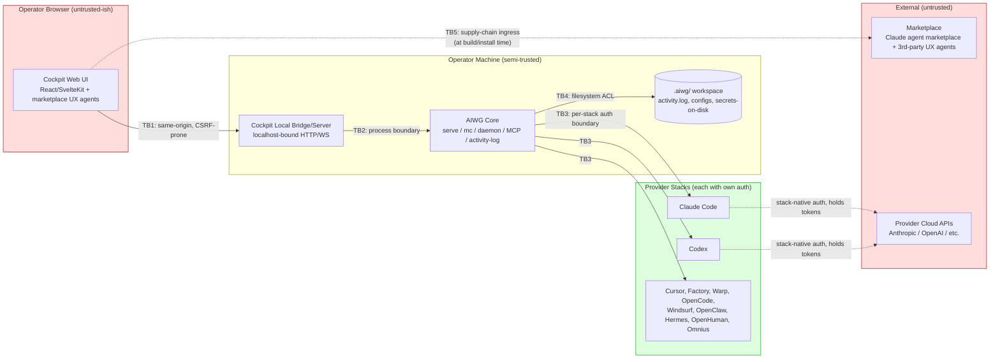

# Threat Model — AIWG Cockpit

**Status**: Draft (Inception-stage, ABM-bound)
**Owner**: Security Architect (AIWG)
**Profile**: MVP base, **Security axis raised to Production rigor** (per `cockpit-solution-profile.md`)
**Methodology**: STRIDE over a Data-Flow / Trust-Boundary view
**Bounding**: Local single-operator v1; multi-stack overlay; no required cloud
**Date**: 2026-06-13

---

## 1. Purpose and Bounding

AIWG Cockpit is a local web control-plane that observes and **drives** multiple agentic stacks (Claude Code, Codex, Cursor, Factory, Warp, OpenCode, Windsurf, OpenClaw, Hermes, OpenHuman, Omnius) plus the AIWG CLI substrate (`serve` executor-registry #1546, Mission Control, daemon/concierge, MCP server, activity-log). It can **start**, **attach to**, and **dispatch** sessions and cross-stack Missions, and surfaces a unified HITL approval inbox (#1565/#1567).

Cockpit is therefore a **high-blast-radius control surface**, even though v1 is single-operator and local. A compromise of Cockpit can:

- Hijack or impersonate sessions across many stacks at once.
- Dispatch arbitrary Missions to provider runtimes with the operator's authority.
- Bypass HITL approval gates if the approval path is forgeable.
- Tamper with the unified audit trail (the only post-incident record).
- Pull malicious code in via the marketplace UX-agent supply chain.

This document scopes the v1 threats, marks them per STRIDE, and lists concrete mitigations that bind to AIWG rules already in force.

---

## 2. Assets

| ID | Asset | Sensitivity | Why It Matters |
|----|-------|-------------|----------------|
| A1 | **Session control authority** (start / attach / pause / resume / dispatch) | Critical | Drives downstream stacks; impersonates the operator |
| A2 | **Provider credentials & tokens** (Anthropic, OpenAI, etc. — held by each stack, NOT by Cockpit) | Critical | Cash-equivalent; per-stack quota; rotation pain |
| A3 | **Mission dispatch capability** (`aiwg mc dispatch`, cross-stack Mission conductor #1546) | Critical | Arbitrary code/agent execution under operator identity |
| A4 | **Unified audit trail** (`.aiwg/activity.log`, append-only) | High | Only forensic record; targeted by an attacker to hide tracks |
| A5 | **Marketplace UX-agent code supply chain** (Claude marketplace + 3rd-party agent definitions consumed by Cockpit UI) | Critical | Sandwich-shop scope; can land arbitrary instructions inside the control plane |
| A6 | **HITL approval inbox state** (#1565/#1567) | Critical | Sign-off authority for destructive actions across stacks |
| A7 | **Cockpit local server bind** (HTTP/WebSocket listener) | Critical | Reachable by other local processes / co-tenants / browser-CSRF |
| A8 | **Project workspace** (`.aiwg/`, repo contents, secrets-on-disk) | High | Read/write surface accessed by Cockpit-driven agents |
| A9 | **Operator browser session** (cookies, localStorage, service workers) | High | XSS in Cockpit UI escalates straight to A1 |
| A10 | **AIWG core integrity** (serve executor-registry, MCP server, daemon) | Critical | A nerfed/altered core silently degrades every stack downstream |

---

## 3. Trust Boundaries (Data Flow View)

**Trust boundaries:**

- **TB1 — Browser ↔ Local Bridge.** Same-origin, but the browser is the largest XSS/CSRF surface. The bridge listens on `localhost` and is reachable by any local process and (without care) by any site the operator visits.
- **TB2 — Local Bridge ↔ AIWG Core.** Process boundary. The bridge MUST NOT bypass AIWG's `human-authorization` / `token-security` / `hitl-gates` rules just because it's "internal."
- **TB3 — AIWG Core ↔ Each Provider Stack.** Each stack already owns its credentials. Cockpit MUST delegate to each stack's native auth, never re-store credentials.
- **TB4 — Core ↔ Filesystem.** `.aiwg/activity.log` is append-only and is the audit anchor; `.aiwg/storage.config` redirection must be respected.
- **TB5 — Build/Install-time Marketplace Ingress.** Marketplace UX agents are arbitrary code/instructions; their adoption gate is the only chance to vet them.

---

## 4. STRIDE Threats

### 4.1 Spoofing

| ID | Threat | Risk | Affected Assets | Mitigation |
|----|--------|------|-----------------|------------|
| S1 | **Local-server origin spoof** — another site the operator visits (or a co-tenant local process) makes requests to Cockpit's `localhost` listener and impersonates the operator | **High** | A1, A3, A7 | Bind to `127.0.0.1` (not `0.0.0.0`); per-install random session token transported as **`SameSite=Strict` + `HttpOnly` + `Secure-when-https`** cookie; require an explicit `Origin: http(s)://localhost:<port>` allow-list; reject all cross-origin requests (no CORS *); CSRF double-submit token on every state-changing request |
| S2 | **Session-impersonation across stacks** — UI claims to attach to stack X but actually drives stack Y, or attaches as a different identity | **High** | A1, A2 | Per-attach handshake delegates to each stack's native auth (TB3); Cockpit holds an opaque attach-handle returned by the stack, never the stack's credentials; UI displays the stack-reported identity, not Cockpit's own label |
| S3 | **HITL approval forgery** — a UI element claims "operator approved" when the approval actually came from a script | **Critical** | A6, A1 | Approval requires the **native-ux-tools** confirmation surface where the platform supports it; fallback is a CSRF-protected POST that the AIWG core re-verifies against an `aiwg.config` policy (per `delivery-policy` and `human-authorization`); every approval writes an `activity.log` entry with origin and time |
| S4 | **Marketplace agent impersonation** — adversary publishes a UX agent named identically to a trusted one, or hijacks a known publisher's namespace | **High** | A5, A10 | Adoption gate verifies publisher identity and pins to a content-addressable hash; first-party AIWG UX agents are the default; third-party adoption requires explicit operator confirmation and is recorded in `.aiwg/security/marketplace-adoption-log.md` |

### 4.2 Tampering

| ID | Threat | Risk | Affected Assets | Mitigation |
|----|--------|------|-----------------|------------|
| T1 | **Activity-log tampering** — Cockpit (or an attacker via Cockpit) rewrites past entries to hide a dispatch | **Critical** | A4 | Append-only writes via the `activity-log` rule contract; never expose a delete/rewrite API in the bridge; rotate-only operations require operator-tier auth and themselves log the rotation; consider hash-chained entries (each entry contains hash of prior) — call out as an Elaboration ADR |
| T2 | **Mission/dispatch tampering in transit** — a payload between UI and bridge is mutated mid-flight (browser extension, malicious local proxy) | **High** | A1, A3 | All bridge calls use HMAC-signed payloads keyed by the per-install session token; the AIWG core re-validates the signature before executing; payload schema is strict and rejected on unknown fields |
| T3 | **Marketplace UX-agent payload tampering** — a once-vetted agent is updated upstream to a malicious version (Mini Shai-Hulud pattern) | **Critical** | A5, A10 | Per `dependency-source-policy` and `ci-action-pinning`: pin marketplace agents by immutable content hash, not by name+latest; require a fresh adoption-gate review on every hash change; CI lint rejects non-pinned references |
| T4 | **Filesystem tampering against `.aiwg/` from a Cockpit-driven agent** — an agent under Cockpit overwrites configs that change Cockpit's own security posture (e.g., flips `delivery.mode` to `direct`) | **High** | A8, A10 | Cockpit-driven agents inherit the AIWG `human-authorization` rule; security-affecting config edits (delivery, storage, MCP, allow-lists) require an explicit HITL gate even when the originating agent has broad scope |

### 4.3 Repudiation

| ID | Threat | Risk | Affected Assets | Mitigation |
|----|--------|------|-----------------|------------|
| R1 | **"It wasn't me" on a destructive dispatch** — operator denies authorizing a Mission that destroyed work | **Medium** | A4, A6 | Every dispatch and every HITL approval writes an `activity.log` entry with: timestamp, originating UI element / API path, session token fingerprint (not the token itself, per `token-security`), target stack, and the operator-displayed prompt at confirmation time |
| R2 | **Marketplace-agent action attributed to operator** — a marketplace UX agent silently issues a dispatch, but the audit trail attributes it to "operator" | **High** | A4, A5 | Every Cockpit-initiated action carries a provenance tag identifying the originating UI agent (first-party AIWG UX agent vs. specific marketplace agent vs. operator-typed input). Activity-log entries include that tag |

### 4.4 Information Disclosure

| ID | Threat | Risk | Affected Assets | Mitigation |
|----|--------|------|-----------------|------------|
| I1 | **Bearer tokens / provider credentials in UI state** — Cockpit caches a provider API key in React state, localStorage, or a service worker | **Critical** | A2, A9 | **Hard rule** (per `token-security` and the solution profile): Cockpit NEVER stores provider credentials. Session attach delegates to each stack's native auth (TB3) and Cockpit holds only opaque attach-handles. Lint: forbid `localStorage` / `IndexedDB` writes of values matching token patterns; CSP `connect-src` allow-list excludes provider API origins |
| I2 | **Secrets in activity-log or screenshots** — a dispatched mission's stdout containing a token is captured into `.aiwg/activity.log` or a Cockpit screenshot | **High** | A2, A4 | Activity-log writer applies the `token-security` redaction patterns (PEM headers, `sk_*`, `ghp_*`, JWT shape, `Authorization: …`) before persist. Screenshots are written to disk and a path is reported — never returned as inline bytes — mirroring `browser-control-safety` Rule 8 |
| I3 | **Cross-tab leak via shared origin** — multiple Cockpit tabs in the same browser share localStorage / BroadcastChannel; a malicious browser extension siphons it | **High** | A1, A9 | Strict CSP (`default-src 'self'; script-src 'self' 'wasm-unsafe-eval'`; no `unsafe-inline`; no `unsafe-eval`); no inline scripts; subresource integrity on all bundled JS; refuse to run if the document has injected scripts |
| I4 | **Bridge logs disclose query strings** — full URL of an attached session ends up in logs with query-string secrets | **Medium** | A2, A4 | Per `browser-control-safety` Rule 9 ("URL logging hygiene"): log origin only by default; full URL only on an explicit, gated authorization path |
| I5 | **Marketplace UX agent exfiltrates project source** — an adopted agent reads `.aiwg/` and POSTs it to an external collector | **Critical** | A5, A8 | Adoption gate (see §5.5) includes a static-analysis pass on the agent's permissions; CSP `connect-src 'self'` denies arbitrary outbound from the UI; AIWG-core invocation paths for marketplace agents apply the workspace `repo-access.manifest.yaml` per `respect-repo-access-manifest` rule |

### 4.5 Denial of Service

| ID | Threat | Risk | Affected Assets | Mitigation |
|----|--------|------|-----------------|------------|
| D1 | **Cockpit crash destabilizes a running stack** — the UI dies mid-dispatch and the underlying stack is left half-driven (the "overlay isolation" invariant breach) | **High** | A10 | **Hard invariant** (carried forward from the solution profile): the bridge MUST treat each dispatched Mission as fire-and-track, not fire-and-hold; the underlying stack persists state through the `serve` executor-registry contract regardless of Cockpit liveness; reattach is idempotent. See §5.1 |
| D2 | **Local-server exhaustion** — a runaway script keeps opening WebSockets to the bridge until file descriptors are exhausted, freezing dispatch | **Medium** | A7, A1 | Per-origin connection cap; per-session rate-limit on dispatch endpoints; bridge surfaces back-pressure to the UI rather than silently dropping |
| D3 | **Audit-log floor lifted by spammy agent** — a noisy agent fills `.aiwg/activity.log` until disk is full, breaking `aiwg activity-log append` for legitimate writers | **Medium** | A4 | Rotation policy per `activity-log` rule; rate-limit on activity-log writes per originating-agent provenance tag (R2 above); disk-full degrades to a fail-closed dispatch policy (refuse new Missions until rotated) |

### 4.6 Elevation of Privilege

| ID | Threat | Risk | Affected Assets | Mitigation |
|----|--------|------|-----------------|------------|
| E1 | **HITL-gate bypass** — Cockpit (or a Cockpit-driven agent) issues a destructive Mission without going through the unified approval inbox | **Critical** | A6, A1, A3 | Per `hitl-gates` and `human-authorization`: the AIWG core re-validates that destructive actions carry a fresh `approval_token` from the inbox; Cockpit cannot mint approval tokens; the inbox is owned by the daemon, not the bridge |
| E2 | **Privilege escalation across stacks** — Cockpit dispatches a Mission to Stack X using credentials of Stack Y (or to a more-permissioned stack than the operator authorized) | **Critical** | A1, A2 | Per-stack attach is bounded to that stack's credentials at TB3; cross-stack handoff carries only the conclusion-bearing artifact, never the credential (per `subagent-scoping` and `context-bloat`); Mission conductor (#1546) validates per-worker scope at dispatch |
| E3 | **Marketplace agent escalates from UI scope to AIWG-core scope** — an adopted UX agent issues `aiwg mc dispatch` instead of staying in render/display | **Critical** | A5, A1, A3 | Marketplace UX agents are sandboxed to **display / interaction surface only** — they never receive a bridge credential; any dispatch path from the UI goes through a `human-authorization`-gated bridge endpoint that authenticates the operator session, not the agent. This is the security-engineering analog of `browser-control-safety` Rule 5 (cookie/storage exfiltration discipline) |
| E4 | **Cockpit privilege escalation via daemon socket** — Cockpit talks to the AIWG daemon and uses an undocumented control-plane verb to do more than the UI promises | **High** | A10, A1 | Daemon exposes a single, allow-listed verb-set to Cockpit; verbs are documented and require the per-install session token; daemon refuses requests carrying unknown verbs. Tested in `flow-security-review-cycle` |

---

## 5. Cross-Cutting Mitigations

### 5.1 The "Non-Nerf / Overlay Isolation" Invariant — Framed as a Security Property

The intake and solution profile call out that **a Cockpit crash must never destabilize an underlying running stack**. This is also a **security property**: a compromised Cockpit must not be able to *silently alter* any underlying stack's behavior, and a crashed Cockpit must not leave a stack in an under-supervised state.

Security-property restatement:

> **Cockpit MUST be additive-only over the existing AIWG substrate.** All mutations to provider stacks flow through the `serve` executor-registry (#1546) or through the documented daemon verb-set; Cockpit owns no private side-channel into a stack. If Cockpit disappears mid-Mission, the Mission persists through the executor-registry and the audit-log entry already exists; the Mission may be reattached, paused, or aborted from any AIWG entry point (CLI, MCP, daemon) — Cockpit holds no exclusive lock.

This is operationally enforced by:

- **No exclusive locks held by Cockpit.** All session/Mission state is owned by the executor-registry and activity-log.
- **No private credentials held by Cockpit.** TB3 ensures each stack holds its own.
- **Idempotent reattach.** Reattach from CLI is always available and produces the same view.
- **No mutation of AIWG core code at runtime.** Marketplace UX agents are UI-scope; they cannot patch the bridge or the core.

This invariant is checked at the **ABM gate** via a capability-parity-and-isolation test matrix (see §6).

### 5.2 Token / Secret Hygiene (per `token-security`)

- Cockpit never stores provider credentials. Period.
- Per-install session token is generated on first `aiwg cockpit serve`, stored at `~/.config/aiwg/cockpit-session-token` mode 600, owned by the operator user.
- The token is loaded from disk on bridge start, held only in the bridge process, and never sent to the browser as a literal value — the browser receives a derived cookie (HMAC-bound to the origin).
- Tokens are never logged. The activity-log writer redacts.
- Heredoc / fd-passing patterns are used everywhere the bridge invokes the AIWG CLI.

### 5.3 Marketplace UX-Agent Adoption Gate

This is the Cockpit analog of `browser-control-safety` for an arbitrary-agent UI ingress. Required gate (recorded in `.aiwg/security/marketplace-adoption-log.md`):

| Check | Requirement |
|-------|-------------|
| **License** | Compatible with AIWG distribution (default: deny non-permissive) |
| **Publisher identity** | Verified namespace; first-party AIWG UX agents preferred |
| **Pinning** | Content-addressable hash, NOT name+latest (per `dependency-source-policy` and `ci-action-pinning`) |
| **Permission audit** | Static analysis of the agent's declared capabilities; reject any agent declaring outbound-network, filesystem-write outside `.aiwg/working/`, or bridge-credential access |
| **Quality bar** | Code review against `agent-friendly-code` thresholds; reject monolithic agents |
| **Security review** | Threat-modeling-lite against this document's STRIDE rows; documented sign-off |
| **Reversibility** | Adoption is recorded; removal procedure is documented |

First-party AIWG UX agents (Product Designer, UX Lead, Frontend Specialist, Accessibility Specialist) are the **default** and need only the standard internal AIWG review.

### 5.4 Supply-Chain Pinning for UI Dependencies

Per `dependency-source-policy` and `ci-action-pinning`:

- All Cockpit UI dependencies (`package.json`) must be registry-pinned semver and locked via `package-lock.json` or `pnpm-lock.yaml`.
- No `git+`, `github:`, `file:`, or non-registry tarball sources without an entry in `.aiwg/security/dep-source-allowlist.yaml`.
- CI action references in the Cockpit build workflow pinned by 40-char commit SHA.
- Container base images (if a Docker dev image ships) pinned by `sha256` digest.

### 5.5 Activity-Log Audit Integrity

- Append-only by contract.
- Token-pattern redaction at write time.
- Provenance tag on every entry: `operator` | `agent:<name>@<hash>` | `cli` | `mcp` | `daemon`.
- Rotation is itself logged.
- Recommendation for Elaboration: investigate hash-chained entries (each entry includes hash of prior) as an integrity-without-cloud measure. Land as ADR `adr-cockpit-audit-integrity.md`.

### 5.6 Local Server Bind / Auth

- Bind to `127.0.0.1` only; default port is documented and randomizable.
- Reject any request whose `Origin` does not match the allow-listed `http(s)://localhost:<port>`.
- CSRF token on every state-changing request.
- CSP: `default-src 'self'; script-src 'self'; connect-src 'self'; img-src 'self' data:; style-src 'self'; object-src 'none'; frame-ancestors 'none'`.
- HTTPS-mode is an Elaboration ADR (self-signed cert for `localhost` vs. plaintext `localhost`).

### 5.7 Browser-Posting Discipline (operator clicks Post)

For any marketplace UX agent that types into a third-party composer (social, comms, etc.) via a Playwright-like surface, the `operator clicks Post` principle applies — Cockpit does NOT submit on the operator's behalf. The composer is filled; the operator presses the final button.

This is consistent with `browser-control-safety` and is explicitly extended to Cockpit so that no marketplace UX agent can silently publish on operator authority.

---

## 6. ABM (Architecture Baseline Milestone) Security Gate Criteria

The following must be **green** for the ABM to pass:

- [ ] **Threat-model accepted** — this document reviewed and signed by Security Architect + maintainer.
- [ ] **Asset inventory complete** — every asset row above has an identified owner.
- [ ] **No bearer tokens in UI state** — design review confirms no localStorage / IndexedDB / cookie path stores a provider credential. Lint rule lands in CI.
- [ ] **Session-attach delegation model documented** — ADR `adr-cockpit-session-attach.md` defines TB3 delegation (per-stack native auth, opaque attach-handles).
- [ ] **Local-server bind & auth model documented** — ADR `adr-cockpit-local-bridge-bind.md` specifies bind address, CSRF, CSP, Origin allow-list, session-token storage.
- [ ] **HITL-gate integrity proven** — design review confirms Cockpit cannot mint approval tokens; approval-token verification happens in the daemon/core, not the bridge (#1565/#1567 hooks documented).
- [ ] **Marketplace UX-agent adoption gate documented** — `.aiwg/security/marketplace-adoption-log.md` template + decision criteria committed; first-party AIWG UX agents flagged as default.
- [ ] **Supply-chain pinning posture** — `package-lock.json` strategy + `.aiwg/security/dep-source-allowlist.yaml` template land; CI lint rules attached.
- [ ] **Activity-log integrity design** — append-only contract documented; provenance tags spec'd; hash-chain decision recorded in ADR.
- [ ] **Overlay-isolation test matrix designed** — per-provider capability-parity-and-isolation checklist (10+ providers); spec landed even if execution awaits Construction.
- [ ] **Critical-risk top-5 retired or mitigation-planned** — every row marked Critical in §4 has either a retired status, a designed mitigation, or an explicit accepted-risk record.

---

## 7. Referenced AIWG Rules

This threat model binds to the following AIWG rules already in force:

- `human-authorization` — A finding is not authorization to act. HITL gates own the authority.
- `token-security` — No bearer tokens in UI; no credentials in logs; heredoc / fd-pass patterns; 600 perms.
- `browser-control-safety` — Precedent for the **marketplace UX-agent + local-browser surface**: allow-list, token-storage discipline, cookie/storage exfiltration discipline, screenshot-bytes-not-returned, URL logging hygiene, operator clicks Post.
- `hitl-gates` — Phase-gate and destructive-action gates; Cockpit MUST integrate, not bypass.
- `dependency-source-policy` — Non-registry dep sources forbidden by default; allow-list with review_date.
- `ci-action-pinning` — Workflow refs pinned by 40-char SHA; container images pinned by `sha256` digest.
- `respect-repo-access-manifest` — Cockpit-driven agents inherit the workspace's repo-access manifest.
- `activity-log` — Append-only, provenance-tagged, redacted-on-write.
- `delivery-policy` — Security-affecting config edits go through the project's declared delivery mode.
- `no-attribution` — Cockpit MUST NOT stamp AI tool attribution into user files, commits, or PRs.

---

## 8. Open Items for Elaboration

- ADR `adr-cockpit-session-attach.md` — TB3 delegation model, per-stack handshake spec.
- ADR `adr-cockpit-local-bridge-bind.md` — bind address, CSRF, CSP, HTTPS-on-localhost, session-token format.
- ADR `adr-cockpit-marketplace-adoption.md` — adoption gate procedure + decision template.
- ADR `adr-cockpit-audit-integrity.md` — hash-chained activity-log feasibility study.
- ADR `adr-cockpit-hitl-bridge.md` — wiring to #1565/#1567 approval-inbox; non-bypass proof.
- Test plan: per-provider overlay-isolation matrix (10+ stacks).
- Security-engineering specialist dispatches:
  - `applied-cryptographer` — if hash-chained audit lands, primitive choice (BLAKE3 vs SHA-256, salt strategy).
  - `auth-factor-design` — if any operator-tier auth ceremony is introduced (e.g., approval-token unlock).

---

**End of threat model.**
