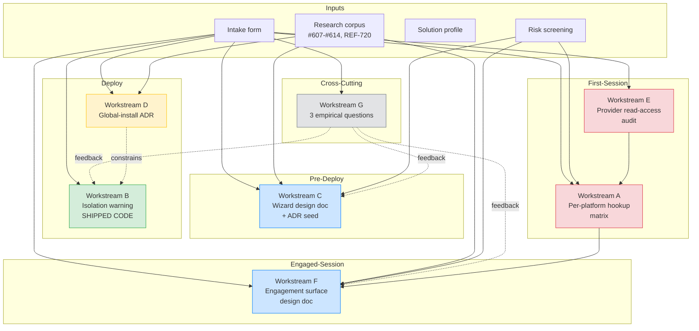
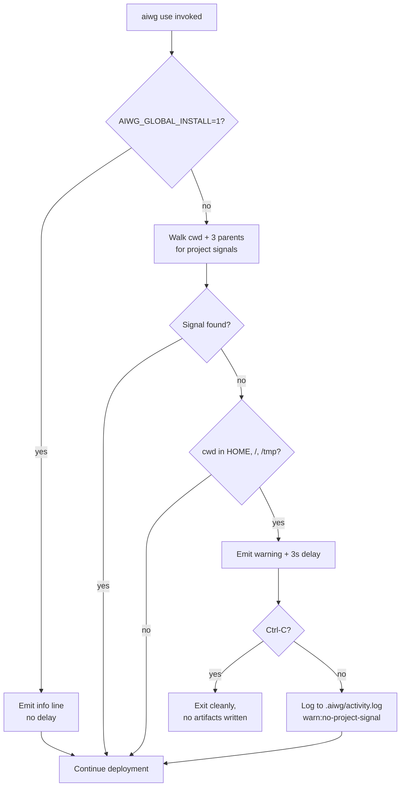
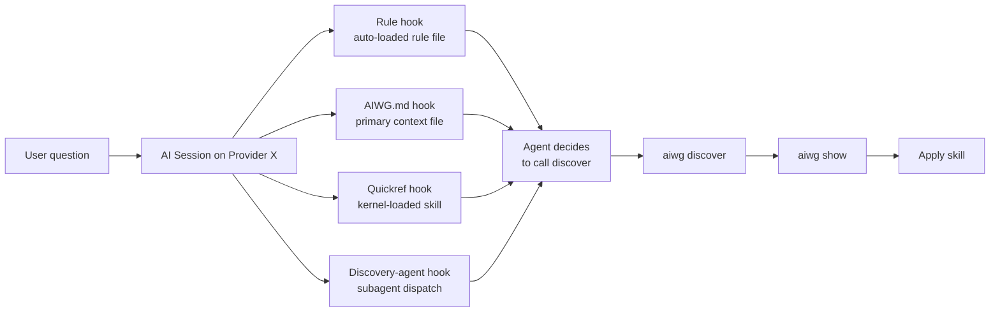

# Software Architecture Document — AIWG Novice-User Adoption Study

## 1. Introduction & Purpose

This document describes the architecture of the **AIWG Novice-User Adoption Study** — the design and execution structure of a research-and-design effort, not a product. The study commissions seven workstreams (A–G) tasked with addressing two persistent adoption failures: **project / session isolation failure** and **hookup failure** in novice user populations. Only one workstream (B) produces shipped code. The rest produce decisions, designs, audits, or empirical data points.

The "system" under design is therefore part UX architecture, part research methodology, and part one small piece of TypeScript that ships into `src/cli/handlers/use.ts`. This SAD adapts the standard SAD form to fit: component-level views are reserved for the two workstreams that touch the AIWG codebase (A audits it; B modifies it); the remainder of the study is described at logical-architecture and methodology levels.

This SAD is the architectural baseline for the Lifecycle Architecture (LA) milestone. It exists to:

- Establish that the study's structure satisfies its drivers and mitigates its critical risks
- Trace every use case (UC-NUA-001 through UC-NUA-007) to a workstream and an architectural section
- Identify decisions deferred to ADRs and the open architectural questions that remain
- Inform downstream construction epics on what the study did and did not decide

The study's commissioning epic (`roctinam/aiwg#1334`) requires hard-stopping at the Architecture Baseline Milestone (ABM). Construction-level work is explicitly out of scope, including the wizard implementation, any per-platform hookup remediation epic, and the engagement-surface implementation. Workstream B is the sole construction-level deliverable inside the study window.

## 2. Architectural Drivers

### 2.1 Success-Metric Drivers

The intake form names six success metrics. Each constrains the architecture:

| Metric | Architectural implication |
|--------|--------------------------|
| Hookup confidence per platform | Per-platform field-evidence model; no platform-wide claims; matrix as primary artifact (Workstream A) |
| Project-isolation warning shipped | Single, low-blast-radius TypeScript module in `src/cli/handlers/use.ts`; non-blocking by design; env-var opt-out (Workstream B) |
| Wizard flow design doc | Design-only deliverable; invocation-pattern decision (`aiwg wizard` vs. `aiwg use --wizard`) deferred to ADR (Workstream C) |
| Global install decision | ADR-only deliverable; binary first-class / escape-hatch decision (Workstream D) |
| Discovery-agent bolster | Audit-driven; null-finding is an acceptable outcome (Workstream A subproduct) |
| AIWG-engagement surface decision | Design-doc deliverable framed by Lee & See trust calibration; explicit anti-pattern guardrails (Workstream F) |

### 2.2 Design Tensions (Architecturally Load-Bearing)

The solution profile names three tensions. Each becomes an ADR seed:

1. **Discoverability vs. Pollution** — surfacing AIWG engagement supports trust calibration but threatens branding pollution. Resolved by: anti-pattern guardrails in Workstream F design doc; defaults that prefer user-initiated probes over agent-pushed identification.
2. **Wizard vs. Default-Path Friction** — a wizard reduces novice failure rate but can degrade power-user UX. Resolved by: opt-in invocation; default `aiwg use` behavior unchanged; documentation discipline (wizard ≠ default install path).
3. **Global Install Convenience vs. Project Isolation** — global install supports the "AIWG everywhere" UX many users prefer, but undermines the project-scoped context boundary REF-720 evidence supports. Resolved by: ADR decision (Workstream D) plus the non-blocking warning (Workstream B) as the in-product enforcement.

### 2.3 Critical-Risk Drivers

Three critical risks (priority ≥12) shape the study's structure:

- **R-001 (per-platform validation infeasibility, priority 16)** — drives the evidence-type taxonomy and the "8 of 10" success threshold instead of universal coverage.
- **R-002 (branding pollution, priority 15)** — drives the anti-pattern guardrails baked into Workstream F's design doc and the explicit reference to the existing `no-attribution` rule as an architectural invariant.
- **R-003 (wizard friction, priority 12)** — drives the opt-in invocation pattern for Workstream C and the explicit power-user-path Cognitive Walkthrough requirement.

### 2.4 Methodology Drivers

Two methodology constraints are architecturally load-bearing:

- **No static-analysis-only conclusions.** Workstream A's matrix requires field evidence per cell. The evidence-type taxonomy (§5.2) is the architectural enforcement.
- **No silent skill copying into `.aiwg/`.** Workstream E's remediation guidance must respect the standing rule that skills are reached via `aiwg discover` + `aiwg show`, not by copying into per-project directories.

## 3. Stakeholder Map

| Stakeholder | Architectural concern |
|-------------|----------------------|
| AIWG core maintainers | Framework integrity; review every baselined artifact; own ADRs |
| Non-technical AIWG users | Primary beneficiaries; addressed by Workstreams B, C, F |
| Technical AIWG users | No-regression constraint; addressed by Workstream B opt-out, Workstream C opt-in, Workstream D continued-support guarantee |
| Discord/Telegram community | Field-feedback input to Workstreams A and G; comms target for Workstream D ADR rollout |
| Provider platforms (10) | Each requires separate validation in Workstream A; Workstream E audits per-platform read-access |

## 4. Logical Architecture of the Study

The study is a directed acyclic graph of seven workstreams plus cross-cutting concerns. Workstreams differ in deliverable type — designs, ADRs, implementations, audits, or data — and in their dependency relationships.



### 4.1 Workstream Deliverable Taxonomy

| Workstream | Deliverable type | Output location |
|------------|-----------------|-----------------|
| A — Per-platform hookup audit | Field-evidence matrix + follow-up issues | `.aiwg/studies/novice-user-adoption/working/hookup-matrix.md` |
| B — Project-isolation warning | TypeScript implementation + tests | `src/cli/handlers/use.ts` (+ adjacent modules) |
| C — Wizard design | Design doc + walkthrough record | `.aiwg/studies/novice-user-adoption/working/wizard-design.md` |
| D — Global install decision | ADR | `.aiwg/studies/novice-user-adoption/architecture/adr-global-install.md` |
| E — Provider read access | Per-provider audit report + targeted config fixes | `.aiwg/studies/novice-user-adoption/working/provider-read-audit.md` |
| F — Engagement-surface design | Design doc citing trust-calibration framework | `.aiwg/studies/novice-user-adoption/working/engagement-surface.md` |
| G — Empirical questions | Three documented data points | `.aiwg/studies/novice-user-adoption/working/empirical-G[1-3].md` |

### 4.2 Dependencies

- **B depends on D's direction.** The warning's wording is informed by whether global install is first-class. B can ship before D baselines using a neutral phrasing; the final wording aligns with D once decided.
- **F depends on A.** The engagement surface design must know which discovery hooks reach the agent on which platform; F cannot specify "show probe via discovery-agent" without A's evidence.
- **A depends on E.** The hookup matrix cannot reach honest conclusions if some platforms lack read access to `$AIWG_ROOT`. Confounding factor must be excluded first.
- **G feeds back** into C (where do novices start?), B (warning text validation), and F (do users recognize engagement?). G is not on the critical path; outputs refine, not block, downstream design.

### 4.3 Sequencing

The study runs primarily in parallel. Suggested ordering inside the elaboration phase:

1. **Week 1–2** — E (provider read access), B (implementation start), G (poll launch)
2. **Week 2–4** — A (per-platform validation, gated on E completion per platform), C (wizard survey + design draft)
3. **Week 3–5** — D (ADR drafting, comms plan), F (engagement-surface design)
4. **Week 5–6** — B (PR review + merge), all workstreams converging on ABM gate review

## 5. Component-Level Views — Implementation-Touching Workstreams

### 5.1 Workstream B — Project-Isolation Warning

The warning is a small, additive module inside the `aiwg use` command path. It runs detection logic at the start of command execution, optionally emits a warning, applies a configurable delay during which the user can cancel, and otherwise allows command execution to proceed unchanged.

#### 5.1.1 Module Placement

```
src/
  cli/
    handlers/
      use.ts                          ← invocation point; calls warning early
    project-isolation/                ← NEW
      detect.ts                       ← signal-walk logic (NFR-PERF-02)
      signals.ts                      ← single-source-of-truth list (NFR-MAINT-01)
      warning.ts                      ← warning emission + delay
      index.ts                        ← public API
```

#### 5.1.2 Detection Flow



#### 5.1.3 Project-Signal List

A single array in `signals.ts` (per NFR-MAINT-01):

```typescript
export const PROJECT_SIGNALS = [
  '.git',
  'package.json',
  'pyproject.toml',
  'Cargo.toml',
  'go.mod',
  'pom.xml',
  'Gemfile',
  'build.gradle',
  // *.csproj globbed separately
] as const;
```

The list is consumed by `detect.ts` and is the only place to add new ecosystems. Existing per-language detection logic elsewhere in the codebase must not duplicate this list.

#### 5.1.4 NFR Traceability

| NFR | Architectural choice |
|-----|---------------------|
| NFR-PERF-01 (<50ms detection) | Stat-only checks; no file read; depth-bounded walk |
| NFR-PERF-02 (depth ≤3) | Loop counter in `detect.ts` |
| NFR-REL-01 (non-blocking) | Delay implemented with `setTimeout` + Ctrl-C handler; no `await` blocks deployment |
| NFR-REL-02 (env-var opt-out) | `process.env.AIWG_GLOBAL_INSTALL` check before any detection work |
| NFR-USE-01 (clarity) | Warning text fixed string with three required elements (target dir, cancel instruction, recovery instruction) |
| NFR-SEC-01 (no credentials) | Module imports only `node:fs`, `node:path`; no token-related code |
| NFR-MAINT-01 (extensibility) | `signals.ts` exports single `PROJECT_SIGNALS` array |
| NFR-OBS-01 (activity logging) | `warning.ts` calls `appendActivityLog('warn:no-project-signal', ...)` after non-cancelled emission |
| NFR-COMPAT-02 (no regression) | All paths bypass detection when `AIWG_GLOBAL_INSTALL=1` or project signal found |

#### 5.1.5 Test Strategy

- Unit tests in `test/cli/project-isolation/`
- Per-signal positive case (each entry in `PROJECT_SIGNALS`)
- Negative cases: `$HOME`, `/`, `/tmp`, deeply nested directory with no signals
- Walk-depth test: signal at parent[3] is found; signal at parent[4] is not
- Performance test: warm-cached `aiwg use` in a project root completes detection in <50ms (CI-enforced, NFR-PERF-01)
- Env-var test: warning suppressed when `AIWG_GLOBAL_INSTALL=1`
- Backward compatibility test: existing `aiwg use sdlc` test suite passes unmodified

### 5.2 Workstream A — Per-Platform Hookup Audit

Workstream A produces a matrix, not code. Its architecture is the matrix structure plus the evidence-type taxonomy that prevents R-006 (static-audit recurrence).

#### 5.2.1 Matrix Structure

```
              | Rule hook | AIWG.md hook | Quickref hook | Discovery-agent hook | Read access (E) |
--------------|-----------|--------------|---------------|----------------------|-----------------|
Claude Code   | scripted+ | scripted+    | scripted+     | scripted+            | scripted+       |
Codex         | scripted+ | scripted+    | scripted+     | scripted+            | scripted+       |
Copilot       | ?         | ?            | ?             | ?                    | ?               |
Cursor        | ?         | ?            | ?             | ?                    | ?               |
Factory       | ?         | ?            | ?             | ?                    | ?               |
OpenCode      | ?         | ?            | ?             | ?                    | ?               |
Warp          | ?         | ?            | ?             | ?                    | ?               |
Windsurf      | ?         | ?            | ?             | ?                    | ?               |
Hermes        | ?         | ?            | ?             | ?                    | ?               |
OpenClaw      | ?         | ?            | ?             | ?                    | ?               |
```

Each cell records a hook-firing claim plus the evidence type backing it.

#### 5.2.2 Evidence-Type Taxonomy

| Evidence type | Validity weight | Use |
|---------------|-----------------|-----|
| **scripted** | High | Repeatable scripted task on the platform; preferred |
| **manual** | Medium-High | Hand-walked task by study runner on the platform with documented session log |
| **field-feedback** | Medium | Direct user report with provider + scenario captured |
| **telemetry** | Medium | Anonymous opt-in invocation log; corroborating, not standalone |
| **static-flagged** | Candidate-only | Static analysis used only to flag candidates for field validation; never a conclusion |

The rule enforced by Workstream A: **no cell concludes with `static-flagged` alone.** Static analysis identifies what to test; field evidence determines what is true. This is the architectural answer to R-006 and to the saved memory rule against platform generalization.

#### 5.2.3 Discovery Hooks Across Providers

The four discovery hooks reach the agent through different mechanisms. The matrix's column structure encodes that variation:



Provider-specific notes (informational; not conclusions):

- **Claude Code / Cursor / OpenClaw** — rule files auto-load; H1 expected to dominate
- **Codex / Warp / Windsurf** — primary context file is the loading mechanism; H2 dominates; H1 reaches via the context file
- **Copilot / Factory / OpenCode** — exact loading order varies; field evidence required
- **Hermes** — MCP sidecar architecture; rule and skill access path differs; field evidence required

These notes are working hypotheses, not findings. The matrix produces findings.

#### 5.2.4 Discovery-Agent Bolster Sub-Audit

The fourth column gets a dedicated sub-audit because the project owner specifically flagged it as needing "more bolstering." The sub-audit asks:

- Does `aiwg-finder` (or the platform's subagent-dispatch equivalent) get invoked when an AIWG-relevant question is asked?
- Is the invocation rate higher than the agent independently calling `aiwg discover`?
- If the dispatch path doesn't fire, is the cause provider-side (no subagent support) or AIWG-side (instructions unclear)?

Acceptable outcomes include "no improvement warranted" (per R-004 mitigation). The deliverable is a recommendation, possibly null.

## 6. Cross-Cutting Concerns

### 6.1 Trust-Calibration Framing

Workstream F builds explicitly on **Lee & See (2004) — "Trust in Automation: Designing for Appropriate Reliance"** (filed as research-papers #614, pending REF-159). The framework defines three trust-calibration outcomes:

- **Appropriate reliance** — user trusts the system when warranted and ignores it when not
- **Over-trust / over-reliance** — user accepts incorrect output uncritically
- **Disuse / under-reliance** — user disregards correct output

The engagement-surface design must support appropriate reliance: users who can recognize when AIWG is engaged develop calibrated expectations. The design must not push users toward over-reliance (the branding-pollution risk: "AIWG must be right, it's always announcing itself") or disuse (the invisibility risk: "I never know if it's helping, so I ignore it").

Pair this with **Co-Audit (research-papers #612 / pending REF-158)** for the on-demand probe pattern: explicit user inquiry is the recommended primary surface; passive footers are an opt-in alternative; pushy attribution is the anti-pattern.

### 6.2 Anti-Pollution Invariant

The existing `.claude/rules/no-attribution.md` rule is treated as an **architectural invariant** for this study. No deliverable — including Workstream F's engagement surface — may introduce:

- AIWG identification in commit messages
- AIWG identification in code comments of user-generated files
- AIWG identification in file headers of user-generated artifacts
- AIWG identification in generated documentation content (excepting the study's own deliverables)

NFR-USE-03 enforces this at design-review time. The Workstream F design doc must include an explicit anti-pattern checklist, verified against the existing rule.

### 6.3 Voice & Authenticity

All baselined study deliverables use the `technical-authority` voice profile per the project voice-framework rule. Deliverables run through `/writing-validator` before baselining (R-009 mitigation). Voice drift across agents and sessions is the primary quality risk; profile pinning is the primary control.

### 6.4 Citation Discipline

Eight research papers used for grounding are filed as induction issues (`research-papers #607–#614`) and have not yet finalized as REF-NNN entries. Workstream deliverables cite both forms: induction issue number + provisional REF reference. When inductions finalize, a citation-validate sweep across study artifacts updates REF-NNN references. No artifact baselines without this dual-citation pattern (R-010 mitigation).

Existing REF citations (REF-720, REF-877, REF-878, REF-879) follow the standard citation-policy rule unchanged.

## 7. Deployment View

### 7.1 Namespace

All study artifacts live under `.aiwg/studies/novice-user-adoption/`:

```
.aiwg/studies/novice-user-adoption/
├── intake/              ← problem statement, solution profile, risks
├── requirements/        ← UCs, user stories, NFR register
├── architecture/        ← SAD, ADRs (D, F, others as needed)
├── working/             ← drafts, walkthroughs, surveys, empirical data
├── testing/             ← test strategy + plans
└── reports/             ← gate reports (LOM done, ABM pending)
```

This namespace mirrors the standard `.aiwg/` SDLC layout one level deep, preserving artifact discoverability through `aiwg discover` indexing while isolating the study from project-root SDLC artifacts.

### 7.2 Baselining

- **Already baselined:** intake-form, solution-profile, risk-screening, all UCs, user-stories, nfr-register, LOM gate report
- **This SAD:** baselined after Primary Author → 3 parallel reviewers → Synthesizer cycle
- **ADRs:** baselined per Workstream D (global install) and Workstream F (engagement surface); additional ADRs may emerge from Workstream C (wizard invocation pattern) and Workstream A (discovery-agent bolster decision)

### 7.3 Relationship to AIWG Repo

The study runs inside the AIWG repository as a dogfooding instance of AIWG's SDLC framework applied to AIWG itself. Workstream B's implementation lands in `src/cli/handlers/use.ts` (and the new `src/cli/project-isolation/` directory) via standard PR process. All other workstream outputs live under `.aiwg/studies/novice-user-adoption/` and do not require code changes.

Workstream B is the only workstream that produces deployment-relevant changes during the study window. It ships via standard CalVer release once merged; no special release coordination is required.

## 8. Use Case Traceability

| Use case | Workstream | Primary SAD section | Notes |
|----------|-----------|---------------------|-------|
| UC-NUA-001 — Installs and uses AIWG | All (parent UC) | §4 Logical Architecture | Aggregating use case; no single section |
| UC-NUA-002 — Runs `aiwg use` first time | B | §5.1 Component view (warning) | Direct implementation trace |
| UC-NUA-003 — Onboards via wizard | C | §4.1 Deliverable taxonomy | Design-doc deliverable; SAD references but does not specify wizard internals |
| UC-NUA-004 — Installs globally | D | §2.2 Tension 3 + §6.4 ADR seed | ADR deliverable; this SAD captures the decision space |
| UC-NUA-005 — Agent invokes discover | A, E | §5.2 Component view (hookup matrix) | Direct audit trace |
| UC-NUA-006 — Recognizes AIWG engaged | F | §6.1 Trust calibration + §6.2 Anti-pollution invariant | Design-doc deliverable; SAD captures the framing |
| UC-NUA-007 — Study runner audits platform | A, G | §5.2.2 Evidence-type taxonomy + §5.2.4 Discovery-agent sub-audit | Methodology constraint |

All seven UCs trace. No UC is unaddressed.

## 9. Risk–Architecture Mapping

| Critical risk | Architectural mitigation |
|---------------|-------------------------|
| **R-001** — Per-platform validation infeasibility (priority 16) | Evidence-type taxonomy (§5.2.2) admits scripted, manual, field-feedback, and telemetry as valid evidence; success threshold is 8 of 10, not 10 of 10; per-platform prioritization by user volume |
| **R-002** — Branding pollution (priority 15) | Anti-pollution invariant (§6.2) treats `no-attribution` rule as architectural; trust-calibration framing (§6.1) prefers user-initiated probes over agent-pushed identification; NFR-USE-03 enforces at design review |
| **R-003** — Wizard friction (priority 12) | §4.2 dependency note: Workstream B ships independently of C; §6.3 voice control; Workstream C deliverable is design-only — wizard never becomes default invocation path during study; opt-in invocation pattern is a hard architectural constraint passed to the implementation epic |

The three non-critical risks with priority ≥6 are also addressed:

- **R-004** (null finding) — §5.2.4 explicitly permits "no improvement warranted" outcome
- **R-005** (ADR conflict with field) — §7.3 plus Workstream D's continued-support guarantee for one CalVer cycle
- **R-006** (static-audit recurrence) — §5.2.2 evidence-type taxonomy forbids static-only conclusions
- **R-010** (citation drift) — §6.4 dual-citation pattern

## 10. Open Architectural Questions (Deferred to ADRs)

The following decisions are deferred from this SAD to ADRs. Each ADR will be produced by the indicated workstream during elaboration:

| Question | Owner | Deferred to |
|----------|-------|-------------|
| Is global install a first-class supported flow or a discouraged escape hatch? | Workstream D | `adr-global-install.md` |
| Should the engagement surface default be on-demand probe, opt-in footer, or no surface? | Workstream F | `adr-engagement-surface.md` |
| Is the wizard invoked as `aiwg wizard`, `aiwg new --interactive`, or `aiwg use --wizard`? | Workstream C | `adr-wizard-invocation.md` (optional — may be folded into design doc) |
| Does the discovery-agent hook need bolstering, or is the current implementation adequate? | Workstream A | `adr-discovery-agent-bolster.md` (optional — may resolve to null-finding note) |
| Does Workstream G's opt-in telemetry get implemented during the study, or deferred entirely? | Workstream G | TBD — may resolve as scope note, not full ADR |

The mandatory ADRs are D (global install) and F (engagement surface). The other three are optional, contingent on the workstream producing a decision that warrants formal recording.

## 11. ABM Gate Criteria

This SAD plus its three reviewer-cycle outputs (security, test, requirements analyst) plus the mandatory ADRs (D, F) plus the master test strategy constitute the artifact set for the **Architecture Baseline Milestone (ABM)** gate. The commissioning epic requires hard-stopping at ABM; no construction-prep work follows.

Construction-level work that the study does not perform but enables for downstream epics:

- Wizard implementation (Workstream C produces design only)
- Engagement-surface implementation (Workstream F produces design only)
- Per-platform hookup remediation epics (Workstream A produces findings + follow-up issues only)
- Provider read-access fixes beyond targeted remediation already in Workstream E scope

## 12. References

- Intake form, solution profile, risk screening, LOM gate report (this study)
- All UCs (UC-NUA-001 through UC-NUA-007) and user stories
- NFR register
- Research corpus: REF-720 (Lost in Multi-Turn Conversation, MSR/Salesforce 2025); REF-877/878/879 (tool-routing precision); induction issues `research-papers #607–#614` covering Krug, Norman, Nielsen heuristics, W3C cognitive accessibility, Zamfirescu-Pereira et al., Co-Audit, Cognitive Walkthrough, Lee & See
- Existing AIWG rules: `.claude/rules/no-attribution.md`, `.claude/rules/voice-framework.md`, `.claude/rules/activity-log.md`, `.claude/rules/citation-policy.md`
- Saved memory rules: `feedback_no_platform_generalization`, `feedback_aiwg_branding_restraint`, `feedback_no_skill_copying`, `feedback_discovery_multi_hook`
- Commissioning epic: `roctinam/aiwg#1334`
