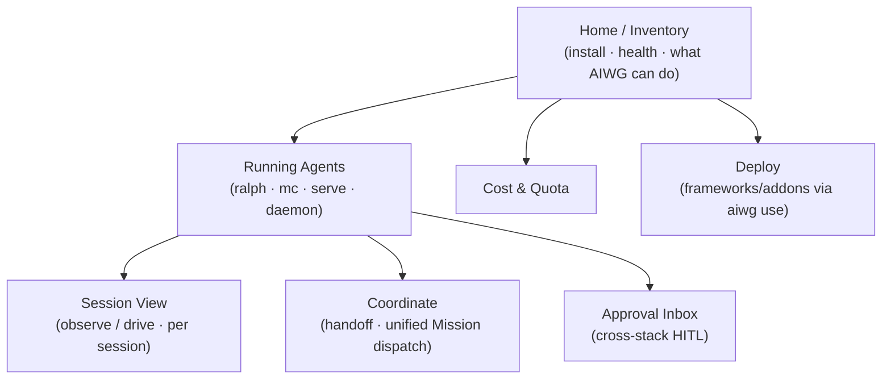

# UX Design — AIWG Cockpit

**Phase**: Elaboration
**Status**: Draft
**Related**: @.aiwg/management/cockpit-vision.md, @.aiwg/requirements/ (UC-COCKPIT-001..012), @.aiwg/requirements/nfr-modules/cockpit-nfrs.md (NFR-05 a11y), @.aiwg/architecture/adr-cockpit-ui-stack.md, @.aiwg/architecture/adr-cockpit-marketplace-ux-agent-sourcing.md
**Design contributors**: AIWG UX team — Product Designer, UX Lead, Frontend Specialist, Accessibility Specialist, Art Director

## Reasoning

1. **Need**: the differentiator is a *friendly, simple* surface that a newcomer can use in <3 min, that also gives power users multi-stack control — without clutter.
2. **Value proposition**: one calm home that answers "what's installed, what's running, how do I jump in" and progressively reveals power (coordination, approvals, lifecycle).
3. **Approach**: progressive disclosure (newcomer-first defaults, depth behind), accessible by construction (WCAG 2.1 AA), and honest about each stack's capability tier (drive vs observe-only).
4. **Risk**: simplicity↔power tension (risk P3) → mitigate with progressive disclosure + UX-agent review.

## Front door & first run (UX-first)

Per the vision's UX-First/CLI-Always posture and `adr-cockpit-distribution-packaging`: **install *is* onboarding.** The default platform-native installer (generated from the Cockpit `setup.aiwg.io/v1` SetupManifest) lands the user in the Cockpit on the **Newcomer Guided Start** (UC-COCKPIT-003), not at a terminal — the ≤5-min ramp (NFR-09 / UC-COCKPIT-013). The installer shows the equivalent CLI commands it ran, so the terminal path is *taught*, never hidden. Every screen makes the CLI discoverable (a "copy the CLI command" affordance) without requiring it — CLI-always, easy-first.

## Research foundations (cited — not invented)

This UX is grounded in established HMI / human-AI-interaction research, inducted into the corpus (section9/research-papers #68, #69, #70). The mapping below is the *defensible basis* for every design choice; design decisions trace back to these.

| Design choice | Citable foundation | Induct |
|---|---|---|
| "Working alongside the agents" — presence, awareness, shared workspace | Dourish & Bellotti, *Awareness and Coordination in Shared Workspaces* (CSCW 1992) | #70 |
| Agent-collaboration UX (what it can do / why it did it / invoke·correct·dismiss) | Amershi et al., *Guidelines for Human-AI Interaction* (CHI 2019) | #68 |
| Observe → drive → hand-back | Horvitz, *Mixed-Initiative User Interfaces* (CHI 1999) | #68 |
| Trust calibration (provenance, verify-path, appropriate reliance) | Lee & See, *Trust in Automation* (Human Factors 2004) | #68 |
| The cockpit/control-plane frame (one operator, many semi-autonomous processes) | Sheridan, *Human Supervisory Control* (1992) | #69 |
| Layout reflects the work domain (earned cockpit metaphor) | Vicente & Rasmussen, *Ecological Interface Design* (IEEE SMC 1992) | #69 |
| Drive-vs-observe / how-much-autonomy tiers | Parasuraman, Sheridan & Wickens, *Levels of Automation* (IEEE SMC-A 2000) | #69 |
| Overview → zoom/filter → details-on-demand (macro navigation) | Shneiderman, *The Eyes Have It* (IEEE VL 1996) | #70 |
| Periphery/center for many concurrent agents | Weiser & Brown, *Calm Technology* (1996) | #70 |
| Visibility of system status; error prevention/recovery | Nielsen (& Molich), *Usability Heuristics* (CHI 1990/1994) | #70 |
| Driving a session = direct manipulation | Shneiderman, *Direct Manipulation* (IEEE Computer 1983) | #70 |
| Conceptual model, affordances, signifiers, feedback | Norman, *The Design of Everyday Things* (1988/2013) | #70 |
| Micro-laws (Fitts/Hick/Tesler/Miller/Gestalt) | Yablonski, *Laws of UX* (O'Reilly 2020) | #70 |
| Friendly-default, explainability, graceful failure | Google PAIR, *People + AI Guidebook* (2019) | #68 |

Full induction (analysis docs, GRADE, citation sidecars) is pending in those issues; this section is the citable map the planning phase builds on.

## Design principles

1. **Friendly default, power on demand** — the first screen is calm and guided; advanced surfaces (coordination, lifecycle, raw logs) are one click deeper, never on the landing view. The CLI equivalent of a UI action is always one affordance away (never forced).
2. **Never hide the truth** — capability tiers (drive-capable vs observe-only), pending approvals, and failures are always visible; no false "success."
3. **Augment, never replace** — every screen makes clear Cockpit is *on top of* the native tools; deep-links out to native UIs/CLI where appropriate (non-nerf).
4. **Accessible by construction** — keyboard-first, screen-reader-labelled, AA contrast, no color-only signaling (NFR-05).
5. **One audit truth** — actions visibly land in the unified timeline.

## Information architecture

## Key screens

| Screen | UC | Newcomer view | Power view (disclosed) |
|---|---|---|---|
| **Home / Inventory** | 001, 011 | "AIWG is healthy. 3 frameworks, 5 providers. [Start a session] [Deploy]" + plain-language health | per-provider deploy matrix, doctor findings, version drift (e.g. #1579 twin warnings) |
| **Newcomer guided start** | 003 | 3-step wizard: pick a stack → pick a task → Go (live session in <3 min) | skipped once familiar |
| **Running Agents** | 002, 006, 012 | cards: what's running, per-stack status, [Attach][Pause][Stop] | concurrency board for ≥3 stacks; lifecycle controls gated by capability |
| **Session View** | 004, 005 | live stream, big "Observing / Driving" badge, [Detach] | drive controls (if capable), deep-link to native UI |
| **Coordinate** | 007, 008 | "Send this result to another stack" | unified Mission composer over heterogeneous workers (#1546) |
| **Approval Inbox** | 009 | one list of "needs your OK", with action + blast radius | per-stack filters; native confirm where supported |
| **Cost & Quota** | 010 | spend at a glance, near-limit flags | per-key/session breakdown (#1187) |

## Interaction safety (UX-level)
- Attach opens in **Observe** with an explicit, high-contrast mode badge; switching to **Drive** is a deliberate, capability-gated action with a confirm.
- Destructive lifecycle (Stop/Abort) and any HITL approval use a confirm naming identity + blast radius (human-authorization); where the host supports a native confirmation tool, use it (native-ux-tools).
- Failures and observe-only limitations are shown plainly, never hidden behind a spinner.

## Accessibility (NFR-05, owner: Accessibility Specialist)
- WCAG 2.1 AA on the core flows (Home, Running, Session View, Approval Inbox).
- Full keyboard operability; ARIA roles/labels on the live-stream and inbox; AA contrast tokens (see color-output-format conventions); status conveyed by text+icon, not color alone.
- Automated AA scan in CI + a manual keyboard/screen-reader pass as ABM evidence.

## Marketplace UX-agent sourcing (per adr-cockpit-marketplace-ux-agent-sourcing)
- **Use AIWG's own UX team first** (already vetted, in-scope): Product Designer (flows/screens), UX Lead (IA, usability, progressive-disclosure), Frontend Specialist (component architecture, web-vitals), Accessibility Specialist (WCAG), Art Director (visual system).
- **External Claude-marketplace UX agents**: locate candidates via the plugin/agent marketplace; admit only through the **Adoption Gate** (license + quality + security review), sandboxed to display/interaction scope with strict CSP, supply-chain-pinned, and provenance-tagged `agent:<name>@<hash>`.
- **Sourcing criteria** for a "good UX agent": produces accessible, on-brand, component-level guidance; no off-origin network needs; permissive license; small, reviewable footprint (and — dogfood lesson from #1587 — lean definition, not a 24–45KB bloated agent).
- **First adoption is a tracked Elaboration deliverable** (risk X4): document the candidate, the gate result, and the sandbox config.

## Open items for ABM
- Final visual system / component library (with Art Director + Frontend Specialist) — tied to the UI-stack spike.
- First external UX-agent adoption-gate record (or decision to ship v1 with AIWG UX team only).
- Usability check of the newcomer <3-min flow.
