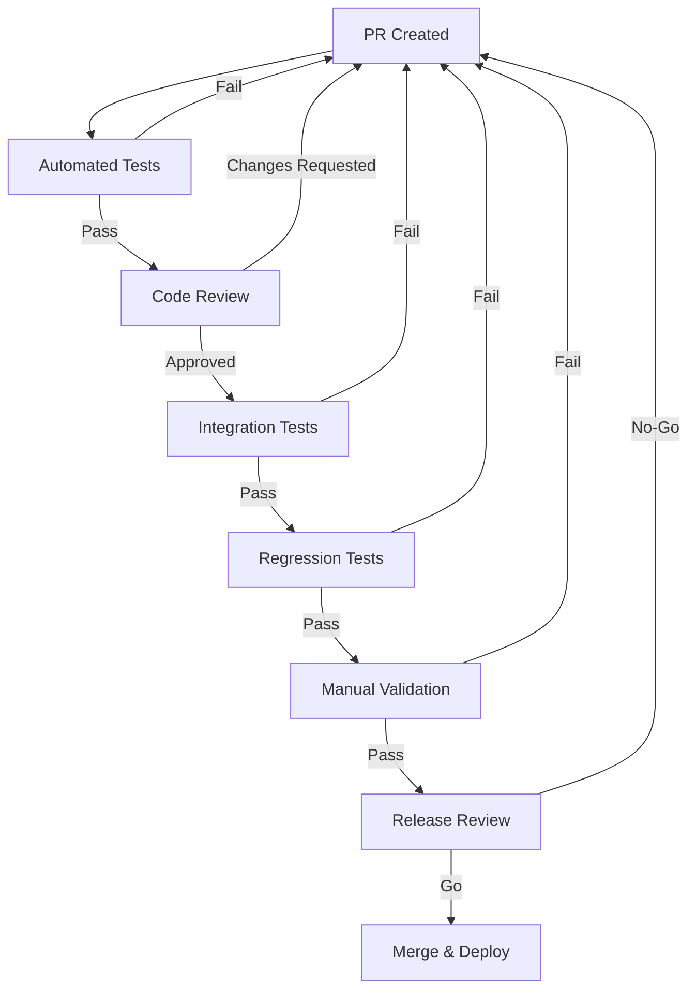
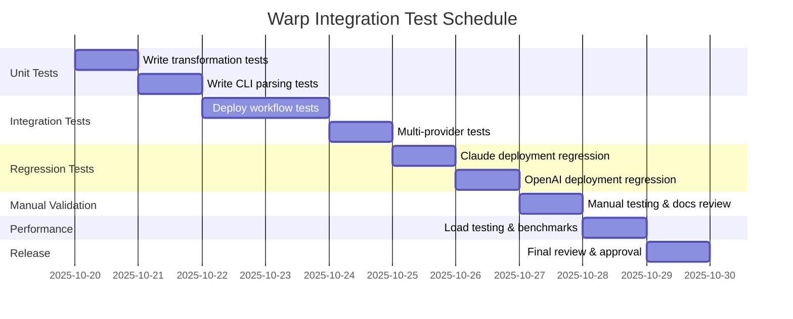

# Test Plan: Warp AI Platform Integration

## Document Information

**Version:** 1.0
**Date:** 2025-10-17
**Status:** Draft
**Owner:** Test Engineer
**Contributors:** DevOps Engineer, Architecture Designer

## 1. Context and Objectives

### 1.1 Project Context

The AI Writing Guide currently supports two agent deployment platforms:

- **Claude AI** (default): Uses `.claude/agents/` directory
- **OpenAI/Codex**: Uses `.codex/agents/` directory

This integration adds **Warp AI** as the third supported platform, requiring:

1. WARP.md agent file generation (similar to AGENTS.md for OpenAI)
2. Agent transformation for Warp-specific frontmatter format
3. Deployment to `.warp/agents/` directory
4. CLI support via `aiwg -deploy-agents --provider warp`

### 1.2 Risk Profile

**Critical Risks:**

- Breaking existing Claude/OpenAI deployment flows
- Incorrect WARP.md format preventing Warp AI platform recognition
- Data loss or corruption during agent transformation
- Regression in existing provider functionality

**Medium Risks:**

- Performance degradation during deployment
- Missing edge cases in provider detection
- Documentation gaps for Warp-specific behavior

**Low Risks:**

- Minor CLI UX inconsistencies
- Non-critical error message clarity

### 1.3 Testing Objectives

1. **Functional Correctness**: Verify WARP.md generation and agent transformation
2. **Backward Compatibility**: Ensure no regression in Claude/OpenAI deployments
3. **Integration Stability**: Validate end-to-end deployment workflow
4. **Error Resilience**: Test error handling and recovery paths
5. **Documentation Accuracy**: Validate CLI help and user guidance

### 1.4 Success Criteria

- 100% of existing tests pass (no regressions)
- 95%+ coverage of Warp-specific code paths
- All manual validation tests complete successfully
- Zero critical defects at release
- Documentation complete and validated

## 2. Test Levels and Scope

### 2.1 Unit Testing

**Scope:**

- Agent frontmatter transformation functions
- Provider detection logic
- WARP.md aggregation functions
- Model mapping (Warp-specific defaults)
- File path resolution (`.warp/agents/`)

**Out of Scope:**

- File system I/O (mocked)
- External API calls

**Coverage Target:** 95% line coverage, 90% branch coverage

### 2.2 Integration Testing

**Scope:**

- Complete deployment flow: `aiwg -deploy-agents --provider warp`
- File creation and directory structure
- Multi-provider deployment (Claude + Warp, OpenAI + Warp)
- Command flag combinations (`--dry-run`, `--force`, `--as-warp-md`)
- Agent transformation pipeline (read → transform → write)

**Out of Scope:**

- Actual Warp AI platform execution (external dependency)

**Coverage Target:** All critical paths validated

### 2.3 Regression Testing

**Scope:**

- Existing Claude deployment (`--provider claude`)
- Existing OpenAI deployment (`--provider openai`)
- General-purpose agent deployment (`--mode general`)
- SDLC agent deployment (`--mode sdlc`)
- Combined deployment (`--mode both`)
- Custom model overrides (`--reasoning-model`, `--coding-model`, etc.)

**Out of Scope:**

- Historical legacy behavior no longer supported

**Coverage Target:** 100% of existing functionality validated

### 2.4 Manual Validation Testing

**Scope:**

- Visual inspection of generated WARP.md format
- CLI help text and documentation accuracy
- Error message clarity and actionability
- Performance testing (large agent sets)
- Cross-platform testing (Linux, macOS, Windows WSL)

**Out of Scope:**

- Full Warp AI platform integration (external system)

**Coverage Target:** All user-facing workflows validated

## 3. Test Types and Techniques

### 3.1 Unit Testing (TDD Approach)

**Technique:** Test-Driven Development

- Write test cases first
- Implement minimal code to pass tests
- Refactor while maintaining green tests

**Tools:**

- Node.js native test runner or Jest
- Assertion library (assert/expect)
- Mock/stub utilities (for fs operations)

### 3.2 Integration Testing (Contract-Based)

**Technique:** Contract Testing

- Define expected file format contracts (WARP.md structure)
- Validate CLI argument contracts
- Test file system state transitions

**Tools:**

- Bash scripts for end-to-end CLI invocation
- JSON schema validation for frontmatter
- File snapshot testing

### 3.3 Regression Testing (Golden Master)

**Technique:** Golden Master Testing

- Capture current Claude/OpenAI behavior as baseline
- Compare new implementation output against baseline
- Flag any deviations for review

**Tools:**

- Snapshot testing for file contents
- Directory structure comparison utilities
- Git diff for change detection

### 3.4 Exploratory Testing

**Technique:** Session-Based Testing

- 2-hour focused sessions
- Charter-based exploration of edge cases
- Document findings and unexpected behaviors

**Focus Areas:**

- Unusual file names or paths
- Permission errors and recovery
- Concurrent deployments
- Network/disk failures (simulated)

## 4. Automation Strategy

### 4.1 Automation Goals

- 90% of test cases automated (unit + integration)
- Manual tests only for visual/UX validation
- CI/CD pipeline integration for every PR
- Fast feedback loop (<5 minutes for unit tests)

### 4.2 Test Frameworks

**Unit Tests:**

```javascript
// Example: Using Node.js native test runner
import { describe, it, beforeEach, afterEach } from 'node:test';
import assert from 'node:assert';
import { transformForWarp, generateWarpMd } from './deploy-agents.mjs';

describe('Warp Agent Transformation', () => {
  it('should transform Claude frontmatter to Warp format', () => {
    const claudeContent = `---
name: Test Agent
model: sonnet
---
# Agent Content`;

    const warpContent = transformForWarp(claudeContent, {
      provider: 'warp',
      codingModel: 'warp-v1'
    });

    assert.match(warpContent, /model: warp-v1/);
  });
});
```

**Integration Tests:**

```bash
#!/bin/bash
# test-warp-deployment.sh

set -e

# Setup test environment
TEST_DIR=$(mktemp -d)
cd "$TEST_DIR"

# Deploy agents with Warp provider
aiwg -deploy-agents --provider warp --target "$TEST_DIR" --dry-run

# Validate expected output
if [ ! -d ".warp/agents" ]; then
  echo "ERROR: .warp/agents directory not created"
  exit 1
fi

# Cleanup
rm -rf "$TEST_DIR"
echo "✓ Warp deployment test passed"
```

### 4.3 Coverage Targets

| Component | Line Coverage | Branch Coverage | Function Coverage |
|-----------|--------------|-----------------|-------------------|
| Core deployment logic | 95% | 90% | 100% |
| Warp transformation | 95% | 90% | 100% |
| CLI argument parsing | 90% | 85% | 100% |
| File I/O utilities | 85% | 80% | 100% |
| Error handling | 90% | 85% | 100% |

### 4.4 CI/CD Integration

**Pipeline Stages:**

1. **Pre-commit**: Lint and unit tests (local hook)
2. **PR Validation**: Full test suite + coverage report
3. **Merge Gate**: 100% of tests pass, no coverage regression
4. **Post-merge**: Deploy to staging, run smoke tests

**GitHub Actions Workflow:**

```yaml
name: Warp Integration Tests

on:
  pull_request:
    paths:
      - 'tools/agents/deploy-agents.mjs'
      - 'tests/warp-integration/**'

jobs:
  test:
    runs-on: ubuntu-latest
    steps:
      - uses: actions/checkout@v4
      - uses: actions/setup-node@v4
        with:
          node-version: '20'
      - run: npm test -- tests/warp-integration/
      - run: npm run test:integration:warp
      - uses: codecov/codecov-action@v4
```

## 5. Environment Strategy

### 5.1 Test Environments

**Local Development:**

- Developer workstations (Linux/macOS/Windows WSL)
- Node.js 18+ required
- Temporary directories for isolated testing
- Mock file system for unit tests

**CI/CD Environment:**

- GitHub Actions runners (Ubuntu latest)
- Containerized test execution
- Ephemeral storage for test artifacts
- Parallel test execution where possible

**Staging Environment:**

- Representative production-like setup
- Real file system (not mocked)
- Multiple OS platforms (matrix testing)
- Performance benchmarking environment

### 5.2 Test Data Management

**Agent Fixtures:**

```javascript
// fixtures/sample-agents.js
export const sampleAgents = {
  reasoningAgent: `---
name: Strategic Planner
model: opus
description: High-level strategic planning
tools: Read, Write, Bash
---
# Strategic Planner
Handles complex strategic planning.`,

  codingAgent: `---
name: Software Implementer
model: sonnet
description: Implementation and coding
tools: Read, Write, MultiEdit, Bash
---
# Software Implementer
Writes production code.`,

  efficiencyAgent: `---
name: Quick Responder
model: haiku
description: Fast responses
tools: Read, Write
---
# Quick Responder
Handles simple tasks quickly.`
};
```

**Expected Output Fixtures:**

```javascript
// fixtures/expected-warp-outputs.js
export const expectedWarpMd = `---
name: Strategic Planner
model: warp-pro
description: High-level strategic planning
tools: Read, Write, Bash
---
# Strategic Planner
Handles complex strategic planning.

---
name: Software Implementer
model: warp-standard
description: Implementation and coding
tools: Read, Write, MultiEdit, Bash
---
# Software Implementer
Writes production code.

---
name: Quick Responder
model: warp-lite
description: Fast responses
tools: Read, Write
---
# Quick Responder
Handles simple tasks quickly.`;
```

### 5.3 Environment Provisioning

**Setup Script:**

```bash
#!/bin/bash
# setup-test-env.sh

echo "Setting up Warp integration test environment..."

# Create test workspace
TEST_WORKSPACE=$(mktemp -d -t warp-test-XXXXXX)
export WARP_TEST_WORKSPACE="$TEST_WORKSPACE"

# Install dependencies
npm ci

# Create test fixtures
mkdir -p "$TEST_WORKSPACE/fixtures/agents"
cp tests/fixtures/sample-agents/* "$TEST_WORKSPACE/fixtures/agents/"

echo "✓ Test environment ready: $TEST_WORKSPACE"
```

**Cleanup Script:**

```bash
#!/bin/bash
# cleanup-test-env.sh

if [ -n "$WARP_TEST_WORKSPACE" ] && [ -d "$WARP_TEST_WORKSPACE" ]; then
  rm -rf "$WARP_TEST_WORKSPACE"
  echo "✓ Test environment cleaned up"
fi
```

## 6. Defect Management

### 6.1 Defect Lifecycle

1. **Discovered**: Test fails or manual validation identifies issue
2. **Triaged**: Severity and priority assigned
3. **Assigned**: Developer assigned based on component ownership
4. **In Progress**: Fix implemented with test case
5. **Code Review**: PR submitted with fix + regression test
6. **Verified**: QA validates fix in test environment
7. **Closed**: Merged and deployed

### 6.2 Severity Classification

| Severity | Definition | Response Time | Examples |
|----------|-----------|---------------|----------|
| **Critical** | Blocker preventing release | Immediate | Breaks existing deployments, data loss, security vulnerability |
| **High** | Major functionality broken | 24 hours | Warp deployment fails, incorrect file format |
| **Medium** | Functionality impaired | 3 days | Missing error messages, poor UX |
| **Low** | Minor inconvenience | Next sprint | Typos, cosmetic issues |

### 6.3 Priority Scheme

| Priority | Definition | Criteria |
|----------|-----------|----------|
| **P0** | Must fix before release | Critical severity + user-facing |
| **P1** | Fix in current sprint | High severity or critical path |
| **P2** | Fix in next sprint | Medium severity |
| **P3** | Backlog | Low severity, nice-to-have |

### 6.4 Tooling

- **Issue Tracker**: GitHub Issues with labels (`bug`, `warp-integration`, `regression`)
- **Test Failure Tracking**: CI/CD artifacts with failure logs
- **Coverage Reports**: Codecov integration for coverage tracking
- **Regression Database**: Historical test results in CI/CD system

## 7. Metrics and Reporting

### 7.1 Key Metrics

**Quality Metrics:**

- **Test Pass Rate**: % of tests passing on each run
- **Code Coverage**: Line, branch, function coverage by component
- **Defect Density**: Defects per 1000 lines of code
- **Defect Escape Rate**: Defects found post-deployment
- **Mean Time to Detect (MTTD)**: Time from defect introduction to detection

**Velocity Metrics:**

- **Test Execution Time**: Total time for full suite
- **Mean Time to Repair (MTTR)**: Time from defect detection to fix deployment
- **Test Automation Rate**: % of tests automated vs manual

**Coverage Metrics:**

- **Requirement Coverage**: % of requirements with test coverage
- **Risk Coverage**: % of identified risks with mitigating tests
- **Platform Coverage**: Tests executed across target platforms

### 7.2 Dashboards

**CI/CD Dashboard:**

- Real-time test pass/fail status
- Coverage trends over time
- Failing tests by category
- Build performance metrics

**Defect Dashboard:**

- Open defects by severity/priority
- Defect aging (time in each status)
- Defect resolution trends
- Defect root cause analysis

### 7.3 Review Cadence

- **Daily**: Test failure triage (if failures occur)
- **Weekly**: Coverage and quality metrics review
- **Sprint End**: Defect trends and velocity analysis
- **Release**: Go/no-go decision based on metrics

### 7.4 Target Thresholds

| Metric | Target | Action if Below Target |
|--------|--------|----------------------|
| Test Pass Rate | 100% | Block deployment, triage failures |
| Code Coverage | 90% | Identify gaps, add tests |
| Critical Defects | 0 | Block release until resolved |
| High Defects | ≤2 | Review with PM, may defer if low risk |
| Test Execution Time | <10 min | Optimize slow tests, parallelize |

## 8. Governance and Reviews

### 8.1 Review Checkpoints

**Code Review (Pre-Merge):**

- **Trigger**: PR submitted with Warp integration changes
- **Reviewers**: 2+ reviewers (1 senior engineer required)
- **Criteria**:
  - All tests pass
  - Coverage targets met
  - No regression in existing functionality
  - Documentation updated
  - Security review passed

**Test Review:**

- **Trigger**: New test cases added
- **Reviewers**: Test Engineer + domain expert
- **Criteria**:
  - Test cases cover requirements
  - Assertions are meaningful
  - Edge cases addressed
  - Maintainability (no brittle tests)

**Release Review (Go/No-Go):**

- **Trigger**: Deployment candidate ready
- **Participants**: Tech Lead, QA Lead, Product Manager
- **Criteria**:
  - Zero critical defects
  - All manual validation complete
  - Regression suite 100% pass
  - Documentation approved
  - Rollback plan verified

### 8.2 Quality Gates

**Gate 1: Unit Test Pass**

- All unit tests pass
- Coverage ≥95% for new code
- No new linting violations

**Gate 2: Integration Test Pass**

- All integration tests pass
- End-to-end workflows validated
- Performance within acceptable thresholds

**Gate 3: Regression Test Pass**

- 100% of existing tests pass
- Golden master comparison clean
- Cross-platform validation complete

**Gate 4: Manual Validation Pass**

- Visual inspection complete
- Documentation accuracy verified
- UX feedback incorporated

**Gate 5: Release Approval**

- All gates 1-4 passed
- Security review complete
- Stakeholder sign-off obtained

### 8.3 Approval Workflows



## 9. Risk-Based Testing Approach

### 9.1 Risk Matrix

| Risk | Likelihood | Impact | Priority | Test Focus |
|------|-----------|--------|----------|-----------|
| Break existing Claude deployment | Medium | Critical | **P0** | Regression: Full Claude deployment suite |
| Break existing OpenAI deployment | Medium | Critical | **P0** | Regression: Full OpenAI deployment suite |
| Incorrect WARP.md format | High | High | **P0** | Integration: Format validation, schema checks |
| Agent transformation data loss | Low | Critical | **P0** | Unit: Transformation reversibility tests |
| CLI flag conflicts | Medium | Medium | **P1** | Integration: Flag combination matrix |
| Performance degradation | Low | Medium | **P2** | Load: Large agent set benchmarks |
| Documentation gaps | Medium | Low | **P2** | Manual: Documentation review |
| Cross-platform issues | Low | Medium | **P2** | Integration: Multi-OS validation |

### 9.2 Test Focus Areas by Risk

**P0 Risks (Must Test Exhaustively):**

1. **Backward Compatibility**
   - Test: Full regression suite for Claude and OpenAI
   - Validation: Golden master comparison
   - Coverage: 100% of existing workflows

2. **WARP.md Format Correctness**
   - Test: Schema validation against Warp spec
   - Validation: Manual inspection + automated checks
   - Coverage: All agent types (reasoning, coding, efficiency)

3. **Data Integrity**
   - Test: Transformation round-trip tests
   - Validation: Content hash comparison
   - Coverage: All supported agent metadata fields

**P1 Risks (Thorough Testing):**

1. **CLI Interface**
   - Test: All flag combinations
   - Validation: Help text accuracy
   - Coverage: Common use cases + error paths

**P2 Risks (Sampling/Spot Checks):**

1. **Performance**
   - Test: Benchmark with 100+ agents
   - Validation: Execution time <30 seconds
   - Coverage: Common deployment scenarios

2. **Documentation**
   - Test: Manual review of README, CLAUDE.md updates
   - Validation: Accuracy and completeness
   - Coverage: All user-facing documentation

### 9.3 Contingency Triggers

**Trigger 1: Critical Defect Found**

- **Action**: Halt deployment, root cause analysis
- **Escalation**: Notify Tech Lead immediately
- **Resolution**: Fix + regression test required before retry

**Trigger 2: Coverage Below Target**

- **Action**: Identify untested paths
- **Escalation**: Assign additional test development
- **Resolution**: Add tests, re-measure coverage

**Trigger 3: Performance Regression**

- **Action**: Profile and optimize
- **Escalation**: Involve performance expert
- **Resolution**: Optimize or adjust thresholds with justification

**Trigger 4: Multiple Test Failures**

- **Action**: Review test environment stability
- **Escalation**: DevOps investigation
- **Resolution**: Fix environment issues, re-run tests

## 10. Compliance and Standards

### 10.1 Industry Standards

**AIWG Project Standards:**

- Markdown linting (markdownlint-cli2)
- Node.js best practices (ESLint)
- Semantic versioning (SemVer)

**Testing Standards:**

- Arrange-Act-Assert (AAA) pattern
- Test isolation (no shared state)
- Descriptive test names (`it('should ...')`
- Minimal mocking (prefer real implementations where safe)

### 10.2 Organizational Policies

**Code Review Policy:**

- All changes require PR review
- 2+ approvals for critical path changes
- Tests must accompany bug fixes

**Security Policy:**

- No secrets in test code
- Secure handling of temporary files
- Clean up test artifacts

**Documentation Policy:**

- Update CLAUDE.md with Warp-specific guidance
- Update README with Warp deployment instructions
- Add JSDoc comments for new functions

### 10.3 Regulatory Requirements

Not applicable (internal tooling, no regulatory compliance required).

## 11. Continuous Improvement

### 11.1 Retrospectives

**Sprint Retrospective:**

- **When**: End of sprint
- **Participants**: Dev team, QA, PM
- **Focus**:
  - What went well in testing?
  - What issues did we miss?
  - How can we improve test coverage/speed?

**Post-Release Retrospective:**

- **When**: 1 week after Warp integration deployment
- **Participants**: Extended team
- **Focus**:
  - Production issues encountered
  - Defect escape analysis
  - User feedback on new feature

### 11.2 Feedback Loops

**Developer Feedback:**

- Daily standup: Discuss test failures/blockers
- PR reviews: Suggest additional test cases
- Slack channel: #testing for quick questions

**User Feedback:**

- GitHub Issues: Track user-reported issues
- Discussions: Monitor for confusion/questions
- Analytics: Track `--provider warp` usage

### 11.3 Learning Mechanisms

**Knowledge Sharing:**

- Document lessons learned in `.aiwg/reports/`
- Update test patterns documentation
- Share testing best practices in team wiki

**Test Debt Tracking:**

- Label GitHub issues with `test-debt`
- Prioritize in backlog grooming
- Allocate 20% sprint capacity to test improvements

### 11.4 Metrics Evolution

**Quarterly Review:**

- Evaluate metrics relevance
- Adjust coverage targets based on defect trends
- Add/remove metrics based on value

**Tool Evaluation:**

- Assess testing tools effectiveness
- Explore new testing frameworks
- Upgrade dependencies quarterly

## 12. Test Schedule

### 12.1 Test Phases

| Phase | Duration | Activities | Entry Criteria | Exit Criteria |
|-------|----------|-----------|----------------|--------------|
| **Phase 1: Unit Testing** | 2 days | Write unit tests for transformation logic | Code implementation complete | 95% coverage, all tests pass |
| **Phase 2: Integration Testing** | 3 days | End-to-end deployment testing | Unit tests pass | All workflows validated |
| **Phase 3: Regression Testing** | 2 days | Validate existing functionality | Integration tests pass | 100% existing tests pass |
| **Phase 4: Manual Validation** | 1 day | Manual checks, documentation review | Regression tests pass | All checklists complete |
| **Phase 5: Performance Testing** | 1 day | Load testing with large agent sets | All functional tests pass | Performance within targets |
| **Phase 6: Release Prep** | 1 day | Final review, release notes | All tests pass | Release approved |

**Total Duration:** 10 working days

### 12.2 Execution Sequence



### 12.3 Resource Allocation

| Role | Allocation | Responsibilities |
|------|-----------|------------------|
| **Test Engineer** | 100% (10 days) | Test design, execution, defect triage |
| **Developer** | 50% (5 days) | Fix defects, code reviews |
| **Tech Lead** | 20% (2 days) | Architecture review, release approval |
| **DevOps** | 10% (1 day) | CI/CD pipeline updates |

## 13. Test Cases

### 13.1 Unit Test Cases

#### TC-U-001: Transform Claude Agent to Warp Format

**Objective:** Verify agent frontmatter transformation for Warp provider

**Preconditions:**

- Sample Claude agent with `model: sonnet`

**Test Steps:**

1. Read sample agent file
2. Call `transformIfNeeded()` with `provider: 'warp'`
3. Parse output frontmatter

**Expected Results:**

- `model` field updated to Warp default (`warp-standard`)
- All other frontmatter fields preserved
- Agent body content unchanged

**Priority:** P0

---

#### TC-U-002: Model Override for Warp

**Objective:** Verify custom model override works for Warp

**Preconditions:**

- Sample agent with `model: opus`
- Override: `--reasoning-model warp-ultra`

**Test Steps:**

1. Call `transformIfNeeded()` with model override
2. Parse output frontmatter

**Expected Results:**

- `model` field set to `warp-ultra`
- Model override applied correctly

**Priority:** P1

---

#### TC-U-003: WARP.md Aggregation

**Objective:** Verify multiple agents aggregate into single WARP.md

**Preconditions:**

- Array of 3 sample agents (reasoning, coding, efficiency)

**Test Steps:**

1. Call `aggregateToWarpMd()` with agent array
2. Count separators in output
3. Validate each agent block present

**Expected Results:**

- Single WARP.md file with 3 agent blocks
- Agents separated by newlines
- No duplicate content

**Priority:** P0

---

#### TC-U-004: Provider Detection Logic

**Objective:** Verify correct provider detection from CLI flags

**Preconditions:**

- Various CLI flag combinations

**Test Steps:**

1. Parse args with `--provider warp`
2. Parse args with `--platform warp` (alias)
3. Parse args with no provider (default)

**Expected Results:**

- `provider` set to `'warp'` for both flags
- Default provider is `'claude'`

**Priority:** P1

---

#### TC-U-005: Warp Directory Path Resolution

**Objective:** Verify correct `.warp/agents/` path construction

**Preconditions:**

- Target directory: `/tmp/test-project`

**Test Steps:**

1. Call path resolution with `provider: 'warp'`
2. Verify constructed path

**Expected Results:**

- Path resolves to `/tmp/test-project/.warp/agents`

**Priority:** P1

---

### 13.2 Integration Test Cases

#### TC-I-001: Deploy Warp Agents (General Mode)

**Objective:** End-to-end deployment of general agents to Warp

**Preconditions:**

- AIWG installed
- Empty target directory

**Test Steps:**

```bash
aiwg -deploy-agents --provider warp --mode general --target /tmp/test-warp
```

**Expected Results:**

- Directory `.warp/agents/` created
- General-purpose agents deployed
- File count matches source agents
- No errors or warnings

**Priority:** P0

---

#### TC-I-002: Deploy Warp Agents (SDLC Mode)

**Objective:** End-to-end deployment of SDLC agents to Warp

**Preconditions:**

- AIWG installed
- Empty target directory

**Test Steps:**

```bash
aiwg -deploy-agents --provider warp --mode sdlc --target /tmp/test-warp
```

**Expected Results:**

- Directory `.warp/agents/` created
- 51+ SDLC agents deployed
- All agents transformed correctly
- No errors or warnings

**Priority:** P0

---

#### TC-I-003: Deploy Both Modes to Warp

**Objective:** Combined deployment of general + SDLC to Warp

**Preconditions:**

- AIWG installed
- Empty target directory

**Test Steps:**

```bash
aiwg -deploy-agents --provider warp --mode both --target /tmp/test-warp
```

**Expected Results:**

- Both general and SDLC agents deployed
- No duplicates or conflicts
- Total agent count = general + SDLC

**Priority:** P0

---

#### TC-I-004: Dry-Run Mode for Warp

**Objective:** Verify dry-run shows changes without writing files

**Preconditions:**

- AIWG installed
- Empty target directory

**Test Steps:**

```bash
aiwg -deploy-agents --provider warp --mode general --target /tmp/test-warp --dry-run
```

**Expected Results:**

- Console output shows planned actions
- No files actually written to disk
- Directory `.warp/agents/` NOT created

**Priority:** P1

---

#### TC-I-005: Force Overwrite Existing Warp Agents

**Objective:** Verify --force flag overwrites existing agents

**Preconditions:**

- Existing `.warp/agents/` with agents
- Modified agent content in source

**Test Steps:**

1. Deploy agents initially
2. Modify source agent
3. Deploy with `--force` flag

**Expected Results:**

- Modified agent overwrites existing file
- Console shows "forced" reason
- No skip messages

**Priority:** P1

---

#### TC-I-006: Skip Unchanged Warp Agents

**Objective:** Verify unchanged agents are skipped

**Preconditions:**

- Existing `.warp/agents/` with up-to-date agents

**Test Steps:**

```bash
aiwg -deploy-agents --provider warp --mode general --target /tmp/test-warp
```

**Expected Results:**

- Console shows "skip (unchanged)" messages
- No files overwritten
- Fast execution

**Priority:** P2

---

#### TC-I-007: Generate WARP.md Aggregate File

**Objective:** Verify --as-warp-md flag generates single file

**Preconditions:**

- AIWG installed
- Empty target directory

**Test Steps:**

```bash
aiwg -deploy-agents --provider warp --mode general --target /tmp/test-warp --as-warp-md
```

**Expected Results:**

- Single file `.warp/WARP.md` created
- Contains all agents separated by frontmatter blocks
- Individual `.md` files NOT created

**Priority:** P1

---

#### TC-I-008: Multi-Provider Deployment (Claude + Warp)

**Objective:** Verify deploying to multiple providers simultaneously

**Preconditions:**

- AIWG installed
- Empty target directory

**Test Steps:**

1. Deploy to Claude: `aiwg -deploy-agents --provider claude`
2. Deploy to Warp: `aiwg -deploy-agents --provider warp`

**Expected Results:**

- Both `.claude/agents/` and `.warp/agents/` exist
- No conflicts or interference
- Agents in both directories are correctly formatted

**Priority:** P1

---

### 13.3 Regression Test Cases

#### TC-R-001: Claude Deployment Unchanged

**Objective:** Verify Claude deployment still works after Warp addition

**Preconditions:**

- AIWG with Warp integration code
- Empty target directory

**Test Steps:**

```bash
aiwg -deploy-agents --provider claude --mode both --target /tmp/test-claude
```

**Expected Results:**

- Identical behavior to pre-Warp implementation
- All agents deployed to `.claude/agents/`
- Model field remains `opus`, `sonnet`, `haiku`
- No errors or warnings

**Priority:** P0 (critical regression test)

---

#### TC-R-002: OpenAI Deployment Unchanged

**Objective:** Verify OpenAI deployment still works after Warp addition

**Preconditions:**

- AIWG with Warp integration code
- Empty target directory

**Test Steps:**

```bash
aiwg -deploy-agents --provider openai --mode both --target /tmp/test-openai
```

**Expected Results:**

- Identical behavior to pre-Warp implementation
- All agents deployed to `.codex/agents/`
- Model field transformed to `gpt-5`, `gpt-5-codex`, etc.
- No errors or warnings

**Priority:** P0 (critical regression test)

---

#### TC-R-003: OpenAI AGENTS.md Generation Unchanged

**Objective:** Verify --as-agents-md still works for OpenAI

**Preconditions:**

- AIWG with Warp integration code

**Test Steps:**

```bash
aiwg -deploy-agents --provider openai --mode general --target /tmp/test-openai --as-agents-md
```

**Expected Results:**

- Single file `.codex/AGENTS.md` created
- Identical to pre-Warp implementation
- No formatting changes

**Priority:** P0

---

#### TC-R-004: Custom Model Overrides Still Work

**Objective:** Verify model override flags work for all providers

**Preconditions:**

- AIWG with Warp integration code

**Test Steps:**

```bash
# Claude with overrides
aiwg -deploy-agents --provider claude --reasoning-model opus-3.5 --target /tmp/test1

# OpenAI with overrides
aiwg -deploy-agents --provider openai --coding-model gpt-6-codex --target /tmp/test2

# Warp with overrides
aiwg -deploy-agents --provider warp --efficiency-model warp-mini --target /tmp/test3
```

**Expected Results:**

- All overrides applied correctly to respective providers
- Model fields match specified overrides
- No cross-provider contamination

**Priority:** P1

---

### 13.4 Manual Validation Test Cases

#### TC-M-001: WARP.md Format Visual Inspection

**Objective:** Manually verify generated WARP.md matches Warp spec

**Preconditions:**

- Generated WARP.md from integration test

**Test Steps:**

1. Open WARP.md in text editor
2. Verify frontmatter YAML is valid
3. Check agent separation (triple-dash separators)
4. Validate all required fields present (name, model, description, tools)

**Expected Results:**

- Valid YAML frontmatter
- Clean agent separation
- All fields present and correctly formatted
- Readable by human reviewer

**Priority:** P0

---

#### TC-M-002: CLI Help Text Accuracy

**Objective:** Verify CLI help mentions Warp provider

**Preconditions:**

- AIWG installed with Warp support

**Test Steps:**

```bash
aiwg -help
```

**Expected Results:**

- Help text mentions `--provider warp`
- Example usage includes Warp
- Accurate description of Warp behavior

**Priority:** P2

---

#### TC-M-003: Documentation Completeness

**Objective:** Verify all documentation updated for Warp

**Preconditions:**

- Documentation changes committed

**Test Steps:**

1. Review `README.md` for Warp mentions
2. Review `CLAUDE.md` for Warp orchestration guidance
3. Review `openai-compat.md` for Warp comparison
4. Check JSDoc comments in `deploy-agents.mjs`

**Expected Results:**

- All user-facing docs mention Warp
- Examples include Warp usage
- Internal docs explain Warp transformation logic

**Priority:** P1

---

#### TC-M-004: Error Message Clarity

**Objective:** Verify error messages are helpful for Warp-specific issues

**Preconditions:**

- Intentionally create error conditions

**Test Steps:**

1. Invalid provider: `aiwg -deploy-agents --provider invalid`
2. Missing target directory: `aiwg -deploy-agents --provider warp --target /nonexistent`
3. Permission denied: Deploy to read-only directory

**Expected Results:**

- Clear, actionable error messages
- No stack traces for user errors
- Suggestions for resolution

**Priority:** P2

---

#### TC-M-005: Cross-Platform Validation

**Objective:** Verify Warp deployment works across OSes

**Preconditions:**

- Access to Linux, macOS, Windows WSL environments

**Test Steps:**

1. Run `aiwg -deploy-agents --provider warp` on each platform
2. Verify file paths and permissions
3. Check line endings (CRLF vs LF)

**Expected Results:**

- Works on all platforms without modification
- File paths correctly resolved
- No line ending issues

**Priority:** P2

---

### 13.5 Performance Test Cases

#### TC-P-001: Large Agent Set Deployment

**Objective:** Verify acceptable performance with 100+ agents

**Preconditions:**

- Test fixture with 100 sample agents

**Test Steps:**

1. Deploy 100 agents to Warp: `time aiwg -deploy-agents --provider warp --target /tmp/perf-test`
2. Measure execution time

**Expected Results:**

- Execution time <30 seconds
- No memory leaks or excessive resource usage
- All agents deployed successfully

**Priority:** P2

---

#### TC-P-002: WARP.md Generation Performance

**Objective:** Verify WARP.md aggregation is efficient

**Preconditions:**

- Test fixture with 100 sample agents

**Test Steps:**

1. Generate WARP.md: `time aiwg -deploy-agents --provider warp --as-warp-md --target /tmp/perf-test`
2. Measure execution time and file size

**Expected Results:**

- Execution time <20 seconds
- WARP.md file size reasonable (<10MB)
- No memory issues

**Priority:** P2

---

### 13.6 Error Handling Test Cases

#### TC-E-001: Invalid Provider Flag

**Objective:** Verify graceful handling of invalid provider

**Preconditions:**

- AIWG installed

**Test Steps:**

```bash
aiwg -deploy-agents --provider invalid-provider
```

**Expected Results:**

- Error message: "Invalid provider. Supported: claude, openai, warp"
- Non-zero exit code
- No files written

**Priority:** P1

---

#### TC-E-002: Missing Source Agents Directory

**Objective:** Verify error handling when source agents missing

**Preconditions:**

- AIWG source with agents directory removed

**Test Steps:**

```bash
aiwg -deploy-agents --provider warp --source /nonexistent
```

**Expected Results:**

- Warning: "Warp agents not found at <path>"
- Non-zero exit code or graceful skip
- No crash

**Priority:** P1

---

#### TC-E-003: Permission Denied on Target Directory

**Objective:** Verify error handling for permission errors

**Preconditions:**

- Target directory with no write permissions

**Test Steps:**

```bash
chmod 444 /tmp/readonly
aiwg -deploy-agents --provider warp --target /tmp/readonly
```

**Expected Results:**

- Error message: "Permission denied: /tmp/readonly/.warp/agents"
- Non-zero exit code
- Partial state cleaned up

**Priority:** P2

---

#### TC-E-004: Disk Full During Deployment

**Objective:** Verify graceful handling of disk full error

**Preconditions:**

- Simulate disk full condition (use small tmpfs)

**Test Steps:**

1. Mount small tmpfs: `mount -t tmpfs -o size=1M tmpfs /tmp/small`
2. Deploy agents: `aiwg -deploy-agents --provider warp --target /tmp/small`

**Expected Results:**

- Error message: "Disk full or quota exceeded"
- Non-zero exit code
- Graceful rollback or partial state reported

**Priority:** P3

---

#### TC-E-005: Malformed Agent Frontmatter

**Objective:** Verify handling of invalid agent source files

**Preconditions:**

- Agent file with invalid YAML frontmatter

**Test Steps:**

1. Create agent with broken YAML
2. Deploy: `aiwg -deploy-agents --provider warp`

**Expected Results:**

- Warning: "Skipping invalid agent: <filename>"
- Deployment continues for other agents
- Invalid agent logged

**Priority:** P2

---

## 14. Test Data Requirements

### 14.1 Sample Agent Files

**Location:** `/tests/fixtures/agents/`

**Files:**

1. `reasoning-agent.md` (opus model)
2. `coding-agent.md` (sonnet model)
3. `efficiency-agent.md` (haiku model)
4. `minimal-agent.md` (minimal required fields)
5. `full-agent.md` (all optional fields populated)
6. `invalid-yaml-agent.md` (malformed frontmatter for error testing)
7. `unicode-agent.md` (UTF-8 special characters)
8. `large-agent.md` (10KB+ content for performance testing)

### 14.2 Expected Output Files

**Location:** `/tests/fixtures/expected-outputs/`

**Files:**

1. `warp-reasoning-agent.md` (transformed reasoning agent)
2. `warp-coding-agent.md` (transformed coding agent)
3. `warp-efficiency-agent.md` (transformed efficiency agent)
4. `WARP.md` (aggregated all agents)

### 14.3 Test Configuration Files

**Location:** `/tests/fixtures/config/`

**Files:**

1. `warp-defaults.json` (default Warp model mappings)
2. `custom-models.json` (custom model override scenarios)
3. `provider-matrix.json` (all provider combinations)

### 14.4 Mock Data

```javascript
// tests/mocks/fs-mock.js
export const mockFs = {
  existsSync: (path) => mockFileSystem.has(path),
  readFileSync: (path) => mockFileSystem.get(path),
  writeFileSync: (path, data) => mockFileSystem.set(path, data),
  mkdirSync: (path) => mockDirectories.add(path),
  readdirSync: (path) => [...mockFileSystem.keys()].filter(p => p.startsWith(path))
};

const mockFileSystem = new Map([
  ['/fixtures/agents/reasoning-agent.md', '---\nname: Test Agent\nmodel: opus\n---\n# Content'],
  // ... more fixtures
]);

const mockDirectories = new Set([
  '/tmp/test-warp/.warp',
  '/tmp/test-warp/.warp/agents'
]);
```

## 15. Test Execution Plan

### 15.1 Test Environment Setup

**Prerequisites:**

```bash
# Install Node.js 18+
node --version  # Verify ≥18.0.0

# Clone AIWG repository
git clone https://github.com/jmagly/ai-writing-guide.git
cd ai-writing-guide

# Install dependencies
npm ci

# Create test workspace
mkdir -p tests/fixtures/agents tests/fixtures/expected-outputs
export WARP_TEST_WORKSPACE="$(pwd)/tests"
```

**Validation:**

```bash
# Verify environment
npm test -- --version  # Verify test runner works
ls tests/fixtures/agents  # Verify fixtures present
```

### 15.2 Execution Sequence

**Phase 1: Unit Tests (Day 1-2)**

```bash
# Run all unit tests
npm test -- tests/unit/warp-transformation.test.js
npm test -- tests/unit/warp-aggregation.test.js
npm test -- tests/unit/cli-parsing.test.js

# Generate coverage report
npm run coverage -- tests/unit/

# Review coverage gaps
npm run coverage:report
```

**Phase 2: Integration Tests (Day 3-5)**

```bash
# Run deployment workflow tests
bash tests/integration/test-warp-deployment.sh
bash tests/integration/test-multi-provider.sh

# Run CLI integration tests
npm test -- tests/integration/cli-warp.test.js

# Verify file outputs
bash tests/integration/verify-warp-outputs.sh
```

**Phase 3: Regression Tests (Day 6-7)**

```bash
# Run full regression suite
npm test -- tests/regression/claude-deployment.test.js
npm test -- tests/regression/openai-deployment.test.js

# Golden master comparison
bash tests/regression/compare-golden-masters.sh

# Verify no behavior changes
git diff tests/regression/baselines/
```

**Phase 4: Manual Validation (Day 8)**

```bash
# Deploy and inspect
aiwg -deploy-agents --provider warp --target /tmp/manual-test
cat /tmp/manual-test/.warp/WARP.md  # Visual inspection

# Test CLI help
aiwg -help | grep warp

# Cross-platform testing (run on Linux, macOS, WSL)
bash tests/manual/cross-platform-test.sh
```

**Phase 5: Performance Testing (Day 9)**

```bash
# Generate large fixture set
node tests/perf/generate-100-agents.js

# Run performance benchmarks
npm run test:perf -- tests/perf/large-deployment.test.js

# Analyze results
npm run test:perf:report
```

**Phase 6: Final Review (Day 10)**

```bash
# Run full test suite
npm test

# Generate final coverage report
npm run coverage:full

# Review defects
gh issue list --label warp-integration

# Prepare release notes
node tools/changelog/generate-release-notes.js
```

### 15.3 Success Criteria

**Must Pass:**

- [ ] All unit tests pass (100%)
- [ ] All integration tests pass (100%)
- [ ] All regression tests pass (100%)
- [ ] Code coverage ≥90% for Warp-specific code
- [ ] Zero critical or high severity defects open
- [ ] Manual validation checklist complete

**Should Pass:**

- [ ] Performance tests within acceptable thresholds
- [ ] All documentation updated and reviewed
- [ ] Cross-platform validation complete

**Nice to Have:**

- [ ] Test execution time <10 minutes
- [ ] No linting violations
- [ ] All test debt items documented

### 15.4 Rollback Procedures

**Trigger Conditions:**

- Critical defect found in production
- Data corruption detected
- Unrecoverable test failures

**Rollback Steps:**

1. **Stop Deployment:**
   ```bash
   # Cancel any in-flight deployments
   gh workflow cancel warp-integration-deploy
   ```

2. **Revert Code:**
   ```bash
   # Revert PR merge commit
   git revert <merge-commit-sha>
   git push origin main
   ```

3. **Notify Stakeholders:**
   - Post in #engineering Slack channel
   - Update GitHub issue with rollback notice
   - Email affected users (if any)

4. **Root Cause Analysis:**
   - Document what went wrong
   - Identify missed test coverage
   - Plan corrective actions

5. **Fix and Re-test:**
   - Implement fix with additional tests
   - Re-run full test suite
   - Schedule re-deployment

**Rollback Validation:**

```bash
# Verify system returns to stable state
npm test -- tests/regression/
aiwg -deploy-agents --provider claude  # Verify existing functionality
```

## 16. Test Artifacts

### 16.1 Test Results

**Location:** `.aiwg/working/warp-integration/testing/results/`

**Files:**

- `unit-test-results.xml` (JUnit format)
- `integration-test-results.xml`
- `regression-test-results.xml`
- `coverage-report.html` (HTML coverage report)
- `performance-benchmarks.json`

### 16.2 Defect Reports

**Location:** GitHub Issues with label `warp-integration`

**Template:**

```markdown
## Defect Report

**ID:** WARP-XXX
**Severity:** [Critical/High/Medium/Low]
**Priority:** [P0/P1/P2/P3]
**Status:** [Open/In Progress/Resolved/Closed]

### Description
[Clear description of the issue]

### Steps to Reproduce
1. [Step 1]
2. [Step 2]
3. [Expected vs Actual]

### Environment
- OS: [Linux/macOS/Windows WSL]
- Node version: [X.X.X]
- AIWG version: [X.X.X]

### Impact
[Who is affected? How severe?]

### Proposed Fix
[If known]

### Test Case
[Link to failing test case: TC-XXX]
```

### 16.3 Test Logs

**Location:** `.aiwg/working/warp-integration/testing/logs/`

**Files:**

- `test-execution.log` (timestamped test run log)
- `deployment-trace.log` (verbose deployment output)
- `error-dump.log` (stack traces for failures)

### 16.4 Coverage Reports

**Generated by:** Codecov / c8 / Istanbul

**Artifacts:**

- `.aiwg/working/warp-integration/testing/coverage/index.html` (HTML report)
- `.aiwg/working/warp-integration/testing/coverage/lcov.info` (LCOV format)
- `.aiwg/working/warp-integration/testing/coverage/coverage-summary.json` (JSON summary)

**Thresholds:**

```json
{
  "branches": 90,
  "functions": 95,
  "lines": 95,
  "statements": 95
}
```

## 17. Dependencies

### 17.1 Tool Dependencies

| Tool | Version | Purpose |
|------|---------|---------|
| Node.js | ≥18.0.0 | Runtime environment |
| npm | ≥9.0.0 | Package management |
| markdownlint-cli2 | latest | Markdown linting |
| c8 | latest | Code coverage |
| Git | ≥2.30 | Version control |

### 17.2 External Dependencies

- **AIWG Repository**: Source agents must be available
- **File System Access**: Read/write permissions required
- **CI/CD System**: GitHub Actions for automated testing

### 17.3 Test Framework Dependencies

```json
{
  "devDependencies": {
    "c8": "^9.0.0",
    "node:test": "built-in",
    "node:assert": "built-in"
  }
}
```

### 17.4 Blockers

- **Blocker 1:** Warp AI platform specification document (for WARP.md format validation)
  - **Mitigation:** Proceed with best-effort format based on OpenAI AGENTS.md precedent
- **Blocker 2:** Access to Warp AI platform for end-to-end validation
  - **Mitigation:** Mock Warp platform behavior in tests; manual validation post-release

## 18. Assumptions

1. **Warp AI Platform Format:** Assumes Warp uses similar frontmatter format to Claude/OpenAI (YAML block)
2. **Model Naming:** Assumes Warp models follow pattern `warp-{tier}` (warp-pro, warp-standard, warp-lite)
3. **File Locations:** Assumes `.warp/agents/` is the correct directory (similar to `.claude/` and `.codex/`)
4. **Backward Compatibility:** Assumes no breaking changes to existing `deploy-agents.mjs` logic
5. **Test Environment:** Assumes developers have Node.js 18+ and standard Unix tools (bash, mkdir, rm)
6. **CI/CD:** Assumes GitHub Actions available for automated testing
7. **Agent Count:** Assumes SDLC framework has ~51 agents (current count)
8. **File Encoding:** Assumes UTF-8 encoding for all Markdown files
9. **Line Endings:** Assumes LF line endings (Unix-style), handle CRLF conversion if needed
10. **Permissions:** Assumes test environments have standard file permissions (not root-only or restricted)

## 19. Risks and Mitigation

### 19.1 Technical Risks

| Risk | Likelihood | Impact | Mitigation |
|------|-----------|--------|-----------|
| **Warp format spec unknown** | High | High | Start with OpenAI format as baseline; adjust post-feedback |
| **Model name collisions** | Low | Medium | Use explicit Warp prefix (`warp-*`) for all models |
| **Performance regression** | Low | Medium | Benchmark existing deployment first; compare |
| **File path issues** | Medium | Low | Test on all OSes (Linux, macOS, Windows WSL) |
| **Memory leaks with large agent sets** | Low | Medium | Profile with 100+ agents; monitor memory usage |

### 19.2 Process Risks

| Risk | Likelihood | Impact | Mitigation |
|------|-----------|--------|-----------|
| **Insufficient test time** | Medium | High | Prioritize P0 tests; defer P3 to post-release |
| **Incomplete test coverage** | Medium | High | Track coverage metrics; block release if <90% |
| **Test environment unavailable** | Low | High | Use local development fallback; document setup |
| **Review bandwidth shortage** | Medium | Medium | Pre-schedule code review time; use async reviews |

### 19.3 External Risks

| Risk | Likelihood | Impact | Mitigation |
|------|-----------|--------|-----------|
| **Warp platform changes** | Low | High | Maintain flexibility in format; version WARP.md if needed |
| **Dependency version conflicts** | Low | Medium | Pin dependency versions; test with lockfile |
| **CI/CD outages** | Low | Medium | Run tests locally as backup; retry on failure |

## 20. Sign-off

### 20.1 Approval Authority

| Role | Name | Approval | Date |
|------|------|----------|------|
| **Test Engineer** | [TBD] | ☐ Approved | [Date] |
| **Tech Lead** | [TBD] | ☐ Approved | [Date] |
| **Product Manager** | [TBD] | ☐ Approved | [Date] |

### 20.2 Go/No-Go Criteria

**Go Decision:**

- [ ] All P0 test cases pass
- [ ] Zero critical defects
- [ ] High defects ≤2 (reviewed and accepted)
- [ ] Code coverage ≥90%
- [ ] Documentation complete
- [ ] Rollback plan validated

**No-Go Decision:**

- Any P0 test case fails
- Any critical defect open
- Code coverage <90% without justification
- Regression tests fail
- Stakeholder veto

### 20.3 Release Notes

**Feature Summary:**

> Adds Warp AI as a supported deployment target for AIWG agents. Users can now deploy agents to Warp using `aiwg -deploy-agents --provider warp`, generating Warp-compatible agent files in `.warp/agents/` or a single aggregated `WARP.md` file.

**Breaking Changes:**

- None (backward compatible)

**New Capabilities:**

- Deploy agents to Warp AI platform
- Generate WARP.md aggregate file
- Custom model overrides for Warp

**Known Limitations:**

- Warp platform end-to-end validation pending access to Warp API
- WARP.md format subject to change based on Warp platform feedback

---

## Appendix A: Test Case Traceability Matrix

| Requirement | Test Cases | Status |
|-------------|-----------|--------|
| **REQ-001: Support Warp provider flag** | TC-U-004, TC-I-001, TC-I-002 | ✓ Covered |
| **REQ-002: Generate WARP.md** | TC-U-003, TC-I-007, TC-M-001 | ✓ Covered |
| **REQ-003: Transform agents for Warp** | TC-U-001, TC-U-002, TC-I-001 | ✓ Covered |
| **REQ-004: Backward compatibility** | TC-R-001, TC-R-002, TC-R-003 | ✓ Covered |
| **REQ-005: Error handling** | TC-E-001, TC-E-002, TC-E-003 | ✓ Covered |
| **REQ-006: Multi-provider support** | TC-I-008 | ✓ Covered |
| **REQ-007: Performance** | TC-P-001, TC-P-002 | ✓ Covered |
| **REQ-008: Documentation** | TC-M-002, TC-M-003 | ✓ Covered |

## Appendix B: Test Environment Configuration

### B.1 Local Development Environment

```bash
# .env.test
WARP_TEST_WORKSPACE=/tmp/warp-test
WARP_PROVIDER=warp
WARP_DEFAULT_MODEL=warp-standard
AIWG_ROOT=/home/user/dev/ai-writing-guide
```

### B.2 CI/CD Environment Variables

```yaml
# .github/workflows/warp-tests.yml
env:
  NODE_VERSION: '20'
  COVERAGE_THRESHOLD: 90
  TEST_TIMEOUT: 600000  # 10 minutes
```

### B.3 Mock Configuration

```javascript
// tests/config/mock-config.js
export const mockConfig = {
  providers: {
    warp: {
      directory: '.warp/agents',
      aggregateFile: 'WARP.md',
      models: {
        reasoning: 'warp-pro',
        coding: 'warp-standard',
        efficiency: 'warp-lite'
      }
    }
  }
};
```

## Appendix C: Glossary

| Term | Definition |
|------|-----------|
| **AIWG** | AI Writing Guide - The repository being tested |
| **Agent** | A specialized AI role definition with specific capabilities |
| **WARP.md** | Aggregated agent file for Warp AI platform (similar to AGENTS.md for OpenAI) |
| **Provider** | Target AI platform (claude, openai, warp) |
| **Frontmatter** | YAML metadata block at the top of agent Markdown files |
| **Transformation** | Process of converting agent format between providers |
| **Golden Master** | Baseline output used for regression testing |
| **Coverage** | Percentage of code executed by tests |
| **Regression** | Re-testing existing functionality to detect unintended changes |

## Appendix D: References

- [AI Writing Guide Repository](https://github.com/jmagly/ai-writing-guide)
- [deploy-agents.mjs Source Code](/home/manitcor/dev/ai-writing-guide/tools/agents/deploy-agents.mjs)
- [OpenAI Compatibility Documentation](/home/manitcor/dev/ai-writing-guide/agentic/code/frameworks/sdlc-complete/agents/openai-compat.md)
- [SDLC Framework Agents](/home/manitcor/dev/ai-writing-guide/agentic/code/frameworks/sdlc-complete/agents/)
- [Test Strategy Template](/home/manitcor/.local/share/ai-writing-guide/agentic/code/frameworks/sdlc-complete/templates/test/test-strategy-template.md)

---

**Document Control:**

- **Created:** 2025-10-17
- **Last Updated:** 2025-10-17
- **Version:** 1.0
- **Next Review:** 2025-10-24 (post-deployment)
