<div align="center">

<a href="https://aiwg.io"></a>

# AIWG

**Multi-agent AI framework for Claude Code, Copilot, Cursor, Warp, and 6 more platforms**

200+ agents, 109+ CLI commands, 400+ deployable agent/skill/command/rule artifacts, 8 core frameworks, 27 addons, and a training marketplace package. SDLC workflows, digital forensics, research management, marketing operations, media curation, ops infrastructure, knowledge base, and fine-tuning dataset curation — all deployable with one command.

```bash
npm i -g aiwg        # full CLI and local resource corpus
aiwg use sdlc        # deploy SDLC framework
```

For a smaller CLI install that resolves signed, versioned resources from the
release host:

```bash
npm i -g @aiwg/cli
aiwg discover "architecture evolution"
aiwg show skill architecture-evolution
```

See [Web-Backed AIWG Resources](docs/install/web-backed-resources.md) for source
selection, exact-version overrides, cache verification, offline use, and the
current framework-graph constraints.

Then ask your AI assistant to set up the project for AIWG. The agent-led setup
conversation should establish remotes, issue storage, delivery behavior,
signing policy, and provider choices; the assistant may call `aiwg setup project`
as the underlying CLI helper.

macOS users: if npm fails with `EACCES` under `/usr/local/lib/node_modules`,
use the [macOS Install Guide](docs/getting-started/macos-install.md).
Agents and stewards setting up AIWG end-to-end should use the
[Agentic Install Runbook](docs/agentic-install-runbook.md).

[](https://www.npmjs.com/package/aiwg)
[](https://www.npmjs.com/package/aiwg)
[](LICENSE)
[](https://github.com/jmagly/aiwg/stargazers)
[](https://nodejs.org)
[](https://www.typescriptlang.org)
[](#-platform-support)

[](https://aiwg.io/badges)

[**Get Started**](#quick-start) · [**Features**](#what-you-get) · [**Agents**](#agents) · [**CLI Reference**](docs/cli-reference.md) · [**Documentation**](#documentation) · [**Community**](#community--support) · [**Badges**](https://aiwg.io/badges)

[](https://discord.gg/BuAusFMxdA)
[](https://t.me/+oJg9w2lE6A5lOGFh)

</div>

---

## Installation Troubleshooting

### Optional native features

The base global install intentionally excludes native packages whose lifecycle
scripts require explicit trust. Core deployment, discovery, and provider tooling
work without them. Enable only the capability you need:

```bash
aiwg features install pty         # builds node-pty for local interactive terminals
aiwg features install embeddings  # builds hnswlib-node for dense semantic search
aiwg doctor                       # verifies the native entry points actually load
```

The feature installer writes a private manifest and lockfile under the AIWG user
data directory and approves scripts only for that feature. Do not set a broad
user-level npm `allow-scripts` policy. If an older install left native package
files present but unbuilt, `aiwg doctor` reports the broken capability and the
same scoped rebuild command.

### macOS npm `EACCES`

If `npm install -g aiwg` fails with `EACCES` while writing to
`/usr/local/lib/node_modules/aiwg`, npm is using a system-owned global install
directory. The recommended Mac path is Node 24 through `nvm`, then:

```bash
npm install -g aiwg
aiwg --version
```

If Node is already installed and you need a quick recovery, use npm's current
user-owned prefix guidance:

```bash
npm config set prefix ~/.local
echo 'PATH="$HOME/.local/bin:$PATH"' >> ~/.profile
echo 'source ~/.profile' >> ~/.zprofile
source ~/.profile
npm install -g aiwg
```

See [macOS Install Guide](docs/getting-started/macos-install.md) for the full
walkthrough. Avoid `sudo npm install -g aiwg` as the default fix; it can create
root-owned npm files that break later upgrades.

### `aiwg` command not found

If `aiwg` is not found after `npm i -g aiwg`, the npm global `bin` directory is not on your `PATH`. Confirm and fix:

```bash
which aiwg                              # empty? PATH is the issue
npm config get prefix                   # find npm's global prefix (bin lives under here)
echo 'export PATH="$(npm config get prefix)/bin:$PATH"' >> ~/.zshrc   # or ~/.bashrc
source ~/.zshrc                         # or restart your shell
```

You can also invoke AIWG without adjusting `PATH` by using `npx aiwg <command>`. For a broader health check — version, deployed providers, missing dependencies, kernel-skill probes — run `aiwg doctor`, which surfaces the same PATH guidance on every invocation if the binary isn't reachable.

---

## What AIWG Is

AIWG is a deployment tool and support utility for AI context. At its core, `aiwg use` copies markdown and YAML source files into the specific paths each AI platform looks in — `.claude/agents/`, `~/.codex/skills/`, `.cursor/rules/`, `.github/prompts/`, and six more — so one source of truth works across 10 platforms.

Around that core, AIWG ships agent-facing utilities for things the base platforms do not handle on their own: persistent artifact memory (`.aiwg/`), background orchestration, autonomous loops, artifact indexing, cost telemetry, health diagnostics, and more. These are tools the agent calls when you ask for something AIWG-shaped — you stay in chat. Most are opt-in. The deployment layer works standalone as plain text files the platform reads natively.

### Project scope (recommended) vs user scope (global)

`aiwg use` supports project deployments, additive user mirrors, and a
user-global bootstrap:

- **Project scope** — default. Run `aiwg use sdlc` from a project root and the artifacts land in `./.claude/agents/`, `./.claude/skills/`, etc. One project's agent set never bleeds into another's session. **This is the recommended default for most use cases.**
- **User scope (additive mirror)** — `aiwg use sdlc --scope user` keeps the
  project deployment and mirrors it to `~/.claude/agents/`,
  `~/.claude/skills/`, etc.
- **Global bootstrap** — `aiwg use sdlc --provider claude --global` installs
  framework and kernel assets in native user-level paths while leaving only
  lightweight context and provider bootstrap files in the current project.
  Use `aiwg regenerate --provider <name>` to wire additional projects without
  deploying their own skill copies.

The trade-off is real: when the same agent set loads into every session, context from one project can bleed into reasoning about another. Research (REF-720, *Lost in Multi-Turn Conversation*, MSR/Salesforce 2025) measured a 39% capability drop when this happens. The non-blocking project-isolation warning surfaces the trade-off at deploy time so the scope choice is informed. Neither scope is wrong; pick the one that fits the workflow.

See the [Agentic Install Runbook](docs/agentic-install-runbook.md) for the
zero-to-running setup path, and `docs/cli-reference.md` (under `aiwg use` →
"Scope models") for the per-provider details and the global-install rough-edge
inventory.

## Simple Building Blocks

AIWG ships five primitive artifact types. All are plain text:

- **Agents** — specialized personas (Security Auditor, Test Architect) with a scoped toolset
- **Skills** — natural-language workflows the platform auto-invokes on trigger phrases
- **Commands** — explicit slash invocations (`/flow-security-review-cycle`)
- **Rules** — enforcement directives the platform loads into every session
- **Behaviors** — lifecycle hooks that fire on events (pre-write, post-session)

Each is a single `.md` file with YAML frontmatter. Nothing executes until an AI platform reads it.

## Why It Compounds

Because the primitives are text, they compose without runtime coordination:

- One agent file becomes one member of a **180-agent SDLC team** that reviews architecture, tests, security, and compliance in parallel.
- One skill becomes a **natural-language entry point** — "run security review" routes to the right multi-agent flow on every platform that supports skills.
- One **framework** (SDLC, forensics, marketing) bundles dozens of agents + skills + rules + templates that cross-reference each other. Deploying a framework deploys a working multi-agent ecosystem.
- The `.aiwg/` directory gives those agents a **shared memory** — artifacts from Monday's requirements session are read by Thursday's test design.
- Flows orchestrate **Primary Author → Parallel Reviewers → Synthesizer → Archive** patterns that no single-prompt workflow can match.

The leverage is not in any one file. It is that hundreds of small files — each independently readable and editable — snap together into workflows that would otherwise take a bespoke agent platform to build.

This is also where the research background lives. AIWG implements patterns from cognitive science (Miller 1956, Sweller 1988), multi-agent systems (Jacobs et al. 1991, MetaGPT, AutoGen), and software engineering (Cooper's stage-gate, FAIR Principles, W3C PROV) — applied as file conventions and deployment rules, not as a runtime you depend on.

## How You Actually Use AIWG

The user surface is the conversation with your AI tool. You install AIWG, deploy a framework, and then talk to the agent normally — "help me start a project", "run a security review", "find me a deploy workflow." The agent does the AIWG-specific work for you.

The CLI exists mostly for the agent to call under the hood. The commands a user typically runs by hand are a short list:

- `aiwg use <framework>` — deploy AIWG to your project (one-time per framework, per project)
- Project setup agent/skill — recommended guided setup conversation for repo, tracker, delivery, signing, and provider policy
- `aiwg wizard` — guided first-run goal routing
- `aiwg new <project>` — scaffold a new project
- `aiwg status` — what's deployed and engaged in this workspace
- `aiwg doctor` — health check
- `aiwg refresh` — keep the install current

Everything else is agent territory. Discovery (`aiwg discover`), artifact lookup (`aiwg show`), the index, agent loops, mission control, MCP — those are tools the agent invokes during a chat when you ask for something AIWG-shaped. You stay in the conversation; the agent handles the lookups, runs the loops, and reports back.

Turn the agent-side tooling on (it's on by default once you `aiwg use`) when you want persistence, parallelism, or automation. Turn it off and the deployed agents, skills, and rules still work — they are still text files the platform reads natively.

## What AIWG Is Not

- **Not a prompt library.** Prompts are the artifacts, not the product. The product is placing the right prompts where the platform finds them.
- **Not an LLM runtime.** AIWG never calls a model. The AI platform you already use does that; AIWG configures what it sees.
- **Not a framework you import into your app.** Nothing is imported at build time. Your project gets a `.aiwg/` directory (artifacts) and a few provider-specific context dirs (deployed copies). Delete them and your app is unchanged.

## Who It's For

If you have used AI coding assistants and thought "this is amazing for small tasks but falls apart on anything complex," AIWG is the missing infrastructure layer that scales AI assistance to multi-week projects.

---

## What Problems Does AIWG Solve?

Base AI assistants (Claude, GPT-4, Copilot without frameworks) have three fundamental limitations:

### 1. No Memory Across Sessions

Each conversation starts fresh. The assistant has no idea what happened yesterday, what requirements you documented, or what decisions you made last week. You re-explain context every morning.

**Without AIWG**: Projects stall as context rebuilding eats time. A three-month project requires continuity, not fresh starts every session.

**With AIWG**: The `.aiwg/` directory maintains 50-100+ interconnected artifacts across days, weeks, and months. Later phases build on earlier ones automatically because memory persists. Agents read prior work via `@-mentions` instead of regenerating from scratch.

The segmented structure also makes large projects tractable. As code files grow, the project doesn't become harder to reason about — agents load only the slice of memory relevant to the current task (`@requirements/UC-001.md`, `@architecture/sad.md`, `@testing/test-plan.md`) rather than the entire codebase. Each subdirectory is a focused knowledge domain that fits comfortably in context, while cross-references keep everything connected.

The artifact index (`aiwg index`) takes this further. Without any tooling, agents often need to browse 3-6 documents before finding what they need. AIWG's structured artifacts reduce this to 2-3. With the index enabled, agents resolve artifact lookups in one query more often than not — a direct hit on the right requirement, architecture decision, or test case without browsing.

### 2. No Recovery Patterns

When AI generates broken code or flawed designs, you manually intervene, explain the problem, and hope the next attempt works. There is no systematic learning from failures, no structured retry, no checkpoint-and-resume.

**Without AIWG**: Research shows 47% of AI workflows produce inconsistent outputs without reproducibility constraints (R-LAM, Sureshkumar et al. 2026). Debugging is trial-and-error.

**With AIWG**: The agent loop implements closed-loop self-correction — execute, verify, learn from failure, adapt strategy, retry. External Ralph survives crashes and runs for 6-8+ hours autonomously. Debug memory accumulates failure patterns so the agent doesn't repeat mistakes.

### 3. No Quality Gates

Base assistants optimize for "sounds plausible" not "actually works." A general assistant critiques security, performance, and maintainability simultaneously — poorly. No domain specialization, no multi-perspective review, no human approval checkpoints.

**Without AIWG**: Production code ships without architectural review, security validation, or operational feasibility assessment.

**With AIWG**: 162 specialized agents provide domain expertise — Security Auditor reviews security, Test Architect reviews testability, Performance Engineer reviews scalability. Multi-agent review panels with synthesis. Human-in-the-loop gates at every phase transition. Research shows 84% cost reduction keeping humans on high-stakes decisions versus fully autonomous systems (Agent Laboratory, Schmidgall et al. 2025).

---

## The Six Core Components

### 1. Memory — Structured Semantic Memory

The `.aiwg/` directory is a persistent artifact repository storing requirements, architecture decisions, test strategies, risk registers, and deployment plans across sessions. This implements Retrieval-Augmented Generation patterns (Lewis et al., 2020) — agents retrieve from an evolving knowledge base rather than regenerating from scratch.

Each artifact is discoverable via `@-mentions` (e.g., `@.aiwg/requirements/UC-001-login.md`). Context sharing between agents happens through artifacts: the requirements analyst writes use cases, the architecture designer reads them.

### 2. Reasoning — Multi-Agent Deliberation with Synthesis

Instead of a single general-purpose assistant, AIWG provides 162 specialized agents organized by domain. Complex artifacts go through multi-agent review panels:

```
Architecture Document Creation:
  1. Architecture Designer drafts SAD
  2. Review Panel (3-5 agents run in parallel):
     - Security Auditor    → threat perspective
     - Performance Engineer → scalability perspective
     - Test Architect       → testability perspective
     - Technical Writer     → clarity and consistency
  3. Documentation Synthesizer merges all feedback
  4. Human approval gate → accept, iterate, or escalate
```

Research shows 17.9% accuracy improvement with multi-path review on complex tasks (Wang et al., GSM8K benchmarks, 2023). Agent specialization means security review is done by a security specialist, not a generalist.

### 3. Learning — Closed-Loop Self-Correction (Ralph)

Ralph executes tasks iteratively, learns from failures, and adapts strategy based on error patterns. Research from Roig (2025) shows recovery capability — not initial correctness — predicts agentic task success.

```
Ralph Iteration:
  1. Execute task with current strategy
  2. Verify results (tests pass, lint clean, types check)
  3. If failure: analyze root cause → extract structured learning → adapt strategy
  4. Log iteration state (checkpoint for resume)
  5. Repeat until success or escalate to human after 3 failed attempts
```

External Ralph adds crash resilience: PID file tracking, automatic restart, cross-session persistence. Tasks run for 6-8+ hours surviving terminal disconnects and system reboots.

### 4. Verification — Bidirectional Traceability

AIWG maintains links between documentation and code to ensure artifacts stay synchronized:

```typescript
// src/auth/login.ts
/**
 * @implements @.aiwg/requirements/UC-001-login.md
 * @architecture @.aiwg/architecture/SAD.md#section-4.2
 * @tests @test/unit/auth/login.test.ts
 */
export function authenticateUser(credentials: Credentials): Promise<AuthResult> {
```

Verification types: Doc → Code, Code → Doc, Code → Tests, Citations → Sources. The retrieval-first citation architecture reduces citation hallucination from 56% to 0% (LitLLM benchmarks, ServiceNow 2025).

### 5. Planning — Phase Gates with Cognitive Load Management

AIWG structures work using Cooper's Stage-Gate methodology (1990), breaking multi-month projects into bounded phases with explicit quality criteria and human approval:

```
Inception → Elaboration → Construction → Transition → Production
   LOM          ABM            IOC            PR
```

Cognitive load optimization follows Miller's 7±2 limits (1956) and Sweller's worked examples approach (1988):

- 4 phases (not 12)
- 3-5 artifacts per phase (not 20)
- 5-7 section headings per template (not 15)
- 3-5 reviewers per panel (not 10)

### 6. Style — Controllable Voice Generation

Voice profiles provide continuous control over AI writing style using 12 parameters (formality, technical depth, sentence variety, jargon density, personal tone, humor, directness, examples ratio, uncertainty acknowledgment, opinion strength, transition style, authenticity markers).

Built-in voices: `technical-authority` (docs, RFCs), `friendly-explainer` (tutorials), `executive-brief` (summaries), `casual-conversational` (blogs, social). Create custom voices from your existing content with `/voice-create`.

---

## A Real Project Walkthrough

Here is how the six components work together across a project lifecycle. How long each phase takes depends entirely on the project — AIWG is a force multiplier, not a clock. Most projects arrive at a complete, reviewed document set in hours to a day. What takes time is the human work that matters: reviewing, editing, and making decisions. The more input your team provides, the better the output. AIWG memory lets operators participate through the tools they already use — industry-standard documents and templates, issues, and knowledge bases.

### Inception

```bash
/intake-wizard "Build customer portal with real-time chat" --interactive
```

**Memory**: Intake forms capture goals, constraints, stakeholders in `.aiwg/intake/`
**Planning**: Executive Orchestrator guides through structured questionnaire
**Reasoning**: Requirements Analyst drafts initial use cases, Product Designer reviews UX
**Verification**: Requirements reference intake forms, ensuring alignment
**Human Gate**: Stakeholder reviews intake → approves transition to Elaboration

### Elaboration

```bash
/flow-inception-to-elaboration
```

**Memory**: Architecture doc, ADRs, threat model, test strategy accumulate in `.aiwg/`
**Reasoning**: Multi-agent review panel — Architecture Designer drafts, Security Auditor + Performance Engineer + Test Architect critique in parallel, Documentation Synthesizer merges
**Learning**: Ralph iterates on ADRs (generate options, evaluate against constraints, refine)
**Style**: Technical documents use `technical-authority`, stakeholder summaries use `executive-brief`
**Human Gate**: Architect reviews SAD, security team approves threat model

### Construction

```bash
/flow-elaboration-to-construction
/ralph "Implement authentication module" --completion "npm test passes"
```

**Learning**: Ralph handles implementation iterations — execute, verify (run tests), learn ("async race condition in token refresh"), adapt (add synchronization), retry
**Verification**: Code references requirements (`@implements UC-001`), tests reference code
**Memory**: Test plans, implementation, deployment scripts accumulate across iterations
**Human Gate**: Code review approves merges, QA approves test results

### Transition

```bash
/flow-deploy-to-production
/flow-hypercare-monitoring 14
```

**Planning**: Deployment checklist — monitoring, rollback plan, incident response
**Learning**: Ralph retries deployment steps if validation fails
**Verification**: Deployment scripts reference architecture (which services, what order)
**Human Gate**: Operations team reviews deployment plan → approves production release

---

## Quantified Claims and Evidence

AIWG makes specific, falsifiable claims backed by peer-reviewed research:

| Claim | Evidence | Source |
|-------|----------|--------|
| 84% cost reduction with human-in-the-loop vs fully autonomous | Agent Laboratory study | Schmidgall et al. (2025) |
| 47% workflow failure rate without reproducibility constraints | R-LAM evaluation | Sureshkumar et al. (2026) |
| 0% citation hallucination with retrieval-first vs 56% generation-only | LitLLM benchmarks | ServiceNow (2025) |
| 17.9% accuracy improvement with multi-path review | GSM8K benchmarks | Wang et al. (2023) |
| 18.5x improvement with tree search on planning tasks | Game of 24 results | Yao et al. (2023) |

Full references: [docs/research/](docs/research/)

---

## When to Use AIWG (and When Not To)

### Good Fit

Multi-week or multi-month projects where requirements evolve, multiple stakeholders have different concerns, quality gates are required, auditability matters, or context exceeds conversation limits.

**Examples**: New product features with architecture/security/operational implications, legacy system migrations requiring phased rollback strategies, research projects needing literature review and reproducibility, compliance-heavy domains (healthcare, finance, aerospace) needing audit trails.

### Not the Best Fit

Single-session tasks where no memory is needed, quality gates are overkill, and overhead exceeds value.

**Examples**: "Write a Python script to parse this CSV," "Fix this typo," "Explain how this code works."

### The Trade-off

AIWG adds structure (templates, phases, gates) that slows trivial tasks but scales to complex multi-week workflows. If your project fits in a single conversation, use a base assistant. If it spans days, weeks, or months, AIWG provides the infrastructure to maintain quality and context.

```
User intent → AIWG CLI → Deploy agents + rules + templates → AI platform
                │                                                │
                ▼                                                ▼
         "aiwg use sdlc"                              Claude Code / Copilot /
                │                                     Cursor / Warp / Factory /
                ▼                                     OpenCode / Codex / Windsurf
         ┌──────────────┐
         │ 188 Agents   │  Specialized AI personas with domain expertise
         │ 50 Commands  │  CLI + slash commands for workflow automation
         │ 128 Skills   │  Natural language workflow triggers
         │ 35 Rules     │  Enforcement patterns (security, quality, anti-laziness)
         │ 334 Templates│  SDLC artifact templates with progressive disclosure
         └──────────────┘
                │
                ▼
         .aiwg/ artifacts ← Persistent project memory across sessions
```

---

## How It Works

> For visual diagrams of AIWG's architecture, deploy flow, and discovery model, see [`docs/architecture-overview.md`](docs/architecture-overview.md). The prose walkthrough lives in [`docs/how-it-works.md`](docs/how-it-works.md).

**At a glance** — AIWG is a deploy-time tool. `aiwg use` copies plain-text files into your AI platform's native directories and exits. Nothing runs in the background; the AI platform's own loader handles everything from there.

```mermaid
flowchart LR
  subgraph Source["AIWG framework source"]
    direction TB
    KERN[16 kernel skills<br/>~15-25k tokens]
    STD[~385 standard skills<br/>read from $AIWG_ROOT]
    AGENT[200+ agents]
    RULES[60+ rules]
    TPL[100+ templates]
  end

  CLI([aiwg use sdlc<br/>--provider X]) --> DEPLOY

  subgraph DEPLOY["Deploy step (one-shot)"]
    direction TB
    COPY[Copy kernel skills, agents,<br/>rules to provider-native dirs]
    INDEX[Build artifact index<br/>~/.local/share/aiwg/index/]
    CTX[Emit AIWG.md + AGENTS.md<br/>at project root]
  end

  Source --> CLI
  DEPLOY --> Project

  subgraph Project["Your project (after deploy)"]
    direction TB
    PLAT[.claude/skills/<br/>.codex/agents/<br/>.warp/agents/ ...]
    AIWGMD[AIWG.md / .hermes.md /<br/>WARP.md / AGENTS.md]
    ART[.aiwg/<br/>requirements/<br/>architecture/<br/>...]
  end

  Project --> SESS

  subgraph SESS["AI session (Claude / Codex / Hermes / etc.)"]
    direction TB
    NATIVE[Platform-native loader<br/>reads provider dir]
    DISC([Optional: aiwg discover<br/>+ aiwg show])
  end

  classDef optional stroke-dasharray: 5 5,fill:#fef9e7
  class DISC optional
  class INDEX optional
```



**Multi-agent orchestration** — once deployed, AIWG coordinates specialized agents through phase-gated workflows:

```
You: "transition to elaboration phase"

AIWG: [Step 1] Requirements Analyst   → Analyze vision document, generate use case briefs
      [Step 2] Architecture Designer  → Baseline architecture, identify technical risks     } parallel
      [Step 3] Security Architect     → Threat model, security requirements                 }
      [Step 4] Documentation Synth.   → Merge reviews into Architecture Baseline Milestone
      [Step 5] Human Gate             → GO / CONDITIONAL_GO / NO_GO decision
      [Step 6] → Next phase or iterate
```

The orchestration pattern: **Primary Author → Parallel Reviewers → Synthesizer → Human Gate → Archive**. Agents run in parallel where possible, with human-in-the-loop checkpoints at phase transitions.

---

## Features

- **188 specialized agents** — domain experts across testing, security, architecture, DevOps, cloud, frontend, backend, data engineering, documentation, and more
- **50 CLI commands** — framework deployment, project scaffolding, iterative execution, metrics, reproducibility validation
- **128 workflow skills** — natural language triggers for regression testing, forensics, voice profiles, quality gates, and CI/CD integration
- **35 enforcement rules** — anti-laziness detection, token security, citation integrity, executable feedback, failure mitigation across 6 LLM archetypes
- **334 artifact templates** — progressive disclosure templates for requirements, architecture, testing, security, deployment, and more
- **8 platform support** — deploy to Claude Code, Copilot, Cursor, Warp, Factory AI, OpenCode, Codex, and Windsurf
- **8 core frameworks + training marketplace package** — SDLC, Digital Forensics, Marketing Operations, Research Management, Media Curation, Ops Infrastructure, Knowledge Base, Security Engineering, plus [`aiwg-training`](https://github.com/jmagly/aiwg-training) for fine-tuning dataset curation (corpus-to-dataset pipeline with DPO/KTO/ORPO/SimPO export)
- **27 addons** — semantic-memory kernel, llm-wiki (Obsidian-native knowledge base), RLM recursive decomposition, voice profiles, testing quality, mutation testing, UAT automation, and more
- **Agent Loop** — iterative task execution with automatic error recovery and crash resilience (6-8 hour sessions)
- **RLM addon** — recursive context decomposition for processing 10M+ tokens via sub-agent delegation
- **YAML metalanguage** — declarative schema-validated workflow definitions (JSON Schema 2020-12)
- **MCP server** — Model Context Protocol integration for tool-based AI workflows
- **Bidirectional traceability** — @-mention system linking requirements → architecture → code → tests
- **FAIR-aligned artifacts** — W3C PROV provenance, GRADE quality assessment, persistent REF-XXX identifiers
- **Reproducibility validation** — deterministic execution modes, checkpoints, configuration snapshots

---

## Quick Start

> **Prerequisites:** Node.js >=20.0.0 and an AI platform (Claude Code, GitHub Copilot, Cursor, Warp Terminal, or others). New installs should prefer Node 24. See [Prerequisites Guide](docs/getting-started/prerequisites.md) for details.

> **Verifying releases (v2026.5.3+):** Every AIWG release ships with Sigstore-anchored npm provenance, a signed git tag, a cosign keyless tarball signature, and a signed CycloneDX SBOM. Verification is optional but recommended:
>
> ```bash
> npm view aiwg@2026.5.3 --json | jq .dist.attestations
> ```
>
> Full walkthrough at [`docs/releases/verifying.md`](docs/releases/verifying.md). Adopt the same pattern for your own packages: [`docs/security/supply-chain-hardening.md`](docs/security/supply-chain-hardening.md).

### Install & Deploy

```bash
# Install globally
npm install -g aiwg

# Deploy to your project
cd your-project
aiwg use sdlc              # Full SDLC framework (98 agents, 38 rules, 200+ templates)
aiwg use forensics         # Digital forensics & incident response (13 agents, 10 skills)
aiwg use marketing         # Marketing operations (37 agents, 87+ templates)
aiwg use media-curator     # Media archive management (6 agents, 9 commands)
aiwg use research          # Research workflow automation (8 agents, 8-stage pipeline)
aiwg use rlm               # RLM addon (recursive context decomposition)
aiwg use all               # Everything

# Existing projects: preview, then transactionally extract the canonical graph
aiwg regenerate --existing-project --dry-run
aiwg regenerate --existing-project --apply
aiwg workspace-context doctor

# Fresh or already-migrated projects: ordinary canonical refresh
aiwg regenerate --workspace

# Legacy compatibility only: inline AIWG context in provider startup files
aiwg regenerate --full-inject

# Or scaffold a new project
aiwg new my-project

# Check installation health
aiwg doctor
```

### Customize Without Forking

Author project-specific rules, skills, agents, addons, or frameworks
directly under `.aiwg/{extensions,addons,frameworks}/<name>/`. Use
`.aiwg/plugins/<name>/` only when you are wrapping a bundle for marketplace
delivery. No fork, no rebuild. Discovered automatically by `aiwg use`.

```bash
aiwg new-bundle my-team-rules --type extension --starter rule
# edit the rule, then:
aiwg use my-team-rules
aiwg doctor --project-local      # health check (counts, validation, drift)
aiwg promote my-team-rules        # graduate to upstream when proven
```

The bundle is **byte-identical** in shape to its upstream form, so
`aiwg promote` is a hash-verified copy with zero rewrite. See the
[customization guide](docs/customization/README.md) for the three paths
(project-local, fork, corpus).

### Claude Code Marketplace (Alternative)

```bash
/plugin marketplace add jmagly/ai-writing-guide
/plugin install sdlc@aiwg
```

### Multi-Platform Deployment

```bash
aiwg use sdlc                          # Claude Code (default)
aiwg use sdlc --provider copilot       # GitHub Copilot
aiwg use sdlc --provider cursor        # Cursor
aiwg use sdlc --provider warp          # Warp Terminal
aiwg use sdlc --provider factory       # Factory AI
aiwg use sdlc --provider opencode      # OpenCode
aiwg use sdlc --provider openai        # OpenAI/Codex
aiwg use sdlc --provider windsurf      # Windsurf
```

### First-Party Integrators

Some partners ship AIWG bundled in their runtime — no `aiwg use` step required. Install the partner tool and AIWG is already wired up.

| Partner | Install | What you get |
|---------|---------|--------------|
| **[Omnius](https://www.npmjs.com/package/omnius)** | `npm i -g omnius` | AIWG framework set, skills, agents, and rules embedded in the Omnius autonomous coding agent. Discoverable through `aiwg discover` from inside Omnius sessions, surfaceable through Omnius's MCP and REST bridges. |

If you ship a product that bundles AIWG and want to be listed here, open an issue at https://github.com/jmagly/aiwg/issues.

---

## What You Get

### Frameworks (8)

| Framework | Agents | Templates | What It Does |
|-----------|--------|-----------|--------------|
| **[SDLC Complete](agentic/code/frameworks/sdlc-complete/)** | 98 | 200+ | Full software development lifecycle — Inception through Production with multi-agent orchestration, quality gates, and DORA metrics |
| **[Forensics Complete](agentic/code/frameworks/forensics-complete/)** | 13 | 8 | Digital forensics and incident response — evidence acquisition, timeline reconstruction, IOC extraction, Sigma rule hunting. NIST SP 800-86, MITRE ATT&CK, STIX 2.1 |
| **[Media/Marketing Kit](agentic/code/frameworks/media-marketing-kit/)** | 37 | 87+ | End-to-end marketing operations — strategy, content creation, campaign management, brand compliance, analytics, and reporting |
| **[Media Curator](agentic/code/frameworks/media-curator/)** | 6 | — | Intelligent media archive management — discography analysis, source discovery, quality filtering, transcript sidecars, research handoff preparation, multi-platform export (Plex, Jellyfin, MPD) |
| **[Research Complete](agentic/code/frameworks/research-complete/)** | 8 | 6 | Academic research automation — paper discovery, citation management, RAG-based summarization, GRADE quality scoring, FAIR compliance, W3C PROV provenance |
| **[Knowledge Base](agentic/code/frameworks/knowledge-base/)** | — | 5 | General-purpose LLM-assisted wiki — source ingest, entity/concept pages, source summaries, comparisons, syntheses, health checks, and emergent taxonomy |
| **[Ops Complete](agentic/code/frameworks/ops-complete/)** | 12 | 3 | Operational infrastructure — incident management, runbooks, troubleshooting workflows |
| **[Security Engineering](agentic/code/frameworks/security-engineering/)** | 2 | 5 | Applied security beyond STRIDE/OWASP — cryptographic primitive selection, chain-of-trust integrity, authentication-factor architecture, degraded-mode design, runtime secret hygiene, supply-chain trust, physical-access threats. Pattern-based, product-agnostic |

### Addons (27)

| Addon | What It Does |
|-------|--------------|
| **[RLM](agentic/code/addons/rlm/)** | Recursive context decomposition — process 10M+ tokens via sub-agent delegation with parallel fan-out |
| **[Writing Quality](agentic/code/addons/writing-quality/)** | Content validation, AI pattern detection, authentic voice enforcement |
| **[Testing Quality](agentic/code/addons/testing-quality/)** | TDD enforcement, mutation testing, flaky test detection and repair |
| **[Voice Framework](agentic/code/addons/voice-framework/)** | 4 built-in voice profiles (technical-authority, friendly-explainer, executive-brief, casual-conversational) with create/blend/apply skills |
| **[UAT-MCP Toolkit](agentic/code/addons/uat-mcp/)** | User acceptance testing with MCP-powered test execution, coverage tracking, and regression detection |
| **[AIWG Evals](agentic/code/addons/aiwg-evals/)** | Agent evaluation framework — archetype resistance testing (Roig 2025), performance benchmarks, quality scoring |
| **[Agent Loop](agentic/code/addons/agent-loop/)** | Iterative task execution engine (`aiwg ralph` / `aiwg agent-loop-ext`) — automatic error recovery, crash resilience, completion tracking |
| **[Agentic Installer](agentic/code/addons/agentic-installer/)** | `setup.aiwg.io/v1` SetupManifest installer — cross-platform install workflows with recovery |
| **[AIWG Dev](agentic/code/addons/aiwg-dev/)** | AIWG development tooling — extension scaffolding, local-source dev mode |
| **[Daemon](agentic/code/addons/daemon/)** | Persistent daemon mode — background sessions, task queue, health monitoring |
| **[LLM Wiki](agentic/code/addons/llm-wiki/)** | Obsidian-native knowledge base for LLM agents — semantic linking, vault integration |
| **[NLP Prod](agentic/code/addons/nlp-prod/)** | Production NLP pipelines — entity extraction, classification, summarization |
| **[Prose Integration](agentic/code/addons/prose-integration/)** | OpenProse contract grammar integration — declarative service contracts |
| **[Semantic Memory](agentic/code/addons/semantic-memory/)** | Semantic memory kernel — query, capture, lifecycle management for agent memory |
| **[Context Curator](agentic/code/addons/context-curator/)** | Context pre-filtering to remove distractors — production-grade agent reliability |
| **[Verbalized Sampling](agentic/code/addons/verbalized-sampling/)** | Probability distribution prompting — 1.6-2.1x output diversity improvement |
| **[Guided Implementation](agentic/code/addons/guided-implementation/)** | Bounded iteration control for issue-to-code automation |
| **[Skill Factory](agentic/code/addons/skill-factory/)** | Dynamic skill generation and packaging at runtime |
| **[Doc Intelligence](agentic/code/addons/doc-intelligence/)** | Document analysis, PDF extraction, documentation site scraping |
| **[Color Palette](agentic/code/addons/color-palette/)** | WCAG-compliant color palette generation with trend research |
| **[Auto Memory](agentic/code/addons/auto-memory/)** | Automatic memory seed templates for new project context initialization |
| **[Agent Persistence](agentic/code/addons/agent-persistence/)** | Agent state management for session continuity |
| **[AIWG Hooks](agentic/code/addons/aiwg-hooks/)** | Lifecycle event handlers — pre-session, post-write, workflow tracing |
| **[AIWG Utils](agentic/code/addons/aiwg-utils/)** | Core meta-utilities (auto-installed with any framework) |
| **[Droid Bridge](agentic/code/addons/droid-bridge/)** | Factory Droid orchestration — multi-platform agent bridge |
| **[Star Prompt](agentic/code/addons/star-prompt/)** | Repository star prompt for success celebration |

---

### Agents (188)

Specialized AI personas deployed to your platform with defined tools, responsibilities, and operating rhythms.

#### SDLC Agents (90)

| Domain | Agents | Examples |
|--------|--------|---------|
| **Testing & Quality** | 11 | Test Engineer, Test Architect, Mutation Analyst, Regression Analyst, Laziness Detector, Reliability Engineer |
| **Security & Compliance** | 9 | Security Auditor, Security Architect, Compliance Checker, Privacy Officer, Citation Verifier |
| **Architecture & Design** | 12 | Architecture Designer, API Designer, Cloud Architect, System Analyst, Product Designer, Decision Matrix Expert |
| **DevOps & Cloud** | 8 | AWS Specialist, Azure Specialist, GCP Specialist, Kubernetes Expert, DevOps Engineer, Multi-Cloud Strategist |
| **Backend & Data** | 10 | Django Expert, Spring Boot Expert, Data Engineer, Database Optimizer, Software Implementer, Incident Responder |
| **Frontend & Mobile** | 6 | React Expert, Frontend Specialist, Mobile Developer, Accessibility Specialist, UX Lead |
| **AI/ML & Performance** | 5 | AI/ML Engineer, Performance Engineer, Cost Optimizer, Metrics Analyst |
| **Code Quality** | 11 | Code Reviewer, Debugger, Dead Code Analyzer, Technical Debt Analyst, Legacy Modernizer |
| **Documentation** | 7 | Technical Writer, Documentation Synthesizer, Documentation Archivist, Context Librarian |
| **Requirements & Planning** | 7 | Requirements Analyst, Requirements Reviewer, Intake Coordinator, RACI Expert |
| **Agent/Tool Smiths** | 9 | AgentSmith, CommandSmith, MCPSmith, SkillSmith, ToolSmith |
| **Governance & Meta** | 3 | Executive Orchestrator, Recovery Orchestrator, Migration Planner |

#### Forensics Agents (13)

| Agent | What It Does |
|-------|-------------|
| Forensics Orchestrator | Coordinates full investigation lifecycle from scoping through reporting |
| Triage Agent | Quick volatile data capture following RFC 3227 volatility order |
| Acquisition Agent | Evidence collection with chain of custody and SHA-256 hash verification |
| Log Analyst | Auth.log, syslog, journal, and application log analysis for brute force, privilege escalation, lateral movement |
| Persistence Hunter | Sweeps cron, systemd, SSH keys, LD_PRELOAD, PAM modules, kernel modules — maps to MITRE ATT&CK |
| Container Analyst | Docker, containerd, Kubernetes forensics — privilege escalation, container escapes, eBPF monitoring |
| Network Analyst | Connection state, DNS, traffic patterns — beaconing, C2, data exfiltration detection |
| Memory Analyst | Volatility 3 memory forensics — process analysis, rootkit detection, credential extraction |
| Cloud Analyst | AWS/Azure/GCP audit logs, IAM review, network flows, API activity anomaly detection |
| Timeline Builder | Multi-source event correlation — chronological incident timelines with attribution |
| IOC Analyst | IOC extraction, enrichment, STIX 2.1 formatting — actionable IOC register |
| Recon Agent | Target reconnaissance — system topology, services, users, network baselines |
| Reporting Agent | Structured forensic reports — executive summary, technical findings, timeline, remediation |

#### Marketing Agents (37)

| Domain | Agents |
|--------|--------|
| **Strategy** | Campaign Strategist, Brand Guardian, Positioning Specialist, Market Researcher, Content Strategist, Channel Strategist |
| **Creation** | Copywriter, Content Writer, Email Marketer, Social Media Specialist, SEO Specialist, Graphic Designer, Art Director |
| **Management** | Campaign Orchestrator, Production Coordinator, Traffic Manager, Asset Manager, Workflow Coordinator |
| **Analytics** | Marketing Analyst, Data Analyst, Attribution Specialist, Reporting Specialist, Budget Planner |
| **Communications** | PR Specialist, Crisis Communications, Corporate Communications, Internal Communications, Media Relations |

#### Research Agents (8)

Discovery Agent, Acquisition Agent, Documentation Agent, Citation Agent, Quality Agent, Archival Agent, Provenance Agent, Workflow Agent

#### Media Curator Agents (6)

Discography Analyst, Source Discoverer, Acquisition Manager, Quality Assessor, Metadata Curator, Completeness Tracker

---

### Rules (35)

Enforcement patterns that prevent common AI failure modes. Rules deploy automatically with their framework.

#### Core Rules (10) — Always Active

| Rule | Severity | What It Enforces |
|------|----------|-----------------|
| `no-attribution` | CRITICAL | AI tools are tools — never add attribution to commits, PRs, docs, or code |
| `token-security` | CRITICAL | Never hard-code tokens; use heredoc pattern for scoped lifetime; file permissions 600 |
| `versioning` | CRITICAL | CalVer YYYY.M.PATCH with NO leading zeros; npm rejects leading zeros |
| `citation-policy` | CRITICAL | Never fabricate citations, DOIs, or URLs; only cite verified sources; GRADE-appropriate hedging |
| `anti-laziness` | HIGH | Never delete tests to pass, skip tests, remove features, or weaken assertions; escalate after 3 failures |
| `executable-feedback` | HIGH | Execute tests before returning code; track execution history; max 3 retries with root cause analysis |
| `failure-mitigation` | HIGH | Detect and recover from 6 LLM failure archetypes: hallucination, context loss, instruction drift, safety, technical, consistency |
| `research-before-decision` | HIGH | Research codebase before acting: IDENTIFY → SEARCH → EXTRACT → REASON → ACT → VERIFY |
| `instruction-comprehension` | HIGH | Fully parse all instructions before acting; track multi-part requests to completion |
| `subagent-scoping` | HIGH | One focused task per subagent; <20% context budget; no delegation chains deeper than 2 levels |

#### SDLC Rules (34) — Active with Framework

Actionable feedback, mention wiring, HITL gates, agent fallback, provenance tracking, TAO loop, reproducibility validation, SDLC orchestration, agent-friendly code, agent generation guardrails, artifact discovery, HITL patterns, human gate display, thought protocol, reasoning sections, few-shot examples, best output selection, reproducibility, progressive disclosure, conversable agent interface, auto-reply chains, criticality panel sizing, qualified references.

#### Research Rules (2) — Active with Research

Research metadata (FAIR-compliant YAML frontmatter), index generation (auto-generated INDEX.md per FAIR F4).

---

### Skills (128)

Natural language workflow triggers. Say "what's the project status?" and the `project-awareness` skill activates.

| Category | Skills | Examples |
|----------|--------|---------|
| **Regression Testing** | 12 | regression-check, regression-baseline, regression-bisect, regression-performance, regression-api-contract, regression-cicd-hooks, regression-learning |
| **Voice & Writing** | 6 | voice-create, voice-analyze, voice-apply, voice-blend, ai-pattern-detection, brand-compliance |
| **Testing & Quality** | 8 | auto-test-execution, test-coverage, test-sync, mutation-test, flaky-detect, flaky-fix, tdd-enforce, qa-protocol |
| **Forensics & Security** | 8 | linux-forensics, memory-forensics, cloud-forensics, container-forensics, sigma-hunting, log-analysis, ioc-extraction, supply-chain-forensics |
| **SDLC & Workflow** | 10 | sdlc-accelerate, sdlc-reports, gate-evaluation, approval-workflow, iteration-control, risk-cycle, parallel-dispatch, decision-support |
| **Documentation** | 6 | doc-sync, doc-scraper, doc-splitter, llms-txt-support, pdf-extractor, source-unifier |
| **Artifacts & Traceability** | 6 | artifact-orchestration, artifact-metadata, artifact-lookup, traceability-check, claims-validator, citation-guard |
| **Research** | 2 | grade-on-ingest, auto-provenance |
| **Infrastructure** | 5 | config-validator, template-engine, code-chunker, decompose-file, workspace-health |
| **Iteration** | 4 | agent-loop, issue-driven-ralph, cross-task-learner, reflection-injection |
| **Other** | 19 | performance-digest, competitive-intel, audience-synthesis, skill-builder, skill-enhancer, skill-packager, quality-checker, nl-router, tot-exploration, and more |

---

## Framework Deep Dives

### SDLC Complete — Full Software Development Lifecycle

The SDLC framework implements a phase-gated development lifecycle with 90 specialized agents, 34 enforcement rules, and 170+ artifact templates. Natural language commands drive phase transitions with automated quality gates.

```
 ┌──────────┐    ┌─────────────┐    ┌──────────────┐    ┌────────────┐    ┌────────────┐
 │ CONCEPT  │───▶│  INCEPTION  │───▶│ ELABORATION  │───▶│CONSTRUCTION│───▶│ TRANSITION │
 │          │    │             │    │              │    │            │    │            │
 │ Intake   │    │ Vision      │    │ Architecture │    │ Code       │    │ Deploy     │
 │ Wizard   │    │ Requirements│    │ Risk Retire  │    │ Test       │    │ Hypercare  │
 │ Solution │    │ Stakeholder │    │ Prototype    │    │ Review     │    │ Handoff    │
 │ Profile  │    │ Analysis    │    │ API Design   │    │ Iterate    │    │ Knowledge  │
 └──────────┘    └──────┬──────┘    └──────┬───────┘    └─────┬──────┘    └────────────┘
                        │                  │                   │
                     ┌──▼──┐            ┌──▼──┐            ┌──▼──┐
                     │ LOM │            │ ABM │            │ IOC │    ← Quality Gates
                     │Gate │            │Gate │            │Gate │
                     └─────┘            └─────┘            └─────┘

 LOM = Lifecycle Objectives Milestone    ABM = Architecture Baseline Milestone
 IOC = Initial Operational Capability
```

**SDLC Flow Commands (24):**

| Command | Phase | What It Does |
|---------|-------|-------------|
| `/intake-wizard` | Concept | Generate project intake form from natural language description |
| `/intake-start` | Concept→Inception | Validate intake, kick off with agent assignments |
| `/intake-from-codebase` | Concept | Scan existing codebase, generate intake from analysis |
| `/flow-concept-to-inception` | Concept→Inception | Phase transition with intake validation and vision alignment |
| `/flow-inception-to-elaboration` | Inception→Elaboration | Architecture baselining and risk retirement |
| `/flow-elaboration-to-construction` | Elaboration→Construction | Iteration planning, team scaling, full-scale development |
| `/flow-construction-to-transition` | Construction→Transition | IOC validation, production deployment, operational handover |
| `/flow-discovery-track` | Any | Prepare validated requirements one iteration ahead of delivery |
| `/flow-delivery-track` | Any | Test-driven development, quality gates, iteration assessment |
| `/flow-iteration-dual-track` | Any | Synchronized Discovery + Delivery workflows |
| `/flow-deploy-to-production` | Transition | Strategy selection, validation, automated rollback, regression gates |
| `/flow-incident-response` | Operations | Triage, escalation, resolution, post-incident review (ITIL) |
| `/flow-security-review-cycle` | Any | Continuous security validation, threat modeling, vulnerability management |
| `/flow-performance-optimization` | Any | Baseline, bottleneck ID, optimization, load testing, SLO validation |
| `/flow-retrospective-cycle` | Any | Structured feedback, improvement tracking, action items |
| `/flow-change-control` | Any | Baseline management, impact assessment, CCB review, communication |
| `/flow-risk-management-cycle` | Any | Continuous risk identification, assessment, tracking, retirement |
| `/flow-compliance-validation` | Any | Requirements mapping, audit evidence, gap analysis, attestation |
| `/flow-knowledge-transfer` | Transition | Assessment, documentation, shadowing, validation, handover |
| `/flow-team-onboarding` | Any | Pre-boarding, training, buddy assignment, 30/60/90 day check-ins |
| `/flow-hypercare-monitoring` | Transition | 24/7 support, SLO tracking, rapid issue response |
| `/flow-gate-check` | Any | Multi-agent phase gate validation with comprehensive reporting |
| `/flow-handoff-checklist` | Any | Handoff validation between phases and tracks |
| `/flow-guided-implementation` | Construction | Bounded iteration with issue-to-code automation |

**SDLC Accelerate — Idea to Construction-Ready in One Command:**

```bash
# From a description
aiwg sdlc-accelerate "AI-powered code review tool with GitHub integration"

# From existing codebase
aiwg sdlc-accelerate --from-codebase .

# Resume interrupted pipeline
aiwg sdlc-accelerate --resume
```

Generates intake form, vision document, use cases, architecture baseline, risk register, test strategy, and deployment plan — all with human approval gates between phases.

**Dual-Track Iteration Model:**

```
        ┌─────────────────────────────────────────────────┐
        │                ITERATION N                       │
        │                                                  │
        │  Discovery Track          Delivery Track         │
        │  (Next iteration)         (Current iteration)    │
        │                                                  │
        │  ┌─────────────┐          ┌──────────────┐      │
        │  │ Requirements│          │ Implement    │      │
        │  │ Research    │          │ Test         │      │
        │  │ Design      │          │ Review       │      │
        │  │ Validate    │          │ Deploy       │      │
        │  └─────┬───────┘          └──────┬───────┘      │
        │        │                         │               │
        │        └────────────┬────────────┘               │
        │                     │                            │
        │              ┌──────▼──────┐                     │
        │              │ Iteration   │                     │
        │              │ Assessment  │                     │
        │              └─────────────┘                     │
        └─────────────────────────────────────────────────┘
```

**Metrics & Quality Tracking:**

| Metric Category | Metrics Tracked |
|-----------------|-----------------|
| **DORA** (4) | Deployment Frequency, Lead Time, Change Failure Rate, MTTR |
| **Velocity** (3) | Story Points, Cycle Time, Throughput |
| **Flow** (3) | WIP Limits, Flow Efficiency, Blocked Items |
| **Quality** (13) | Test Coverage (4), Defect Metrics (4), Code Quality (3), Technical Debt (2) |
| **Operational** (16) | SLO/SLI (5), Infrastructure (4), Incidents (4), Cost (3) |

### Forensics Complete — Digital Forensics & Incident Response

Full DFIR investigation workflow following NIST SP 800-86, with MITRE ATT&CK mapping and Sigma rule hunting.

```
 ┌──────────┐    ┌──────────┐    ┌────────────┐    ┌──────────┐    ┌──────────┐
 │  SCOPE   │───▶│  TRIAGE  │───▶│  ACQUIRE   │───▶│ ANALYZE  │───▶│  REPORT  │
 │          │    │          │    │            │    │          │    │          │
 │ Profile  │    │ Volatile │    │ Evidence   │    │ Log      │    │ Executive│
 │ target   │    │ data     │    │ collection │    │ Timeline │    │ summary  │
 │ system   │    │ capture  │    │ Chain of   │    │ IOC      │    │ Findings │
 │          │    │ RFC 3227 │    │ custody    │    │ Sigma    │    │ Timeline │
 └──────────┘    └──────────┘    └────────────┘    └──────────┘    └──────────┘
                                       │
                                  SHA-256 hash
                                  verification
```

**Investigation Commands:**

```bash
/forensics-profile          # Build target system profile via SSH
/forensics-triage           # Quick triage following RFC 3227 volatility order
/forensics-acquire          # Evidence acquisition with chain of custody
/forensics-investigate      # Full multi-agent investigation workflow
/forensics-timeline         # Build correlated event timeline
/forensics-hunt             # Threat hunt using Sigma rules
/forensics-ioc              # Extract and enrich IOCs
/forensics-report           # Generate forensic investigation report
/forensics-status           # Show investigation dashboard
```

**Bundled Sigma Rules (8):**

| Rule | What It Detects |
|------|----------------|
| SSH Brute Force | Repeated failed SSH authentication attempts |
| Unauthorized SUID | Unexpected SUID/SGID binaries |
| LD_PRELOAD Rootkit | Library injection via LD_PRELOAD |
| Cron Persistence | Unauthorized crontab modifications |
| Kernel Module Load | Suspicious kernel module insertion |
| PAM Backdoor | PAM configuration tampering |
| SSH Key Injection | Unauthorized authorized_keys modifications |
| Systemd Persistence | Suspicious systemd unit creation |

**Supported Evidence Sources:**

| Source | Agent | Analysis |
|--------|-------|----------|
| Auth logs | Log Analyst | Brute force, privilege escalation, lateral movement |
| Syslog / journal | Log Analyst | System events, service anomalies |
| Network connections | Network Analyst | C2 beaconing, data exfiltration, DNS tunneling |
| Docker/containerd | Container Analyst | Container escapes, image tampering, eBPF monitoring |
| Memory dumps | Memory Analyst | Process injection, rootkits, credential extraction |
| AWS/Azure/GCP | Cloud Analyst | API anomalies, IAM abuse, network flow analysis |
| File system | Persistence Hunter | Cron, systemd, SSH keys, PAM, kernel modules |

### Media/Marketing Kit — Campaign Lifecycle

```
 ┌──────────┐    ┌──────────┐    ┌──────────┐    ┌──────────┐    ┌──────────┐
 │ STRATEGY │───▶│ CREATION │───▶│  REVIEW  │───▶│ PUBLISH  │───▶│ ANALYZE  │
 │          │    │          │    │          │    │          │    │          │
 │ Research │    │ Copy     │    │ Brand    │    │ Schedule │    │ KPIs     │
 │ Audience │    │ Design   │    │ Legal    │    │ Channels │    │ Reports  │
 │ Strategy │    │ Content  │    │ Quality  │    │ Launch   │    │ ROI      │
 └──────────┘    └──────────┘    └──────────┘    └──────────┘    └──────────┘
```

37 agents across strategy, creation, management, analytics, and communications. 87+ templates covering campaign intake, brand guidelines, content briefs, social playbooks, email sequences, PR kits, and analytics dashboards.

### Media Curator — Intelligent Archive Management

```bash
# Full curation pipeline
/curate "Pink Floyd"

# Step by step
/analyze-artist "Pink Floyd"           # Identify eras, catalog structure
/find-sources "Pink Floyd" "DSOTM"     # Discover across YouTube, Archive.org, Bandcamp
/acquire                               # Download with format selection
/transcribe-media /path/to/media.wav     # Create timestamped transcript sidecars
/tag-collection                        # Apply metadata, embed artwork, rename
/check-completeness                    # Gap analysis against canonical discography
/assemble "Pink Floyd live 1973"       # Build thematic compilations
/export --format plex                  # Export to Plex, Jellyfin, MPD, or archival
/verify-archive                        # SHA-256 integrity verification
```

Quality tiers: Tier 1 (Official/Lossless) → Tier 2 (High Quality) → Tier 3 (Acceptable) → Tier 4 (Avoid). Transcript sidecars preserve source hashes, transcript hashes, timestamps, and optional speaker labels for review and future research handoff. Standards: ID3v2.4, Vorbis Comments, MusicBrainz, PREMIS 3.0, W3C PROV-O.

### Research Complete — Academic Research Pipeline

```
 ┌──────────┐    ┌──────────┐    ┌──────────┐    ┌──────────┐
 │ DISCOVER │───▶│ ACQUIRE  │───▶│ DOCUMENT │───▶│ ARCHIVE  │
 │          │    │          │    │          │    │          │
 │ Search   │    │ Download │    │ RAG      │    │ OAIS     │
 │ databases│    │ PDF      │    │ summaries│    │ lifecycle│
 │ Rank     │    │ Metadata │    │ Citations│    │ FAIR     │
 │ results  │    │ extract  │    │ GRADE    │    │ W3C PROV │
 └──────────┘    └──────────┘    └──────────┘    └──────────┘
```

8-stage pipeline: Discovery → Acquisition → Documentation → Citation → Quality Assessment → Synthesis → Gap Analysis → Archival. Persistent REF-XXX identifiers. GRADE scoring (HIGH/MODERATE/LOW/VERY LOW). Unpaywall integration for open access papers.

---

## Voice Framework — Content Voice Consistency

4 built-in voice profiles with create, analyze, blend, and apply skills:

| Profile | When to Use | Characteristics |
|---------|-------------|----------------|
| `technical-authority` | API docs, architecture guides | Precise terminology, confident assertions, specific metrics |
| `friendly-explainer` | Tutorials, onboarding | Accessible language, analogies, encouragement |
| `executive-brief` | Status reports, proposals | Bottom-line-first, quantified impact, action-oriented |
| `casual-conversational` | Blog posts, social media | Natural rhythm, opinions, varied structure |

```bash
# Apply a voice to content
"Apply technical-authority voice to docs/architecture.md"

# Create a custom voice from existing content
/voice-create --source "blog-posts/*.md" --name "company-voice"

# Analyze writing patterns in a voice sample
/voice-analyze docs/existing-content.md

# Blend two voices
/voice-blend technical-authority casual-conversational --ratio 70:30

# Detect AI patterns and suggest authentic alternatives
/ai-pattern-detection docs/generated-content.md
```

---

## MCP Server — Model Context Protocol Integration

AIWG includes a built-in MCP server for tool-based AI workflow integration:

```bash
# Start MCP server
aiwg mcp serve

# Install into Claude Desktop
aiwg mcp install claude

# Show capabilities
aiwg mcp info
```

The MCP server exposes AIWG's artifact management, workflow execution, and project health capabilities as tools that any MCP-compatible AI platform can invoke programmatically.

---

## Agent Evaluation Framework

Test agent quality with archetype resistance testing based on Roig (2025) failure patterns:

```bash
# Evaluate a specific agent
/eval-agent security-auditor

# Test archetype resistance
/eval-agent test-engineer --category archetype

# Run performance benchmarks
/eval-agent code-reviewer --category performance
```

**Test Categories:**

| Category | Tests | What It Validates |
|----------|-------|-------------------|
| **Archetype** | 4 | Grounding (hallucination resistance), Substitution (scope adherence), Distractor (context noise), Recovery (failure handling) |
| **Performance** | 3 | Latency, token efficiency, parallel execution capability |
| **Quality** | 3 | Output format compliance, correct tool usage, scope adherence |

Target score: >=85% per agent. Results include passed/failed breakdown with evidence.

---

## Bidirectional Traceability — @-Mention System

Link requirements to architecture to code to tests with semantic @-mentions:

```markdown
<!-- In a use case document -->
This use case @implements(UC-001) the authentication flow
described in @architecture(SAD-section-3.2).

<!-- In a test file -->
// @tests(UC-001) @depends(auth-service)
describe('authentication flow', () => { ... });
```

**Mention Commands:**

```bash
/mention-wire         # Analyze codebase and inject @-mentions for traceability
/mention-validate     # Validate all @-mentions resolve to existing files
/mention-report       # Generate traceability report
/mention-lint         # Lint @-mentions for style consistency
/mention-conventions  # Display naming conventions and placement rules
```

Relationship qualifiers: `@implements`, `@tests`, `@depends`, `@derives-from`, `@blocked-by`, `@supersedes`. Enables queries like "what implements UC-001?" and "what tests cover the auth module?"

---

## Configuration & Customization

### Workspace Structure

```
your-project/
├── .aiwg/                    # SDLC artifacts (persistent project memory)
│   ├── intake/               # Project intake forms
│   ├── requirements/         # Use cases, user stories, NFRs
│   ├── architecture/         # SAD, ADRs, system diagrams
│   ├── planning/             # Phase plans, iteration plans
│   ├── risks/                # Risk register, mitigations
│   ├── testing/              # Test strategy, plans, results
│   ├── security/             # Threat models, security gates
│   ├── deployment/           # Deployment plans, runbooks
│   ├── reports/              # Generated status reports
│   ├── ralph/                # In-session agent loop state
│   ├── ralph-external/       # External Ralph crash-resilient state
│   ├── research/             # Research corpus and findings
│   ├── forensics/            # Investigation artifacts
│   ├── working/              # Temporary files (safe to delete)
│   └── frameworks/           # Installed framework registry
│       └── registry.json
├── .claude/                  # Claude Code deployment
│   ├── agents/               # 162 agent definitions
│   ├── commands/             # Slash commands
│   ├── skills/               # 86 skill definitions
│   └── rules/                # RULES-INDEX.md + on-demand full rules
├── .github/                  # GitHub Copilot deployment
├── .cursor/                  # Cursor deployment
├── .warp/                    # Warp Terminal deployment
└── CLAUDE.md                 # Project instructions (auto-generated)
```

### Creating Custom Extensions

```bash
# Add a custom agent
aiwg add-agent my-domain-expert

# Add a custom command
aiwg add-command my-workflow

# Add a custom skill
aiwg add-skill my-capability

# Scaffold a complete addon
aiwg scaffold-addon my-addon

# Scaffold a complete framework
aiwg scaffold-framework my-framework

# Validate all extension metadata
aiwg validate-metadata
```

### Capability Discovery — `aiwg discover` + `aiwg show`

The headline operator surface for finding and reading AIWG capabilities. Most AIWG skills (~385 of 400) are **not loaded into your platform's flat skill listing** — they stay at `$AIWG_ROOT` and are reached on demand through `aiwg discover` (find) and `aiwg show` (fetch). The kernel set on disk is small on purpose: 9 framework quickrefs + 6 self-maintenance ops = 15 skills, well under every supported platform's skill-listing budget.

```bash
# Find a skill by capability
aiwg discover "deploy production"           # → flow-deploy-to-production
aiwg discover "create intake"               # → intake-* family
aiwg discover "audit security" --type skill --limit 5
aiwg discover "<phrase>" --format json      # stable ids for sub-agents, no paths
aiwg discover "<phrase>" --format json --compact

# Fetch the full body of a specific artifact (companion to discover)
aiwg show skill aiwg:skill:6f1477d99813ca8d
aiwg show skill flow-deploy-to-production
aiwg show agent aiwg-steward
aiwg show command discover
aiwg show rule no-attribution

# Inspect Fortemi metadata and resolved paths when needed
aiwg show metadata aiwg:skill:6f1477d99813ca8d --json
```

The kernel quickrefs ship **curated, validated discovery phrases per capability domain** — phrases tested against the live scorer to surface the right top-3 candidates. The 6 self-maintenance ops (`steward`, `aiwg-doctor`, `aiwg-refresh`, `aiwg-status`, `aiwg-help`, `use`) stay loaded so the agent retains repair surfaces even when discovery itself is broken. See [`docs/discovery-and-kernel-skills.md`](docs/discovery-and-kernel-skills.md) for the full best-practices guide, ASCII flow diagrams, and verification steps.

### Artifact Index — `aiwg index`

```bash
# Build searchable artifact index
aiwg index build
aiwg index build --force --verbose

# Search artifacts by keyword
aiwg index query "authentication" --json

# Show dependency graph for an artifact
aiwg index deps .aiwg/requirements/UC-001.md --json

# Index statistics
aiwg index stats --json
```

The index supports multiple graphs: project graph (`.aiwg/` artifacts), codebase graph (`src/` / `test/` / `tools/`), and framework graph (`agentic/code/` + `docs/`).

### Doc Sync — Bidirectional Documentation

```bash
# Audit doc drift (dry run)
aiwg doc-sync code-to-docs --dry-run

# Sync docs to match code
aiwg doc-sync code-to-docs

# Bidirectional reconciliation
aiwg doc-sync full --interactive
```

### Reproducibility Validation

```bash
# Show/set execution mode (strict = temperature 0, fixed seed)
aiwg execution-mode

# Create execution snapshot
aiwg snapshot

# Create workflow checkpoint
aiwg checkpoint

# Validate workflow reproducibility
aiwg reproducibility-validate
```

Thresholds: compliance audit (100%), security scan (100%), test generation (95%).

---

## Issue-Driven Development

AIWG integrates with issue trackers for 2-way human-AI collaboration:

```bash
# Create issues from any backend (Gitea, GitHub, Jira, Linear, local files)
/issue-create "Implement OAuth2 flow" --labels "feature,auth"

# List and filter issues
/issue-list --state open --labels "priority:high"

# Drive an issue with agent loop — posts status to issue thread
/issue-driven-ralph 42

# Auto-sync issues from commits and artifacts
/issue-sync

# Close with comprehensive summary and verification
/issue-close 42
```

The `/address-issues` command orchestrates issue-thread-driven agent loops with automatic progress posting and human feedback incorporation at each cycle.

---

## Daemon Mode & Messaging Integration

### Daemon Mode

```bash
# Background file watching, cron scheduling, IPC
aiwg daemon start
```

See [Daemon Guide](docs/daemon-guide.md) for background agent orchestration.

### Messaging Integration

Bidirectional Slack, Discord, and Telegram bots for remote agent control:

```bash
# Connect to messaging platforms
aiwg messaging connect slack
aiwg messaging connect discord
aiwg messaging connect telegram
```

See [Messaging Guide](docs/messaging-guide.md) for setup and configuration.

---

## See It In Action

```bash
# Generate project intake from natural language
/intake-wizard "Build customer portal with real-time chat"

# Accelerate from idea to construction-ready
/sdlc-accelerate "AI-powered code review tool"

# Phase transition with automated gate check
/flow-inception-to-elaboration

# Iterative task execution — "iteration beats perfection"
/ralph "Fix all failing tests" --completion "npm test passes"

# Long-running tasks with crash recovery (6-8 hours)
/ralph-external "Migrate to TypeScript" --completion "npx tsc --noEmit exits 0"

# Process massive codebases with recursive context decomposition
/rlm-query "src/**/*.ts" "Extract all exported interfaces" --model haiku
/rlm-batch "src/components/*.tsx" "Add TypeScript types" --max-parallel 4

# Digital forensics investigation
/forensics-investigate
/forensics-triage
/forensics-timeline

# Scan codebase for agent-readiness
/codebase-health --format text

# Decompose large files into agent-friendly modules
/decompose-file src/large-file.ts --execute

# Deploy to production with rollback gates
/flow-deploy-to-production

# Security assessment
/security-audit

# Voice transformation
"Apply technical-authority voice to docs/architecture.md"
"Create a voice profile based on our existing blog posts"
```

---

## Platform Support

All 8 platforms receive agents, commands, skills, and rules. Deployment adapts to each platform's conventions automatically.

| Platform | Status | Agents | Commands | Skills | Rules | Deploy Command |
|----------|--------|--------|----------|--------|-------|---------------|
| **Claude Code** | Tested | `.claude/agents/` | `.claude/commands/` | `.claude/skills/` | `.claude/rules/` | `aiwg use sdlc` |
| **GitHub Copilot** | Tested | `.github/agents/` | `.github/agents/` | `.github/skills/` | `.github/copilot-rules/` | `--provider copilot` |
| **Warp Terminal** | Tested | `.warp/agents/` + WARP.md | `.warp/commands/` | `.warp/skills/` | `.warp/rules/` | `--provider warp` |
| **Factory AI** | Tested | `.factory/droids/` | `.factory/commands/` | `.factory/skills/` | `.factory/rules/` | `--provider factory` |
| **Cursor** | Tested | `.cursor/agents/` | `.cursor/commands/` | `.cursor/skills/` | `.cursor/rules/` | `--provider cursor` |
| **OpenCode** | Tested | `.opencode/agent/` | `.opencode/commands/` | `.opencode/skill/` | `.opencode/rule/` | `--provider opencode` |
| **OpenAI/Codex** | Tested | `.codex/agents/` | `~/.codex/prompts/` | `~/.codex/skills/` | `.codex/rules/` | `--provider openai` |
| **Windsurf** | Experimental | AGENTS.md | `.windsurf/workflows/` | `.windsurf/skills/` | `.windsurf/rules/` | `--provider windsurf` |

---

## CLI Reference (50 Commands)

| Category | Commands | Description |
|----------|----------|-------------|
| **Maintenance** | `help`, `version`, `doctor`, `update` | Installation health, updates, diagnostics |
| **Framework** | `use`, `list`, `remove` | Deploy, inspect, and remove frameworks |
| **Project** | `new` | Scaffold new project with AIWG structure |
| **Workspace** | `status`, `migrate-workspace`, `rollback-workspace` | Workspace health and migration |
| **MCP** | `mcp serve`, `mcp install`, `mcp info` | Model Context Protocol server |
| **Catalog** | `catalog list`, `catalog info`, `catalog search` | Browse available extensions |
| **Marketplace packaging** | `install-plugin`, `uninstall-plugin`, `plugin-status`, `package-plugin`, `package-all-plugins` | Install and package delivery wrappers |
| **Scaffolding** | `add-agent`, `add-command`, `add-skill`, `add-template`, `scaffold-addon`, `scaffold-extension`, `scaffold-framework` | Create new extensions |
| **Ralph** | `ralph`, `ralph-status`, `ralph-abort`, `ralph-resume`, `ralph-external`, `ralph-memory`, `ralph-config` | Iterative execution engine |
| **Metrics** | `cost-report`, `cost-history`, `metrics-tokens` | Token usage and cost tracking |
| **Index** | `index build`, `index query`, `index deps`, `index stats` | Artifact discovery and dependency graphing |
| **Documentation** | `doc-sync` | Bidirectional doc-code synchronization |
| **SDLC** | `sdlc-accelerate` | Idea-to-construction-ready pipeline |
| **Code Analysis** | `cleanup-audit` | Dead code and unused export detection |
| **Reproducibility** | `execution-mode`, `snapshot`, `checkpoint`, `reproducibility-validate` | Deterministic workflow validation |
| **Toolsmith** | `runtime-info` | Runtime environment detection |
| **Utility** | `prefill-cards`, `contribute-start`, `validate-metadata` | Development utilities |

### Quick Reference

```bash
# Deploy frameworks
aiwg use sdlc                    # SDLC framework
aiwg use forensics               # Forensics framework
aiwg use all                     # Everything
aiwg use sdlc --provider copilot # Deploy to GitHub Copilot

# Project management
aiwg new my-project              # Scaffold new project
aiwg status                      # Workspace health
aiwg doctor                      # Installation diagnostics

# Iterative execution (Agent Loop)
aiwg ralph "Fix all tests" --completion "npm test passes"
aiwg ralph-status                # Check loop progress
aiwg ralph-abort                 # Cancel running loop
aiwg ralph-resume                # Resume interrupted loop
aiwg ralph-external "Migrate to TS" --completion "tsc --noEmit exits 0"

# Artifact discovery
aiwg index build                 # Build artifact index
aiwg index query "authentication" --json
aiwg index deps .aiwg/requirements/UC-001.md --json

# Documentation sync
aiwg doc-sync code-to-docs --dry-run
aiwg doc-sync full --interactive

# Metrics
aiwg cost-report                 # Session cost breakdown
aiwg metrics-tokens              # Token usage

# SDLC accelerate
aiwg sdlc-accelerate "Project description"
aiwg sdlc-accelerate --from-codebase .
```

---

## Architecture

### Extension System

AIWG uses a unified extension system with 10 extension types, all deployable across 8 platforms:

| Type | Count | Description |
|------|-------|-------------|
| **Agents** | 188 | Specialized AI personas with defined tools, responsibilities, and operating rhythms |
| **Commands** | 50 | CLI commands and slash commands for workflow automation |
| **Skills** | 128 | Natural language workflow triggers activated by conversation patterns |
| **Rules** | 35 | Enforcement patterns deployed as consolidated index with on-demand full-rule loading |
| **Templates** | 334 | Progressive disclosure document templates for all SDLC phases |
| **Frameworks** | 8 | Complete workflow systems (SDLC, Forensics, Marketing, Research, Media Curator, Ops, Knowledge Base, Security Engineering) |
| **Addons** | 21 | Feature bundles extending frameworks (RLM, Voice, Testing Quality, UAT, Ring) |
| **Hooks** | varies | Lifecycle event handlers (pre-session, post-write, workflow tracing) |
| **Tools** | varies | External utility integrations (git, jq, npm) |
| **MCP Servers** | varies | Model Context Protocol server integrations |

### Multi-Agent Orchestration

```
                    ┌─────────────────────┐
                    │ Executive Orchestrator│
                    └──────────┬──────────┘
                               │
              ┌────────────────┼────────────────┐
              ▼                ▼                 ▼
      ┌──────────────┐ ┌──────────────┐ ┌──────────────┐
      │Primary Author│ │  Reviewer 1  │ │  Reviewer 2  │  ← Parallel
      │(e.g. Req.   │ │(e.g. Security│ │(e.g. Test    │
      │  Analyst)    │ │  Architect)  │ │  Architect)  │
      └──────┬───────┘ └──────┬───────┘ └──────┬───────┘
             └────────────────┼────────────────┘
                              ▼
                    ┌─────────────────────┐
                    │  Documentation      │
                    │  Synthesizer        │  ← Merge all reviews
                    └──────────┬──────────┘
                               ▼
                    ┌─────────────────────┐
                    │  Human Gate         │  ← GO / NO_GO decision
                    └──────────┬──────────┘
                               ▼
                    ┌─────────────────────┐
                    │  .aiwg/ Archive     │  ← Persistent artifacts
                    └─────────────────────┘
```

### YAML Metalanguage

AIWG is pioneering a declarative YAML metalanguage for multi-agent workflow orchestration. Schema-validated YAML defines agent topology, workflow DAGs, gate conditions, and artifact contracts — while natural language handles behavioral logic.

```yaml
# Example: flow definition (schema-validated)
flow:
  id: inception-to-elaboration
  model: opus
  entry_criteria:
    gate: LOM
    artifacts:
      - path: .aiwg/requirements/vision-document.md
        required: true
  steps:
    - id: requirements-analysis
      agent: requirements-analyst
      parallel_group: reviews
    - id: architecture-baseline
      agent: architecture-designer
      parallel_group: reviews
    - id: synthesis
      agent: documentation-synthesizer
      depends_on: [requirements-analysis, architecture-baseline]
  exit_criteria:
    gate: ABM
    decision: [GO, CONDITIONAL_GO, NO_GO]
```

JSON Schema definitions for `flow.yaml`, `agent.yaml`, `rule.yaml`, and `skill.yaml` at `agentic/code/frameworks/sdlc-complete/schemas/metalanguage/`.

### Project Artifacts (.aiwg/)

All SDLC artifacts persist in `.aiwg/` — structured project memory that survives across AI sessions:

```
.aiwg/
├── intake/           # Project intake forms, solution profiles
├── requirements/     # Use cases, user stories, NFRs
├── architecture/     # SAD, ADRs, diagrams
├── planning/         # Phase plans, iteration plans
├── risks/            # Risk register, mitigations
├── testing/          # Test strategy, test plans
├── security/         # Threat models, security gates
├── deployment/       # Deployment plans, runbooks
├── reports/          # Generated status reports
├── ralph/            # Agent loop state and history
└── frameworks/       # Installed framework registry
```

This segmentation is what makes large projects manageable. Individual code files inevitably grow, but the project knowledge stays organized into focused domains. An agent working on a deployment problem loads `@.aiwg/deployment/` and `@.aiwg/architecture/` — not the entire codebase. An agent debugging a test failure loads the relevant requirement, the test plan, and the specific source file. Context stays sharp regardless of project size.

`aiwg index` amplifies this further — it builds a searchable artifact index so agents resolve lookups in a single query instead of browsing. Without tooling: 3-6 documents to find what's needed. With AIWG structure: 2-3. With the index: usually 1.

---

## Agent Loop — Autonomous Long-Running Agent Orchestration

The Agent Loop is the core execution philosophy: **iteration beats perfection**. Instead of getting everything right on the first attempt, the agent executes in a retry loop where errors become learning data. Ralph supports both in-session loops and **crash-resilient external loops that run indefinitely** — surviving process crashes, terminal disconnects, and system reboots.

### In-Session Ralph (Minutes to Hours)

```bash
# Iterative task execution with automatic error recovery
/ralph "Fix all failing tests" --completion "npm test passes with 0 failures"
/ralph "Reach 80% coverage" --completion "coverage report shows >80%" --max-iterations 20

# Issue-driven Ralph — posts cycle status to issue threads, incorporates human feedback
/issue-driven-ralph 42    # Drives issue #42 with 2-way human-AI collaboration
```

### External Ralph — Crash-Resilient Autonomous Agents (Hours to Days)

External Ralph runs as a **persistent background process** with PID file tracking, crash recovery, and automatic restart. The agent continues working even if your terminal disconnects or the host reboots.

```bash
# Long-running autonomous task (6-8+ hours, survives crashes)
/ralph-external "Migrate entire codebase to TypeScript" \
  --completion "npx tsc --noEmit exits 0" \
  --timeout 480

# Autonomous code review loop
/ralph-external "Review and fix all security vulnerabilities" \
  --completion "npm audit shows 0 vulnerabilities"

# Continuous integration loop
/ralph-external "Get all tests passing on Node 18 and 22" \
  --completion "npm test passes on both versions"
```

External Ralph features:

- **Crash resilience** — PID file recovery, automatic restart on process death
- **Checkpoint system** — saves progress at each iteration boundary, resumes from last checkpoint
- **Cross-session persistence** — state stored in `.aiwg/ralph-external/`, survives terminal disconnects
- **Debug memory** — learns from failure patterns across iterations, applies lessons to subsequent attempts
- **Episodic memory** — `/ralph-reflect` shows accumulated learnings and strategy evolution
- **Completion reports** — detailed iteration history saved to `.aiwg/ralph/`

### Scheduled and Remote Agents

```bash
# Schedule recurring autonomous agent tasks
/schedule create "Run security audit" --cron "0 9 * * 1"    # Every Monday 9am
/schedule create "Check dependency updates" --cron "0 0 * *" # Monthly

# Remote agent triggers — execute on schedule from anywhere
/schedule list
/schedule run <trigger-id>
```

### Ralph Control

```bash
/ralph-status     # Check current/previous loop status
/ralph-resume     # Resume interrupted loop from last checkpoint
/ralph-abort      # Cancel running loop (optionally revert changes)
/ralph-memory     # View debug memory entries and failure patterns
/ralph-reflect    # View episodic memory and strategy evolution
/ralph-analytics  # Execution metrics and performance history
```

### How It Works

Each iteration follows the TAO loop (Thought → Action → Observation):

```
Iteration N:
  1. THINK  — Analyze current state + accumulated learnings from iterations 1..N-1
  2. ACT    — Make changes based on task + debug memory + failure patterns
  3. VERIFY — Run completion command (tests, build, lint, coverage, etc.)
  4. LEARN  — If verification fails, extract root cause → store in debug memory
  5. DECIDE — Pass? → Complete. Fail? → Iterate. Max retries? → Escalate to human.
```

The debug memory system implements executable feedback: the agent doesn't just retry — it learns *what went wrong* and *why*, then applies that knowledge to the next attempt. After 3 failed attempts at the same root cause, it escalates to a human rather than looping forever.

Research foundation: Self-Refine (Madaan et al., NeurIPS 2023), ReAct (Yao et al., ICLR 2023), METR 2025 (recovery capability dominates agentic task success), Reflexion (Shinn et al., 2023).

---

## RLM — Recursive Context Decomposition

Process codebases and documents far beyond any model's context window:

```bash
# Query: fan-out across files, gather results
/rlm-query "src/**/*.ts" "Extract all exported interfaces" --model haiku

# Batch: parallel processing with configurable concurrency
/rlm-batch "src/components/*.tsx" "Add TypeScript types" --max-parallel 4

# Status: monitor decomposition progress
/rlm-status
```

The RLM addon decomposes large inputs into chunks, delegates each to a sub-agent, and synthesizes results. Processes 10M+ tokens through recursive delegation.

Research foundation: Recursive Language Models (Zhang, Kraska, Khattab — MIT CSAIL, 2026).

---

## Research Foundations

AIWG's architecture is grounded in peer-reviewed research across cognitive science, multi-agent systems, software engineering, and AI safety. Reference summaries live in `docs/references/` (REF-NNN entries), ordered highest to lowest GRADE evidence quality within each category.

### Cognitive Foundations

- Miller, G.A. (1956). [The Magical Number Seven, Plus or Minus Two](https://doi.org/10.1037/h0043158). *Psychological Review*, 63(2), 81–97. doi:10.1037/h0043158
- Sweller, J. (1988). [Cognitive Load During Problem Solving: Effects on Learning](https://doi.org/10.1207/s15516709cog1202_4). *Cognitive Science*, 12(2), 257–285. doi:10.1207/s15516709cog1202_4
- Anderson, J.R. et al. (2004). [An Integrated Theory of the Mind](https://doi.org/10.1037/0033-295X.111.4.1036). *Psychological Review*, 111(4), 1036–1060. (ACT-R cognitive architecture)
- Laird, J.E., Newell, A. & Rosenbloom, P.S. (1987). [SOAR: An Architecture for General Intelligence](https://doi.org/10.1016/0004-3702(87)90050-6). *Artificial Intelligence*, 33(1), 1–64.
- Harel, D. (1987). [Statecharts: A Visual Formalism for Complex Systems](https://doi.org/10.1016/0167-6423(87)90035-9). *Science of Computer Programming*, 8(3), 231–274.
- Young, S. et al. (2010). [The Hidden Information State Model: A Practical Framework for POMDP-Based Spoken Dialogue Management](https://doi.org/10.1016/j.csl.2009.04.001). *Computer Speech & Language*, 24(2), 150–174.

### Multi-Agent Systems & Orchestration

- Jacobs, R.A. et al. (1991). [Adaptive Mixtures of Local Experts](https://doi.org/10.1162/neco.1991.3.1.79). *Neural Computation*, 3(1), 79–87. (Mixture-of-Experts foundation)
- Hong, S. et al. (2024). [MetaGPT: Meta Programming for a Multi-Agent Collaborative Framework](https://arxiv.org/abs/2308.00352). *ICLR 2024*. (85.9% HumanEval, SOP-based orchestration)
- Qian, C. et al. (2024). [ChatDev: Communicative Agents for Software Development](https://arxiv.org/abs/2307.07924). *ACL 2024*.
- Shen, Y. et al. (2023). [HuggingGPT: Solving AI Tasks with ChatGPT and its Friends in HuggingFace](https://arxiv.org/abs/2303.17580). *NeurIPS 2023*.
- Tao, W. et al. (2024). [MAGIS: LLM-Based Multi-Agent Framework for GitHub Issue Resolution](https://arxiv.org/abs/2403.17927).
- Zhang, J. et al. (2025). [AFlow: Automating Agentic Workflow Generation](https://arxiv.org/abs/2410.10762). *ICLR 2025 Oral*. (5.7% avg gain over best manual methods)
- Wu, Q. et al. (2023). [AutoGen: Enabling Next-Gen LLM Applications via Multi-Agent Conversation](https://arxiv.org/abs/2308.08155). (Conversational multi-agent framework)
- Yu, C. et al. (2025). [A Survey on Agent Workflow — Status and Future](https://arxiv.org/abs/2508.01186). (24 systems, 11 metrics)
- Lodha, D. et al. (2026). [MCP-Diag: A Deterministic, Protocol-Driven Architecture for AI-Native Network Diagnostics](https://arxiv.org/abs/2601.22633). *COMSNETS 2026*. (First production MCP system)
- Yu, G. (2026). [AdaptOrch: Adaptive Orchestration for Multi-Agent LLM Systems Through Topology-Aware Task Planning](https://arxiv.org/abs/2502.09340). (12–23% improvement across 4 topologies)
- Gerred (2025). [Multi-Agent Orchestration](https://gerred.github.io/building-an-agentic-system/second-edition/part-iv-advanced-patterns/chapter-10-multi-agent-orchestration.html). Tool isolation, resource boundaries, observable coordination.
- Falconer, S. (2025). [Event-Driven Multi-Agent Systems](https://www.confluent.io/blog/event-driven-multi-agent-systems/). Confluent. 4 Kafka orchestration patterns.
- Mario, M. (2025). [Multi-Agent System Patterns: A Unified Guide to Designing Agentic Architectures](https://medium.com/@mjgmario/multi-agent-system-patterns-a-unified-guide-to-designing-agentic-architectures-04bb31ab9c41). 4-dimensional framework.
- Runkle, S. (2026). [Choosing the Right Multi-Agent Architecture](https://www.blog.langchain.com/choosing-the-right-multi-agent-architecture/). LangChain. Subagents, skills, handoffs, 90.2% improvement stat.
- Towards Data Science (2025). [Why Your Multi-Agent System Is Failing: Escaping the 17x Error Trap](https://towardsdatascience.com/why-your-multi-agent-system-is-failing-escaping-the-17x-error-trap-of-the-bag-of-agents/). 17.2x error amplification, 4-agent coordination threshold.
- NexAI Tech (2025). [Multi-AI Agent Architecture Patterns for Scale](https://nexaitech.com/multi-ai-agent-architecutre-patterns-for-scale/). Enterprise 5-layer architecture, 3 orchestration patterns.
- Wexford, E. (2026). [How to Build Multi-Agent Systems: Complete 2026 Guide](https://dev.to/eira-wexford/how-to-build-multi-agent-systems-complete-2026-guide-1io6). DEV Community. 3–7 agents optimal sizing.

### Reasoning & Planning

- Wei, J. et al. (2022). [Chain-of-Thought Prompting Elicits Reasoning in Large Language Models](https://arxiv.org/abs/2201.11903). *NeurIPS 2022*.
- Wang, X. et al. (2023). [Self-Consistency Improves Chain of Thought Reasoning in Language Models](https://arxiv.org/abs/2203.11171). *ICLR 2023*.
- Yao, S. et al. (2023). [ReAct: Synergizing Reasoning and Acting in Language Models](https://arxiv.org/abs/2210.03629). *ICLR 2023*.
- Yao, S. et al. (2023). [Tree of Thoughts: Deliberate Problem Solving with Large Language Models](https://arxiv.org/abs/2305.10601). *NeurIPS 2023*.
- Zhou, A. et al. (2024). [Language Agent Tree Search Unifies Reasoning, Acting, and Planning in Language Models](https://arxiv.org/abs/2310.04406). *ICML 2024*.
- Kojima, T. et al. (2022). [Large Language Models are Zero-Shot Reasoners](https://arxiv.org/abs/2205.11916). *NeurIPS 2022*. ("Let's think step by step")
- Liu, Z. et al. (2026). [Exploratory Memory-Augmented LLM Agent via Hybrid On- and Off-Policy Optimization (EMPO²)](https://arxiv.org/abs/2602.23008). *ICLR 2026*. (128.6% over GRPO on ScienceWorld)

### Self-Correction & Iterative Refinement

- Madaan, A. et al. (2023). [Self-Refine: Iterative Refinement with Self-Feedback](https://arxiv.org/abs/2303.17651). *NeurIPS 2023*. (+4.2% HumanEval, −63% revision cost)
- Shinn, N. et al. (2023). [Reflexion: Language Agents with Verbal Reinforcement Learning](https://arxiv.org/abs/2303.11366). *NeurIPS 2023*.

### Stage-Gate, SDLC & Traceability

- Cooper, R.G. (1990). [Stage-Gate Systems: A New Tool for Managing New Products](https://doi.org/10.1016/0007-6813(90)90040-I). *Business Horizons*, 33(3), 44–54.
- Jacobson, I., Booch, G. & Rumbaugh, J. (1999). *The Unified Software Development Process*. Addison-Wesley. ISBN 978-0-201-57169-1.
- Gotel, O.C.Z. & Finkelstein, A.C.W. (1994). [An Analysis of the Requirements Traceability Problem](https://doi.org/10.1109/ICRE.1994.292398). *IEEE ICRE 1994*.

### Software Engineering & Agent-Computer Interface

- Jimenez, C.E. et al. (2024). [SWE-bench: Can Language Models Resolve Real-world GitHub Issues?](https://www.swebench.com). *ICLR 2024*.
- Wang, X. et al. (2024). [Executable Code Actions Elicit Better LLM Agents (CodeAct)](https://arxiv.org/abs/2402.01030). *ICML 2024*. (Up to 20% higher success rate)
- Yang, J. et al. (2024). [SWE-agent: Agent-Computer Interfaces Enable Automated Software Engineering](https://arxiv.org/abs/2405.15793). *NeurIPS 2024*. (12.47% SWE-bench)
- Laurent, A. (2025). [A Comparison of AI Code Assistants for Large Codebases](https://intuitionlabs.ai/articles/ai-code-assistants-large-codebases). IntuitionLabs. (62% AI code contains flaws)
- Augment Code (2025). [AI Coding Assistants for Large Codebases: A Complete Guide](https://www.augmentcode.com/tools/ai-coding-assistants-for-large-codebases-a-complete-guide). (73% compile locally but violate patterns)
- AlgoMaster (2025). [How to Use AI Effectively in Large Codebases](https://blog.algomaster.io/p/using-ai-effectively-in-large-codebases). Retrieval as bottleneck framing.

### Context Engineering & Memory

- Liu, N.F. et al. (2024). [Lost in the Middle: How Language Models Use Long Contexts](https://arxiv.org/abs/2307.03172). *TACL* 12, 157–173. doi:10.1162/tacl_a_00638
- Dai, Y. et al. (2025). [Pretraining Context Compressor for Large Language Models with Embedding-Based Memory](https://aclanthology.org/2025.acl-long.1394.pdf). *ACL 2025*.
- Kang, M. et al. (2025). [ACON: Optimizing Context Compression for Long-Horizon LLM Agents](https://arxiv.org/abs/2510.00615). (26–54% peak token reduction, >95% accuracy preserved)
- Liu, F. & Qiu, H. (2025). [Context Cascade Compression (C3): Exploring the Upper Limits of Text Compression](https://arxiv.org/abs/2511.15244). (98% precision at 20x compression)
- Vasilopoulos, A. (2026). [Codified Context: Infrastructure for AI Agents in a Complex Codebase](https://arxiv.org/abs/2602.20478). (Three-tier context infrastructure: constitution + 19 agents + 34-doc KB)
- Ostby, D.L. (2025). [Stingy Context: Compressing Code Context for Cost-Effective AI Development Assistance](https://arxiv.org/abs/2512.15504). (TREEFRAG, 18:1 compression ratio)
- Anthropic Applied AI Team (2026). [Effective Context Engineering for AI Agents](https://www.anthropic.com/engineering/effective-context-engineering-for-ai-agents). Anthropic Engineering Blog.
- Huang, J.Y. et al. (2026). [Do LLMs Benefit From Their Own Words?](https://arxiv.org/abs/2602.24287) (36.4% of multi-turn prompts self-contained; up to 10x context reduction)
- Böckeler, B. (2026). [Context Engineering for Coding Agents](https://martinfowler.com/articles/exploring-gen-ai/context-engineering-coding-agents.html). Martin Fowler's Blog. Two-category framework.
- Haseeb, M. (2025). [Context Engineering for Multi-Agent LLM Code Assistants](https://arxiv.org/abs/2508.08322). (80% vs 40% single-shot success)
- Verma, N. (2026). [Focus Agent: LLM Agent with Active Context Compression for SWE-Bench](https://arxiv.org/abs/2501.09067). (22.7% token reduction via consolidate/withdraw)
- Zylos Research (2026). [Long-Running AI Agents and Task Decomposition](https://zylos.ai/research/2026-01-16-long-running-ai-agents). (35-min degradation threshold, Planner-Worker model)
- Zylos Research (2026). [LLM Context Window Management and Long-Context Strategies](https://zylos.ai/research/2026-01-19-llm-context-management). (Lost-in-Middle persists, TTT-E2E 35× speedup)

### Agent Memory & Knowledge Systems

- Laird, J.E. et al. (1987). [SOAR: An Architecture for General Intelligence](https://doi.org/10.1016/0004-3702(87)90050-6). *Artificial Intelligence*, 33(1), 1–64.
- Anderson, J.R. et al. (2004). [An Integrated Theory of the Mind (ACT-R)](https://doi.org/10.1037/0033-295X.111.4.1036). *Psychological Review*, 111(4), 1036–1060.
- Park, J.S. et al. (2023). [Generative Agents: Interactive Simulacra of Human Behavior](https://arxiv.org/abs/2304.03442). *UIST 2023*. doi:10.1145/3586183.3606763
- Xu, W. et al. (2025). [A-MEM: Agentic Memory for LLM Agents](https://arxiv.org/abs/2502.12110). (Zettelkasten-inspired, 85–93% token reduction)
- Hu, Y. et al. (2025). [Memory in the Age of AI Agents: A Survey](https://arxiv.org/abs/2512.13564). (Surveys 100+ implementations, forms-functions-dynamics framework)
- Rezazadeh, A. et al. (2025). [Collaborative Memory: Multi-User Memory Sharing in LLM Agents with Dynamic Access Control](https://arxiv.org/abs/2505.18279). (61% resource reduction)
- Yuen, S. et al. (2025). [Intrinsic Memory Agents: Heterogeneous Multi-Agent LLM Systems through Structured Contextual Memory](https://arxiv.org/abs/2508.08997). Role-aligned heterogeneous memory.
- Graves, A., Wayne, G. & Danihelka, I. (2014). [Neural Turing Machines](https://arxiv.org/abs/1410.5401). External memory architectures.
- Packer, C. et al. (2023). [MemGPT: Towards LLMs as Operating Systems](https://arxiv.org/abs/2310.08560). OS-inspired virtual context paging.
- Yu, Z. et al. (2026). [Multi-Agent Memory from a Computer Architecture Perspective](https://arxiv.org/abs/2603.10062). *Architecture 2.0 '26*. Three-layer I/O-cache-memory hierarchy.
- Chhikara, P. et al. (2025). [Mem0: Building Production-Ready AI Agents with Scalable Long-Term Memory](https://arxiv.org/abs/2504.19413). (26% accuracy gain, 91% latency reduction)

### Recursive Context Decomposition

- Zhang, A.L., Kraska, T. & Khattab, O. (2026). [Recursive Language Models](https://arxiv.org/abs/2512.24601). *arXiv:2512.24601*. MIT CSAIL. (10M+ token processing, up to 3x cheaper than summarization)

### Provenance, Reproducibility & Research Management

- Wilkinson, M.D. et al. (2016). [The FAIR Guiding Principles for scientific data management and stewardship](https://doi.org/10.1038/sdata.2016.18). *Scientific Data*, 3, 160018. (G20, EU, NIH endorsement)
- W3C (2013). [PROV-DM: The PROV Data Model](https://www.w3.org/TR/prov-dm/). W3C Recommendation.
- CCSDS (2024). [Reference Model for an Open Archival Information System (OAIS)](https://public.ccsds.org/Pubs/650x0m2.pdf). ISO 14721. (Digital preservation lifecycle)
- GRADE Working Group (2004–present). [GRADE Handbook](https://www.gradeworkinggroup.org/). Evidence quality assessment. Adopted by WHO, Cochrane, NICE, and 100+ organizations.
- Schmidgall, S. et al. (2025). [Agent Laboratory: Using LLM Agents as Research Assistants](https://arxiv.org/abs/2501.04227). (84% cost reduction)
- Sureshkumar, V. et al. (2026). [R-LAM: Towards Reproducibility in Large Action Model Workflows](https://arxiv.org/abs/2601.09749). (47% of workflows non-reproducible without constraints)
- ServiceNow Research (2025). LitLLM for Scientific Literature Reviews. RAG-based literature review, no hallucination approach.

### AI Safety & Failure Modes

- Tang, R. et al. (2023). [Large Language Models Can be Lazy Learners: Analyze Shortcuts in In-Context Learning](https://arxiv.org/abs/2305.17256). *ACL 2023 Findings*. doi:10.18653/v1/2023.findings-acl.284
- Bandara, E. et al. (2025). [A Practical Guide for Designing, Developing, and Deploying Production-Grade Agentic AI Workflows](https://arxiv.org/abs/2512.08769).
- Roig, J.V. (2025). [How Do LLMs Fail In Agentic Scenarios? A Qualitative Analysis](https://arxiv.org/abs/2512.07497).
- Von Arx, S., Chan, L. & Barnes, E. (2025). [Recent Frontier Models Are Reward Hacking](https://metr.org/blog/2025-06-05-recent-reward-hacking/). METR Research Blog.
- Anthropic Alignment Team (2025). [From shortcuts to sabotage: Natural emergent misalignment from reward hacking](https://www.anthropic.com/research/emergent-misalignment-reward-hacking). Anthropic Research.
- Batista, R.M. & Griffiths, T.L. (2026). [A Rational Analysis of the Effects of Sycophantic AI](https://arxiv.org/abs/2602.14270). (Bayesian analysis, epistemic risk)
- Kumar, R.S.S. et al. (2025). [Taxonomy of Failure Modes in Agentic AI Systems](https://www.microsoft.com/en-us/security/blog/2025/04/24/new-whitepaper-outlines-the-taxonomy-of-failure-modes-in-ai-agents/). Microsoft Security.
- Twiss, J. (2026). [AI Coding Degrades: Silent Failures Emerge](https://spectrum.ieee.org/ai-coding-degrades). *IEEE Spectrum*.
- van Linschoten, A.S. (2025). [The Agent Deployment Gap: Why Your LLM Loop Isn't Production-Ready](https://www.zenml.io/blog/the-agent-deployment-gap-why-your-llm-loop-isnt-production-ready-and-what-to-do-about-it). ZenML.

### Task Decomposition & Declarative Pipelines

- Khot, T. et al. (2023). [Decomposed Prompting: A Modular Approach for Solving Complex Tasks](https://arxiv.org/abs/2210.11610). *ICLR 2023*.
- Khattab, O. et al. (2023). [DSPy: Compiling Declarative Language Model Calls into Self-Improving Pipelines](https://arxiv.org/abs/2310.03714). *ICLR 2024*.
- Dohan, D. et al. (2022). [Language Model Cascades](https://arxiv.org/abs/2207.10342). Google Brain. (PGM formalization of multi-step LLM pipelines)
- Peng, B. et al. (2023). [Check Your Facts and Try Again: Improving Large Language Models with External Knowledge and Automated Feedback](https://arxiv.org/abs/2302.12813). Microsoft Research.

### Training, Alignment & In-Context Learning

- Ouyang, L. et al. (2022). [Training language models to follow instructions with human feedback (InstructGPT)](https://arxiv.org/abs/2203.02155). (RLHF methodology)
- Dong, Q. et al. (2024). [A Survey on In-Context Learning](https://arxiv.org/abs/2301.00234). *EMNLP 2024*.
- Bai, Y. et al. (2022). [Constitutional AI: Harmlessness from AI Feedback](https://arxiv.org/abs/2212.08073). (Principle-based alignment)

### RAG, Retrieval & Tool Use

- Lewis, P. et al. (2020). [Retrieval-Augmented Generation for Knowledge-Intensive NLP Tasks](https://arxiv.org/abs/2005.11401). *NeurIPS 2020*.
- Schick, T. et al. (2023). [Toolformer: Language Models Can Teach Themselves to Use Tools](https://arxiv.org/abs/2302.04761). (Self-supervised tool learning)

### Domain Knowledge & Specialization

- Song, Z. et al. (2025). [Injecting Domain-Specific Knowledge into Large Language Models: A Comprehensive Survey](https://arxiv.org/abs/2502.10708). *EMNLP 2025 Findings*. (Four-paradigm taxonomy)
- Zhang, T. et al. (2024). [RAFT: Adapting Language Model to Domain Specific RAG](https://arxiv.org/abs/2403.10131). *COLM 2024*. (Outperforms RAG-only and SFT-only)

### Constrained Generation & Output Validation

- Beurer-Kellner, L., Fischer, M. & Vechev, M. (2023). [Prompting Is Programming: A Query Language for Large Language Models (LMQL)](https://arxiv.org/abs/2212.06094). *PLDI 2023*. doi:10.1145/3591300 (26–85% token reduction)
- Willard, B.T. & Louf, R. (2023). [Efficient Guided Generation for Large Language Models (Outlines)](https://arxiv.org/abs/2307.09702). (0% parse failures by construction)
- Lhoest, Q. & Turuta, M. (2024). [Structured Generation with Outlines](https://huggingface.co/blog/outlines-structured-generation). Hugging Face Blog. (1.5–3x speedup)
- Gerganov, G. et al. (2024). [Grammar-Based Sampling (GBNF) — llama.cpp](https://github.com/ggerganov/llama.cpp/blob/master/grammars/README.md). Context-free grammar constrained sampling.

### LLM Serving & Local Deployment

- Yu, G. et al. (2022). [Orca: A Distributed Serving System for Transformer-Based Generative Models](https://www.usenix.org/conference/osdi22/presentation/yu). *OSDI '22*. (36.9x throughput improvement)
- Kwon, W. et al. (2023). [Efficient Memory Management for Large Language Model Serving with PagedAttention](https://arxiv.org/abs/2309.06180). *SOSP '23*. UC Berkeley. (2–4x throughput vs HuggingFace)
- Ollama Team (2024). [Ollama Concurrent Requests and Performance FAQ](https://github.com/ollama/ollama/blob/main/docs/faq.md). `OLLAMA_NUM_PARALLEL` configuration guidance.

### MCP & Agentic Standards

- Agentic AI Foundation / Linux Foundation (2025). [Model Context Protocol Specification 2025-11-25](https://modelcontextprotocol.io/specification/2025-11-25). (Tool integration protocol)

Full research background, citations, and methodology: [docs/research/](docs/research/)

---

## Why AIWG

### For Individual Developers

**Turn your AI coding assistant from a stateless autocomplete into a project-aware development partner.** Without AIWG, every time your AI assistant restarts you lose all context. With AIWG, the `.aiwg/` directory maintains requirements, architecture decisions, test strategies, and project history across sessions. The agent loop means you can hand off complex multi-step tasks ("migrate this module to TypeScript") and walk away — the agent iterates until completion or escalates when stuck.

### For Engineering Teams

**Standardize how your team works with AI across 8 platforms.** Whether your team uses Claude Code, Copilot, Cursor, or Warp, everyone gets the same agents, rules, and workflows. The 35 enforcement rules prevent common AI mistakes: deleting tests to make them pass, fabricating citations, hard-coding tokens, or silently dropping features. Human-in-the-loop gates at phase transitions ensure no AI output reaches production without human review.

### For Platform Engineers

**Deploy consistent AI-augmented workflows across your organization.** AIWG's extension system lets you create custom agents, commands, and skills specific to your domain, then deploy them to any supported platform. The scaffolding commands (`aiwg add-agent`, `aiwg scaffold-addon`, `aiwg scaffold-framework`) make it easy to build and distribute organizational capabilities.

### For Researchers

**Standards-aligned implementation of multi-agent systems with full provenance.** AIWG operationalizes FAIR Principles (G20, EU, NIH endorsement), W3C PROV for provenance tracking, and GRADE methodology for evidence quality. The research framework manages paper discovery, citation integrity, and archival lifecycles. All 138+ research paper citations are grounded in verified sources — no hallucinated references.

### For Security Teams

**Forensics-grade investigation workflows and security review automation.** The Forensics Complete framework provides 13 specialized agents for digital forensics and incident response, with NIST SP 800-86 evidence handling, MITRE ATT&CK mapping, Sigma rule hunting, and STIX 2.1 IOC formatting. Security review cycles integrate into the SDLC with automated threat modeling and vulnerability management.

---

## AIWG vs Manual AI Workflows

| Capability | Without AIWG | With AIWG |
|-----------|-------------|-----------|
| **Context persistence** | Lost on every restart | `.aiwg/` survives across sessions |
| **Multi-agent coordination** | Manual prompt switching | Orchestrated parallel reviews with synthesis |
| **Quality enforcement** | Hope for the best | 35 rules auto-enforced (anti-laziness, token security, citation integrity) |
| **Error recovery** | Start over | Agent loop iterates with learned debug memory |
| **Long-running tasks** | Babysit the terminal | External agent loop runs 6-8+ hours crash-resilient |
| **Traceability** | Grep and hope | @-mention system with bidirectional linking |
| **Reproducibility** | Non-deterministic | Strict mode (temperature=0), checkpoints, validation |
| **Platform switching** | Rewrite all prompts | `--provider copilot` deploys identical workflows |
| **Citation integrity** | AI may hallucinate | Retrieval-first architecture, GRADE-assessed sources only |
| **Phase management** | Ad-hoc | Stage-gate with human approval at transitions |

---

## Standards & Compliance

| Standard | How AIWG Uses It |
|----------|-----------------|
| **FAIR Principles** (G20, EU, NIH) | Findable, Accessible, Interoperable, Reusable artifact management |
| **W3C PROV** | Provenance tracking for all generated artifacts |
| **GRADE** (WHO, Cochrane, NICE) | Evidence quality assessment for research citations |
| **OAIS** (ISO 14721) | Archival lifecycle management for research corpus |
| **NIST SP 800-86** | Digital forensics evidence handling |
| **MITRE ATT&CK** | Threat technique mapping in forensics framework |
| **STIX 2.1** | Indicator of Compromise formatting |
| **Sigma Rules** | Threat detection rule format |
| **IEEE 830** | Requirements specification traceability |
| **MCP** (Linux Foundation) | Model Context Protocol for tool integration |
| **CalVer** | Calendar versioning (YYYY.M.PATCH) |

---

## Documentation

### Getting Started

- **[Quick Start Guide](docs/quickstart.md)** — Install and deploy in minutes
- **[Prerequisites](docs/getting-started/prerequisites.md)** — Node.js, AI platforms, OS support
- **[CLI Reference](docs/cli-reference.md)** — 67+ commands with examples

### Customize

- **[Make AIWG Yours](docs/customization/README.md)** — Personal rules, agents, and skills that go live immediately
- **[Customization Examples](docs/customization/examples.md)** — 5 concrete examples of what people actually customize
- **[Fork Workflow](docs/customization/fork-workflow.md)** — Upstream sync, contributing back, the ownership model

### By Audience

**Practitioners:**

- [Quick Start Guide](docs/quickstart.md) — Hands-on workflows
- [Agent Loop Guide](docs/ralph-guide.md) — Iterative execution with crash recovery
- [Platform Guides](docs/integrations/) — 5-10 minute setup per platform

**Technical Leaders:**

- [Extension System Overview](docs/extensions/overview.md) — Architecture and capabilities
- [Workspace Architecture](docs/architecture/workspace-architecture.md) — Multi-framework isolation
- [Multi-Agent Orchestration](agentic/code/frameworks/sdlc-complete/docs/orchestrator-architecture.md) — Ensemble patterns

**Researchers & Evaluators:**

- [Research Background](docs/research/) — Literature review and citations
- [Glossary](docs/research/glossary.md) — Professional terminology mapping
- [Production-Grade Guide](docs/production-grade-guide.md) — Failure mode mitigation

### Platform Guides

- **[Claude Code](docs/integrations/claude-code-quickstart.md)** — 5-10 min setup
- **[Warp Terminal](docs/integrations/warp-terminal-quickstart.md)** — 3-5 min setup
- **[Factory AI](docs/integrations/factory-quickstart.md)** — 5-10 min setup
- **[Cursor](docs/integrations/cursor-quickstart.md)** — 5-10 min setup
- **[All Integrations](docs/integrations/)**

### Framework Documentation

- **[SDLC Framework](agentic/code/frameworks/sdlc-complete/README.md)** — 98 agents, phase workflows, quality gates
- **[Forensics Complete](agentic/code/frameworks/forensics-complete/README.md)** — DFIR investigation workflows
- **[Marketing Kit](agentic/code/frameworks/media-marketing-kit/README.md)** — 37 agents, campaign lifecycle
- **[Media Curator](agentic/code/frameworks/media-curator/README.md)** — Media archive management
- **[Research Complete](agentic/code/frameworks/research-complete/README.md)** — 8-stage research pipeline

### Extension System

AIWG's unified extension system enables dynamic discovery, semantic search, and cross-platform deployment:

- **[Extension System Overview](docs/extensions/overview.md)** — Architecture and capabilities
- **[Creating Extensions](docs/extensions/creating-extensions.md)** — Build custom agents, commands, skills
- **[Extension Types Reference](docs/extensions/extension-types.md)** — Complete type definitions

### Advanced Topics

- **[Agent Loop](docs/ralph-guide.md)** — Iterative task execution with crash recovery
- **[RLM Addon](agentic/code/addons/rlm/README.md)** — Recursive context decomposition for 10M+ token processing
- **[Daemon Mode](docs/daemon-guide.md)** — Background file watching, cron scheduling, IPC
- **[Messaging Integration](docs/messaging-guide.md)** — Bidirectional Slack, Discord, and Telegram bots
- **[MCP Server](docs/mcp/)** — Model Context Protocol integration
- **[Agent Design Bible](docs/AGENT-DESIGN.md)** — 10 Golden Rules for agent creation
- **[YAML Metalanguage](agentic/code/frameworks/sdlc-complete/schemas/metalanguage/)** — Declarative workflow schemas

---

## Contributing

We welcome contributions! See [CONTRIBUTING.md](CONTRIBUTING.md) for guidelines.

**Quick contributions:**

- Found an AI pattern? [Open an issue](https://github.com/jmagly/aiwg/issues/new)
- Have a better rewrite? Submit a PR to `examples/`
- Want to add an agent? Use `aiwg add-agent` or see `docs/development/agent-template.md`
- Want to add a skill? Use `aiwg add-skill`
- Want to create an addon? Use `aiwg scaffold-addon`

---

## Community & Support

- **Website:** [aiwg.io](https://aiwg.io)
- **Discord:** [Join Server](https://discord.gg/BuAusFMxdA)
- **Telegram:** [Join Group](https://t.me/+oJg9w2lE6A5lOGFh)
- **Issues:** [GitHub Issues](https://github.com/jmagly/aiwg/issues)
- **Discussions:** [GitHub Discussions](https://github.com/jmagly/aiwg/discussions)
- **Security:** Report vulnerabilities per [SECURITY.md](SECURITY.md) — do not file public issues.

---

## Badges

Building on AIWG? Show it. Grab a **Built With AIWG** / **Powered By AIWG** badge — light and dark, hosted and free to hot-link (no need to copy the image into your repo):

[](https://aiwg.io)

```md
[](https://aiwg.io)
```

Full set with copy-paste snippets at **[aiwg.io/badges](https://aiwg.io/badges)**.

---

## Usage Notes

AIWG is optimized for token efficiency. Rules deploy as a consolidated index (~200 lines) instead of 35 individual files (~9,321 lines). Most users on **Claude Pro** or similar plans will have no issues. See [Usage Notes](docs/usage-notes.md) for rate limit guidance.

---

## License

**MIT License** — Free to use, modify, and distribute. See [LICENSE](LICENSE).

**Important:** This framework does not provide legal, security, or financial advice. All generated content should be reviewed before use. See [Terms of Use](docs/terms.md) for full disclaimers.

---

## Sponsors

<table>
<tr>
<td width="33%" align="center">

### [Roko Network](https://roko.network)

**The Temporal Layer for Web3**

Enterprise-grade timing infrastructure for blockchain applications.

</td>
<td width="33%" align="center">

### [Selfient](https://selfient.xyz)

**No-Code Smart Contracts for Everyone**

Making blockchain-based agreements accessible to all.

</td>
<td width="33%" align="center">

### [Integro Labs](https://integrolabs.io)

**AI-Powered Automation Solutions**

Custom AI and blockchain solutions for the digital age.

</td>
</tr>
</table>

**Interested in sponsoring?** [Contact us](https://github.com/jmagly/aiwg/discussions)

---

## Acknowledgments

**Research foundations:** Built on established principles from cognitive science (Miller 1956, Sweller 1988), multi-agent systems (Jacobs et al. 1991, MetaGPT, AutoGen), software engineering (Cooper 1990, RUP), and recent AI systems research (ReAct, Self-Refine, DSPy, SWE-Agent). Implements standards from FAIR Principles, OAIS (ISO 14721), W3C PROV, GRADE evidence assessment, and MCP protocol (Linux Foundation).

**Platforms:** Thanks to Anthropic (Claude Code), GitHub (Copilot), Warp, Factory AI, Cursor, and the OpenCode community for building the platforms that enable this work.

---

<div align="center">

**[Back to Top](#aiwg)**

Made with determination by [Joseph Magly](https://github.com/jmagly)

</div>
