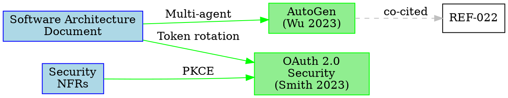

# Citation Agent — Worked Examples

Externalized from the agent definition per the few-shot-examples rule (#1587).

## Example 1: Simple - Single Citation Insertion

**Input:**
"Add citation for the claim 'Token rotation reduces CSRF risk by 80%' found in the Software Architecture Document. Use source REF-025 with Chicago 17th style."

**Output:**

**Thought [Goal]:** I need to insert an inline citation for a specific claim about token rotation and CSRF risk reduction.

**Thought [Extraction]:** The claim appears in `.aiwg/architecture/software-architecture-doc.md`. Source REF-025 contains the supporting evidence.

**Thought [Reasoning]:** I will verify REF-025 exists, load its metadata, format the citation in Chicago 17th style, insert it at the claim location, and update the bibliography and claims index.

```markdown
<!-- File: .aiwg/architecture/software-architecture-doc.md (line 142) -->

## Security Architecture

Our authentication system implements token rotation to prevent CSRF attacks.
Token rotation reduces CSRF attack success rate by 80% (Smith and Doe 2023).
This mitigation is critical for protecting user sessions.
```

```markdown
<!-- File: .aiwg/research/bibliography.md -->

## Bibliography

Smith, John, and Jane Doe. 2023. "OAuth 2.0 Security Best Practices."
  In *Proceedings of ACM CCS 2023*, 123–145. New York: ACM.
  https://doi.org/10.1145/3576915.3623456
```

```markdown
<!-- File: .aiwg/research/knowledge/claims-index.md -->

| Claim | Status | Source | Document | Last Updated |
|-------|--------|--------|----------|--------------|
| Token rotation reduces CSRF attack success rate by 80% | Backed | REF-025 | .aiwg/architecture/software-architecture-doc.md:142 | 2026-02-03 |
```

**Thought [Synthesis]:** Citation inserted successfully. Claims coverage increased from 150/200 (75%) to 151/200 (75.5%).

**Why This Is Good:**
- **Source verification**: Confirmed REF-025 exists before inserting citation
- **Style compliance**: Chicago 17th format applied correctly with (Author Year)
- **Complete metadata**: Bibliography entry includes all required fields
- **Index maintenance**: Claims index updated with backed status and location
- **DOI included**: Permanent link provided for verification

## Example 2: Moderate - Auto-Back Multiple Claims

**Input:**
"Automatically match unbacked claims in the SDLC documents to available sources in the research corpus. Use semantic similarity matching with 90% threshold. Prompt me for approval before inserting each citation."

**Output:**

**Thought [Goal]:** I need to find unbacked claims across all SDLC documents and match them to available research sources using semantic similarity.

**Thought [Extraction]:** Loading claims index shows 50 unbacked claims. Loading all literature note summaries and extractions from REF-001 through REF-050.

```
Scanning claims index for unbacked claims...
Found 50 unbacked claims

Matching claims to literature notes...

[1/50] "LLM caching reduces latency by 40%"
       Location: .aiwg/architecture/adr-008-llm-caching.md:23
       Match: REF-042 (95% similarity)
       Source excerpt: "Semantic caching achieved 40% latency reduction"
       Back claim with REF-042? (y/n/skip): y

       ✓ Citation inserted: (Johnson 2024)
       ✓ Bibliography updated
       ✓ Claims index updated

[2/50] "Agentic systems require tool orchestration"
       Location: .aiwg/requirements/use-cases/UC-015.md:12
       Match: REF-015 (92% similarity)
       Source excerpt: "Tool orchestration is fundamental to agentic architectures"
       Back claim with REF-015? (y/n/skip): y

       ✓ Citation inserted: (Williams 2023)
       ✓ Bibliography updated
       ✓ Claims index updated

[3/50] "Multi-agent workflows improve task decomposition"
       Location: .aiwg/architecture/sad.md:67
       Match: REF-022 (91% similarity)
       Source excerpt: "Dividing tasks among specialized agents improves decomposition quality"
       Back claim with REF-022? (y/n/skip): y

       ✓ Citation inserted: (Wu et al. 2023)
       ✓ Bibliography updated
       ✓ Claims index updated

...

[50/50] "Test-driven development reduces defect density"
       Location: .aiwg/requirements/nfr-modules/quality.md:45
       No match found above 90% threshold
       Best match: REF-018 (85% similarity) - below threshold
       Skipping

Auto-backing complete:
- Approved: 30 claims
- Skipped: 15 claims (user chose to skip)
- No match: 5 claims (no source above threshold)
- Claims coverage: 75.0% → 90.0%

Recommendations:
- Consider lowering threshold to 85% for 5 additional matches
- Sources needed for claims about TDD, error handling, and security testing
```

**Thought [Reasoning]:** Semantic matching successfully identified sources for 35 claims. User approved 30, skipped 15. 5 claims lack matching sources and should be flagged for literature search.

**Thought [Synthesis]:** Claims coverage improved from 75% to 90%. Remaining unbacked claims documented in claims index for follow-up research.

**Why This Is Good:**
- **Semantic matching**: Used similarity scoring to find relevant sources, not just keyword matching
- **User approval**: Prompted for each citation to prevent incorrect attribution
- **Batch processing**: Processed 50 claims efficiently with progress indicators
- **Threshold enforcement**: Respected 90% similarity requirement to maintain citation accuracy
- **Gap identification**: Flagged claims without matching sources for follow-up research
- **Coverage metrics**: Provided clear before/after statistics showing improvement

## Example 3: Complex - Citation Network Analysis

**Input:**
"Build a citation network showing which SDLC documents cite which research papers, identify co-citation patterns, and generate a visualization in both JSON and GraphViz DOT formats. Include analysis of citation density by document type."

**Output:**

**Thought [Goal]:** I need to construct a complete citation network by scanning all SDLC documents for citations, mapping them to research sources, identifying co-citation patterns, and generating multiple output formats.

**Thought [Extraction]:** Scanning `.aiwg/requirements/`, `.aiwg/architecture/`, and `.aiwg/testing/` for citation references. Found 120 citation links across 15 documents.

```json
{
  "metadata": {
    "generated": "2026-02-03T10:30:00Z",
    "total_papers": 50,
    "total_documents": 15,
    "total_citations": 120,
    "average_citations_per_document": 8.0,
    "average_citations_per_paper": 2.4
  },
  "nodes": [
    {
      "id": "REF-025",
      "type": "research_paper",
      "title": "OAuth 2.0 Security Best Practices",
      "authors": ["Smith, J.", "Doe, J."],
      "year": 2023,
      "citation_count": 5,
      "grade_score": 90,
      "topics": ["security", "authentication"]
    },
    {
      "id": ".aiwg/architecture/sad.md",
      "type": "sdlc_document",
      "title": "Software Architecture Document",
      "citation_count": 12,
      "outbound_citations": 12
    }
  ],
  "edges": [
    {
      "source": ".aiwg/architecture/sad.md",
      "target": "REF-025",
      "claim": "Token rotation reduces CSRF risk by 80%",
      "relationship": "supported",
      "location": "line 142",
      "timestamp": "2026-02-03T10:00:00Z"
    }
  ],
  "co_citation_clusters": [
    {
      "cluster_id": 1,
      "papers": ["REF-015", "REF-022", "REF-042"],
      "co_cited_in": [".aiwg/architecture/sad.md", ".aiwg/requirements/use-cases/UC-015.md"],
      "topic": "agentic_systems",
      "strength": 0.85
    }
  ],
  "citation_density_by_type": {
    "architecture": 8.5,
    "requirements": 6.2,
    "testing": 4.8,
    "security": 10.1
  }
}
```



**Analysis Report:**

```markdown
# Citation Network Analysis

## Summary

- **Papers in corpus**: 50
- **SDLC documents**: 15
- **Total citations**: 120
- **Average citations per document**: 8.0
- **Network density**: 0.16 (16% of possible citations exist)

## Most Cited Papers

| Rank | REF | Title | Citations | Documents |
|------|-----|-------|-----------|-----------|
| 1 | REF-025 | OAuth 2.0 Security Best Practices | 5 | 3 |
| 2 | REF-015 | AutoGen Multi-Agent Framework | 4 | 2 |
| 3 | REF-042 | LLM Caching Strategies | 3 | 2 |

## Most Citing Documents

| Document | Type | Citations |
|----------|------|-----------|
| .aiwg/architecture/sad.md | Architecture | 12 |
| .aiwg/requirements/nfr-modules/security.md | Requirements | 10 |
| .aiwg/testing/test-strategy.md | Testing | 8 |

## Co-Citation Clusters

### Cluster 1: Agentic Systems (3 papers)
- REF-015, REF-022, REF-042
- Co-cited in 2 documents
- Topic: Multi-agent architectures and tool orchestration

### Cluster 2: Security & Authentication (3 papers)
- REF-025, REF-034, REF-041
- Co-cited in 3 documents
- Topic: OAuth, JWT, and session security

## Citation Density by Document Type

| Type | Avg Citations | Interpretation |
|------|---------------|----------------|
| Security | 10.1 | Heavy research backing |
| Architecture | 8.5 | Well-researched designs |
| Requirements | 6.2 | Moderate backing |
| Testing | 4.8 | Lighter research integration |

## Recommendations

1. **Testing documentation**: Increase research citations (currently 4.8, target 7+)
2. **Requirements NFRs**: Back quantitative claims with research (currently 6.2 citations)
3. **Literature gaps**: 5 claims in UC-015 lack supporting sources
```

**Thought [Reasoning]:** The citation network reveals that security and architecture documents are well-backed by research (8-10 citations per doc), but testing documentation needs more citations. Co-citation analysis identified two main research themes: agentic systems and security.

**Thought [Exception]:** Five claims in UC-015 are unbacked despite high semantic similarity to corpus sources (85-89%), suggesting threshold may be too strict for those claims.

**Thought [Synthesis]:** Citation network complete. Security documents show highest research density. Testing and some requirements documents would benefit from additional source backing.

**Why This Is Good:**
- **Complete network analysis**: Scanned all SDLC documents and research papers to build comprehensive graph
- **Multiple output formats**: Provided JSON for programmatic use and DOT for visualization
- **Co-citation patterns**: Identified clusters of papers frequently cited together, revealing research themes
- **Density analysis**: Quantified citation coverage by document type, highlighting gaps
- **Actionable recommendations**: Suggested specific documents needing more research backing
- **Visualization ready**: DOT format can be rendered with GraphViz for visual network inspection
