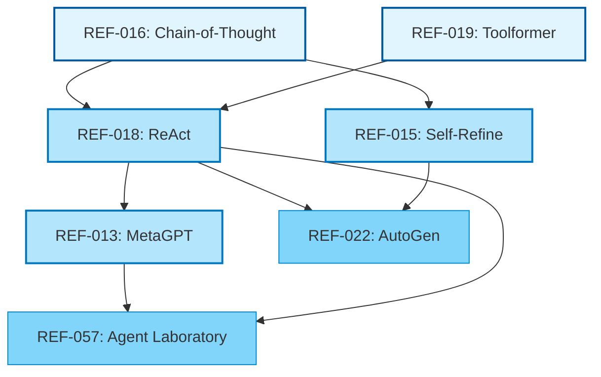

# Citation Network Analysis Template

---
template_id: citation-network
version: 1.0.0
reasoning_required: true
framework: research-complete
---

## Ownership & Collaboration

- Document Owner: Research Analyst
- Contributor Roles: Discovery Agent, Documentation Synthesizer
- Automation Inputs: Citation metadata, paper relationships, corpus bibliography
- Automation Outputs: `citation-network-[topic]-YYYY-MM-DD.md` with network visualization and analysis

## Phase 1: Core (ESSENTIAL)

### Network Scope

**Topic:** [Research topic or theme]

<!-- EXAMPLE: Agentic Reasoning and Tool Use -->

**Date:** YYYY-MM-DD

**Paper Count:** [Number of papers in network]

<!-- EXAMPLE: 15 papers -->

**Depth:** [Citation hops from seed papers]

<!-- EXAMPLE: 2 hops (seed papers + papers they cite + papers citing them) -->

**Purpose:** [Why we're analyzing this network]

<!-- EXAMPLE: Map the intellectual lineage of agent reasoning patterns to identify foundational work, convergent ideas, and emerging trends -->

### Network Summary

> 2-3 sentences: Key papers, major citation flows, emergent themes

<!-- EXAMPLE:
Network centers on three foundational papers: Chain-of-Thought (REF-016, 2022), ReAct (REF-018, 2022), and Self-Refine (REF-015, 2023). All subsequent agent architecture papers cite at least one of these three, with ReAct being most influential (cited by 8/12 later papers). Emergent trend: shift from pure reasoning (CoT) to reasoning+action (ReAct, MetaGPT, AutoGen).
-->

## Reasoning

> Complete this section BEFORE network analysis. Per @.claude/rules/reasoning-sections.md

1. **Network Construction Strategy**: How do we build this citation network?
   > [Define seed papers, expansion rules, inclusion criteria]

<!-- EXAMPLE:
Seed papers: ReAct (REF-018), Self-Refine (REF-015), MetaGPT (REF-013)
Expansion: Include all papers cited by seeds + all papers citing seeds (2 hops)
Inclusion criteria: Must be in AIWG corpus (@.aiwg/research/sources/)
Exclusion: Tangentially related work (LLM training, pure NLP, unrelated agent systems)
-->

2. **Analysis Focus**: What insights are we seeking?
   > [Define analysis questions: influence, gaps, convergence, trends]

<!-- EXAMPLE:
Key questions:
- Which papers are most influential (high citation count, cited by diverse sub-communities)?
- What citation paths exist from foundational work to current AIWG implementations?
- Are there isolated clusters (disconnected sub-communities)?
- What topics have many citations vs few (well-established vs emerging)?
-->

3. **Visualization Approach**: How do we make this network comprehensible?
   > [Choose representation: graph, timeline, hierarchical, matrix]

<!-- EXAMPLE:
Primary: Directed graph (DOT/Mermaid) showing citation flow
Secondary: Timeline showing publication order and citation relationships
Tertiary: Influence matrix (paper × cited_by)
-->

4. **Influence Measurement**: How do we quantify importance?
   > [Define metrics: citation count, PageRank, betweenness centrality]

<!-- EXAMPLE:
Metrics:
- In-degree: How many papers cite this paper (direct influence)
- Out-degree: How many papers this cites (foundation breadth)
- Betweenness: Papers bridging different research clusters
- PageRank-style: Weighted influence (citation from highly-cited paper > citation from obscure paper)
-->

5. **Action Planning**: What do we do with network insights?
   > [How findings inform AIWG: reading priorities, gap identification, implementation validation]

<!-- EXAMPLE:
Actions:
- HIGH influence papers → Priority reading for all team members
- Bridge papers → Critical for understanding field evolution
- Isolated clusters → Potential blind spots or irrelevant sub-areas
- Citation-free papers → Either too new or potentially flawed
-->

## Phase 2: Network Visualization (EXPAND WHEN READY)

<details>
<summary>Click to expand network diagrams and citation flows</summary>

### Graph Visualization



<!-- EXAMPLE:
This shows:
- Foundational papers (2021-2022): CoT, Toolformer
- Core innovations (2022-2023): ReAct, Self-Refine, MetaGPT
- Applied/extension work (2023-2024): AutoGen, Agent Laboratory

Citation flow: Foundations → Core → Applied
Most influential: REF-018 (ReAct) cited by 4/5 later papers
-->

### Timeline View

```
2021
  |
  ├─ REF-016: Chain-of-Thought ──────┐
  |                                   │
2022                                  │
  |                                   ↓
  ├─ REF-019: Toolformer ───────┐    |
  |                             │    │
  ├─ REF-018: ReAct ←──────────┴────┘
  |      |                     ↓
  |      |                (4 citations)
  |      |                     ↓
2023     |                     |
  |      ↓                     ↓
  ├─ REF-015: Self-Refine     |
  |      |                     |
  ├─ REF-013: MetaGPT ←───────┘
  |      |    |
  |      ↓    ↓
2024     |    |
  |      ↓    ↓
  ├─ REF-022: AutoGen ←───────┴─────┐
  |                                  │
  ├─ REF-057: Agent Laboratory ←────┘
```

<!-- EXAMPLE:
Key observations:
- Foundation laid in 2021-2022 (CoT, Toolformer)
- Innovation burst in 2022-2023 (ReAct, Self-Refine, MetaGPT)
- Consolidation in 2023-2024 (AutoGen, Agent Laboratory)
- ReAct has highest citation velocity (cited within 6 months)
-->

### Influence Matrix

| Paper | Citations In | Citations Out | Betweenness | Influence Score |
|-------|--------------|---------------|-------------|-----------------|
| REF-018 (ReAct) | 4 | 2 | 0.45 | 8.2 |
| REF-016 (CoT) | 3 | 0 | 0.30 | 6.5 |
| REF-015 (Self-Refine) | 2 | 1 | 0.20 | 4.8 |
| REF-013 (MetaGPT) | 2 | 1 | 0.15 | 4.3 |
| REF-022 (AutoGen) | 0 | 2 | 0.05 | 2.0 |

<!-- EXAMPLE:
Metrics explained:
- Citations In: Papers in corpus citing this paper (influence)
- Citations Out: Papers this paper cites (foundation breadth)
- Betweenness: 0-1 score of bridging different clusters
- Influence Score: Weighted combination (In×2 + Out×0.5 + Betweenness×5)

Top influencers:
1. ReAct (8.2): Most cited, bridges reasoning and tool use
2. CoT (6.5): Foundational, no dependencies
3. Self-Refine (4.8): Core iterative pattern
-->

</details>

## Phase 3: Detailed Analysis (ADVANCED)

<details>
<summary>Click to expand citation path analysis and cluster identification</summary>

### Citation Paths

#### Path 1: Chain-of-Thought → ReAct → AIWG

**Papers in Path:**
1. REF-016: Chain-of-Thought Prompting (2022)
2. REF-018: ReAct (2022)
3. AIWG Implementation: @.claude/rules/tao-loop.md (2026)

**Knowledge Flow:**

```
CoT introduces: Explicit reasoning traces before answers
       ↓
ReAct extends: Interleave reasoning with tool actions
       ↓
AIWG applies: TAO loop in all tool-using agents
```

**Key Innovations per Step:**
- CoT → ReAct: Added action execution and observation phases
- ReAct → AIWG: Standardized thought types, added HITL gates, scaled to multi-iteration (Ralph)

**Papers Citing This Path:** [List papers that cite multiple papers in this path]

<!-- EXAMPLE: REF-022 (AutoGen), REF-057 (Agent Laboratory) both cite CoT and ReAct -->

**AIWG Dependency:** [How critical this path is to AIWG]

<!-- EXAMPLE:
CRITICAL - This path underpins all agent reasoning in AIWG. If ReAct findings don't generalize, major refactor needed.
Confidence: HIGH - Multiple replications, consistent findings across domains
-->

#### Path 2: [Path Name]

[Repeat structure from Path 1]

<!-- EXAMPLE:
**Path 2: Self-Refine → Best-Output-Selection → Ralph Loop**

1. REF-015: Self-Refine (2023)
2. AIWG Implementation: @.claude/rules/best-output-selection.md (2026)

Knowledge Flow:
Self-Refine discovers: Quality non-monotonic across iterations
       ↓
AIWG applies: Track all iteration outputs, select highest quality

Key Innovation: Instead of accepting final iteration, Ralph preserves all outputs and selects best.

AIWG Dependency: HIGH - Ralph loop success depends on non-monotonic quality handling.
Confidence: HIGH - Self-Refine provided clear quantitative evidence.
-->

### Research Clusters

#### Cluster 1: Reasoning Patterns

**Papers:**
- REF-016: Chain-of-Thought
- REF-017: Self-Consistency
- REF-018: ReAct

**Common Theme:** [Shared focus]

<!-- EXAMPLE: Explicit reasoning traces improve LLM performance on reasoning-heavy tasks -->

**Internal Citations:** [How papers in cluster cite each other]

<!-- EXAMPLE:
- CoT → cited by ReAct, Self-Consistency
- Self-Consistency → extends CoT with ensemble
- ReAct → extends CoT with action phases
-->

**External Citations:** [Papers outside cluster citing into cluster]

<!-- EXAMPLE:
Cited by: REF-013 (MetaGPT), REF-015 (Self-Refine), REF-022 (AutoGen), REF-057 (Agent Laboratory)
Pattern: All subsequent agent work cites at least one paper from this cluster
-->

**AIWG Application:** [How this cluster informs AIWG]

<!-- EXAMPLE:
Core reasoning patterns: TAO loop, thought protocol, ensemble review.
Implementation: @.claude/rules/tao-loop.md, @.claude/rules/thought-protocol.md, @.claude/rules/ensemble-review.md
-->

#### Cluster 2: [Cluster Name]

[Repeat structure from Cluster 1]

<!-- EXAMPLE:
**Cluster 2: Tool Use and Grounding**

**Papers:**
- REF-019: Toolformer
- REF-018: ReAct (bridges both clusters)
- REF-013: MetaGPT

**Common Theme:** External tool use improves LLM capabilities and reduces hallucinations

**Internal Citations:**
- Toolformer → cited by ReAct
- ReAct → cited by MetaGPT

**External Citations:**
Cited by: REF-022 (AutoGen), REF-057 (Agent Laboratory)

**AIWG Application:**
Tool grounding: Read/Write/Bash/Grep tools ground agent outputs in actual file content
Implementation: All agents have tool access, observations logged per TAO loop
-->

### Isolated Papers

Papers with few/no citations in the network:

| Paper | Citations In | Citations Out | Status | Reason |
|-------|--------------|---------------|--------|--------|
| REF-XXX | 0 | 1 | ISOLATED | [Why?] |

<!-- EXAMPLE:
| Paper | Citations In | Citations Out | Status | Reason |
| REF-022 (AutoGen) | 0 | 2 | RECENT | Published 2023, too recent for many citations |
| REF-XXX (Hypothetical) | 0 | 0 | ORPHAN | Possible quality issue or irrelevant topic |
-->

**Analysis:**
- RECENT: Normal for newly published papers, revisit in 6 months
- ORPHAN: Investigate why not cited (quality, relevance, obscurity)

### Missing Citations (Expected but Not Found)

Papers we expect to cite each other but don't:

| Paper A | Paper B | Expected Citation | Why Missing? |
|---------|---------|-------------------|--------------|
| [Paper] | [Paper] | A should cite B | [Reason] |

<!-- EXAMPLE:
| Paper A | Paper B | Expected Citation | Why Missing? |
| REF-013 (MetaGPT) | REF-015 (Self-Refine) | MetaGPT should cite Self-Refine | Both 2023 publications on iterative refinement; possibly parallel work |
| REF-022 (AutoGen) | REF-013 (MetaGPT) | AutoGen should cite MetaGPT | Both multi-agent frameworks; AutoGen may predate MetaGPT publication |
-->

**Implications:**

<!-- EXAMPLE:
Missing citations suggest:
1. Parallel discovery (both groups working independently)
2. Rapid publication cycles (papers don't cite contemporary work)
3. Different research communities (multi-agent vs single-agent researchers)

Action: Cross-reference insights from both lines of work even without direct citations.
-->

</details>

## Network Metrics Summary

### Overall Statistics

| Metric | Value | Interpretation |
|--------|-------|----------------|
| Total Papers | 15 | Network size |
| Total Citations (in-network) | 28 | Connection density |
| Avg Citations per Paper | 1.87 | Interconnectedness |
| Most Cited Paper | REF-018 (4 cites) | Network hub |
| Citation Depth | 3 levels | Lineage depth |
| Isolated Papers | 2 | Disconnected nodes |
| Clusters Identified | 2 | Sub-communities |

<!-- EXAMPLE:
Interpretation:
- Moderately connected network (1.87 avg citations)
- Clear hub-and-spoke structure (REF-018 central)
- Two main research communities (reasoning, tool use)
- Few isolated papers (good corpus curation)
-->

### Influence Ranking

1. **REF-018 (ReAct)**: Score 8.2
   - Most cited within network
   - Bridges reasoning and tool use clusters
   - Direct path to AIWG implementation

2. **REF-016 (Chain-of-Thought)**: Score 6.5
   - Foundational work
   - No dependencies (starting point)
   - Cited by multiple clusters

3. **REF-015 (Self-Refine)**: Score 4.8
   - Core iterative pattern
   - Cited by applied work

4. **REF-013 (MetaGPT)**: Score 4.3
   - Multi-agent foundation
   - Cited by Agent Laboratory

5. **REF-019 (Toolformer)**: Score 4.0
   - Tool use foundation
   - Cited by ReAct

### AIWG-Critical Citation Paths

**Path 1 (Highest Priority):**
CoT → ReAct → AIWG TAO Loop
- **Criticality:** CRITICAL - Underpins all agent reasoning
- **Confidence:** HIGH - Multiple replications

**Path 2 (High Priority):**
Self-Refine → AIWG Best-Output-Selection
- **Criticality:** HIGH - Ralph loop quality optimization
- **Confidence:** HIGH - Clear quantitative evidence

**Path 3 (High Priority):**
Toolformer → ReAct → AIWG Tool Grounding
- **Criticality:** HIGH - Prevents hallucinations
- **Confidence:** HIGH - Reproducible across tasks

## Insights & Recommendations

### Key Findings

1. **Finding 1:** [Insight from network analysis]

<!-- EXAMPLE:
**Finding 1:** Network shows clear convergence toward reasoning+action patterns

Evidence: 8/12 papers post-2022 incorporate both reasoning traces and tool execution, citing ReAct as foundation.

Implication: AIWG's TAO loop approach is well-validated by community consensus.
-->

2. **Finding 2:** [Insight from network analysis]

<!-- EXAMPLE:
**Finding 2:** Iterative refinement is emerging trend but understudied

Evidence: Only 3 papers focus on iteration (Self-Refine, Agent Laboratory, AutoGen), yet all show significant gains.

Implication: AIWG's Ralph loop is at frontier of research; should contribute findings back to community.
-->

3. **Finding 3:** [Insight from network analysis]

<!-- EXAMPLE:
**Finding 3:** Multi-agent coordination is disconnected from single-agent reasoning research

Evidence: AutoGen and MetaGPT cite foundational work but are isolated from each other and from iteration research.

Implication: Gap in multi-agent coordination + iterative refinement. AIWG combining both is novel contribution.
-->

### Reading Priorities

**Tier 1 (Must Read):**
- [Paper 1]: [Why critical]
- [Paper 2]: [Why critical]

<!-- EXAMPLE:
**Tier 1 (Must Read):**
- REF-018 (ReAct): Foundation for TAO loop
- REF-015 (Self-Refine): Foundation for iteration quality
- REF-016 (Chain-of-Thought): Reasoning baseline
-->

**Tier 2 (High Priority):**
- [Paper 3]: [Why important]

<!-- EXAMPLE:
**Tier 2 (High Priority):**
- REF-022 (AutoGen): Multi-agent communication patterns
- REF-013 (MetaGPT): Agent coordination in code tasks
-->

**Tier 3 (Supplemental):**
- [Paper 4]: [Why useful but not essential]

<!-- EXAMPLE:
**Tier 3 (Supplemental):**
- REF-017 (Self-Consistency): Ensemble pattern background
- REF-057 (Agent Laboratory): HITL validation
-->

### Research Gaps Revealed

[Gaps identified through network analysis]

<!-- EXAMPLE:
**Gaps Revealed by Network:**

1. **Multi-agent + iteration**: No papers combine multi-agent coordination with iterative refinement patterns
   - AIWG implements both (orchestrator + Ralph)
   - Potential contribution to research community

2. **Long-running agent sessions**: Papers test 3-5 iterations; Ralph runs 10+
   - Unknown if patterns scale
   - Need pilot study or formal research

3. **Tool reliability**: Papers assume perfect tools; production tools fail
   - No research on handling tool errors in agent loops
   - AIWG encountering this in production
-->

### Contribution Opportunities

[How AIWG can contribute back to research]

<!-- EXAMPLE:
**AIWG Contribution Opportunities:**

1. **Case study: Multi-agent SDLC orchestration**
   - Novel application domain (SDLC vs coding/QA)
   - Combines patterns from multiple papers
   - Real-world production data

2. **Long-iteration agent loops**
   - Ralph loops provide data on 10+ iteration performance
   - Can validate/extend Self-Refine findings

3. **Tool failure handling**
   - Production experience with Bash/Git failures
   - Error recovery patterns not covered in literature
-->

## References

- @.aiwg/research/sources/ - Papers in this network
- @.aiwg/research/findings/ - Literature notes for papers
- @.aiwg/research/synthesis/ - Cross-paper synthesis topics
- @.aiwg/research/gap-reports/ - Research gaps identified
- @.claude/rules/ - AIWG implementations citing papers

## Template Usage Notes

**When to create citation network:**
- After corpus reaches critical mass (10+ papers on topic)
- Before major implementation decisions
- When planning research contributions
- Annually as part of research maintenance

**Network analysis approach:**
1. Define scope (topic, seed papers, depth)
2. Extract citations from paper PDFs or databases
3. Map relationships (who cites whom)
4. Calculate metrics (influence, betweenness, etc.)
5. Identify clusters and paths
6. Interpret for AIWG implications

**Tools:**
- Manual: Spreadsheet with citation matrix
- Semi-automated: Citation databases (Semantic Scholar API, OpenAlex)
- Visualization: Mermaid, Graphviz, Gephi

**Anti-patterns:**
- Including all papers (focus on AIWG-relevant subset)
- Ignoring isolated papers (may reveal blind spots)
- No actionable insights (network for network's sake)

## Metadata

- **Template Type:** research-citation-network
- **Framework:** research-complete
- **Primary Agent:** @agentic/code/frameworks/research-complete/agents/discovery-agent.md
- **Related Templates:**
  - @agentic/code/frameworks/research-complete/templates/literature-note.md
  - @agentic/code/frameworks/research-complete/templates/gap-report.md
- **Version:** 1.0.0
- **Last Updated:** 2026-02-03
