# Data Flow Diagram Template

## Metadata

- ID: DES-DFD-`id`
- Owner: `name/role/team`
- Contributors: `list`
- Reviewers: `list`
- Team: `team`
- Stakeholders: `list`
- Status: `draft/in-progress/blocked/approved/done`
- Dates: created `YYYY-MM-DD` / updated `YYYY-MM-DD` / due `YYYY-MM-DD`
- Related: REQ-`id`, DES-`id`, IFC-`id`, DB-`id`, SEC-`id`, ADR-`id`
- Links: `paths/urls`

## Related Templates

- docs/sdlc/templates/analysis-design/interface-contract-card.md
- docs/sdlc/templates/analysis-design/database-design-template.md
- docs/sdlc/templates/analysis-design/component-design-card.md
- docs/sdlc/templates/security/threat-model-template.md

## Diagram Purpose

### Context

- **System**: `name of system being documented`
- **Scope**: `full system/subsystem/feature`
- **Perspective**: `logical/physical/deployment`
- **Audience**: `developers/architects/security/operations`

### Objectives

**Primary Goal**: `what this diagram communicates`

**Key Questions Answered**:
1. What data flows through the system?
2. Where does data originate and terminate?
3. How is data transformed along the way?
4. What are the security boundaries?
5. Where are the integration points?

## Diagram Levels

### Level 0 - Context Diagram

**Purpose**: System boundary and external interactions

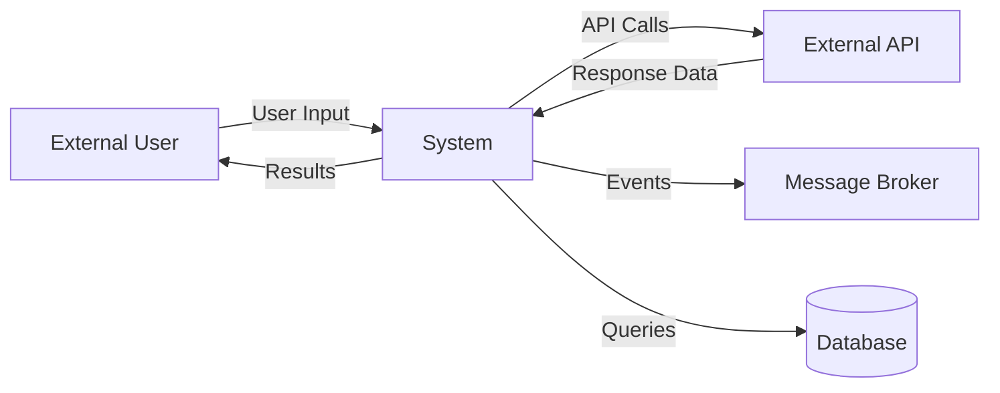

**External Entities**:

| Entity | Type | Description | Data Exchanged |
| ------ | ---- | ----------- | -------------- |
| External User | Human | End user of system | User requests, responses |
| External API | System | Third-party service | API requests, responses |
| Message Broker | Infrastructure | Event bus | Event messages |
| Database | Infrastructure | Data store | Queries, results |

**System Boundary**:
- What is inside the system: `components owned and controlled`
- What is outside the system: `external dependencies`

### Level 1 - Major Components

**Purpose**: Primary subsystems and data flows between them

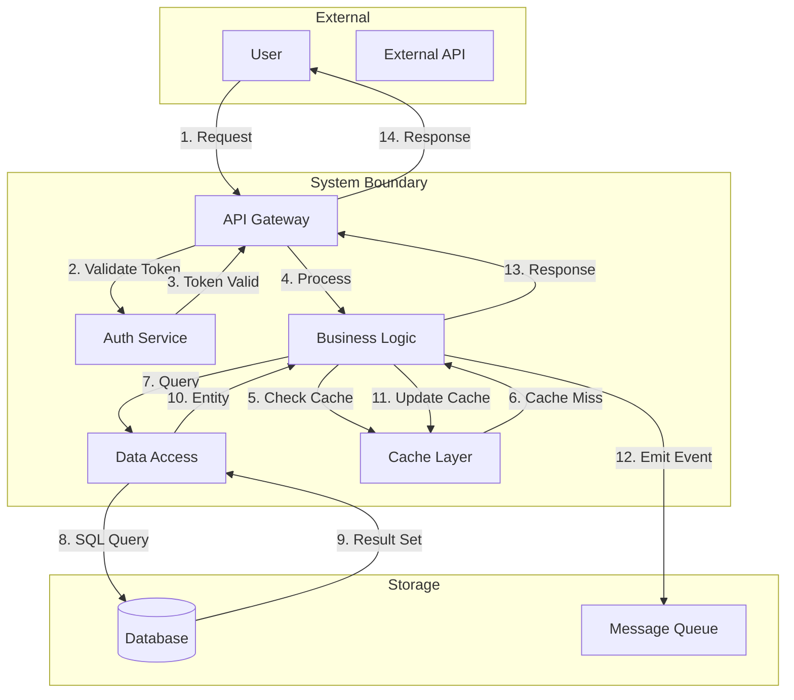

**Component Responsibilities**:

| Component | Data Inputs | Data Processing | Data Outputs |
| --------- | ----------- | --------------- | ------------ |
| API Gateway | HTTP requests | Routing, rate limiting | Routed requests |
| Auth Service | Tokens | Token validation | Auth results |
| Business Logic | Requests, entities | Business rules | Responses, events |
| Data Access | Entity requests | ORM mapping | Entities |
| Cache Layer | Keys | Lookup, store | Cached values |

### Level 2 - Detailed Flows

**Purpose**: Detailed data transformations within components

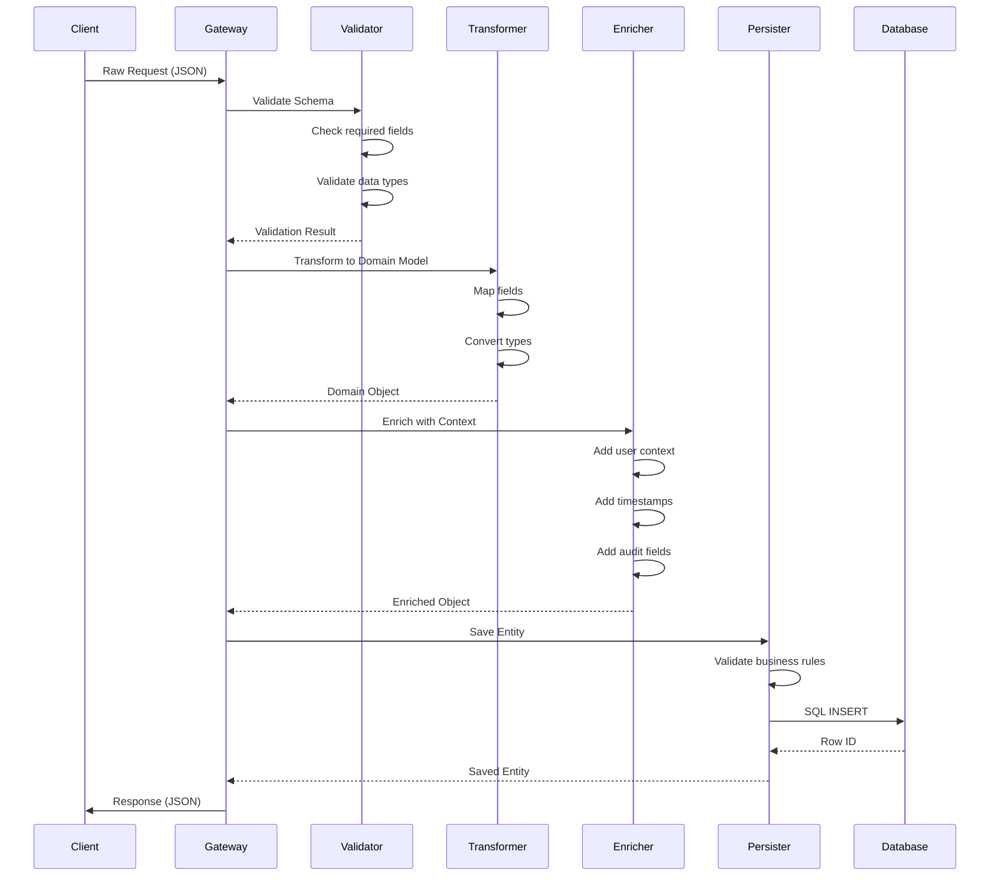

**Data Transformation Points**:

| Stage | Input Format | Transformation | Output Format | Validation |
| ----- | ------------ | -------------- | ------------- | ---------- |
| Request Validation | Raw JSON | Schema check | Validated JSON | JSON Schema |
| Domain Mapping | JSON | Field mapping | Domain object | Business rules |
| Enrichment | Domain object | Add context | Enriched object | Completeness |
| Persistence | Enriched object | SQL mapping | Database row | Constraints |
| Response Mapping | Domain object | DTO mapping | Response JSON | Schema |

## Data Stores

### Data Store Catalog

| Store | Type | Purpose | Data Pattern | Access Pattern |
| ----- | ---- | ------- | ------------ | -------------- |
| Primary DB | Relational | Transactional data | Normalized tables | Read/Write |
| Cache | Key-Value | Hot data | Denormalized | Read-mostly |
| Event Log | Append-only | Audit trail | Time-series | Write-only |
| Search Index | Document | Full-text search | Denormalized docs | Read-only |

### Data Flow to/from Stores

**Write Patterns**:

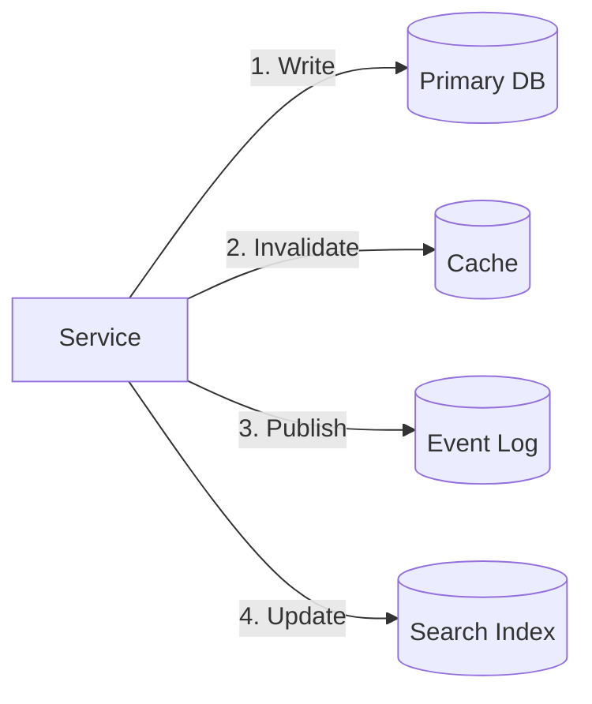

**Read Patterns**:

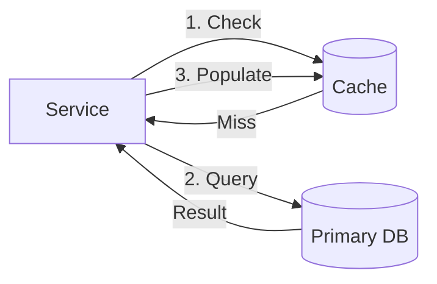

## Data Transformation Specifications

### Transformation Catalog

#### Transformation: `TransformationName`

**Purpose**: `what this transformation achieves`

**Trigger**: `when this transformation occurs`

**Input Schema**:
```text
{
  field1: type,
  field2: type,
  nested: {
    subfield: type
  }
}
```

**Transformation Logic**:
1. **Field Mapping**: `input.field1 → output.targetField`
2. **Type Conversion**: `string to datetime`
3. **Calculation**: `derived fields and formulas`
4. **Enrichment**: `data added from other sources`
5. **Filtering**: `data excluded based on criteria`

**Output Schema**:
```text
{
  targetField: type,
  calculatedField: type,
  enrichedField: type
}
```

**Data Quality Rules**:
- Null handling: `default values/reject/pass through`
- Validation: `constraints and rules`
- Error handling: `logging/retry/dead letter`

### Aggregation Patterns

| Aggregation | Source | Logic | Destination | Frequency |
| ----------- | ------ | ----- | ----------- | --------- |
| Daily Totals | Transaction Log | SUM(amount) GROUP BY day | Reporting DB | Nightly |
| User Metrics | Activity Events | COUNT(*) GROUP BY user | User Profile | Real-time |
| Analytics Rollup | Event Stream | Complex aggregation | Data Warehouse | Hourly |

## Integration Points

### External System Interfaces

| System | Direction | Protocol | Data Format | Authentication |
| ------ | --------- | -------- | ----------- | -------------- |
| Payment Gateway | Outbound | REST | JSON | API Key |
| Email Service | Outbound | SMTP | MIME | Password |
| Analytics Platform | Outbound | Event Stream | JSON | Token |
| Identity Provider | Inbound | SAML | XML | Certificate |

### Integration Data Flows

#### Integration: `SystemName`

**Data Flow Direction**: `inbound/outbound/bidirectional`

**Flow Pattern**:
```text
Our System → [Transform] → [Protocol] → External System
           ← [Transform] ← [Protocol] ← External System
```

**Request Flow**:
1. Internal data model
2. Transform to external format
3. Apply protocol (HTTP, message queue, etc.)
4. Send to external system
5. Await response/acknowledgment

**Response Flow**:
1. Receive external response
2. Parse protocol
3. Transform to internal format
4. Validate data
5. Process internally

**Error Handling**:
- Timeout behavior: `duration and fallback`
- Retry policy: `attempts, backoff, conditions`
- Circuit breaker: `failure threshold and recovery`
- Fallback strategy: `cached data/default values/error response`

## Security Boundaries

### Trust Zones

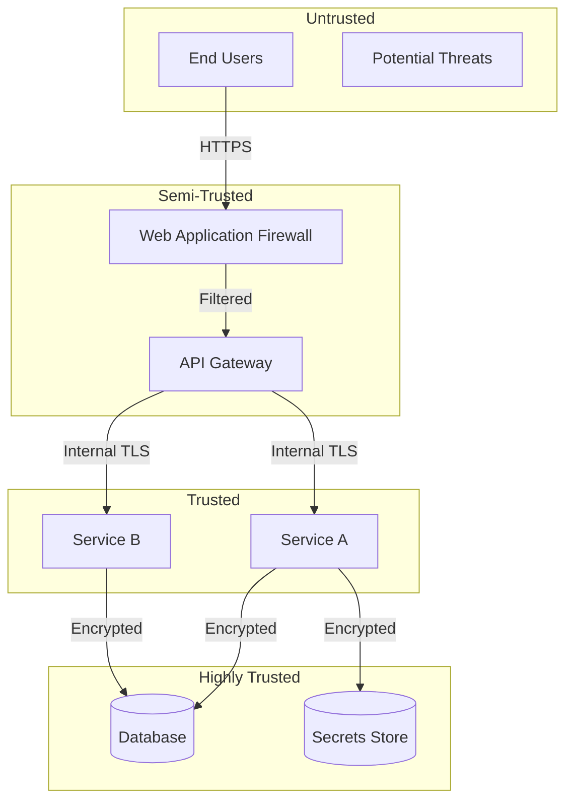

### Data Security Flows

| Data Classification | At Rest | In Transit | In Processing | Audit |
| ------------------- | ------- | ---------- | ------------- | ----- |
| Public | None | TLS | None | No |
| Internal | Encrypted | TLS | Memory only | Basic |
| Confidential | Encrypted | TLS + cert pinning | Encrypted memory | Full |
| Secret | HSM/KMS | mTLS | Secure enclave | Immutable |

### Security Control Points

| Control Point | Type | Purpose | Data Inspection | Actions |
| ------------- | ---- | ------- | --------------- | ------- |
| WAF | Perimeter | Block attacks | Full payload | Block/Log/Alert |
| API Gateway | Edge | Rate limiting, auth | Headers + metadata | Throttle/Reject |
| Service Firewall | Internal | Service isolation | Connection metadata | Allow/Deny |
| Database Firewall | Data | SQL injection | Query structure | Block/Alert |

## Event-Driven Flows

### Event Catalog

| Event | Producer | Consumers | Payload | Delivery Guarantee |
| ----- | -------- | --------- | ------- | ------------------ |
| UserCreated | User Service | Notification, Analytics | User ID, email | At-least-once |
| OrderPlaced | Order Service | Inventory, Fulfillment | Order details | Exactly-once |
| PaymentFailed | Payment Service | Notification, Fraud | Payment ID, reason | At-least-once |

### Event Flow Patterns

#### Publish-Subscribe

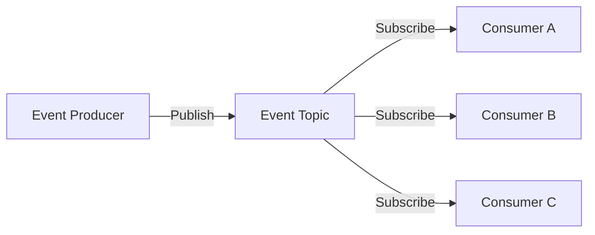

#### Event Sourcing

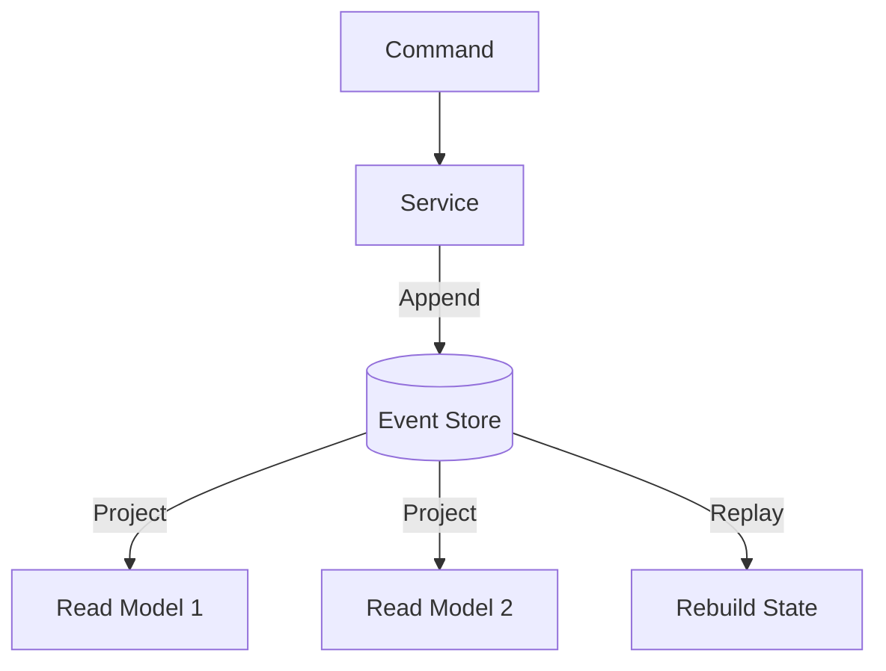

### Event Data Flow

**Event Structure**:
```text
{
  metadata: {
    eventId: uuid,
    eventType: string,
    timestamp: datetime,
    version: string,
    correlationId: uuid,
    causationId: uuid
  },
  payload: {
    ...business data
  }
}
```

**Processing Flow**:
1. Producer creates event
2. Publish to message broker
3. Broker routes to subscribers
4. Consumer receives event
5. Consumer processes (idempotently)
6. Consumer acknowledges
7. Update read models

## Batch Processing Flows

### Batch Job Catalog

| Job | Schedule | Source | Destination | Volume | Duration |
| --- | -------- | ------ | ----------- | ------ | -------- |
| Daily Export | 02:00 UTC | Production DB | Data Warehouse | 1M records | 30 min |
| Report Generation | Hourly | Event Log | Report Storage | 100K events | 5 min |
| Data Cleanup | Weekly | All tables | Archive | Variable | 2 hours |

### Batch Flow Pattern

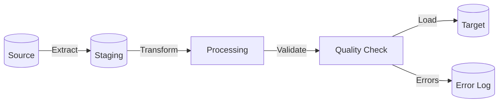

**Batch Processing Steps**:
1. **Extract**: Read from source systems
2. **Stage**: Write to temporary storage
3. **Transform**: Apply business logic
4. **Validate**: Check data quality
5. **Load**: Write to destination
6. **Reconcile**: Verify record counts
7. **Archive**: Move to cold storage
8. **Cleanup**: Remove temporary data

## Monitoring Data Flows

### Observability Data

| Data Type | Source | Collection Method | Destination | Retention |
| --------- | ------ | ----------------- | ----------- | --------- |
| Metrics | All services | Push to collector | Metrics DB | 90 days |
| Logs | All services | Log shipper | Log aggregator | 30 days |
| Traces | All services | Trace agent | Trace backend | 7 days |
| Audit | Critical operations | Event stream | Audit store | 7 years |

### Telemetry Flow

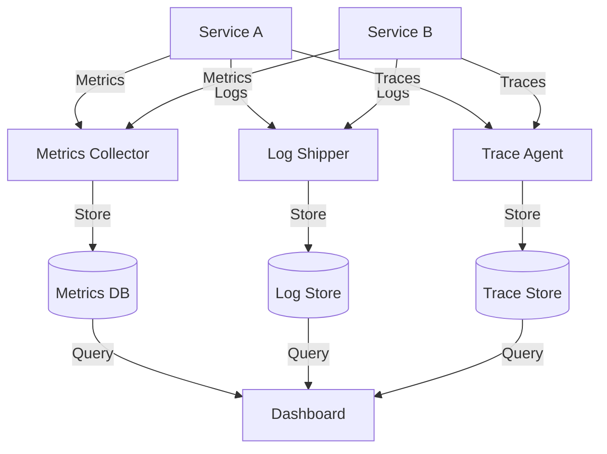

## Data Flow Validation

### Consistency Checks

| Check | Frequency | Method | Tolerance |
| ----- | --------- | ------ | --------- |
| Record Count | Per batch | Compare source/destination | 0% variance |
| Data Integrity | Sampling | Hash comparison | 0% corruption |
| Referential Integrity | Daily | FK validation | 0% orphans |
| Business Rules | Real-time | Rule engine | 0% violations |

### Reconciliation Process

1. **Extract counts**: Source and destination
2. **Compare totals**: Identify discrepancies
3. **Identify gaps**: Missing records
4. **Root cause analysis**: Why gaps exist
5. **Remediation**: Replay or manual fix
6. **Verification**: Confirm resolution

## Performance Characteristics

### Flow Throughput

| Flow | Expected Volume | Peak Volume | Latency Target | Bottleneck |
| ---- | --------------- | ----------- | -------------- | ---------- |
| User Login | 100/sec | 500/sec | <100ms | Auth Service |
| Order Creation | 10/sec | 50/sec | <500ms | Database |
| Batch Export | 1M/hour | N/A | <60 min | Network |
| Event Processing | 1000/sec | 5000/sec | <10ms | Message Broker |

### Data Volume Projections

| Data Flow | Current | Year 1 | Year 3 | Growth Strategy |
| --------- | ------- | ------ | ------ | --------------- |
| User Requests | 1M/day | 10M/day | 100M/day | Horizontal scaling |
| Database Writes | 100K/day | 1M/day | 10M/day | Sharding |
| Event Messages | 1M/day | 10M/day | 100M/day | Partitioning |
| Log Volume | 10GB/day | 100GB/day | 1TB/day | Compression, sampling |

## Error Handling Flows

### Error Propagation

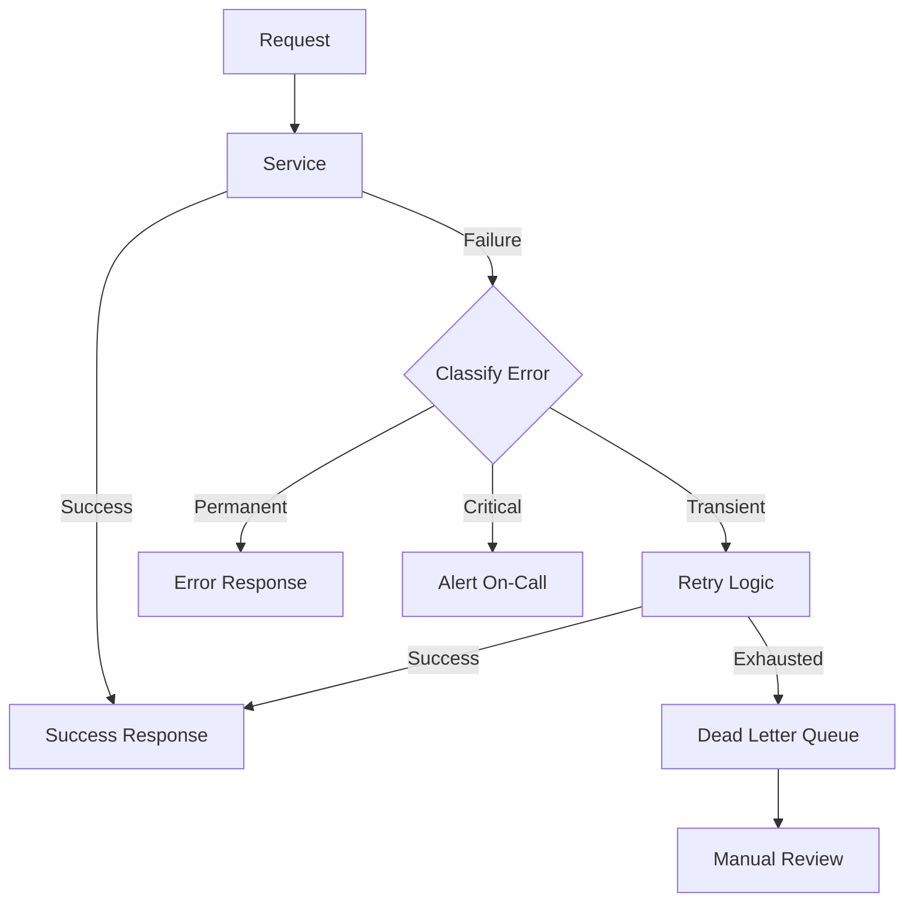

### Error Handling Strategy

| Error Type | Detection | Handling | Notification | Recovery |
| ---------- | --------- | -------- | ------------ | -------- |
| Validation Error | Input check | Reject with details | None | Client fixes |
| Transient Error | Timeout, 5xx | Retry with backoff | Log | Automatic |
| Data Error | Business rule | Dead letter queue | Alert | Manual |
| System Error | Exception | Circuit breaker | Page on-call | Restart |

## Documentation and Diagrams

### Diagram Maintenance

- **Update Frequency**: `on each significant change`
- **Version Control**: `track in git with code`
- **Review Process**: `architecture review board`
- **Validation**: `ensure diagrams match implementation`

### Supporting Documentation

- **Data Dictionary**: Field definitions and semantics
- **Transformation Rules**: Detailed mapping specifications
- **Integration Guides**: How to connect to each interface
- **Troubleshooting**: Common issues and resolutions

## Validation Checklist

- [ ] All external entities identified
- [ ] System boundary clearly defined
- [ ] All major data flows documented
- [ ] Data transformations specified
- [ ] Security boundaries marked
- [ ] Integration points detailed
- [ ] Error handling flows included
- [ ] Performance characteristics noted
- [ ] Monitoring data flows covered
- [ ] Diagrams are up to date
- [ ] Related documentation linked

## Appendices

### A. Detailed Flow Examples

[Specific flow scenarios with sample data]

### B. Data Format Specifications

[Detailed schemas for all data formats]

### C. Integration Sequence Diagrams

[Step-by-step integration flows]

### D. Performance Test Results

[Actual throughput and latency measurements]