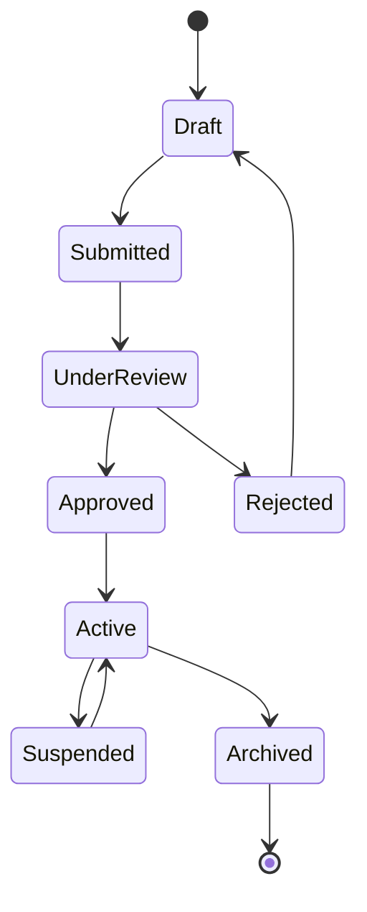

# Interface Contract Card

## Metadata

- ID: DES-IFC-`id`
- Owner: `name/role/team`
- Contributors: `list`
- Reviewers: `list`
- Team: `team`
- Stakeholders: `list`
- Status: `draft/in-progress/blocked/approved/done`
- Dates: created `YYYY-MM-DD` / updated `YYYY-MM-DD` / due `YYYY-MM-DD`
- Related: UC-`id`, REQ-`id`, DES-`id`, DATA-`id`, TEST-`id`, ADR-`id`
- Links: `paths/urls`

## Related Templates

- docs/sdlc/templates/requirements/data-contract-template.md
- docs/sdlc/templates/requirements/use-case-acceptance-template.md
- docs/sdlc/templates/analysis-design/sequence-diagram-template.md
- docs/sdlc/templates/analysis-design/component-design-card.md

## Interface Identity

### Service Context

- Service Name: `name of providing service`
- Service Domain: `business domain/bounded context`
- Interface Name: `specific interface identifier`
- Interface Type: `synchronous/asynchronous/streaming/batch`
- Communication Style: `request-response/publish-subscribe/fire-forget`

### Ownership Model

- Provider Team: `team responsible for interface`
- Provider Contact: `email/slack/teams channel`
- Consumer Teams: `list of known consumers`
- Consumer Contacts: `consumer team contacts`
- Governance Model: `provider-driven/consumer-driven/collaborative`

## Interface Purpose

### Business Capability

**Primary Function**: `one-line description of business capability`

**Business Value**:
- What business process does this enable?
- What problem does it solve?
- What outcomes does it deliver?

### Use Cases

| Use Case | Actor | Scenario | Frequency |
| -------- | ----- | -------- | --------- |
| UC-001 | User Service | Retrieve user profile | 1000/sec |
| UC-002 | Order Service | Update user preferences | 100/sec |
| UC-003 | Analytics | Batch user export | Daily |

### Interface Boundaries

**In Scope**:
- Specific operations provided
- Data domains covered
- Business rules enforced

**Out of Scope**:
- Operations not provided
- Data domains excluded
- Responsibilities of consumers

## Contract Specification

### Operation Catalog

#### Operation: `OperationName`

**Business Purpose**: `what business function this serves`

**Operation Type**: `query/command/event/stream`

**Request Pattern**: `request-response/async/streaming`

##### Request Specification

**Input Parameters**:

| Parameter | Type | Required | Constraints | Description |
| --------- | ---- | -------- | ----------- | ----------- |
| id | identifier | Yes | Valid UUID | Resource identifier |
| filter | object | No | See schema | Query filters |
| page | integer | No | 1-1000 | Page number |
| size | integer | No | 1-100, default=20 | Page size |

**Request Headers**:

| Header | Required | Format | Purpose |
| ------ | -------- | ------ | ------- |
| Authorization | Yes | Bearer {token} | Authentication |
| Request-Id | Yes | UUID | Request tracking |
| Accept-Language | No | RFC 5646 | Localization |
| Idempotency-Key | Conditional | UUID | Duplicate prevention |

**Request Body Schema**:

```text
Schema Structure:
{
  field1: string, required, min=1, max=255
  field2: number, required, min=0
  nested: {
    subfield1: boolean, required
    subfield2: array<string>, optional, max_items=10
  }
}

Validation Rules:
- field1 must be unique in system
- field2 + nested.subfield1 must satisfy business rule X
- At least one of [fieldA, fieldB] must be provided
```

##### Response Specification

**Success Response**:

```text
Status: 200 OK / 201 Created / 204 No Content

Headers:
- Content-Type: application/json
- Cache-Control: max-age=300
- ETag: "resource-version"
- X-Rate-Limit-Remaining: 999

Body Structure:
{
  data: {
    id: identifier
    ...resource fields
  },
  metadata: {
    version: string
    timestamp: datetime
    links: {
      self: uri
      related: [uris]
    }
  }
}
```

**Error Response Structure**:

```text
Status: 4xx/5xx

Body:
{
  error: {
    code: "SPECIFIC_ERROR_CODE",
    message: "Human-readable description",
    details: {
      field: "field_name",
      constraint: "validation_failed",
      provided: "actual_value",
      required: "expected_format"
    },
    timestamp: "ISO-8601",
    traceId: "correlation-id",
    helpUrl: "link-to-documentation"
  }
}
```

##### Operation Characteristics

- **Idempotency**: `yes/no - behavior on duplicate requests`
- **Pagination**: `offset/cursor/keyset based`
- **Filtering**: `supported parameters and operators`
- **Sorting**: `sortable fields and default order`
- **Field Selection**: `sparse fieldsets support`
- **Bulk Support**: `single/batch processing capabilities`

### Data Contracts

#### Input Data Contract

**Schema Definition**:

| Field | Type | Constraints | Semantics |
| ----- | ---- | ----------- | --------- |
| email | string | RFC 5322 | User email address |
| amount | decimal | >0, 2 decimal places | Transaction amount |
| timestamp | datetime | ISO 8601, UTC | Event occurrence time |
| status | enum | [active, inactive, pending] | Record state |

**Validation Rules**:
1. Cross-field validations
2. Business rule constraints
3. Referential integrity requirements

#### Output Data Contract

**Schema Definition**:

| Field | Type | Always Present | Semantics |
| ----- | ---- | -------------- | --------- |
| id | identifier | Yes | Unique resource ID |
| created_at | datetime | Yes | Creation timestamp |
| updated_at | datetime | Yes | Last modification |
| _embedded | object | No | Related resources |

**Data Guarantees**:
- Fields that are always populated
- Fields that may be null/empty
- Computed fields and their derivation

### Error Catalog

#### Error Classification

| Category | HTTP Status Range | Retry Behavior | Client Action |
| -------- | ----------------- | -------------- | ------------- |
| Client Errors | 400-499 | Do not retry | Fix request |
| Server Errors | 500-599 | Retry with backoff | Wait and retry |
| Rate Limiting | 429 | Retry after delay | Honor retry-after |

#### Specific Error Codes

| Code | HTTP Status | Description | Recovery Strategy |
| ---- | ----------- | ----------- | ----------------- |
| VALIDATION_ERROR | 400 | Request validation failed | Fix input data |
| UNAUTHORIZED | 401 | Authentication required | Provide credentials |
| FORBIDDEN | 403 | Insufficient permissions | Check authorization |
| NOT_FOUND | 404 | Resource does not exist | Verify identifier |
| CONFLICT | 409 | Resource state conflict | Resolve conflict |
| GONE | 410 | Resource permanently deleted | Do not retry |
| PRECONDITION_FAILED | 412 | Optimistic lock failure | Refresh and retry |
| RATE_LIMITED | 429 | Too many requests | Backoff and retry |
| INTERNAL_ERROR | 500 | Unexpected server error | Retry with backoff |
| NOT_IMPLEMENTED | 501 | Feature not available | Use alternative |
| SERVICE_UNAVAILABLE | 503 | Temporary unavailability | Retry with backoff |

### State Management

#### Resource States



#### State Transition Rules

| From State | To State | Trigger | Conditions | Side Effects |
| ---------- | -------- | ------- | ---------- | ------------ |
| Draft | Submitted | submit() | All required fields | Notification sent |
| Submitted | UnderReview | assign() | Reviewer available | Lock for editing |
| UnderReview | Approved | approve() | Meets criteria | Update timestamp |

## Non-Functional Requirements

### Performance SLAs

#### Latency Targets

| Operation | P50 | P95 | P99 | P99.9 | Measurement Point |
| --------- | --- | --- | --- | ----- | ----------------- |
| Read Single | 10ms | 50ms | 100ms | 500ms | API Gateway |
| Read List | 50ms | 200ms | 500ms | 1s | API Gateway |
| Write | 30ms | 100ms | 200ms | 1s | API Gateway |
| Bulk Operation | 500ms | 2s | 5s | 10s | API Gateway |

#### Throughput Targets

| Operation | Sustained | Peak | Burst Duration | Throttling |
| --------- | --------- | ---- | -------------- | ---------- |
| Read | 1000 req/s | 2000 req/s | 60 seconds | Gradual |
| Write | 100 req/s | 500 req/s | 10 seconds | Immediate |
| Bulk | 10 req/s | 50 req/s | 5 seconds | Queue |

### Reliability Requirements

#### Availability Targets

- **Overall SLA**: `99.9% monthly (43 minutes downtime)`
- **Maintenance Windows**: `Sundays 02:00-06:00 UTC`
- **Degraded Mode**: `read-only during maintenance`

#### Resilience Patterns

| Pattern | Implementation | Trigger | Behavior |
| ------- | -------------- | ------- | -------- |
| Circuit Breaker | After 5 failures in 60s | Error rate >10% | Fail fast for 30s |
| Retry | Exponential backoff | 5xx errors, timeouts | Max 3 attempts |
| Timeout | Request timeout | No response | Abort after 5s |
| Bulkhead | Connection pooling | Resource exhaustion | Isolate failures |
| Rate Limiting | Token bucket | Exceeds quota | Return 429 |

### Scalability Characteristics

#### Scaling Dimensions

| Dimension | Current | Target | Strategy |
| --------- | ------- | ------ | -------- |
| Concurrent Connections | 1000 | 10000 | Connection pooling |
| Data Volume | 1GB | 100GB | Partitioning |
| Request Rate | 100/s | 10000/s | Horizontal scaling |
| Response Size | 1MB | 10MB | Pagination |

#### Resource Limits

| Resource | Limit | Behavior When Exceeded |
| -------- | ----- | ---------------------- |
| Request Size | 10MB | Return 413 |
| Response Size | 50MB | Paginate required |
| Query Complexity | 100 joins | Return 400 |
| Batch Size | 1000 items | Return 400 |
| Connection Duration | 5 minutes | Close connection |

### Security Requirements

#### Authentication Schemes

| Scheme | Use Case | Token Lifetime | Refresh Strategy |
| ------ | -------- | -------------- | ---------------- |
| Bearer Token | User requests | 1 hour | Refresh token |
| API Key | Service-to-service | No expiry | Rotation quarterly |
| mTLS | High security | Certificate based | Annual renewal |
| HMAC Signature | Webhooks | Per request | Key rotation |

#### Authorization Model

**Access Control Type**: `RBAC/ABAC/PBAC/ACL`

**Permission Matrix**:

| Role | Create | Read | Update | Delete | Admin |
| ---- | ------ | ---- | ------ | ------ | ----- |
| admin | Yes | Yes | Yes | Yes | Yes |
| user | Own only | Own only | Own only | No | No |
| service | Yes | Yes | Yes | No | No |
| readonly | No | Yes | No | No | No |

#### Data Protection

- **Encryption in Transit**: `TLS 1.3 minimum`
- **Encryption at Rest**: `AES-256`
- **PII Handling**: `field-level encryption, masking in logs`
- **Audit Logging**: `all write operations, sensitive reads`

## Interface Evolution

### Versioning Strategy

#### Version Scheme

- **Format**: `major.minor.patch (e.g., 2.1.3)`
- **Major**: Breaking changes
- **Minor**: Backward compatible features
- **Patch**: Backward compatible fixes

#### Version Negotiation

**Request Version**:
- Header: `API-Version: 2.1`
- URL: `/v2/resource`
- Query: `?version=2.1`
- Content-Type: `application/vnd.api+json;version=2.1`

**Response Version**:
- Header: `API-Version: 2.1`
- Deprecation: `Deprecation: true`
- Sunset: `Sunset: Sat, 31 Dec 2024 23:59:59 GMT`

### Compatibility Rules

#### Backward Compatible Changes

- Adding optional request parameters
- Adding response fields
- Adding new operations
- Adding new error codes
- Relaxing validation rules

#### Breaking Changes

- Removing/renaming fields
- Changing field types
- Tightening validation
- Removing operations
- Changing error semantics

### Deprecation Process

1. **Announcement**: 6 months notice minimum
2. **Migration Guide**: Detailed upgrade instructions
3. **Dual Support**: Both versions available
4. **Monitoring**: Track version usage
5. **Sunset**: Remove after migration complete

## Testing & Validation

### Contract Testing Strategy

#### Test Categories

| Category | Purpose | Frequency | Automation |
| -------- | ------- | --------- | ---------- |
| Schema Validation | Verify structure | Every build | Yes |
| Business Rules | Validate logic | Every build | Yes |
| Integration | End-to-end flow | Daily | Yes |
| Performance | Meet SLAs | Weekly | Yes |
| Security | Vulnerability scan | Weekly | Yes |
| Compatibility | Version testing | Release | Yes |

#### Test Data Requirements

**Synthetic Data**:
- Cover all field types and ranges
- Include edge cases and boundaries
- Maintain referential integrity
- Support performance testing volumes

**Test Scenarios**:
1. Happy path for each operation
2. Error conditions for each error code
3. Boundary conditions for all constraints
4. Concurrent access patterns
5. State transition coverage

### Mock Service Specification

**Mock Capabilities**:
- Static responses for development
- Dynamic scenarios for testing
- Error injection for resilience
- Latency simulation for performance
- State management for workflows

**Mock Endpoints**:
- Base URL: `https://mock.service.example/v1`
- Reset: `POST /mock/reset`
- Scenario: `POST /mock/scenario/{name}`
- Verify: `GET /mock/verify`

## Client Integration Guide

### Integration Patterns

#### Synchronous Integration

```text
Client Request → API Gateway → Service → Response
                      ↓
                Load Balancer → Instance Pool
```

#### Asynchronous Integration

```text
Client Request → Message Queue → Service Processor
         ↓                            ↓
    Correlation ID              Callback/Webhook
```

### Client Best Practices

#### Request Construction

1. **Always include required headers**: Request-Id, Authorization
2. **Use idempotency keys**: For non-idempotent operations
3. **Implement pagination**: For list operations
4. **Handle partial responses**: Check response completeness

#### Response Handling

1. **Check status codes first**: Handle errors before parsing
2. **Validate response schema**: Ensure expected structure
3. **Handle rate limiting**: Respect retry-after headers
4. **Process pagination**: Follow next links

#### Error Recovery

1. **Classify errors**: Retryable vs non-retryable
2. **Implement backoff**: Exponential with jitter
3. **Set timeout limits**: Fail fast when appropriate
4. **Log failures**: Include trace ID for support

### SDK Guidelines

**Language Support**: Specify supported client languages

**SDK Features**:
- Automatic retry with backoff
- Request/response logging
- Schema validation
- Error classification
- Metrics collection

**SDK Distribution**:
- Package repositories (npm, PyPI, Maven)
- Version alignment with API
- Migration guides included
- Example usage provided

## Monitoring & Observability

### Key Metrics

#### Business Metrics

| Metric | Target | Alert Threshold | Dashboard |
| ------ | ------ | --------------- | --------- |
| Request Rate | Baseline +50% | >200% baseline | Real-time |
| Success Rate | >99% | <95% | Real-time |
| Error Rate by Code | <1% | >5% | By error type |
| Latency by Operation | Per SLA | >SLA | By percentile |

#### Technical Metrics

| Metric | Purpose | Collection Method |
| ------ | ------- | ----------------- |
| Response Time | Performance | Every request |
| Throughput | Capacity | Per minute |
| Error Rate | Reliability | Per minute |
| Saturation | Capacity planning | Per minute |

### Logging Requirements

**Log Levels**:
- ERROR: All errors with stack traces
- WARN: Degraded conditions
- INFO: Request/response summary
- DEBUG: Detailed processing

**Log Format**:
```json
{
  "timestamp": "ISO-8601",
  "level": "ERROR",
  "traceId": "correlation-id",
  "operation": "operation-name",
  "duration": 123,
  "status": 500,
  "error": "error details"
}
```

### Alerting Rules

| Alert | Condition | Priority | Action |
| ----- | --------- | -------- | ------ |
| High Error Rate | >5% for 5 min | P1 | Page on-call |
| SLA Violation | P99 > target for 10 min | P2 | Notify team |
| Rate Limit Exceeded | >1000 429s/min | P3 | Review capacity |

## Compliance & Governance

### Regulatory Requirements

- **Data Privacy**: GDPR, CCPA compliance
- **Industry Standards**: PCI DSS, HIPAA
- **Security Standards**: OWASP API Top 10
- **Accessibility**: WCAG 2.1 AA

### Audit Requirements

**What to Audit**:
- All write operations
- Failed authentication attempts
- Permission changes
- Data exports

**Audit Log Retention**: `7 years`

**Audit Log Protection**: `immutable, encrypted`

## Dependencies & Integrations

### Upstream Dependencies

| Service | Purpose | Criticality | Fallback Strategy |
| ------- | ------- | ----------- | ----------------- |
| Auth Service | Token validation | Critical | Cache tokens |
| User Service | User data | Critical | Cache profiles |
| Notification | Send alerts | Non-critical | Queue for retry |

### Downstream Consumers

| Consumer | Usage Pattern | Volume | Special Requirements |
| -------- | ------------- | ------ | ------------------- |
| Web App | Real-time queries | High | Low latency |
| Mobile App | Cached queries | Medium | Bandwidth efficient |
| Analytics | Batch export | Low | Large datasets |

## Migration & Adoption

### Migration from Previous Version

**Migration Strategy**: `parallel run/gradual/big bang`

**Migration Steps**:
1. Deploy new version alongside old
2. Route percentage of traffic
3. Monitor error rates
4. Increase traffic gradually
5. Deprecate old version

### Adoption Guidelines

**Onboarding Process**:
1. Register for API access
2. Receive credentials
3. Test in sandbox
4. Complete integration
5. Production approval

## Appendices

### A. Example Requests and Responses

[Complete request/response examples for each operation]

### B. State Machine Definitions

[Detailed state transition diagrams and rules]

### C. Error Recovery Flowcharts

[Visual guides for error handling]

### D. Performance Benchmarks

[Baseline performance metrics and test results]