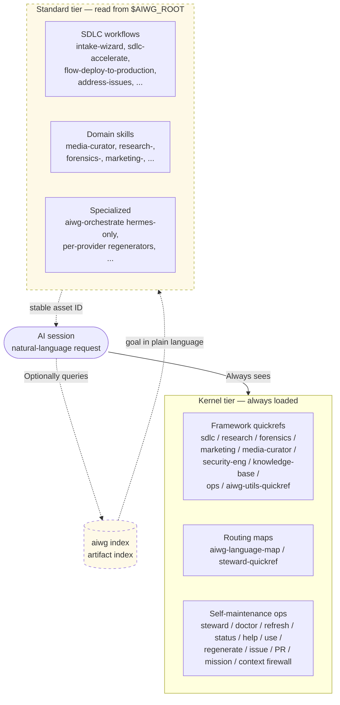
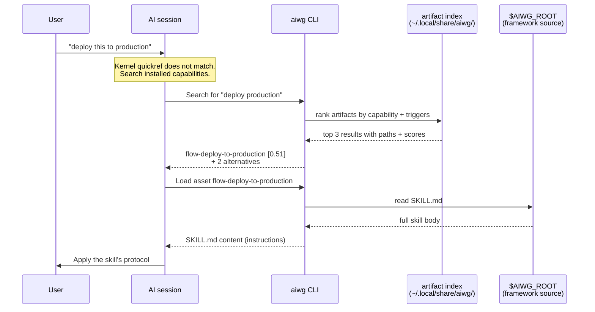
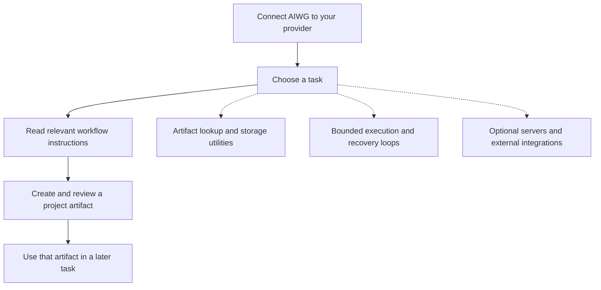
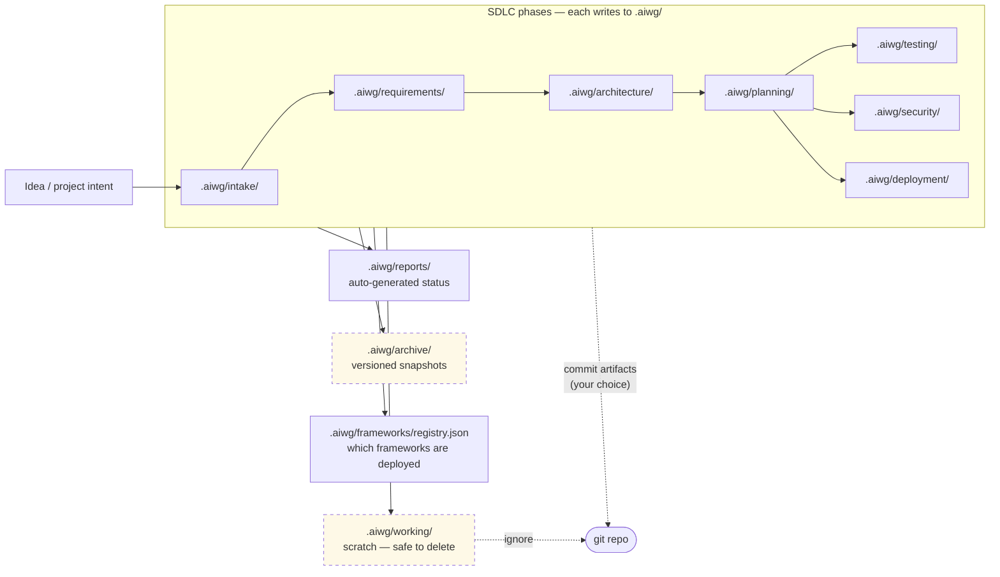
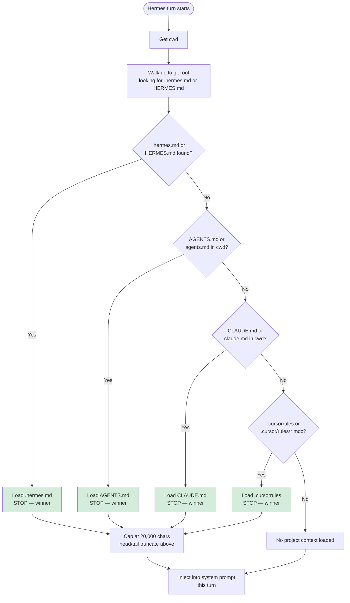
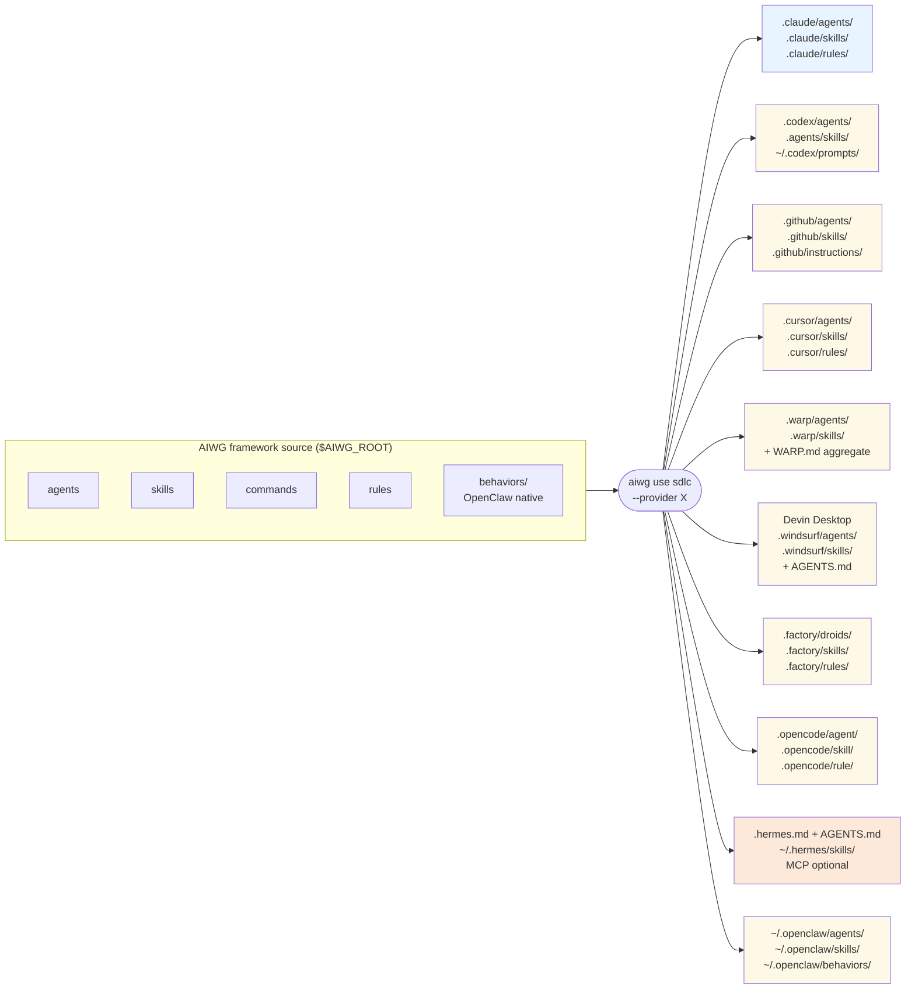
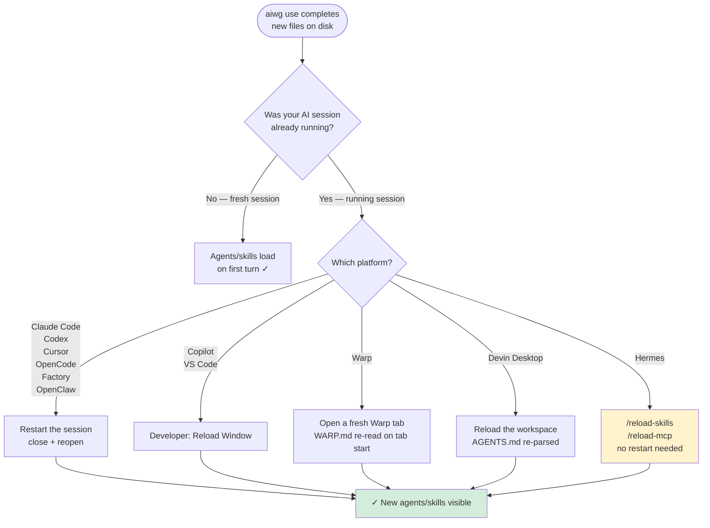

# AIWG Architecture Overview

> **Version**: 2026.5.0+
> **Audience**: Developers, technical leads, CISOs, anyone wanting a visual mental model of AIWG before reading the deeper guides

AIWG gives an AI assistant reusable project context and specialist workflows in the tools a team already uses. This
overview shows where AIWG writes files, what the assistant can see after deployment, and which runtime services are
optional.

Use it when you need to answer three practical questions:

- What changes in my repository after `aiwg use`?
- Which parts are plain deployed instructions, and which parts require optional services?
- What has to be refreshed when I switch AI platforms or reload a session?

Deeper guides:

- [`docs/how-it-works.md`](how-it-works.md) — prose walkthrough of the same concepts
- [`docs/discovery-and-kernel-skills.md`](https://github.com/jmagly/aiwg/blob/main/docs/discovery-and-kernel-skills.md)
  — kernel-vs-standard skill model in depth
- [`docs/integrations/hermes-quickstart.md`](integrations/hermes-quickstart.md) — Hermes-specific integration

---

## 1. AIWG starts as a deploy-time tool

`aiwg use` copies plain-text files into the directories your AI platform reads, builds an artifact index, and exits.
The core deploy step does not require a daemon, service, or network listener. Optional utilities such as background
loops, MCP integration, scheduled runs, or persistent services are separate components that run only when configured
and invoked.

```mermaid
flowchart LR
  subgraph Source["AIWG framework source"]
    direction TB
    KERN["Kernel quickrefs<br/>always visible"]
    STD["Standard skills<br/>read from $AIWG_ROOT"]
    AGENT["Agents"]
    RULES["Rules"]
    TPL["Templates"]
  end

  CLI(["aiwg use sdlc<br/>--provider X"]) --> DEPLOY

  subgraph DEPLOY["Deploy step (one-shot)"]
    direction TB
    COPY["Copy kernel skills, agents,<br/>rules to provider-native dirs"]
    INDEX["Build artifact index<br/>~/.local/share/aiwg/index/"]
    CTX["Emit AIWG.md + AGENTS.md<br/>at project root"]
  end

  Source --> CLI
  DEPLOY --> Project

  subgraph Project["Your project (after deploy)"]
    direction TB
    PLAT[".claude/skills/<br/>.codex/agents/<br/>.warp/agents/ ..."]
    AIWGMD["AIWG.md / .hermes.md /<br/>WARP.md / AGENTS.md"]
    ART[".aiwg/<br/>requirements/<br/>architecture/<br/>..."]
  end

  Project --> SESS

  subgraph SESS["AI session (Claude / Codex / Hermes / etc.)"]
    direction TB
    NATIVE["Platform-native loader<br/>reads provider dir"]
    DISC(["Optional: capability search<br/>+ verified asset load"])
  end

  classDef optional stroke-dasharray: 5 5,fill:#fef9e7
  class DISC optional
  class INDEX optional
```

---

## 2. The two-tier skill model

Platform context windows cannot fit every workflow instruction at once, so AIWG uses two tiers. Kernel skills are
small, always-visible guides for routing and maintenance. Standard skills stay at `$AIWG_ROOT` and are loaded only
after the agent searches the artifact index for the current goal.

See
[`docs/discovery-and-kernel-skills.md`](https://github.com/jmagly/aiwg/blob/main/docs/discovery-and-kernel-skills.md)
for the full kernel inventory, why no-copy is the default for standard skills, and the per-provider deployment paths.

---

## 3. Capability retrieval (the optional layer)

When the kernel skills do not directly answer a request, the agent searches the
standard tier using the user's goal, selects a stable asset ID, and loads the
authoritative asset body. This flow is optional—agents can work entirely from
the kernel surface for many requests—but when it is needed, the cost is bounded
and the answer comes from the indexed ranking rather than a literal-string
filesystem search. Exact CLI contracts live in the
[agent and automation reference](cli/README.md).

The [discover-first
protocol](https://github.com/jmagly/aiwg/blob/main/agentic/code/addons/aiwg-utils/rules/skill-discovery.md) makes this
the expected first move for AIWG capability queries. Agents search the AIWG index before reading provider deployment
directories, then load the selected asset by stable ID.

---

## 4. Optional layers

The standard setup connects the supported workflow surface. You can then use a focused task without turning on every
optional runtime service.

The dotted paths require the corresponding configuration and provider capabilities. Installing workflow source does
not start every service. Use [Install, Connect, and Verify](getting-started/install-connect-verify.md) for setup and
the [capability guide](overview/capabilities.md) to choose a task or utility.

---

## 5. The `.aiwg/` lifecycle

`.aiwg/` is your project's structured workspace — every SDLC phase has a home, the working scratch has a clearly disposable bin, and what you commit to git is your choice. AIWG manages the structure; you choose what's permanent.

`.aiwg/working/` is explicitly ephemeral — safe to delete, typically `.gitignore`'d. Whether to commit the rest of `.aiwg/` is a team decision; many teams commit everything except `working/` and the optional `archive/` directory.

---

## 6. Hermes context-file priority (first-match-wins)

[Hermes Agent](https://github.com/NousResearch/hermes-agent) loads exactly **one** project-context file per turn, by priority. AIWG always emits `.hermes.md` (the priority-1 file), so `AGENTS.md` and `CLAUDE.md` remain valid for Claude Code, Codex, and other providers without interfering with Hermes.

Source: `agent/prompt_builder.py:1410-1436` in the Hermes Agent repo. See [`docs/integrations/hermes-quickstart.md`](integrations/hermes-quickstart.md) for the full integration walkthrough.

---

## 7. Multi-platform deploy

AIWG's parity model: write/configure once, deploy to whichever AI platforms your team uses. The source-of-truth tree (`agentic/code/`) translates to ten provider-native target conventions through `aiwg use <framework> --provider <X>`.

Switching platforms reuses the same AIWG source and emits files in the selected provider's convention. Hermes deploys
files like the others (`AGENTS.md`, `.hermes.md`, and user-level skills); MCP is an optional global hook.

---

## 8. Session reload after `aiwg use`

Some AI platforms cache their agent or skill registry at session start. After `aiwg use`, a running session may need
to refresh that registry; the required action depends on the provider. `aiwg use` prints the correct action in the
compact `Next` section so operators do not have to guess; `--verbose` also explains why that provider needs the
reload.

Hermes supports `/reload-skills` and `/reload-mcp` for the Hermes-specific pieces. Other platforms generally require
the provider's session, window, or tab reload behavior so their native registry sees the new files.

---

## Related guides

- [`docs/how-it-works.md`](how-it-works.md) — the prose walkthrough of these same concepts
- [`docs/discovery-and-kernel-skills.md`](https://github.com/jmagly/aiwg/blob/main/docs/discovery-and-kernel-skills.md)
  — kernel/standard model in depth, verification steps
- [`docs/integrations/hermes-quickstart.md`](integrations/hermes-quickstart.md) — Hermes integration, capabilities catalog
- [`docs/cli/reference.md`](cli/reference.md) — complete CLI command reference
- [`skill-discovery.md`](https://github.com/jmagly/aiwg/blob/main/agentic/code/addons/aiwg-utils/rules/skill-discovery.md)
  — discover-first protocol source

The canonical inventory contains 26 kernel skills for routing, quick references, and self-maintenance.
