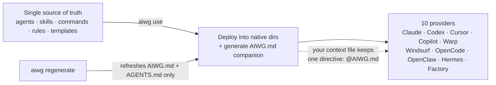
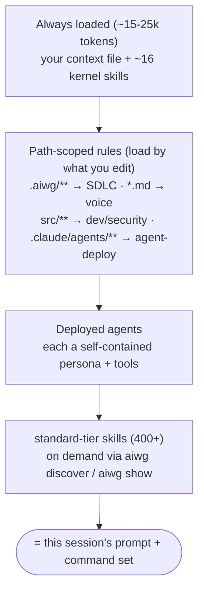

# How AIWG builds your customized system prompt (and command set)


A system prompt in a real project is a moving target. It should reflect exactly which AI tool you are in, which part of the repo you are currently editing, and which team conventions apply right now. A static text file can't keep up with an active codebase.

AIWG takes a different approach. It does not ship one static file. Instead, it assembles a per-session prompt and command set directly from your workspace state, and regenerates it cleanly as your setup changes. Here is how it works under the hood, and how to hook your own pieces into the framework.


## One source, deployed and linked

AIWG keeps one source of truth: your agents, skills, commands, rules, and templates are all maintained as plain markdown and YAML files. The framework is built around the idea of one source, ten targets. Running `aiwg use <framework>` performs a one-shot deploy. It is not a background daemon or service: it copies artifacts into the directories each tool natively reads, builds an artifact index, and exits.

These native paths behave exactly as you expect. Claude Code looks at .claude/agents/, .claude/skills/, and .claude/rules/. Codex expects files in ~/.codex/skills/ and ~/.codex/prompts/. Cursor uses .cursor/rules/. GitHub Copilot targets .github/agents/, .github/prompts/, and .github/skills/. All ten supported providers (Claude Code, Codex, Cursor, GitHub Copilot, Warp, Windsurf, OpenCode, OpenClaw, Hermes, Factory AI) get their files mapped automatically.

The centerpiece here is the hook-file architecture. The guiding principle is simple: link, don't duplicate. AIWG does not paste its framework context directly into the file you own. It keeps its generated context completely isolated in a companion file called AIWG.md. Your provider's context file—whether that is CLAUDE.md for Claude, WARP.md for Warp, or .cursorrules for Cursor—stays yours. That file carries a single directive that loads the companion. For Claude, that directive is literally just the line @AIWG.md. CLAUDE.md stays minimal and entirely under your control.

When you run aiwg use, it deploys the artifacts and generates AIWG.md (the cross-provider companion), plus a thin AGENTS.md bridge file that points directly at AIWG.md. For tools that need their own distinct context file, AIWG emits a provider twin: files like Warp's WARP.md, Copilot's .github/copilot-instructions.md, or Hermes's .hermes.md. Why keep AGENTS.md as a thin bridge? Codex caps its instructions file at 32 KB by default. Keeping AGENTS.md small and pointing to AIWG.md avoids inlining and prevents you from hitting that limit. To share some historical color: before the hook file existed, aiwg use injected 400 to 500 lines straight into CLAUDE.md. It buried your own notes and made updates painful. The hook file fixed that.

It is important not to conflate how you update the system. aiwg regenerate re-synthesizes only the cross-provider context layer—AIWG.md, .aiwg/AIWG.md, and the AGENTS.md bridge—from your current workspace state. It preserves your operator-authored content and rewrites only its own managed blocks. It does not redeploy artifacts, and it does not rewrite provider native files. If you need to re-run the full deploy, you use the heavier command, aiwg refresh.




## Assembled per session, not written once

What loads as the system prompt each session relies on a two-tier assembly.

The first tier is always loaded and remains compact, sitting at roughly 15 to 25k tokens. This includes your provider context file plus about 16 kernel skills. Those kernel skills consist of 9 quickrefs (one per installed framework, plus a utils quickref), an `aiwg-language-map` for handling your addons and extensions, and 6 self-maintenance ops. A few global rules stay active regardless of the path you are in: no-attribution, token-security, and anti-laziness.

The second tier relies on path-scoped rules that activate based on what you actually touch. If you are editing files within .aiwg/, SDLC orchestration rules load. Touching a *.md file pulls in specific voice and writing rules. Modifying files in src/ loads your development and security conventions, and working inside .claude/agents/ triggers agent-deployment rules. Each deployed agent also operates as a self-contained persona with its own tool set.

AIWG ships 400+ skills (and the count climbs as you add frameworks — a full SDLC deploy reports several hundred discoverable). These are skills, not commands; commands are a separate, smaller category being migrated into skills. Only the ~16 kernel skills are always-loaded. The rest stay resting at `$AIWG_ROOT` and only reach the agent when queried via the artifact index. You look for them with `aiwg discover "<need>"` and pull them in with `aiwg show <type> <name>`.

The net effect of this architecture is complete customization. Because the assembly derives from your installed frameworks, addons, and providers, no two projects get the same prompt-and-command set.




## Tips for hooking your own

When you are ready to configure your specific logic, keep these practices in mind:

- Protect your directives: Write your team directives in your own file, entirely outside AIWG's managed blocks. aiwg regenerate preserves them safely.
- Scaffold with the smiths: use `aiwg add-agent`, `aiwg add-command`, or `aiwg add-skill` (which call the AgentSmith, CommandSmith, and SkillSmith agents).
- Create a project-local bundle: run `aiwg new-extension <name>`, then activate it with `aiwg use <name>`.
- Scope rules tightly: use `paths:` frontmatter so rules auto-load only where relevant. Making everything always-on just creates context bloat.
- Link, don't inline: reference documents with `@path/to/file.md`, and keep `AGENTS.md` a thin index pointing at `AIWG.md`.
- Discover instead of hardcoding: find skills with `aiwg discover`, then pull them in with `aiwg show` — no memorizing paths.


## Walk through it: hook your own agent in

Enough theory. Here's the whole loop end to end: install, deploy, see the hook with your own eyes,
add an agent, and regenerate. About five minutes, and you end with a working custom agent wired into
your prompt. (Outputs below are real, captured from a live run.)

**1. Install and deploy.** One global install, then deploy a framework into your project.

```bash
npm install -g aiwg
aiwg use sdlc
```

```
  ◆ Installing sdlc framework  for Claude Code
  OK Agents      120 deployed
  OK Commands    33 deployed
  OK Skills      12 deployed
  OK Discoverable skills 487 deployed
  OK Rules       2 deployed

  Session reload required:
    › Restart your Claude Code session to load the newly deployed agents.
```

`aiwg use` lands the artifacts in your tool's native directories, generates `AIWG.md` at the repo
root, and adds a single `@AIWG.md` line to your `CLAUDE.md`. Your file stays yours. (`aiwg use` picks
your provider automatically; here it detected Claude Code.)

**2. Confirm it's engaged.** `--probe` prints a deterministic status block.

```bash
aiwg status --probe
```

```json
{
  "engaged": true,
  "status": "ready",
  "checks": { "framework_count": 8, "provider_deployment_count": 4, "health": "healthy" }
}
```

**3. See the hook for yourself.** Open `CLAUDE.md`. Your notes are untouched; the only AIWG addition
is one line near the top:

```
@AIWG.md
```

And at the bottom you'll find a marker:

```
<!-- TEAM DIRECTIVES: Add project-specific guidance below this line -->
```

Anything you write under that survives every regenerate. That's the whole contract: AIWG owns
`AIWG.md`, you own `CLAUDE.md`.

**4. Know which provider you're in.** The first run builds a catalog; after that it just reads it.

```bash
aiwg runtime-info --discover
```

```
Starting runtime discovery...
Discovery complete: 51 tools found
Catalog saved to: .aiwg/smiths/toolsmith/runtime.json
```

**5. Add your own agent.** Scaffold a project-local extension with an agent starter, then scope and deploy it.

```bash
aiwg new-bundle my-reviewer --type extension --starter agent
```

```
    + manifest.json
    + README.md
    + agents/my-reviewer.md
  Next steps:
    ...
    Deploy:  aiwg use my-reviewer
```

That writes `.aiwg/extensions/my-reviewer/agents/my-reviewer.md`. Open it and add a `paths:` block to
its frontmatter so it loads only where it's relevant, say when you're touching application code:

```yaml
paths:
  - "src/**"
```

Then deploy the bundle — you deploy the extension, not the agent name:

```bash
aiwg use my-reviewer
```

```
  OK project-local extension 'my-reviewer' deployed (1 provider(s))
```

Prefer adding to a framework you already use? `aiwg add-agent <name> --to <addon|framework>` does that
— for example `aiwg add-agent my-reviewer --to sdlc-complete` (then redeploy with `aiwg use sdlc`).

**6. Preview, then regenerate.** Always dry-run first — it writes nothing.

```bash
aiwg regenerate --dry-run
```

```
◆ aiwg regenerate  (dry run)
  Would regenerate:
    - .aiwg/AIWG.md
    - AIWG.md
    - AGENTS.md
  Dry run complete — no changes made
```

Drop `--dry-run` to apply. Note what it touches: just `AIWG.md` and the `AGENTS.md` bridge. Your
`CLAUDE.md` notes and your `src/**`-scoped agent stay exactly as you left them.

**7. Find capabilities without memorizing paths.** You don't keep a map of every skill in your head;
you query for them.

```bash
aiwg discover "add my own agent"
aiwg show skill add-agent
```

```
Discovery results for "add my own agent" (3 matches):
  score=0.34  skill  add-agent — Scaffold a new agent definition inside an existing addon or framework
```

`discover` finds it by capability; `show` prints the skill so you can use it. That's the pattern for
reaching anything in the catalog.


## Trade-offs, and when you don't need this

Dynamic assembly costs a little legibility. The prompt in front of you at any given moment is the composed result of your base setup, active rules, and agents — not one static file you can read top to bottom.

The mitigation here is discipline: scope rules tightly, keep AGENTS.md thin, and use aiwg status --probe or aiwg doctor to clearly see the resolved picture. If your project uses exactly one tool with one fixed rule set, you may not need most of this framework. The real payoff shows up in mixed-provider repos and projects whose conventions keep evolving over time.


## Takeaway

Your prompt should track your project, not lag behind it. Deploy once, link instead of duplicate, and let rules and agents load by context. When your setup changes, regenerate the framework state — without clobbering the notes you actually wrote.

---

**Get started:** `npm install -g aiwg` · [aiwg.io](https://aiwg.io) ·
[Start here](https://docs.aiwg.io/getting-started/start-here.html) ·
[GitHub](https://github.com/jmagly/aiwg)
