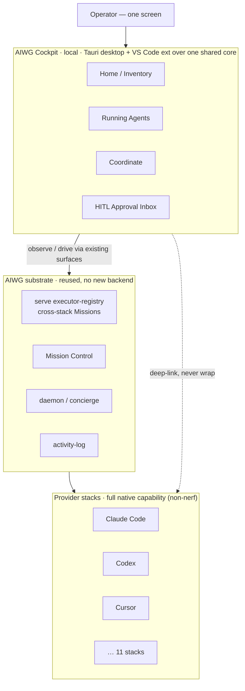
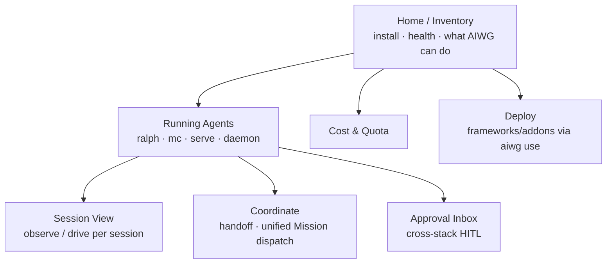
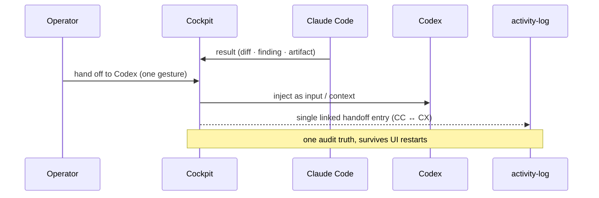

# Your agents, your desktop: the AIWG Cockpit (and what shipped in June)


AIWG already does one hard thing well: write an agent, skill, command, or rule **once**, and deploy it across eleven agentic stacks — Claude Code, Codex, Cursor, Factory, Warp, OpenCode, Windsurf, OpenClaw, Hermes, OpenHuman, and Omnius — from a single source of truth. June pushed that further. What comes next changes where you *operate* from.

The short version: the orchestration is real and it's text-first today. The next step is to put a calm, local control plane on your desktop — **on top of** the stacks you already run, never in place of them. The foundation for that landed in v2026.6.1. This post covers what shipped in June and lays out the Cockpit design honestly, including what is and isn't built yet.

## What shipped in June

Two releases, one line of travel.

**v2026.6.0** widened the surface:

- **OpenHuman is provider #11.** An OSS Rust/Tauri personal-AI runtime joins the deployment matrix. One `aiwg use` deploys to it like any other stack.
- **Declarative YAML Flows.** Multi-step orchestration as version-controlled `flow.aiwg.io/v1` documents — discoverable via `aiwg discover`, runnable as orchestration with multi-agent panels and synthesis.
- **Cross-stack Missions.** One Mission conductor fans heterogeneous workers across *different* stacks — a Claude Code session dispatching Codex subagents, for example — over a `runtime:<name>` executor convention. The stacks stay independent; the coordination layer is the new part.
- **Research-corpus intelligence.** Semantic search and citation-graph densification on the research framework.

**v2026.6.1** tightened and laid foundation:

- **Fleet-wide agent debloat under a 16 KB dispatch ceiling.** Oversized agent definitions were failing subagent dispatch with `Prompt is too long` — at zero tokens, before the agent did any work. Examples and restated boilerplate now live in a discoverable catalog; every shipped agent is under the ceiling, enforced by `aiwg doctor`.
- **A documentation-accuracy pass.** Skill and agent counts across the docs were reconciled against what's actually on disk.
- **AIWG Cockpit — beta groundwork.** The rest of this post.

## The problem the Cockpit solves

AIWG's power is real, but its operator surface is scattered. To answer "what's installed, what's running, and how do I jump into a session," you hold several disjoint mental models: the CLI (`aiwg status`, `aiwg mc`, `aiwg ralph`, `aiwg discover`), one bespoke session UI per provider, config files, and background daemons. Newcomers stall at the verb list. Multi-stack operators tab-switch between provider windows with no shared view — and the coordination that *should* be possible across stacks (hand a result from one to another, dispatch one Mission over mixed workers, approve gates in one place) is painful or impossible because nothing spans the stacks.

The Cockpit is the missing surface: **one friendly, local screen for everything AIWG runs.**

## The one rule: overlay, never replacement

The non-negotiable design constraint — we call it the **non-nerf guarantee** — is that Cockpit observes and drives provider stacks through their *existing* programmatic surfaces (the `serve` executor-registry, MCP, CLI probes, the daemon) and never forks, wraps over, or alters a native session. Everything a provider can do in its own UI or CLI stays available and unaltered while Cockpit is attached. This is enforced as a per-provider capability-parity checklist and treated as a release gate, not a feature. And it cuts inward too: **the AIWG CLI is never nerfed to make the GUI look necessary.** UX-first, CLI-always.



Cockpit adds no new backend, no new agent runtime, and no required cloud. It reuses what AIWG already has. v1 is local and single-operator.

## What it looks like

Not abstract color — an actual layout. The Home screen is calm and guided; power is one click deeper, never on the landing view (progressive disclosure). Here's the newcomer-first Home / Inventory and the Running Agents board it leads to:

```text
┌─ AIWG Cockpit ─────────────────────────────────────────────┐
│  Home   Running(3)   Coordinate   Inbox(2)   Cost   Deploy  │
├────────────────────────────────────────────────────────────┤
│  ✓ AIWG healthy — 4 frameworks, 5 providers                 │
│                                                            │
│   [ ▶ Start a session ]        [ + Deploy a framework ]     │
│                                                            │
│  Providers          Deployed   Status                       │
│   Claude Code         ✓        drive-capable                │
│   Codex               ✓        drive-capable                │
│   Cursor              ✓        observe-only                 │
│   Warp                ✓        drive-capable                │
│   OpenHuman           ✓        observe-only                 │
│                                                            │
│  ⚠ 1 doctor finding · twin-file drift (#1579)   [review]    │
└────────────────────────────────────────────────────────────┘

┌─ Running Agents ───────────────────────────────────────────┐
│  ● ralph  · auth-refactor    Claude Code   ▮ Driving        │
│       └ iter 4/6 · tests green        [Attach][Pause][Stop] │
│  ● mc/mission · doc-sweep    Codex ×2      ▯ Observing      │
│       └ 2 workers · 1 awaiting approval    [Attach][Inbox]  │
│  ● serve · index-build       Warp          ▯ Observing      │
│       └ 71%                                 [Attach][Stop]   │
└────────────────────────────────────────────────────────────┘
```

Every screen makes the equivalent CLI command one affordance away — the terminal path is *taught*, never hidden. Attach always opens in **Observe** behind a high-contrast mode badge; switching to **Drive** is a deliberate, capability-gated action with a confirm. Observe-only stacks say so plainly; nothing hides behind a spinner.

The information architecture, straight from the UX design:



## The actual differentiator: cross-stack coordination

Multi-stack on one screen is the table stakes. The reason to build this is three coordination actions that are painful or impossible with the provider UIs and CLI as they exist today:

1. **Context / result handoff.** Take the *result* of a Claude Code session — a diff, a finding, a generated artifact — and hand it as the *input* of a Codex session in one operator gesture. Today that's manual copy-paste between windows with no audit link. Cockpit records it as a single linked `activity-log` entry connecting the two sessions.
2. **Unified Mission dispatch over heterogeneous workers.** One Mission whose workers span different stacks, conducted by the cross-stack Mission conductor that shipped in 2026.6.0 — steered from one surface.
3. **Unified HITL approval inbox.** Every pending human-in-the-loop gate from every running stack and Mission in one inbox, each with its action and blast radius — instead of hunting per-provider prompts. An approval raised in a Codex session is invisible to someone watching the Claude Code window today.



A fourth capability falls out for free: a single audit timeline on disk that interleaves every Cockpit-initiated action across all stacks and survives UI restarts.

## Where it actually stands

Honestly: **groundwork.** What's in place after v2026.6.1 —

- the registry-bound, data-driven core (capabilities derived from the extension / `discover` / index registry, not hardcoded),
- instance control over the agentic-sandbox interface,
- the two shells — a Tauri desktop app and a VS Code extension over one shared core,
- local control-surface auth (`127.0.0.1` + Origin + CSRF + per-launch token + OS-keychain handshake),
- a declarative UI contribution model (extensions contribute screens, actions, workflows, and event-hooks),
- live capability/index refresh without an app restart.

What's **not** done: the full operator UX — the thing you'd actually sit in front of all day. That lands in a later release. Cockpit ships as an opt-in `@aiwg/cockpit` package; the base `npm i -g aiwg` footprint is unchanged. If you install it today, you're looking at the foundation, not the finished cockpit.

That's the honest framing, and we lead with it because the design is the commitment: a local, friendly, non-nerf control plane for every agentic stack you run — on your desktop, the way the orchestration already works under the hood.

## Try it / shape it

```bash
npm install -g aiwg     # fresh install
aiwg refresh            # update an existing install
```

- Repo: [github.com/jmagly/aiwg](https://github.com/jmagly/aiwg)
- Site: [aiwg.io](https://aiwg.io)

If you run multi-stack setups, the Cockpit UX priorities are being decided now — open an issue with what *you* would want on that one screen. That input shapes what ships next.

## Tools & transparency

AIWG is open about how its content is made.

- **Words:** mostly AI-generated, then fact-checked and edited by a human.
- **Facts and claims:** checked against the actual v2026.6.0 / v2026.6.1 releases and the Cockpit design corpus (vision, SAD, 12 ADRs, UX design) in the repo — nothing model-invented ships unverified. Cockpit is described as beta groundwork because that is its actual state.
- **Imagery:** the diagrams are hand-authored Mermaid + a text wireframe (no AI-rendered text or logos). The hero concept image is AI-generated (ChatGPT / DALL·E) and human-reviewed before publish.
- **Final pass:** human.

Net: AI-drafted, human-fact-checked.
