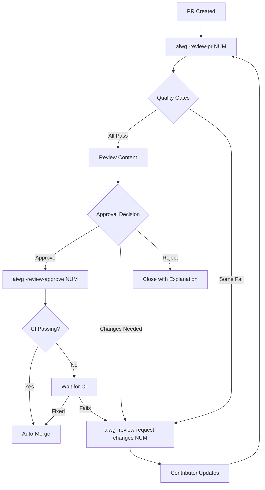

# AIWG Maintainer Review Guide

**Version:** 1.0 (Publication Ready)
**Created:** 2025-10-17
**Status:** Baseline
**Audience:** AIWG Repository Maintainers

## Table of Contents

1. [Prerequisites](#prerequisites)
2. [Review Workflow Overview](#review-workflow-overview)
3. [Automated Quality Validation](#automated-quality-validation)
4. [Command Reference](#command-reference)
5. [Review Decision Framework](#review-decision-framework)
6. [Requesting Changes](#requesting-changes)
7. [Approving and Merging](#approving-and-merging)
8. [Special Cases](#special-cases)
9. [Example Reviews](#example-reviews)
10. [Contribution Metrics](#contribution-metrics)
11. [Best Practices](#best-practices)

## Prerequisites

### Required Tools

**GitHub CLI (gh):**
```bash
# Verify installation
gh --version  # Should be >= 2.0

# Authenticate if needed
gh auth login
gh auth status
```

**AIWG Installation:**
```bash
# Verify AIWG is installed
aiwg -version

# Ensure maintainer commands are available
aiwg -help | grep review
# Should show: -review-pr, -review-request-changes, -review-approve, -review-stats
```

### Using Review Commands in Other Repositories

These maintainer commands work with any GitHub repository using similar quality standards:

**Adaptations:**
- quality gates are AIWG-specific (markdown lint, manifests)
- For other repos, configure quality gates in `.aiwg/config.json`
- Core workflow (review → request changes → approve) is universal

**Example:**
```bash
# Review PR in different repo
cd /path/to/other-repo
aiwg -review-pr 42  # Works with any GitHub repo
```

### Required Access

**Repository Permissions:**
- Write access to `jmagly/ai-writing-guide`
- Ability to approve PRs
- Ability to merge PRs

**Maintainer Role:**
- Listed in `.github/CODEOWNERS` (if configured)
- Member of maintainer team in GitHub organization

### Understanding AIWG Architecture

**Key Knowledge Areas:**
1. **Directory Structure:** Know where agents, commands, templates, flows reside
2. **CLI Architecture:** Understand `install.sh` routing and command dispatch
3. **Quality Standards:** Markdown linting rules, manifest system, documentation requirements
4. **SDLC Framework:** Intake forms, phase workflows, artifact structure

**Recommended Reading:**
- `README.md`
- `CLAUDE.md`
- `agentic/code/frameworks/sdlc-complete/README.md`
- `docs/contributing/pr-guidelines.md`

## Review Workflow Overview

### Standard Review Flow



### Time Expectations

**Initial Review:** Within 24-48 hours of PR creation (business days)
**Change Response:** Within 24 hours of contributor update (business days)
**Final Approval:** Within 24 hours of all criteria met

### Communication Standards

**Tone:** Professional, constructive, encouraging
**Specificity:** Always provide file/line references
**Actionability:** Every request includes example or guidance
**Positivity:** Acknowledge good work, not just issues

## Automated Quality Validation

The `aiwg -review-pr` command runs these validation checks:

### 1. Markdown Lint (Required)

**Validation:** All markdown files pass markdownlint-cli2 rules

**Common Issues:**
- MD012: Multiple blank lines
- MD022/MD032: Heading/list spacing
- MD031/MD040: Code fence issues
- MD041: First line should be H1
- MD047: Files end with newline

**Fix Commands (for contributors):**
```bash
# Run all fixers
node tools/lint/fix-md12.mjs --target . --write
node tools/lint/fix-md-heading-lists.mjs --target . --write
node tools/lint/fix-md-codefences.mjs --target . --write
node tools/lint/fix-md41-firsth1.mjs --target . --write
node tools/lint/fix-md47-finalnewline.mjs --target . --write
```

**Score Impact:** -5 points per unfixed error

### 2. Manifest Sync (Required)

**Validation:** All directory manifests are up-to-date

**Common Issues:**
- New files added without manifest update
- File descriptions missing or generic
- Metadata incomplete

**Fix Commands:**
```bash
# Regenerate manifests
node tools/manifest/generate-manifest.mjs <dir> --write-md
node tools/manifest/enrich-manifests.mjs --target . --write
node tools/manifest/sync-manifests.mjs --target . --fix --write-md
```

**Score Impact:** -10 points if out of sync

### 3. Documentation Completeness (Required)

**Validation:** All required documentation is present and complete

**Required Documentation:**
- [ ] **README.md updated** - Feature mentioned in relevant section
- [ ] **Quick-start guide exists** - `docs/<category>/<feature>-quickstart.md`
- [ ] **Integration doc complete** - Detailed usage, examples, troubleshooting

**Optional Documentation (adds points):**
- [ ] **Video tutorial** or animated GIF
- [ ] **Migration guide** (for breaking changes)
- [ ] **API reference** (if adding programmatic interface)

**Score Impact:** -20 points per missing required doc, +5 points per optional doc

### 4. Breaking Change Analysis (Required)

**Validation:** Breaking changes are identified and documented

**What Constitutes Breaking Change:**
- CLI command signature changes (flags, arguments)
- File path changes (templates, agents, commands)
- Configuration schema changes
- Removal of features or commands
- Behavior changes to existing features

**Required for Breaking Changes:**
- [ ] **BREAKING CHANGE** noted in commit message
- [ ] **Migration guide** provided in docs
- [ ] **Deprecation notices** added (if applicable)
- [ ] **Version bump** planned (major version)

**Score Impact:** -30 points if breaking change not documented

### 5. Security Scan (Basic)

**Validation:** No obvious security issues

**Checks:**
- No hardcoded credentials or tokens
- No obvious command injection vulnerabilities
- No path traversal issues
- No eval() or dangerous code execution

**Score Impact:** -50 points if security issue found (likely reject)

### Quality Score Calculation

**Base Score:** 100 points

**Deductions:**
- Markdown lint errors: -5 per error
- Manifest out of sync: -10
- Missing required doc: -20 per doc
- Breaking change undocumented: -30
- Security issue: -50

**Bonuses:**
- Optional docs: +5 per doc
- Comprehensive tests: +10
- Video tutorial: +10

**Thresholds:**
- **90-100:** Excellent - Immediate approval candidate
- **80-89:** Good - Minor improvements needed
- **70-79:** Acceptable - Changes requested
- **Below 70:** Needs significant work - Reject or major rework

### Manual Review Criteria

**Code Quality:**
- [ ] Follows existing code style and patterns
- [ ] No unnecessary dependencies added
- [ ] Error handling is robust
- [ ] Code is maintainable and readable

**Architecture Alignment:**
- [ ] Fits into existing AIWG structure
- [ ] Doesn't duplicate functionality
- [ ] Integrates cleanly with other components
- [ ] Follows AIWG conventions (naming, directory structure)

**User Experience:**
- [ ] Command interface is intuitive
- [ ] Error messages are clear and actionable
- [ ] Output is well-formatted and helpful
- [ ] Documentation matches actual behavior

**Testing:**
- [ ] Changes are testable
- [ ] Test strategy documented (if applicable)
- [ ] Manual testing steps provided
- [ ] Edge cases considered

## Command Reference

### `aiwg -review-pr <pr-number>`

**Purpose:** Comprehensive PR quality validation and review report generation

**Usage:**
```bash
# Review PR #123
aiwg -review-pr 123

# Output shows:
# - quality gate results
# - Files changed summary
# - Recommendation (approve/request changes/reject)
# - Next action options
```

**What It Does:**
1. Fetches PR metadata via `gh pr view`
2. Checks out PR branch locally (temporary)
3. Runs all quality gates
4. Analyzes files changed
5. Generates review report
6. Provides recommendation and action menu

**Typical Output:**
```
Reviewing PR #123: Add Cursor Editor platform integration
Author: @contributor
Branch: contrib/contributor/cursor-integration

Quality Gates:
✓ Markdown lint: PASSED
✓ Manifest sync: PASSED
⚠ Documentation: INCOMPLETE (missing --mode in quickstart)
✓ Breaking changes: NONE
✓ Security scan: PASSED

Files changed: 6
- tools/cursor/setup-cursor.mjs (new, 350 lines)
- tools/install/install.sh (+15 lines)
- README.md (+25 lines)
- docs/integrations/cursor-quickstart.md (new, 200 lines)
- docs/integrations/cursor-integration.md (new, 450 lines)
- tools/manifest/integrations-manifest.json (+12 lines)

Manual Review Checklist:
- Code style: Consistent with existing patterns
- Architecture: Follows platform integration structure
- UX: Clear error messages, helpful output
- Testing: Manual test steps provided

quality score: 85/100

Recommendation: REQUEST CHANGES
Issues:
1. Missing --mode flag documentation in quickstart
2. install.sh needs --platform cursor routing

Actions:
[1] Request changes with guidance
[2] Approve despite issues
[3] Comment only (no review)
[4] Generate detailed review report
[5] Exit
```

**When to Use:**
- Every PR, as first step
- After contributor updates (re-review)
- Before final approval

### `aiwg -review-request-changes <pr-number> [--guidance "text"]`

**Purpose:** Request changes with specific, actionable feedback

**Usage:**
```bash
# Request changes with inline guidance
aiwg -review-request-changes 123 --guidance "Add --mode flag to cursor quickstart"

# Interactive mode (asks for guidance)
aiwg -review-request-changes 123
```

**What It Does:**
1. Reads quality gate results from previous review
2. Generates structured change request
3. Provides file/line references
4. Includes example fixes or guidance
5. Posts review via `gh pr review --request-changes`

**Example Output:**
```
Generating change request for PR #123...

Changes requested on PR #123:

1. Documentation: Add --mode flag support
   File: docs/integrations/cursor-quickstart.md
   Location: Lines 25-30
   Issue: Quick-start doesn't show --mode flag usage

   Suggestion:
   ```bash
   # Deploy agents with mode selection
   aiwg -deploy-agents --platform cursor --mode sdlc
   # Or deploy both general and SDLC agents
   aiwg -deploy-agents --platform cursor --mode both
   ```

   Why: Users need to know they can choose agent sets

2. CLI Routing: Add platform cursor detection
   File: tools/install/install.sh
   Location: Line 245
   Issue: Missing --platform cursor routing

   Suggestion: Follow pattern from --platform warp (lines 234-242)
   ```bash
   --platform)
       shift
       case "$1" in
           cursor)
               node "$INSTALL_DIR/tools/cursor/setup-cursor.mjs" "${@:2}"
               exit 0
               ;;
   ```

   Why: Ensures `aiwg -deploy-agents --platform cursor` works

Post review? [y/n]: y
✓ Review posted: https://github.com/jmagly/aiwg/pull/123

Notification sent to @contributor
Expected response time: 24-48 hours
```

**When to Use:**
- quality score 70-89 with fixable issues
- Documentation incomplete
- Minor code issues
- Missing examples or tests

### `aiwg -review-approve <pr-number> [--auto-merge]`

**Purpose:** Approve PR and optionally enable auto-merge

**Usage:**
```bash
# Approve only (wait for manual merge)
aiwg -review-approve 123

# Approve and enable auto-merge
aiwg -review-approve 123 --auto-merge

# Approve with comment
aiwg -review-approve 123 --comment "Great work on the cursor integration!"
```

**What It Does:**
1. Runs final quality validation
2. Checks all gates pass
3. Approves PR via `gh pr review --approve`
4. Optionally enables auto-merge
5. Posts approval comment
6. Updates project status

**Example Output:**
```
Running final validation for PR #123...
✓ All quality gates passed
✓ quality score: 92/100

Approving PR #123: Add Cursor Editor platform integration

Review Comment:
--------------------------------------------------
Excellent work! The cursor integration follows our platform
patterns perfectly and the documentation is thorough.

quality score: 92/100
✓ All gates passed
✓ Code quality: High
✓ Documentation: Complete
✓ Testing: Manual steps provided

Approved with auto-merge enabled.
--------------------------------------------------

✓ Approved
✓ Auto-merge enabled (will merge when CI passes)

PR will merge automatically when:
- All CI checks pass
- No new change requests posted
- No merge conflicts

Estimated merge time: 5-10 minutes (CI duration)
```

**When to Use:**
- quality score >= 90
- All gates passed
- Code review complete and acceptable
- Documentation complete
- No security concerns

### `aiwg -review-stats [--since "YYYY-MM-DD"]`

**Purpose:** Track contribution metrics and community health

**Usage:**
```bash
# Stats since beginning of year
aiwg -review-stats --since "2025-01-01"

# Stats for last 30 days
aiwg -review-stats --since "30 days ago"

# All-time stats
aiwg -review-stats
```

**What It Does:**
1. Fetches all PRs with `contribution` label
2. Calculates metrics (merge rate, quality scores, response times)
3. Identifies top contributors
4. Analyzes contribution categories
5. Generates health report

**Example Output:**
```
Contribution Metrics (2025-01-01 to 2025-10-17)

PRs: 15 total
- Merged: 12 (80%)
- Open: 2 (13%)
- Closed without merge: 1 (7%)

Contribution Categories:
- Platform Integrations: 8 (53%)
  - Cursor: 1 (merged)
  - Windsurf: 1 (open)
  - Zed: 1 (open)
  - Warp: 2 (merged)
  - VS Code: 3 (merged)
- Documentation: 4 (27%)
- Bug Fixes: 2 (13%)
- Tooling: 1 (7%)

Quality Metrics:
- Average quality score: 87/100
- Score Distribution:
  - 90-100: 6 PRs (40%)
  - 80-89: 7 PRs (47%)
  - 70-79: 2 PRs (13%)
  - Below 70: 0 PRs (0%)

Time Metrics:
- Median time to first review: 18 hours
- Median time to merge: 3.5 days
- Median contributor response time: 6 hours

Top Contributors:
1. @contributor1 (4 PRs, avg score: 91)
2. @contributor2 (3 PRs, avg score: 85)
3. @contributor3 (2 PRs, avg score: 88)

Community Health:
✓ Response time under target (24h)
✓ Merge rate healthy (>80%)
⚠ Open PR age: 2 PRs >7 days (review needed)

Recommendations:
- Review PR #125 (open 9 days)
- Review PR #127 (open 8 days)
```

**When to Use:**
- Monthly community health check
- Before planning meetings
- To identify top contributors for recognition
- To track maintainer responsiveness

### Integration with Contributor Workflow

When you request changes via `aiwg -review-request-changes`, contributors can respond using:

```bash
# Contributor side
aiwg -contribute-monitor {feature}  # See your feedback
aiwg -contribute-respond {feature}  # Address changes
```

**Communication Tips:**
- Mention these commands in change requests for first-time contributors
- Link to contributor documentation in PR comments
- Encourage use of AIWG toolset for faster iteration

**Example:**
"Thanks for this contribution! I've requested some changes. You can use
`aiwg -contribute-respond cursor-integration` to address the feedback
using AIWG's assisted workflow."

## Review Decision Framework

### Simplified Decision Process

```text
quality score → Action
90-100       → Approve (auto-merge)
80-89        → Approve or request minor changes
70-79        → Request changes
<70          → Reject or major rework
```

### Decision Criteria

#### Immediate Approval (quality score >= 90)

**Criteria:**
- ✓ All quality gates passed
- ✓ Code follows AIWG patterns
- ✓ Documentation complete and accurate
- ✓ No security concerns
- ✓ Changes are focused and cohesive

**Action:**
```bash
aiwg -review-approve <PR> --auto-merge
```

**Comment Template:**
```markdown
Excellent contribution! All quality gates passed and code review looks great.

quality score: {score}/100
✓ Documentation complete
✓ Code quality high
✓ Testing strategy clear

Approved with auto-merge enabled. Thank you for your contribution!
```

#### Request Minor Changes (quality score 80-89)

**Criteria:**
- ✓ Most gates passed
- ⚠ 1-3 fixable issues
- ✓ Core contribution is solid
- ⚠ Documentation needs small additions

**Action:**
```bash
aiwg -review-request-changes <PR> --guidance "Specific actionable feedback"
```

**Comment Template:**
```markdown
Great work on this contribution! The core implementation is solid, but needs a few small improvements:

quality score: {score}/100

Issues to address:
1. {Specific issue with file/line reference}
2. {Specific issue with example fix}

Once these are addressed, this will be ready to merge. Thanks!
```

#### Request Significant Changes (quality score 70-79)

**Criteria:**
- ⚠ Multiple issues across different areas
- ⚠ Documentation incomplete or inaccurate
- ⚠ Code quality concerns
- ✓ But core idea is valuable

**Action:**
```bash
aiwg -review-request-changes <PR> --guidance "Comprehensive rework needed"
```

**Comment Template:**
```markdown
Thank you for this contribution. The core idea is valuable, but several areas need improvement before we can merge:

quality score: {score}/100

Major Issues:
1. **Documentation:** {What's missing or incorrect}
2. **Code Quality:** {Specific patterns to follow}
3. **Testing:** {What needs verification}

I've provided specific guidance for each issue. Please don't hesitate to ask questions if anything is unclear. We're here to help!
```

#### Reject or Request Major Rework (quality score < 70)

**Criteria:**
- ❌ Multiple quality gates failed
- ❌ Fundamental architecture misalignment
- ❌ Security concerns
- ❌ Incomplete or misunderstood requirements

**Action:**
```bash
# Close PR with detailed explanation (manual via gh pr close)
gh pr close <PR> --comment "Detailed explanation and guidance"
```

**Comment Template:**
```markdown
Thank you for taking the time to contribute. Unfortunately, this PR cannot be merged in its current state due to significant issues:

quality score: {score}/100

Critical Issues:
1. **{Issue category}:** {Detailed explanation}
2. **{Issue category}:** {Detailed explanation}

Options:
1. **Major Rework:** If you'd like to continue, please address these fundamental issues. We can help guide you through a fresh approach.
2. **Fresh Start:** Consider starting a new contribution with `aiwg -contribute-start` to leverage AIWG's SDLC framework for better quality.
3. **Discussion:** Let's discuss the approach before more implementation work.

We appreciate your interest in contributing and are happy to help you succeed on a future contribution!
```

### Borderline Scores (75-80)

For scores on the edge between "Acceptable" and "Needs work":

**Tiebreaker Criteria:**
- First-time contributor? → Extra patience, request changes with detailed guidance
- Repeat contributor? → Higher standards, may approve with conditions
- Security implications? → Higher bar, request changes
- Documentation only? → Lower bar, may approve

## Special Cases

### Breaking Changes

**Detection:**
- CLI command signature changes
- File path relocations
- Configuration schema changes
- Removed features or commands
- Behavior changes to existing functionality

**Review Process:**
1. **Identify Impact:**
   ```bash
   # Check which files are affected
   gh pr files 123 | grep -E "install.sh|commands/|agents/"

   # Review changes carefully
   gh pr diff 123
   ```

2. **Require Documentation:**
   - [ ] Migration guide in `docs/migrations/v{X}-to-v{Y}.md`
   - [ ] Deprecation notices in affected commands (if graceful deprecation)
   - [ ] BREAKING CHANGE in commit message
   - [ ] Updated version number (major bump)

3. **Request Team Review:**
   ```bash
   # Tag other maintainers
   gh pr comment 123 --body "@maintainer1 @maintainer2 Breaking change - please review"
   ```

4. **Approval Criteria:**
   - [ ] All maintainers reviewed and approved
   - [ ] Migration guide tested
   - [ ] Version bump planned
   - [ ] Release timeline agreed

**Example Comment:**
```markdown
## Breaking Change Review

This PR introduces breaking changes:

**Changes:**
1. `--deploy-agents` now requires `--platform` flag (previously optional)
2. Default behavior changed from "all platforms" to "current platform only"

**Impact:**
- Existing scripts using `aiwg --deploy-agents` will fail
- Users must specify `--platform all` for old behavior

**Migration:**
✓ Migration guide provided: docs/migrations/v1-to-v2.md
✓ Error message guides users to fix
✓ Documentation updated

**Approval Status:**
- @maintainer1: Approved
- @maintainer2: Awaiting review

**Release Plan:**
- Version: 2.0.0 (major bump)
- Timeline: Merge after all approvals, release in 2 weeks
- Announcement: Blog post + GitHub release notes

Tagging team for review: @maintainer1 @maintainer2
```

### Security Concerns

**Red Flags:**
- Hardcoded credentials, tokens, or secrets
- Command injection vulnerabilities (e.g., unsanitized `exec()`)
- Path traversal risks (e.g., `../../../etc/passwd`)
- Arbitrary code execution (e.g., `eval()`, `Function()`)
- Unsafe file operations (e.g., no validation before write)

**Review Process:**
1. **Immediate Action:**
   ```bash
   # Do NOT approve
   # Request immediate changes or close PR

   gh pr comment 123 --body "SECURITY ISSUE: {description} - Please fix immediately"
   ```

2. **Private Discussion:**
   - For sensitive vulnerabilities, discuss privately (not in PR comments)
   - Use GitHub Security Advisory if needed

3. **Example Comment (for minor issues):**
   ```markdown
   ## Security Issue

   **File:** tools/contrib/create-pr.mjs
   **Line:** 45

   **Issue:** User input directly interpolated into shell command

   **Current:**
   ```javascript
   exec(`gh pr create --title "${title}"`)
   ```

   **Risk:** Title with special characters could execute arbitrary commands

   **Fix:**
   ```javascript
   const { execFile } = require('child_process');
   execFile('gh', ['pr', 'create', '--title', title])
   ```

   **Why:** `execFile` doesn't spawn shell, preventing injection attacks.

   Please fix before approval. Security is our top priority!
   ```

4. **Approval Only After:**
   - [ ] Security issue fixed
   - [ ] Fix verified by maintainer
   - [ ] No other security concerns found

### Large Refactors

**Definition:**
- Changes >500 lines across multiple files
- Architectural changes affecting multiple components
- Significant behavior changes to core features

**Review Process:**
1. **Early Discussion:**
   - Ideally, large refactors should be discussed BEFORE PR submission
   - Use GitHub Discussions or Issues to align on approach

2. **Phased Review:**
   ```bash
   # Review in chunks
   gh pr files 123 | head -10  # Review first 10 files

   # Request contributor to explain changes
   gh pr comment 123 --body "Can you provide a high-level overview of the refactor strategy?"
   ```

3. **Test Thoroughly:**
   - Require comprehensive testing strategy
   - Manual testing by multiple maintainers
   - Check all integration points

4. **Example Comment:**
   ```markdown
   ## Large Refactor Review

   This is a significant change. Let's ensure quality:

   **Scope:**
   - 847 lines changed across 23 files
   - Refactors CLI routing architecture
   - Affects all platform integrations

   **Review Strategy:**
   1. High-level architecture review (me)
   2. Platform integration testing (@maintainer1)
   3. Backward compatibility testing (@maintainer2)

   **Questions:**
   1. Can you provide a migration guide for this refactor?
   2. Have you tested all existing platform integrations?
   3. Are there any breaking changes we should be aware of?

   Timeline: This will take 3-5 days to review thoroughly. Thanks for your patience!
   ```

### Multi-Platform Impacts

**Scenario:** PR affects multiple platforms (Claude, Warp, Cursor, etc.)

**Review Process:**
1. **Test on All Platforms:**
   ```bash
   # Deploy to each platform and test
   aiwg -deploy-agents --platform claude --mode both
   aiwg -deploy-agents --platform warp --mode both
   aiwg -deploy-agents --platform cursor --mode both

   # Verify functionality on each
   ```

2. **Check Platform-Specific Files:**
   - `.claude/agents/`
   - `.warp/workflows/`
   - `.cursor/rules`

3. **Example Comment:**
   ```markdown
   ## Multi-Platform Impact Check

   This PR affects all platform integrations. Testing:

   **Platforms Tested:**
   - ✓ Claude: Agents deployed and functional
   - ✓ Warp: Workflows generated correctly
   - ⏳ Cursor: Testing in progress
   - ❌ Windsurf: Error in rule generation (details below)

   **Issue Found (Windsurf):**
   File: tools/windsurf/setup-windsurf.mjs:67
   Error: `undefined is not a function` when generating rules

   Please fix Windsurf compatibility before merge.
   ```

### First-Time Contributors

**Recognition:**
- Check contributor's GitHub profile and PR history
- First PR to AIWG deserves extra encouragement

**Review Process:**
1. **Extra Patience:**
   - Provide more detailed feedback
   - Explain "why" behind conventions
   - Offer to pair program or help directly

2. **Example Comment:**
   ```markdown
   ## Welcome to AIWG! 🎉

   Thank you for your first contribution! We appreciate you taking the time to improve AIWG.

   I've reviewed your PR and have some feedback. Don't worry - this is normal! Every contribution goes through a review process to ensure quality.

   **What You Did Well:**
   - ✓ Clear documentation
   - ✓ Good code structure
   - ✓ Followed our commit conventions

   **Areas to Improve:**
   1. {Feedback with extra explanation}
   2. {Feedback with examples}

   **Need Help?**
   - Ask questions anytime! We're here to help.
   - Check out docs/contributing/ for more guidance
   - Try `aiwg -contribute-respond {feature}` to address feedback

   Looking forward to merging your contribution!
   ```

3. **Post-Merge Recognition:**
   - Thank them publicly in PR comment
   - Consider adding to CONTRIBUTORS.md
   - Invite to join community discussions

### Abandoned or Corrupted Contributions

**Detection:**
- PR inactive >30 days
- Contributor unresponsive to feedback
- Contribution workspace corrupted

**Maintainer Actions:**
1. Comment on PR offering help
2. Suggest `aiwg -contribute-abort {feature}` if unrecoverable
3. Close PR after 60 days of inactivity with clear explanation

**Example Comment:**
```markdown
It looks like this contribution may have stalled. If you'd like to continue,
use `aiwg -contribute-abort cursor-integration` to clean up and start fresh.
If we don't hear back in 30 days, we'll close this PR. Thanks for your interest!
```

## Requesting Changes

### Best Practices for Feedback

#### Be Specific and Actionable

**Bad Example:**
```markdown
The documentation needs improvement.
```

**Good Example:**
```markdown
Documentation: Add --mode flag usage to quickstart

File: docs/integrations/cursor-quickstart.md
Location: Lines 25-30

Current: Only shows basic deployment
```bash
aiwg -deploy-agents --platform cursor
```

Add: Show mode selection
```bash
# Deploy SDLC agents only
aiwg -deploy-agents --platform cursor --mode sdlc

# Deploy general-purpose agents only
aiwg -deploy-agents --platform cursor --mode general

# Deploy both (default)
aiwg -deploy-agents --platform cursor --mode both
```

Why: Users need to understand mode selection to choose the right agent set.
```

#### Provide Context and Examples

**Bad Example:**
```markdown
Follow existing patterns.
```

**Good Example:**
```markdown
CLI Routing: Follow existing platform pattern

File: tools/install/install.sh
Location: After line 245

Reference: See --platform warp implementation (lines 234-242)

Add this case to the --platform switch:
```bash
cursor)
    node "$INSTALL_DIR/tools/cursor/setup-cursor.mjs" "${@:2}"
    exit 0
    ;;
```

Why: Ensures consistent CLI behavior across all platform integrations.
```

#### Balance Criticism with Encouragement

**Bad Example:**
```markdown
This code is poorly structured and doesn't follow our conventions.
```

**Good Example:**
```markdown
Code Structure: Great start! Let's align with AIWG conventions

File: tools/cursor/setup-cursor.mjs
Location: Lines 45-60

Current approach works, but let's use our existing error handling pattern:

Current:
```javascript
if (!fs.existsSync(cursorDir)) {
  console.error("Cursor directory not found");
  process.exit(1);
}
```

Suggested:
```javascript
const { validateDirectory } = require('../lib/validation.mjs');

try {
  validateDirectory(cursorDir, 'Cursor configuration');
} catch (error) {
  console.error(`Error: ${error.message}`);
  process.exit(1);
}
```

Why: Reuses existing validation logic and provides consistent error messages.

The core logic is solid - this is just about consistency with the rest of the codebase!
```

### Feedback Structure Template

Use this structure for all change requests:

```markdown
## Summary
{1-2 sentences summarizing overall feedback}

quality score: {score}/100

## Required Changes

### 1. {Category}: {Short description}
**File:** {path/to/file.ext}
**Location:** {Lines X-Y or "Throughout"}
**Issue:** {What's wrong or missing}

**Current:**
```{language}
{Current code or content}
```

**Suggested:**
```{language}
{Suggested improvement}
```

**Why:** {Rationale - user benefit, consistency, etc.}

### 2. {Next issue...}

## Optional Improvements
{Nice-to-have changes that would make this even better}

## What You Got Right
{Positive feedback - acknowledge good work}

## Questions?
Feel free to ask questions about any of this feedback. We're here to help!
```

### Response Time Expectations

**Set Clear Expectations:**
```markdown
Expected contributor response time: 24-48 hours
If you need more time or have questions, just let us know!

We'll re-review within 24 hours of your updates.
```

### Offer Help

**Always Include:**
```markdown
## Need Help?
- Questions about this feedback? Comment here or tag @maintainer
- Want to discuss approach? We can hop on a quick call
- Stuck on implementation? We can pair program or provide code examples
- Using AIWG commands? Try `aiwg -contribute-respond cursor-integration`
```

## Approving and Merging

### Pre-Approval Checklist

Before approving any PR, verify:

- [ ] **All quality gates passed** (run `aiwg -review-pr` final time)
- [ ] **Code review complete** (all files reviewed manually)
- [ ] **Documentation accurate** (quick-start tested, examples work)
- [ ] **No security concerns** (no hardcoded secrets, safe code execution)
- [ ] **Breaking changes handled** (documented, migration guide present)
- [ ] **CI passing** (all GitHub Actions green)

### Approval Process

#### Step 1: Final Validation

```bash
# Run final review
aiwg -review-pr 123

# Verify quality score >= 90 (or 80 with good justification)
# Verify all gates passed
# Verify CI is passing
```

#### Step 2: Approve with Comment

```bash
# Approve with auto-merge
aiwg -review-approve 123 --auto-merge --comment "Great contribution! {specific praise}"

# Or approve without auto-merge (if you want manual control)
aiwg -review-approve 123 --comment "Approved! Will merge after {condition}"
```

**Approval Comment Template:**
```markdown
Excellent work on this contribution!

quality score: {score}/100
✓ All quality gates passed
✓ Code quality: {High/Excellent}
✓ Documentation: {Complete/Thorough}
✓ Testing: {Strategy provided/Manual testing complete}

{Specific thing you appreciated about this PR}

Approved with auto-merge enabled. Thank you for improving AIWG!
```

#### Step 3: Merge Strategy

**Auto-Merge (Default):**
- Enable with `--auto-merge` flag
- Merges automatically when CI passes
- Best for straightforward contributions
- Reduces maintainer overhead

**Manual Merge:**
- Use when coordination needed (with other PRs, release timing, etc.)
- Use when final validation needed before merge
- Use for breaking changes (coordinate version bump)

**Merge Method:**
- **Squash and merge** (default): For most contributions - clean history
- **Rebase and merge**: For well-structured commit history
- **Merge commit**: For large multi-feature contributions (rare)

#### Step 4: Post-Merge Actions

**Immediately After Merge:**
```bash
# Thank contributor (if not auto-generated)
gh pr comment 123 --body "Merged! Thanks for your contribution to AIWG!"

# Check if release needed
# - Platform integration: Increment minor version
# - Bug fix: Increment patch version
# - Breaking change: Increment major version
```

**Update Documentation:**
- Add to CHANGELOG.md (if applicable)
- Update version in package.json (if applicable)
- Add contributor to CONTRIBUTORS.md (if exists)

**Milestone and Project Management:**
- Close related issues (if any)
- Update project board (if using GitHub Projects)
- Assign milestone (if applicable)

### Release Coordination

**Patch Releases (Bug Fixes, Docs):**
- Can be released immediately after merge
- No version coordination needed
- Update via `aiwg -update`

**Minor Releases (Features, Platform Integrations):**
- Batch similar PRs if possible (e.g., multiple platform integrations)
- Announce in release notes
- Coordinate timing (avoid weekends, holidays)

**Major Releases (Breaking Changes):**
- Requires team discussion
- Plan migration path
- Announce well in advance
- Provide migration guide
- Update all documentation

## Example Reviews

### Example 1: Excellent PR - Immediate Approval

**Scenario:** Cursor platform integration, quality score 94/100

```markdown
## Review Summary

PR #123: Add Cursor Editor platform integration
quality score: 94/100

### Automated Quality Gates
✓ Markdown lint: PASSED
✓ Manifest sync: PASSED
✓ Documentation: COMPLETE
✓ Breaking changes: NONE
✓ Security scan: PASSED

### Manual Review
✓ Code quality: Excellent - follows all AIWG patterns
✓ Architecture: Perfect fit with existing platform integration structure
✓ UX: Clear error messages, helpful output formatting
✓ Testing: Comprehensive manual testing steps provided

### Files Changed (6 files)
- tools/cursor/setup-cursor.mjs (new, 350 lines) ✓
- tools/install/install.sh (+15 lines) ✓
- README.md (+25 lines) ✓
- docs/integrations/cursor-quickstart.md (new, 200 lines) ✓
- docs/integrations/cursor-integration.md (new, 450 lines) ✓
- tools/manifest/integrations-manifest.json (+12 lines) ✓

### What You Got Right
- **Consistency:** Followed existing platform integration patterns exactly
- **Documentation:** Comprehensive quick-start and integration docs with examples
- **Error Handling:** Excellent validation and user-friendly error messages
- **CLI Integration:** Seamless integration with existing --platform flag

### Decision
**APPROVED** with auto-merge enabled

This is an exemplary contribution! The code is clean, well-documented, and follows all our conventions. Thank you for taking the time to do this right!

Welcome to the AIWG contributors list 🎉

---
Approved by @maintainer
Auto-merge enabled - will merge when CI passes
```

**Command Used:**
```bash
aiwg -review-approve 123 --auto-merge --comment "Exemplary contribution!"
```

### Example 2: Good PR - Minor Changes Needed

**Scenario:** Windsurf platform integration, quality score 82/100

```markdown
## Review Summary

PR #125: Add Windsurf editor platform integration
quality score: 82/100

### Automated Quality Gates
✓ Markdown lint: PASSED
✓ Manifest sync: PASSED
⚠ Documentation: INCOMPLETE (missing troubleshooting section)
✓ Breaking changes: NONE
✓ Security scan: PASSED

### Manual Review
✓ Code quality: Good - minor consistency improvements needed
⚠ Architecture: Fits well, but error handling could be more robust
✓ UX: Clear output, but error messages need improvement
✓ Testing: Basic manual steps provided

### Required Changes

#### 1. Documentation: Add troubleshooting section
**File:** docs/integrations/windsurf-quickstart.md
**Location:** End of file (after examples)
**Issue:** Users will encounter common issues - need guidance

**Add:**
```markdown
## Troubleshooting

### Error: "Windsurf configuration directory not found"
**Cause:** Windsurf not installed or using non-standard location
**Fix:**
1. Verify Windsurf is installed: `which windsurf`
2. Check config location: `ls ~/.config/windsurf`
3. Specify custom location: `aiwg -deploy-agents --platform windsurf --config-dir /custom/path`

### Error: "Permission denied writing to .windsurf/rules"
**Cause:** File permissions issue
**Fix:**
```bash
chmod 755 ~/.windsurf
chmod 644 ~/.windsurf/rules
```

### Agents not loading in Windsurf
**Cause:** Windsurf needs restart after rule changes
**Fix:** Close and reopen Windsurf
```

**Why:** Every integration doc has troubleshooting - helps users self-service

#### 2. Error Handling: Improve validation messages
**File:** tools/windsurf/setup-windsurf.mjs
**Location:** Lines 45-60
**Issue:** Generic error messages don't guide users to solutions

**Current:**
```javascript
if (!fs.existsSync(configDir)) {
  console.error("Configuration directory not found");
  process.exit(1);
}
```

**Suggested:**
```javascript
if (!fs.existsSync(configDir)) {
  console.error(`Error: Windsurf configuration directory not found at ${configDir}`);
  console.error(`\nPossible solutions:`);
  console.error(`1. Install Windsurf editor from https://windsurf.ai`);
  console.error(`2. Verify installation: which windsurf`);
  console.error(`3. Use custom location: --config-dir /path/to/config`);
  process.exit(1);
}
```

**Why:** Actionable error messages reduce support burden

### What You Got Right
- **Platform Detection:** Excellent auto-detection of Windsurf installation
- **Code Structure:** Clean separation of concerns
- **Integration:** Smooth CLI integration with --platform flag

### Next Steps
1. Add troubleshooting section to quickstart (15 min)
2. Improve error messages (10 min)
3. Reply here when ready for re-review

Expected turnaround: 24-48 hours. If you have questions or need help, just ask!

---
Changes requested by @maintainer
```

**Command Used:**
```bash
aiwg -review-request-changes 125 --guidance "Add troubleshooting section to quickstart and improve error messages"
```

### Example 3: Needs Significant Work

**Scenario:** Custom SDLC workflow contribution, quality score 73/100

```markdown
## Review Summary

PR #127: Add custom workflow for microservices architecture
quality score: 73/100

### Automated Quality Gates
⚠ Markdown lint: FAILED (12 errors)
✓ Manifest sync: PASSED
⚠ Documentation: INCOMPLETE (missing quick-start, integration doc)
✓ Breaking changes: NONE
✓ Security scan: PASSED

### Manual Review
⚠ Code quality: Inconsistent with AIWG patterns
⚠ Architecture: Doesn't leverage existing flow infrastructure
⚠ UX: Output formatting inconsistent with other commands
✓ Testing: Manual steps provided but incomplete

### Required Changes

Thank you for this contribution! The idea of microservices-specific workflows is valuable. However, several areas need improvement before we can merge:

#### 1. Markdown Linting
**Issue:** 12 markdown lint errors across documentation files

**Fix:**
Run our lint fixers:
```bash
node tools/lint/fix-md12.mjs --target . --write
node tools/lint/fix-md-heading-lists.mjs --target . --write
node tools/lint/fix-md47-finalnewline.mjs --target . --write
```

Then verify:
```bash
npm exec markdownlint-cli2 "docs/**/*.md"
```

#### 2. Documentation Structure
**Issue:** Missing required documentation

**Required:**
1. **Quick-start guide:** `docs/workflows/microservices-quickstart.md`
   - 5-minute getting started
   - Basic example
   - Common use cases

2. **Integration guide:** `docs/workflows/microservices-workflow.md`
   - Detailed usage
   - Configuration options
   - Advanced examples
   - Troubleshooting

**Template:** See `docs/integrations/cursor-quickstart.md` as reference

#### 3. Architecture Alignment
**File:** tools/workflows/microservices-workflow.mjs
**Issue:** Reimplements flow orchestration instead of using existing infrastructure

**Current Approach:** Custom orchestration logic (lines 45-150)

**Suggested Approach:** Leverage existing flow commands

Instead of custom orchestration, create a flow command that uses existing SDLC flows:

**Example:**
```javascript
// tools/workflows/microservices-workflow.mjs
import { executeFlow } from '../lib/flow-executor.mjs';

export async function microservicesWorkflow(options) {
  // Use existing flows with microservices-specific configuration
  await executeFlow('flow-architecture-evolution', {
    archType: 'microservices',
    components: options.services,
    ...options
  });

  await executeFlow('flow-test-strategy-execution', {
    testType: 'integration',
    scope: 'cross-service',
    ...options
  });
}
```

**Why:** Reuses battle-tested orchestration logic, maintains consistency

**Reference:** See `tools/lib/flow-executor.mjs` for existing patterns

#### 4. Output Formatting
**File:** tools/workflows/microservices-workflow.mjs
**Lines:** 200-250
**Issue:** Inconsistent output formatting

**Follow AIWG patterns:**
```javascript
// Use our logging utilities
import { logSuccess, logWarning, logError, logInfo } from '../lib/logger.mjs';

// Consistent status symbols
logSuccess('✓ Service architecture validated');
logWarning('⚠ Service B has circular dependency');
logError('❌ Service C failed health check');
logInfo('⏳ Running integration tests...');
```

**Reference:** See `tools/lib/logger.mjs`

### What You Got Right
- **Valuable Use Case:** Microservices workflows are a real need
- **Good Examples:** Real-world service configurations
- **Testing Mindset:** Included test strategy

### Suggestions for Success
1. **Start with Documentation:** Write the quick-start first (helps clarify the UX)
2. **Reuse Infrastructure:** Don't reinvent - extend existing flows
3. **Follow Patterns:** Study similar contributions (platform integrations, other workflows)
4. **Ask Questions:** Unsure about architecture? Let's discuss before more coding

### Next Steps
1. Fix markdown linting (quick win - 5 min)
2. Add required documentation (1-2 hours)
3. Refactor to use existing flow infrastructure (2-3 hours)
4. Update output formatting (30 min)

**Estimated Effort:** 4-6 hours total

If you'd like to discuss approach before reworking, I'm happy to hop on a call or provide more detailed guidance. This is a valuable contribution worth getting right!

---
Changes requested by @maintainer
Expected response time: 3-5 days (given scope of changes)
```

**Command Used:**
```bash
aiwg -review-request-changes 127 --guidance "Align architecture with existing flows, add required docs, fix linting"
```

## Contribution Metrics

### Tracking Community Health

Use `aiwg -review-stats` to monitor:

#### Response Time Metrics

**Target:** First review within 24 hours

**Measurement:**
```bash
aiwg -review-stats --since "30 days ago" | grep "Median time to first review"
```

**Red Flags:**
- Median >48 hours: Maintainers overloaded
- High variance: Inconsistent attention
- Old PRs accumulating: Need triage

**Action Items:**
- If >48h: Recruit additional reviewers
- If inconsistent: Set reviewer rotation schedule
- If accumulating: Dedicated triage session

#### Merge Rate Metrics

**Target:** >80% merge rate (of quality contributions)

**Measurement:**
```bash
aiwg -review-stats | grep "Merged:"
# Merged: 12 (80%)
```

**Analysis:**
- <70%: Too strict or poor contributor guidance
- 90-100%: Healthy acceptance rate
- 100%: Possibly too lenient

**Action Items:**
- If low: Review rejection reasons, improve contributor docs
- If high: Ensure quality gates are working

#### Quality Score Trends

**Target:** Average quality score trending upward

**Measurement:**
```bash
aiwg -review-stats --since "90 days ago"
# Compare to:
aiwg -review-stats --since "30 days ago"
```

**Positive Trends:**
- Score increasing over time
- Fewer low-score PRs
- More first-time contributors with high scores

**Indicates:**
- Contributor docs are working
- `aiwg -contribute-*` commands helping quality
- Community learning and improving

#### Contributor Growth

**Target:** +10 new contributors per month

**Measurement:**
```bash
aiwg -review-stats --since "30 days ago" | grep "Top Contributors"
# Count new names vs. previous month
```

**Healthy Indicators:**
- New contributors each month
- Repeat contributors returning
- Diverse contribution types (not just one person doing platform integrations)

**Action Items:**
- Recognize top contributors publicly
- Welcome first-time contributors warmly
- Highlight contribution opportunities

### Monthly Health Check

**Run This Monthly:**
```bash
# Generate comprehensive stats
aiwg -review-stats --since "30 days ago" > /tmp/monthly-stats.txt

# Review:
cat /tmp/monthly-stats.txt

# Check for:
# 1. Response time under 24h median
# 2. Merge rate >80%
# 3. No PRs >7 days old
# 4. Quality scores trending up
# 5. New contributors present
```

**Share with Team:**
- Post in maintainer channel
- Discuss any red flags
- Celebrate wins (new contributors, high quality PRs)
- Plan improvements (docs, automation, etc.)

## Best Practices

### Consistency is Key

**Use Templates:** Every review should follow similar structure
**Use Commands:** Prefer `aiwg -review-*` over manual `gh` commands (ensures consistency)
**Document Decisions:** If you deviate from guidelines, explain why in PR comments

### Communication Standards

**Response Time:**
- First review: Within 24 hours (business days)
- Re-review after changes: Within 24 hours
- Questions: Within 12 hours

**Tone:**
- Professional but friendly
- Constructive, not critical
- Encouraging, especially for first-time contributors

**Specificity:**
- Always provide file/line references
- Always provide examples or suggestions
- Never say "fix this" without saying "how"

### Review Efficiency

**Parallel Review:**
- Don't review line-by-line sequentially
- Skim entire PR first (get big picture)
- Then dive into details
- Batch similar feedback together

**Use Automation:**
- Let quality gates catch mechanical issues
- Focus manual review on architecture, UX, and logic
- Trust CI to catch test failures

**Time-Box Reviews:**
- Simple PRs: 15-30 minutes
- Medium PRs: 30-60 minutes
- Complex PRs: 1-2 hours (or split across multiple sessions)

### Building Community

**Recognize Contributions:**
```markdown
# In approval comments
Thank you @contributor for this excellent work! Your attention to detail in the documentation is especially appreciated.

# In monthly updates
Shout out to @contributor1, @contributor2, @contributor3 for their platform integration contributions this month!
```

**Invest in First-Time Contributors:**
- Extra patience and explanation
- Offer to pair program or hop on call
- Follow up after merge ("How was the experience?")

**Create Contribution Opportunities:**
- Label issues as "good first contribution"
- Document "most wanted" integrations or features
- Share contribution ideas in discussions

### Maintain Quality Standards

**Never Compromise On:**
- Security (reject if any security concerns)
- Documentation (no merges without docs)
- Breaking changes (must be documented and discussed)

**Be Flexible On:**
- Code style minutiae (if functional and maintainable)
- Perfect scores (80+ is often good enough)
- Process (contributor didn't use `aiwg -contribute-*`? That's okay)

**Balance:**
- Quality vs. velocity
- Strictness vs. community growth
- Perfection vs. good enough

### Continuous Improvement

**Track Patterns:**
- Common issues across PRs? → Update contributor docs
- Repeated questions? → Add to FAQ
- quality gate missed something? → Improve automation

**Retrospectives:**
- Monthly: Review stats, discuss what's working
- Quarterly: Bigger picture - process improvements
- Annually: Major changes - quality standards, automation, etc.

**Iterate on Process:**
- This guide isn't static
- Update based on learnings
- Share improvements with team

---

## Appendix: Quick Reference

### Command Cheat Sheet

```bash
# Review PR
aiwg -review-pr <number>

# Request changes
aiwg -review-request-changes <number> --guidance "specific feedback"

# Approve PR
aiwg -review-approve <number> --auto-merge

# View stats
aiwg -review-stats --since "30 days ago"

# Manual gh commands (if needed)
gh pr view <number>
gh pr diff <number>
gh pr checks <number>
gh pr review <number> --approve
gh pr merge <number> --squash
```

### quality score Reference

| Score | Meaning | Action |
|-------|---------|--------|
| 90-100 | Excellent | Approve |
| 80-89 | Good | Minor changes or approve with notes |
| 70-79 | Acceptable | Request changes |
| <70 | Needs work | Major rework or reject |

### Review Time Targets

| PR Complexity | First Review | Re-Review | Total Cycle |
|---------------|--------------|-----------|-------------|
| Simple (docs, small fixes) | 12 hours | 12 hours | 1-2 days |
| Medium (feature, integration) | 24 hours | 24 hours | 3-5 days |
| Complex (refactor, breaking) | 48 hours | 48 hours | 1-2 weeks |

### Decision Matrix

| quality score | Gates Passed | Code Quality | Action |
|---------------|--------------|--------------|--------|
| >=90 | ✓ All | ✓ High | Approve |
| 80-89 | ✓ Most | ✓ Good | Minor changes |
| 70-79 | ⚠ Some | ⚠ Fair | Request changes |
| <70 | ❌ Failed | ❌ Poor | Reject or major rework |

---

**Document Status:** v1.0 Baseline
**Next Review:** After maintainer feedback
**Owner:** Documentation Team
**Last Updated:** 2025-10-17