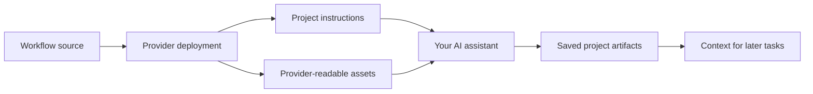

# How AIWG Works

AIWG gives your AI assistant reusable project context and specialist workflows. It places instructions where your AI
tool can read them and provides utilities for carrying work between tasks and sessions.

For examples before the mechanics, read [What Is AIWG?](overview/what-is-aiwg.md). For diagrams of the deployment and
optional runtime components, see the [architecture overview](architecture-overview.md).

## From workflow source to your project

Frameworks bundle roles, workflows, rules, and templates around a kind of work. Deployment adapts those files to the
selected provider's supported locations and formats, connects the project context, and reports verification and reload
guidance.



The [provider inventory](providers/provider-inventory.md) records integration status and scope. Some providers read
project files; others also use user-level paths. Supported agent execution, rule loading, hooks, and permissions
differ. The [provider comparison](integrations/cross-platform-overview.md) links to those details.

Use [Install, Connect, and Verify](getting-started/install-connect-verify.md) for setup. A guide to the mechanism is
not a separate list of installation steps.

## What the instructions describe

| Building block | Purpose | Example |
|---|---|---|
| Agent | A specialist role and its review responsibilities | A test engineer reviewing missing coverage |
| Skill | A repeatable procedure the assistant can discover and follow | A README audit with prioritized findings |
| Command | An explicit way to request an operation | A provider-supported workflow invocation |
| Rule | A constraint the assistant is instructed to follow | Preserve unrelated changes |
| Template | A structure for an output artifact | A review with findings, source references, and recommendations |

These are instructions and structures. They do not replace the model's judgment or prove that a task was executed
correctly. A rule can be backed by a tool or check where available; its presence alone is not enforcement.

## Discovering the right workflow

AIWG provides a small entry set of commonly needed skills and a searchable catalog of other assets. The agent can look
up a capability by the user's goal, inspect the selected instructions, and apply them. This lets the agent retrieve
details for the task without loading the entire catalog into the conversation.

The provider-facing context directs the agent to `WORKSPACE.md` for project context and `AIWG.md` for AIWG routing.
Provider-specific adapters handle the entry point. Links identify material to consult; reading behavior depends on the
provider and the agent following the instructions.

See [capability discovery](https://github.com/jmagly/aiwg/blob/main/docs/discovery-and-kernel-skills.md) for the
technical loading model and the [CLI reference](cli/reference.md) for exact commands.

## Saving work for later

Workflows can write durable artifacts under `.aiwg/`. For example:

```text
.aiwg/
├── intake/          Project goals and constraints
├── requirements/    Requirements and use cases
├── architecture/    Design decisions
├── testing/         Test plans and review records
└── marketing/       Campaign and content work
```

This is an illustrative layout; the selected workflow determines actual paths. A small README review does not need
every directory or a full intake process.

An intake workflow helps establish goals and constraints for a larger project. Later workflows can consult those
documents and link their outputs to earlier decisions. Artifact storage and lookup utilities support retrieval as the
collection grows.

The assistant must still read relevant files and check whether they are current. Keep decisions updated, resolve
conflicting artifacts, and inspect important source references. See [artifact storage](storage/overview.md) and
[traceability utilities](mention-utilities.md).

## Coordinating a review

A workflow can separate drafting from review and synthesis:

1. Inspect the task and its source material.
2. Produce a draft or initial findings.
3. Review from the perspectives the task requires.
4. Combine findings, resolve disagreements, and record uncertainty.
5. Check the output against the task's completion criteria.
6. Save the result and identify the next action.

When supported and useful, reviewers can run in parallel. Otherwise the provider may execute the roles sequentially or
use a compatibility path. Project policy determines required approvals. For lifecycle-specific gates, see the [flow
and gate process](getting-started/flow-and-gate-process.md).

A saved review lets the next session pick up a concrete task. The [first-result
walkthrough](getting-started/just-try-it.md) demonstrates this with a README review and a follow-up edit.

## Optional runtime utilities

The deployment step writes context and assets, then exits. Optional utilities perform additional work when invoked or configured:

- [Agent loops](ralph-guide.md) repeat execution and verification toward bounded completion criteria.
- [Automation](getting-started/daemon-and-automation.md) explains supported ways to coordinate longer-running work and
  external triggers.
- [MCP integration](mcp/README.md) exposes tools and resources through configured servers.
- [Session history](getting-started/session-history.md) helps review earlier provider sessions.
- [Project-local customization](project-local/overview.md) keeps your own workflow source with the project.

These paths may require processes, model access through a provider, storage services, or external integrations.
Installing workflow assets does not mean every optional service is running.

## Evaluate the result

Structured context and reviews can help organize complex work, but they can also add effort and model calls. AIWG does
not guarantee correct findings, deterministic reproduction, or a fixed performance improvement. Check the result
against the task and measure usefulness in your own workflow.

The [research reading list](overview/reading-list.md) supplies design background. Published benchmark results for
other systems are not AIWG evaluations. For a practical adoption check, use the [executive brief's
pilot](overview/executive-brief.md#a-practical-pilot).

The canonical inventory contains 26 kernel skills for routing, quick references, and self-maintenance.
