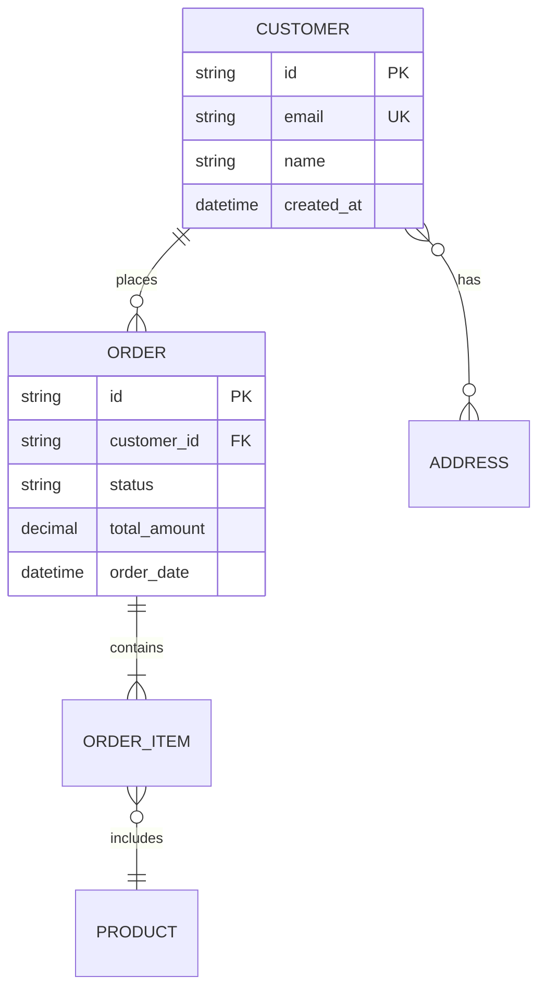
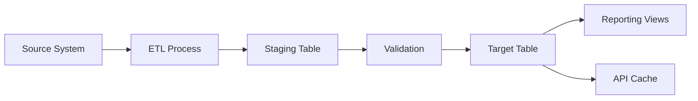

# Database Design Template

## Metadata

- ID: DES-DB-`id`
- Owner: `name/role/team`
- Contributors: `list`
- Reviewers: `list`
- Team: `team`
- Stakeholders: `list`
- Status: `draft/in-progress/blocked/approved/done`
- Dates: created `YYYY-MM-DD` / updated `YYYY-MM-DD` / due `YYYY-MM-DD`
- Related: REQ-`id`, DES-`id`, IFC-`id`, ADR-`id`, TEST-`id`
- Links: `paths/urls`

## Related Templates

- docs/sdlc/templates/requirements/data-contract-template.md
- docs/sdlc/templates/analysis-design/interface-contract-card.md
- docs/sdlc/templates/analysis-design/component-design-card.md
- docs/sdlc/templates/analysis-design/architecture-decision-record.md

## Database Identity

### System Context

- System Name: `name of system/application`
- Database Purpose: `primary business function supported`
- Database Type: `operational/analytical/hybrid`
- Data Criticality: `tier-1/tier-2/tier-3`
- Regulatory Scope: `GDPR/HIPAA/PCI/SOX/none`

### Database Profile

- Logical Name: `business-aligned name`
- Physical Name: `technical database name`
- Environment: `dev/test/staging/prod`
- Version: `schema version`

## Data Architecture Decisions

### Storage Pattern

**Decision**: `single-database/multi-database/federated/distributed`

**Rationale**:
- Scalability considerations
- Data isolation requirements
- Consistency requirements
- Performance objectives
- Operational complexity tolerance

### Data Model Paradigm

**Primary Model**: `relational/document/key-value/graph/time-series/hybrid`

**Justification**:
- Query patterns alignment
- Data relationship complexity
- Schema flexibility needs
- Consistency guarantees required
- Performance characteristics

### Consistency Model

**Selected Model**: `strong/eventual/causal/session`

**Trade-offs Accepted**:
- CAP theorem position: `CP/AP/CA`
- Acceptable staleness window: `0ms/100ms/1s/minutes`
- Conflict resolution strategy: `last-write-wins/vector-clocks/CRDT/custom`

## Conceptual Data Model

### Business Entities

| Entity | Description | Cardinality | Criticality |
| ------ | ----------- | ----------- | ----------- |
| Entity1 | Business purpose | Expected volume | Critical/Important/Standard |
| Entity2 | Business purpose | Expected volume | Critical/Important/Standard |

### Entity Relationships



### Business Rules

1. **Integrity Rules**:
   - Rule: `description of business constraint`
   - Enforcement: `database/application/both`
   - Validation: `trigger/check/foreign-key/unique`

2. **Derivation Rules**:
   - Calculated fields and their formulas
   - Aggregation rules
   - Default value logic

3. **Temporal Rules**:
   - Data retention policies
   - Archive strategies
   - Audit requirements

## Logical Data Model

### Entity Specifications

#### Entity: `EntityName`

**Business Description**: `what this entity represents`

**Attributes**:

| Attribute | Type | Constraints | Description |
| --------- | ---- | ----------- | ----------- |
| id | identifier | PK, not null | Unique identifier |
| email | string(255) | unique, not null | User email |
| status | enum | not null, default='active' | Record status |
| created_at | timestamp | not null, auto | Creation timestamp |
| updated_at | timestamp | not null, auto | Last update timestamp |

**Natural Keys**: `business-meaningful unique identifiers`

**Surrogate Keys**: `system-generated identifiers`

**Candidate Keys**: `potential unique identifiers`

### Relationship Specifications

#### Relationship: `Entity1-Entity2`

- **Type**: `one-to-one/one-to-many/many-to-many`
- **Optionality**: `mandatory/optional on each side`
- **Cardinality**: `min..max on each side`
- **Cascade Rules**: `delete: cascade/restrict/set-null`
- **Referential Actions**: `update: cascade/restrict`
- **Business Meaning**: `what this relationship represents`

### Data Integrity Constraints

#### Domain Constraints

| Domain | Base Type | Constraints | Examples |
| ------ | --------- | ----------- | -------- |
| Email | string | RFC 5322 compliant | user@example.com |
| Phone | string | E.164 format | +1234567890 |
| Currency | decimal(19,4) | >= 0 | 1234.5678 |
| Status | enum | predefined values | active/inactive/pending |

#### Complex Constraints

```text
Constraint: Order total must equal sum of line items
Expression: order.total_amount = SUM(order_item.quantity * order_item.unit_price)
Enforcement: trigger/application/both
```

## Physical Design Decisions

### Indexing Strategy

#### Index Planning Matrix

| Index Name | Type | Columns | Purpose | Expected Impact |
| ---------- | ---- | ------- | ------- | --------------- |
| idx_user_email | unique | (email) | Login queries | Lookup: O(1) |
| idx_order_customer_date | composite | (customer_id, order_date DESC) | Customer history | Range scan improvement |
| idx_product_category | bitmap/btree | (category_id) | Category browsing | High cardinality filter |

#### Indexing Principles

1. **Primary Access Paths**: Indexes supporting main query patterns
2. **Join Optimization**: Foreign key indexes for join performance
3. **Sort Optimization**: Indexes matching ORDER BY clauses
4. **Covering Indexes**: Include columns to avoid table lookups
5. **Selective Indexing**: Focus on high-cardinality columns

### Partitioning Strategy

**Partitioning Decision**: `none/range/list/hash/composite`

**Partitioning Design**:
- Partition Key: `column(s) used for partitioning`
- Partition Scheme: `monthly/yearly/by-region/by-tenant`
- Partition Count: `initial and growth strategy`
- Maintenance: `automated/manual partition management`

**Benefits Expected**:
- Query performance improvement
- Maintenance window reduction
- Archive efficiency
- Parallel processing enablement

### Storage Optimization

#### Denormalization Decisions

| Denormalization | Type | Justification | Update Strategy |
| --------------- | ---- | ------------- | --------------- |
| user.post_count | Computed column | Avoid COUNT(*) queries | Trigger on post insert/delete |
| order.customer_name | Duplicated data | Avoid join for reports | Sync on customer update |

#### Compression Strategy

- Compression Type: `row/column/page/none`
- Target Tables: `large historical tables`
- Expected Ratio: `3:1 typical for text data`
- Trade-offs: `CPU vs storage vs query performance`

## Data Access Patterns

### Query Patterns

#### Pattern: `GetUserByEmail`
- **Frequency**: `1000/second`
- **Latency Target**: `<10ms`
- **Access Path**: `unique index on email`
- **Result Size**: `single row`
- **Caching Strategy**: `application cache 5 minutes`

#### Pattern: `GetRecentOrdersByCustomer`
- **Frequency**: `100/second`
- **Latency Target**: `<50ms`
- **Access Path**: `composite index (customer_id, order_date DESC)`
- **Result Size**: `10-50 rows typical`
- **Pagination**: `cursor-based using order_date`

### Write Patterns

#### Pattern: `CreateOrder`
- **Frequency**: `10/second peak`
- **Consistency**: `strong required`
- **Transaction Scope**: `order + order_items`
- **Locking Strategy**: `row-level pessimistic`
- **Retry Policy**: `exponential backoff on deadlock`

### Aggregation Patterns

#### Pattern: `DailySalesReport`
- **Frequency**: `once per day`
- **Processing Window**: `02:00-04:00 UTC`
- **Source Data**: `orders, order_items, products`
- **Optimization**: `materialized view/summary table`
- **Incremental Strategy**: `process changed records only`

## Data Governance

### Data Classification

| Data Element | Classification | Handling Requirements |
| ------------ | -------------- | -------------------- |
| user.email | PII | Encryption required, audit access |
| user.password_hash | Secret | Never expose, rotate regularly |
| order.total | Confidential | Restrict access by role |
| product.description | Public | No restrictions |

### Data Quality Rules

1. **Completeness**: Required fields and coverage expectations
2. **Accuracy**: Validation rules and acceptable ranges
3. **Consistency**: Cross-field and cross-entity rules
4. **Timeliness**: Freshness requirements and SLAs
5. **Uniqueness**: Duplicate prevention strategies

### Data Lineage



## Migration Strategy

### Schema Evolution Approach

**Versioning Scheme**: `major.minor.patch`

**Backward Compatibility**: `maintain 2 versions back`

**Migration Types**:
- **Additive**: New columns/tables (backward compatible)
- **Transformative**: Data type changes (requires migration)
- **Destructive**: Removal of elements (requires deprecation)

### Migration Patterns

1. **Dual-Write Pattern**: For gradual migrations
2. **Blue-Green Deployment**: For schema swaps
3. **Expand-Contract**: For column modifications
4. **Shadow Tables**: For testing migrations

### Rollback Strategy

- Point-in-time recovery capability
- Migration checkpoint creation
- Automated rollback triggers
- Data reconciliation procedures

## Performance Baselines

### Expected Volumes

| Metric | Current | Year 1 | Year 3 | Year 5 |
| ------ | ------- | ------ | ------ | ------ |
| Total Records | 1M | 10M | 100M | 500M |
| Daily Transactions | 10K | 100K | 1M | 5M |
| Storage Size | 10GB | 100GB | 1TB | 5TB |
| Concurrent Users | 100 | 1000 | 10000 | 50000 |

### Performance Targets

| Operation | Target Latency | Target Throughput |
| --------- | -------------- | ----------------- |
| Single row lookup | <5ms | 10000/sec |
| Range scan (100 rows) | <50ms | 1000/sec |
| Insert transaction | <10ms | 1000/sec |
| Bulk load (1M rows) | <60sec | N/A |
| Complex aggregation | <1sec | 100/sec |

## Operational Considerations

### Backup Strategy

- **RPO (Recovery Point Objective)**: `15 minutes`
- **RTO (Recovery Time Objective)**: `1 hour`
- **Backup Type**: `full weekly, incremental daily, log every 15min`
- **Retention**: `30 days hot, 1 year cold`
- **Testing**: `monthly restore verification`

### Monitoring Requirements

1. **Health Metrics**:
   - Connection pool utilization
   - Query response times
   - Lock wait times
   - Deadlock frequency
   - Replication lag

2. **Growth Metrics**:
   - Table size growth rate
   - Index fragmentation
   - Storage utilization
   - Row count trends

3. **Alert Thresholds**:
   - Query time >1s: Warning
   - Connection pool >80%: Warning
   - Replication lag >1min: Critical
   - Storage >90%: Critical

### Maintenance Windows

- **Scheduled**: `Sunday 02:00-06:00 UTC`
- **Activities**: `index rebuild, statistics update, cleanup`
- **Zero-downtime Requirements**: `rolling updates, read replicas`

## Security Specifications

### Access Control Matrix

| Role | Create | Read | Update | Delete | Notes |
| ---- | ------ | ---- | ------ | ------ | ----- |
| admin | Yes | Yes | Yes | Yes | Full access |
| app_service | Yes | Yes | Yes | Soft only | Via API |
| analyst | No | Yes | No | No | Read replicas only |
| auditor | No | Yes | No | No | Audit tables only |

### Encryption Requirements

- **At Rest**: `AES-256 transparent encryption`
- **In Transit**: `TLS 1.3 minimum`
- **Key Management**: `HSM/KMS integration`
- **Field-Level**: `PII fields individually encrypted`

### Audit Requirements

- **What to Audit**: `all write operations, sensitive reads`
- **Audit Storage**: `separate audit database`
- **Retention**: `7 years for compliance`
- **Immutability**: `write-once, tamper-evident`

## Testing Strategy

### Test Data Requirements

- **Volume**: `10% of production size minimum`
- **Variety**: `cover all edge cases and data types`
- **Veracity**: `maintain referential integrity`
- **Velocity**: `simulate production write rates`

### Test Scenarios

1. **Functional Tests**: CRUD operations, constraints, triggers
2. **Performance Tests**: Load testing, stress testing, endurance
3. **Recovery Tests**: Backup/restore, failover, corruption handling
4. **Security Tests**: Injection prevention, access control, encryption

## Documentation and Maintenance

### Schema Documentation

- Entity-relationship diagrams
- Data dictionary maintenance
- Change history tracking
- Business glossary alignment

### Knowledge Transfer

- Developer guides for data access
- DBA runbooks for operations
- Data governance procedures
- Troubleshooting playbooks

## Validation Checklist

- [ ] All entities have primary keys defined
- [ ] Foreign key relationships are complete
- [ ] Indexes support all primary access patterns
- [ ] Constraints enforce business rules
- [ ] Audit requirements are met
- [ ] Security controls are specified
- [ ] Performance targets are achievable
- [ ] Migration strategy is defined
- [ ] Backup/recovery meets RTO/RPO
- [ ] Monitoring covers key metrics
- [ ] Test scenarios are comprehensive
- [ ] Documentation is complete

## Appendices

### A. Data Dictionary

[Detailed field-level documentation]

### B. Sample Queries

[Common query patterns with examples]

### C. Migration Scripts

[Template migration scripts]

### D. Monitoring Queries

[Health check and metric queries]