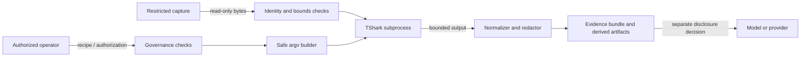

# Network analysis threat model

## Document control

| Field | Value |
| --- | --- |
| System | AIWG network-analysis addon |
| Version | 1.0 |
| Date | 2026-09-05 |
| Owner | AIWG maintainers |
| Status | Ready for operator approval |
| Classification | Public design; raw packet captures are Restricted |
| Tracking | #2269, #2279 |

## Purpose and security posture

The addon analyzes packet captures with TShark and may create evidence records
for other AIWG frameworks. Captures can expose credentials, session tokens,
personal or regulated data, internal topology, proprietary payloads, and traffic
belonging to people outside the investigation. Compromise can disclose those
values, corrupt an investigation, execute hostile dissector behavior, or consume
host resources.

The default policy is offline-only, metadata-only, payload-denied, and
provider-transfer-denied. Live acquisition requires a scoped authorization
record. Payload access requires an explicit local opt-in. Any transfer of raw
packets, headers, metadata, or payload to a model/provider requires a separate,
capture-bound disclosure decision.

## Architecture and trust boundaries

The operator boundary is trusted only for authenticated, recorded decisions;
operator-supplied interfaces, filters, paths, recipes, and retention values are
untrusted inputs. Capture bytes and dissector output are hostile. TShark is a
separate process trust boundary. The provider boundary is external and receives
nothing unless policy and a disclosure record authorize the exact capture,
provider, purpose, content classes, and fields.

The host OS and configured executable paths are trusted dependencies. The
addon does not install tools, change privileges, load ambient profiles, or
silently search the current directory. A host already controlled by an attacker
can still falsify tools or evidence; deployments needing stronger assurance
must add host attestation outside this addon.

Physical access adds no addon-specific control beyond the host assumption.
Portable captures remain Restricted and must use the organization's encrypted
storage, device, custody, and media-disposal controls.

## Data classification and privacy

| Data | Default class | Rules |
| --- | --- | --- |
| Raw PCAP/PCAPNG and packet payload | Restricted | Immutable source, SHA-256 identity, no provider transfer by default, declared retention and verified deletion |
| Credentials, tokens, cookies, personal identifiers | Restricted | Do not emit by default; redact before any disclosure |
| Addresses, hostnames, ports, timing, protocol fields | Confidential | Metadata output may still identify people or systems; minimize fields and preserve disclosure state |
| Derived summaries and statistics | Internal unless reviewed | Hash independently, cite the source capture, retain inference provenance |
| Tool versions, argv, recipe and audit decisions | Internal | Retain for reproducibility and non-repudiation; do not copy captured secrets into logs |

Metadata is not anonymous. Addresses, timing, topology, and uncommon protocol
behavior can re-identify a person or system when combined with other records.
Consumers must minimize fields, apply case retention, and carry sensitivity and
redaction metadata into every handoff.

## STRIDE analysis and risk treatment

Risk uses likelihood × impact on a 1–4 scale: 12–16 Critical, 8–11 High, 4–7
Medium, and 1–3 Low. No Critical residual risk is accepted by this gate.

| ID | STRIDE | Threat and consequence | Inherent | Required control | Residual |
| --- | --- | --- | --- | --- | --- |
| NA-T01 | Spoofing / Elevation | An operator captures an interface or traffic without authority, or attempts implicit privilege escalation | Critical 12 | Offline default; exact authority, interface, filter, duration, bytes, files, destination, retention, issuance and expiry; no sudo/root workflow | Medium 4 |
| NA-T02 | Tampering / Elevation | Command, filter, path, profile, or config text changes subprocess meaning or selects a hostile executable | Critical 12 | Typed capture/display filters; absolute trusted executable; argument arrays with `shell: false`; NUL rejection; destination confinement; no ambient profile/config | Low 3 |
| NA-T03 | Tampering / Information disclosure | A malicious capture triggers vulnerable dissectors or embeds terminal/control content | Critical 12 | Maintained TShark policy, isolated bounded subprocess, no terminal rendering of raw output, structured parsing, sanitized test captures | Medium 6 |
| NA-T04 | Information disclosure | Payload, credentials, tokens, or personal data leak to logs, artifacts, source control, or a model/provider | Critical 16 | Restricted classification, metadata-only output, payload deny/explicit opt-in, field allowlist, redaction, repository fixture sanitation, separate provider decision | Medium 6 |
| NA-T05 | Information disclosure | Metadata enables deanonymization or exposes internal topology | High 9 | Data minimization, explicit allowed fields and purpose, sensitivity propagation, address/token redaction, retention expiry | Medium 4 |
| NA-T06 | Tampering / Repudiation | Source bytes or derived results change, citations point to other bytes, or an actor denies a decision | Critical 12 | Regular non-symlink reads, hash before analysis, re-verification, independently hashed derivatives, context-bound citations, decision/authorization IDs and actors | Low 3 |
| NA-T07 | Denial of service | Oversized, malformed, compressed, or pathological input exhausts CPU, memory, disk, descriptors, or subprocess output | High 9 | Duration/byte/file/output hard bounds, process timeout and kill, no overwrite, partial/error records, cleanup and retention | Medium 4 |
| NA-T08 | Spoofing / Tampering | PATH hijack, executable replacement, plugin/profile drift, or unsupported versions falsify results | High 8 | Explicit absolute path precedence, trusted search roots, executable/version/build capability provenance, isolated config environment, fail-closed compatibility | Medium 4 |
| NA-T09 | Information disclosure / Repudiation | A broad or stale provider approval is reused for another capture, provider, purpose, field, or payload | Critical 12 | Separate immutable disclosure record bound to capture digest, provider, purpose, content, fields, actor, issuance and expiry; exact subset check; revocation state | Low 3 |

## Control requirements

Live capture code must call the governance boundary before starting a process.
The authorization is active only inside its issuance/expiry window and only for
the declared scope. Requested bounds may be narrower but cannot exceed the
record. The addon never selects an interface, elevates privileges, overwrites a
destination, or converts a display filter into a capture filter.

Every subprocess call uses an absolute executable and a string argument array.
Shell command strings and interpolation are forbidden. Capture text stays one
argv element even when it contains shell metacharacters. Process time, stdout,
stderr, output bytes, capture bytes, and file counts receive hard limits.

Before analysis, the source is opened read-only without following a terminal
symlink, hashed, and recorded as immutable evidence. It is re-hashed before a
result is accepted or handed off. Each normalized output, export, or report is
hashed from its own bytes and linked to the source digest; a source digest is
never reused as a derived-artifact digest.

## Security validation cases

| Test | Threats | Expected result | Evidence |
| --- | --- | --- | --- |
| NA-ST01 | NA-T01 | Default policy rejects live capture | `governance.test.ts` default-policy test |
| NA-ST02 | NA-T01, NA-T07 | Missing, expired, mismatched, or over-broad capture scope is rejected | authorization/schema tests |
| NA-ST03 | NA-T02 | Hostile-looking filter stays a literal argv value and shell is false | safe-process test |
| NA-ST04 | NA-T04, NA-T05, NA-T09 | Payload and provider transfer fail unless both policy and an exact active decision allow them | output/disclosure tests |
| NA-ST05 | NA-T06 | Source and derived bytes get independent hashes; changes and symlinks fail | evidence-integrity test |
| NA-ST06 | NA-T02, NA-T06 | Destination escapes fail and evidence citations remain capture/context-bound | destination and citation tests |
| NA-ST07 | NA-T03, NA-T07, NA-T08 | Probe/analyzer enforce executable trust, compatibility, timeout, and output limits | probe tests and future analyzer tests |
| NA-ST08 | NA-T04 | Repository fixtures contain only synthetic, sanitized traffic | fixture sanitation gate |

## Residual risk and review triggers

The residual risks depend on a trustworthy host, maintained Wireshark packages,
correct organizational authority decisions, and downstream compliance with
retention and deletion. Approval of this threat model accepts those Medium-or-
lower residual risks for construction; it does not authorize any live capture
or provider disclosure. Those remain per-operation decisions.

Review this model when acquisition modes, provider integrations, dissectors,
tool compatibility, evidence schemas, payload handling, privilege boundaries,
or retention behavior change, and after any related security incident.
